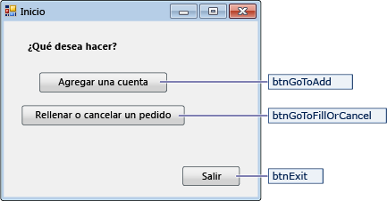
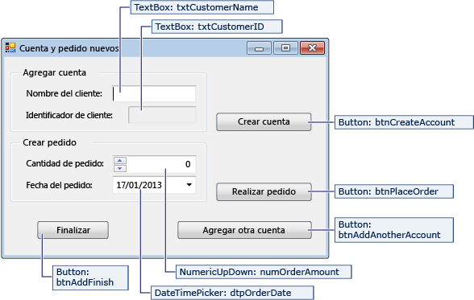

# <a name="create-a-simple-data-application-by-using-adonet"></a>Creación de una aplicación de datos sencilla mediante ADO.NET

Al crear una aplicación que manipula datos en una base de datos, se realizan tareas básicas tales como definir cadenas de conexión, insertar datos y ejecutar procedimientos almacenados. Siguiendo este tema, puede detectar cómo interactuar con una base de datos desde una aplicación sencilla de "formularios sobre datos" de Windows Forms utilizando Visual C# o Visual Basic y ADO.NET.  Todas las tecnologías de datos. NET, incluidos los conjuntos de datos, LINQ to SQL y Entity Framework, en última instancia, realice los pasos que son muy similares a las que se muestran en este artículo.

En este artículo se muestra una manera sencilla de obtener datos de una base de datos de una manera rápida. Si la aplicación necesita modificar los datos de formas no triviales y actualizar la base de datos, debe considerar con Entity Framework y el uso de enlace de datos para sincronizar automáticamente los controles de interfaz de usuario a los cambios en los datos subyacentes.

> [!IMPORTANT]
> Para mantener el código sencillo, no se incluye el control de excepciones listo para producción.

## <a name="prerequisites"></a>Requisitos previos

Para crear la aplicación, necesitará:

-   Visual Studio.

-   SQL Server Express LocalDB. Si no tiene SQL Server Express LocalDB, puede instalarlo desde el [página de descarga de SQL Server Express](https://www.microsoft.com/sql-server/sql-server-editions-express).

En este tema se da por supuesto que está familiarizado con la funcionalidad básica del IDE de Visual Studio y puede crear una aplicación de Windows Forms, agregar formularios para el proyecto, colocar botones y otros controles en los formularios, establecer las propiedades de los controles y codificar eventos simples. Si no está familiarizado con estas tareas, recomendamos que complete la [Introducción a Visual C# y Visual Basic](../ide/quickstart-visual-basic-console.md) tema antes de empezar este tutorial.

## <a name="set-up-the-sample-database"></a>Configurar la base de datos de ejemplo

Cree la base de datos de ejemplo siguiendo estos pasos:

1. En Visual Studio, abra el **Explorador de servidores** ventana.

2. Haga doble clic en **conexiones de datos** y elija **crear nueva base de datos de SQL Server**.

3. En el **nombre del servidor** texto, escriba **(localdb) \mssqllocaldb**.

4. En el **nuevo nombre de base de datos** texto, escriba **ventas**, a continuación, elija **Aceptar**.

     Vacío **ventas** base de datos se crea y se agrega al nodo Conexiones de datos en el Explorador de servidores.

5. Haga doble clic en el **ventas** conexión de datos y seleccione **nueva consulta**.

     Se abre una ventana del editor de consultas.

6. Copia el [script Transact-SQL de ventas](https://github.com/MicrosoftDocs/visualstudio-docs/raw/master/docs/data-tools/samples/sales.sql) en el Portapapeles.

7. Pegue el script de Transact-SQL en el editor de consultas y, a continuación, elija el **Execute** botón.

     Después de un breve tiempo, finalice la consulta y se crean los objetos de base de datos. La base de datos contiene dos tablas: Los clientes y pedidos. Estas tablas no contienen datos inicialmente, pero puede agregar datos al ejecutar la aplicación que se va a crear. La base de datos también contiene cuatro procedimientos almacenados simples.

## <a name="create-the-forms-and-add-controls"></a>Crear los formularios y agregar controles

1. Cree un proyecto para una aplicación de Windows Forms y, a continuación, asígnele el nombre **SimpleDataApp**.

    Visual Studio crea el proyecto y varios archivos, incluido un formulario de Windows vacío denominado **Form1**.

2. Agregue dos formularios de Windows al proyecto para que tenga tres formularios y, a continuación, asígneles los siguientes nombres:

   -   **Navegación**

   -   **NewCustomer**

   -   **FillOrCancel**

3. Para cada formulario, agregue los cuadros de texto, botones y otros controles que aparecen en las siguientes ilustraciones. Para cada control, establezca las propiedades que se describen en las tablas.

   > [!NOTE]
   > El cuadro de grupo y los controles de etiquetas agregan claridad pero no se utilizan en el código.

   **Formulario Navigation**

   

|Controles del formulario Navigation|Propiedades|
| - |----------------|
|Botón|Nombre = btnGoToAdd|
|Botón|Nombre = btnGoToFillOrCancel|
|Botón|Nombre = btnExit|

 **Formulario NewCustomer**

 

|Controles del formulario NewCustomer|Propiedades|
| - |----------------|
|TextBox|Nombre = txtCustomerName|
|TextBox|Nombre = txtCustomerID<br /><br /> De solo lectura = True|
|Botón|Nombre = btnCreateAccount|
|NumericUpDown|Posiciones decimales = 0<br /><br /> Máximo = 5000<br /><br /> Nombre = numOrderAmount|
|DateTimePicker|Formato = Abreviado<br /><br /> Nombre = dtpOrderDate|
|Botón|Nombre = btnPlaceOrder|
|Botón|Nombre = btnAddAnotherAccount|
|Botón|Nombre = btnAddFinish|

 **Formulario FillOrCancel**

 

|Controles del formulario FillOrCancel|Propiedades|
| - |----------------|
|TextBox|Nombre = txtOrderID|
|Botón|Nombre = btnFindByOrderID|
|DateTimePicker|Formato = Abreviado<br /><br /> Nombre = dtpFillDate|
|DataGridView|Nombre = dgvCustomerOrders<br /><br /> De solo lectura = True<br /><br /> Encabezados de filas visibles = False|
|Botón|Nombre = btnCancelOrder|
|Botón|Nombre = btnFillOrder|
|Botón|Nombre = btnFinishUpdates|

## <a name="store-the-connection-string"></a>Almacenar la cadena de conexión
 Cuando la aplicación intenta abrir una conexión a la base de datos, la aplicación debe tener acceso a la cadena de conexión. Para evitar escribir la cadena manualmente en cada formulario, almacene la cadena en el *App.config* en el proyecto y cree un método que devuelve la cadena cuando se llama al método desde cualquier formulario de la aplicación.

 Puede encontrar la cadena de conexión con el botón secundario en el **ventas** conexión de datos en **Explorador de servidores** y eligiendo **propiedades**. Busque el **ConnectionString** propiedad, a continuación, usar **Ctrl**+**A**, **Ctrl**+**C**  para seleccionar y copiar la cadena en el Portapapeles.

1.  Si usa C#, en **el Explorador de soluciones**, expanda el **propiedades** nodo bajo el proyecto y, a continuación, abra el **Settings.settings** archivo.
    Si usa Visual Basic, en **el Explorador de soluciones**, haga clic en **mostrar todos los archivos**, expanda el **mi proyecto** nodo y, a continuación, abra el **Settings.settings** archivo.

2.  En el **nombre** columna, escriba `connString`.

3.  En el **tipo** lista, seleccione **(cadena de conexión)**.

4.  En el **ámbito** lista, seleccione **aplicación**.

5.  En el **valor** columna, escriba la cadena de conexión (sin ninguna fuera de las comillas) y, a continuación, guarde los cambios.

> [!NOTE]
> En una aplicación real, debe almacenar de forma segura, como se describe en la cadena de conexión [las cadenas de conexión y archivos de configuración](/dotnet/framework/data/adonet/connection-strings-and-configuration-files).

##  <a name="write-the-code-for-the-forms"></a>Escribir el código para los formularios

Esta sección contiene información general breve de lo que hace cada formulario. También proporciona el código que define la lógica subyacente cuando se hace clic en un botón en el formulario.

### <a name="navigation-form"></a>Formulario Navigation

El formulario Navigation se abre cuando se ejecuta la aplicación. El botón **Agregar una cuenta** abre el formulario NewCustomer. El botón **Rellenar o cancelar órdenes** abre el formulario FillOrCancel. El botón **Salir** cierra la aplicación.

#### <a name="make-the-navigation-form-the-startup-form"></a>Hacer que el formulario Navigation sea el formulario de inicio

Si usa C#, en el **Explorador de soluciones**, abra **Program.cs** y, a continuación, cambie la línea `Application.Run` a esta: `Application.Run(new Navigation());`

Si usa Visual Basic, en **el Explorador de soluciones**, abra el **propiedades** ventana, seleccione el **aplicación** pestaña y, a continuación, seleccione  **SimpleDataApp.Navigation** en el **formulario de inicio** lista.

#### <a name="create-auto-generated-event-handlers"></a>Crear controladores de eventos generados automáticamente

Haga doble clic en los tres botones en el formulario de navegación para crear métodos de controlador de eventos vacío. Haga doble clic en los botones, también se agrega el código generado automáticamente en el archivo de código de diseñador que permite a un clic de botón Generar un evento.

#### <a name="add-code-for-the-navigation-form-logic"></a>Agregue código para la lógica del formulario de navegación

En la página de códigos del formulario Navigation, completa los cuerpos de método para el botón de tres controladores de eventos click tal como se muestra en el código siguiente.

[!code-csharp[Navigation#1](../data-tools/codesnippet/CSharp/SimpleDataApp/Navigation.cs#1)]
[!code-vb[Navigation#1](../data-tools/codesnippet/VisualBasic/SimpleDataApp/Navigation.vb#1)]

### <a name="newcustomer-form"></a>Formulario NewCustomer

Si escribe un nombre de cliente y, a continuación, seleccione el **crear cuenta** botón, el formulario NewCustomer crea una cuenta de cliente y SQL Server devuelve un valor de identidad como el nuevo identificador de cliente. A continuación, puede colocar un pedido para la nueva cuenta especificando una cantidad y una fecha de pedido y seleccionando el **realizar pedido** botón.

#### <a name="create-auto-generated-event-handlers"></a>Crear controladores de eventos generados automáticamente

Crear un Click vacío el controlador de eventos para cada botón en el formulario NewCustomer haciendo doble clic en cada uno de los cuatro botones. Haga doble clic en los botones, también se agrega el código generado automáticamente en el archivo de código de diseñador que permite a un clic de botón Generar un evento.

#### <a name="add-code-for-the-newcustomer-form-logic"></a>Agregue código para la lógica del formulario NewCustomer

Para completar la lógica del formulario NewCustomer, siga estos pasos.

1. Poner el `System.Data.SqlClient` espacio de nombres en el ámbito para que le permitirá despreocuparse totalmente calificar los nombres de sus miembros.

     ```csharp
     using System.Data.SqlClient;
     ```
     ```vb
     Imports System.Data.SqlClient
     ```

2. Agregue algunas variables y métodos auxiliares a la clase tal como se muestra en el código siguiente.

     [!code-csharp[NewCustomer#1](../data-tools/codesnippet/CSharp/SimpleDataApp/NewCustomer.cs#1)]
     [!code-vb[NewCustomer#1](../data-tools/codesnippet/VisualBasic/SimpleDataApp/NewCustomer.vb#1)]

3. Complete los cuerpos de método para el botón cuatro controladores de eventos click tal como se muestra en el código siguiente.

     [!code-csharp[NewCustomer#2](../data-tools/codesnippet/CSharp/SimpleDataApp/NewCustomer.cs#2)]
     [!code-vb[NewCustomer#2](../data-tools/codesnippet/VisualBasic/SimpleDataApp/NewCustomer.vb#2)]

### <a name="fillorcancel-form"></a>Formulario FillOrCancel

El formulario FillOrCancel ejecuta una consulta para devolver un pedido cuando escriba un identificador de pedido y, a continuación, haga clic en el **buscar pedido** botón. La fila devuelta aparece en una cuadrícula de datos de solo lectura. Puede marcar el pedido como cancelado (X) si selecciona el **Cancelar pedido** botón, o bien puede marcar el pedido como relleno (F) si selecciona el **rellenar pedido** botón. Si selecciona el **buscar pedido** nuevamente en el botón, la fila actualizada aparece.

#### <a name="create-auto-generated-event-handlers"></a>Crear controladores de eventos generados automáticamente

Crear vacío haga clic en los controladores de eventos para los cuatro botones en el formulario FillOrCancel haciendo doble clic en los botones. Haga doble clic en los botones, también se agrega el código generado automáticamente en el archivo de código de diseñador que permite a un clic de botón Generar un evento.

#### <a name="add-code-for-the-fillorcancel-form-logic"></a>Agregue código para la lógica del formulario FillOrCancel

Para completar la lógica del formulario FillOrCancel, siga estos pasos.

1. Ponga las dos siguientes espacios de nombres en el ámbito para que no tenga que calificar totalmente los nombres de sus miembros.

     ```csharp
     using System.Data.SqlClient;
     using System.Text.RegularExpressions;
     ```
     ```vb
     Imports System.Data.SqlClient
     Imports System.Text.RegularExpressions
     ```

2. Agregue un variable y el método auxiliar a la clase tal como se muestra en el código siguiente.

     [!code-csharp[FillOrCancel#1](../data-tools/codesnippet/CSharp/SimpleDataApp/FillOrCancel.cs#1)]
     [!code-vb[FillOrCancel#1](../data-tools/codesnippet/VisualBasic/SimpleDataApp/FillOrCancel.vb#1)]

3. Complete los cuerpos de método para el botón cuatro controladores de eventos click tal como se muestra en el código siguiente.

     [!code-csharp[FillOrCancel#2](../data-tools/codesnippet/CSharp/SimpleDataApp/FillOrCancel.cs#2)]
     [!code-vb[FillOrCancel#2](../data-tools/codesnippet/VisualBasic/SimpleDataApp/FillOrCancel.vb#2)]

## <a name="test-your-application"></a>Probar la aplicación

Seleccione la tecla **F5** para compilar y probar la aplicación después del código de cada controlador del evento Click y, a continuación, después de haber terminado la programación.

## <a name="see-also"></a>Vea también

- [Visual Studio Data Tools para .NET](../data-tools/visual-studio-data-tools-for-dotnet.md)
