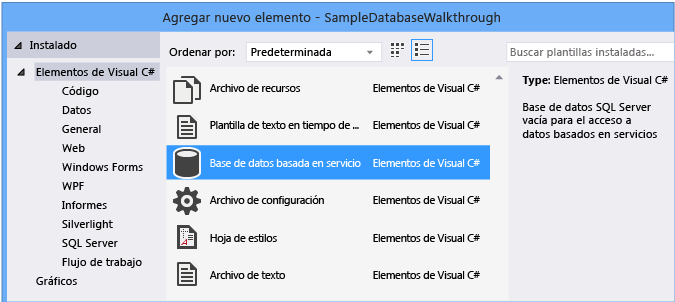
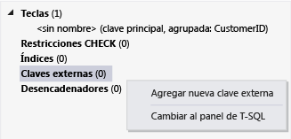

# <a name="create-a-database-and-add-tables-in-visual-studio"></a>Crear una base de datos y agregar las tablas en Visual Studio

Puede usar Visual Studio para crear y actualizar un archivo de base de datos local en SQL Server Express LocalDB. También puede crear una base de datos mediante la ejecución de instrucciones de Transact-SQL en el **Explorador de objetos de SQL Server** ventana de herramientas de Visual Studio. En este tema, crearemos un *.mdf* de archivo y agregar tablas y claves mediante el Diseñador de tablas.

## <a name="prerequisites"></a>Requisitos previos

Para completar este tutorial, debe tener el elemento opcional **procesamiento y almacenamiento de datos** carga de trabajo instalada en Visual Studio. Para instalarlo, abra **instalador de Visual Studio** y elija el **cargas de trabajo** ficha. En **Web y nube**, elija **procesamiento y almacenamiento de datos**. Elija la **modificar** para agregar la carga de trabajo para Visual Studio.

## <a name="create-a-project-and-a-local-database-file"></a>Crear un proyecto y un archivo de base de datos local

1. Cree un proyecto de formularios Windows Forms denominado **SampleDatabaseWalkthrough**.

2. En la barra de menús, seleccione **proyecto** > **Agregar nuevo elemento**.

3. En la lista de plantillas de elementos, desplácese hacia abajo y seleccione **base de datos basada en servicio**.

     

4. Nombre de la base de datos **SampleDatabase**y, a continuación, seleccione el **agregar** botón.

### <a name="add-a-data-source"></a>Agregar un origen de datos

1. Si el **orígenes de datos** ventana no está abierta, ábrala presionando **MAYÚS**+**Alt**+**d.** o seleccionar **Vista** > **Other Windows** > **orígenes de datos** en la barra de menús.

1. En el **orígenes de datos** ventana, seleccione el **Agregar nuevo origen de datos** vínculo.

   Se abrirá el **Asistente para configuración de orígenes de datos**.

1. En el **elegir un tipo de origen de datos** página, elija **base de datos** y, a continuación, elija **siguiente**.

1. En el **elegir un modelo de base de datos** página, elija **siguiente** para aceptar el valor predeterminado (conjunto de datos).

1. En el **elegir la conexión de datos** página, seleccione el **SampleDatabase.mdf** de archivos en la lista desplegable y, a continuación, elija **siguiente**.

1. En el **Guardar cadena de conexión en el archivo de configuración de aplicación** página, elija **siguiente**.

1. Una el **elija los objetos de base de datos** página, verá un mensaje que indica la base de datos no contiene ningún objeto. Elija **Finalizar**.

### <a name="view-properties-of-the-data-connection"></a>Ver las propiedades de la conexión de datos

Puede ver la cadena de conexión para el *SampleDatabase.mdf* archivo, abra la ventana Propiedades de la conexión de datos:

- En Visual Studio, seleccione **vista** > **Explorador de objetos de SQL Server** si esa ventana no está abierta. Abra la ventana Propiedades, expanda el **conexiones de datos** nodo, abra el menú contextual de *SampleDatabase.mdf*y, a continuación, seleccione **propiedades**.

- Como alternativa, puede seleccionar **vista** > **Explorador de servidores**, si esa ventana no está abierta. Abra la ventana Propiedades, expanda el **conexiones de datos** nodo. Abra el menú contextual para *SampleDatabase.mdf*y, a continuación, seleccione **propiedades**.

## <a name="create-tables-and-keys-by-using-table-designer"></a>Crear tablas y claves mediante el Diseñador de tablas

En esta sección, creará dos tablas, una clave principal en cada tabla y algunas filas de datos de ejemplo. También creará una clave externa para especificar cómo se corresponden con los registros de una tabla para los registros de la otra tabla.

### <a name="create-the-customers-table"></a>Crear la tabla Customers

1. En **Explorador de servidores** o **Explorador de objetos de SQL Server**, expanda el **conexiones de datos** nodo y, a continuación, expanda el **SampleDatabase.mdf**nodo.

2. Abra el menú contextual para **tablas**y, a continuación, seleccione **agregar nueva tabla**.

     El **Diseñador de tablas** se abre y muestra una cuadrícula con una fila predeterminada que representa una columna única de la tabla que está creando. Al agregar filas a la cuadrícula, agregará columnas en la tabla.

3. En la cuadrícula, agregue una fila para cada una de las entradas siguientes:

    |Nombre de columna|Tipo de datos|Permitir valores NULL|
    |-----------------|---------------|-----------------|
    |`CustomerID`|`nchar(5)`|False (desactivada)|
    |`CompanyName`|`nvarchar(50)`|False (desactivada)|
    |`ContactName`|`nvarchar (50)`|True (seleccionada)|
    |`Phone`|`nvarchar (24)`|True (seleccionada)|

4. Abra el menú contextual para el `CustomerID` fila y, a continuación, seleccione **establecer clave principal**.

5. Abra el menú contextual para la fila predeterminada y, a continuación, seleccione **eliminar**.

6. Asigne un nombre a la tabla Customers actualizando la primera línea del panel de script para que coincida con el ejemplo siguiente:

    ```sql
    CREATE TABLE [dbo].[Customers]
    ```

    Verá algo parecido a esto:

    

7. En la esquina superior izquierda de la **Diseñador de tablas**, seleccione el **actualización** botón.

8. En el **vista previa de actualizaciones de base de datos** cuadro de diálogo, seleccione el **Actualizar base de datos** botón.

    Los cambios realizados se guardarán en el archivo de base de datos local.

### <a name="create-the-orders-table"></a>Crear la tabla Orders

1. Agregue otra tabla y, después, agregue una fila para cada entrada de la tabla siguiente:

    |Nombre de columna|Tipo de datos|Permitir valores NULL|
    |-----------------|---------------|-----------------|
    |`OrderID`|`int`|False (desactivada)|
    |`CustomerID`|`nchar(5)`|False (desactivada)|
    |`OrderDate`|`datetime`|True (seleccionada)|
    |`OrderQuantity`|`int`|True (seleccionada)|

2. Establecer **OrderID** como la clave principal y, a continuación, elimine la fila predeterminada.

3. Asigne un nombre a la tabla Orders actualizando la primera línea del panel de script para que coincida con el ejemplo siguiente:

    ```sql
    CREATE TABLE [dbo].[Orders]
    ```

4. En la esquina superior izquierda de la **Diseñador de tablas**, seleccione el **actualización** botón.

5. En el **vista previa de actualizaciones de base de datos** cuadro de diálogo, seleccione el **Actualizar base de datos** botón.

    Los cambios realizados se guardarán en el archivo de base de datos local.

### <a name="create-a-foreign-key"></a>Crear una clave externa

1. En el panel de contexto en el lado derecho de la cuadrícula, abra el menú contextual de **claves externas**y, a continuación, seleccione **agregar nueva clave externa**, tal y como se muestra en la siguiente ilustración.

     

2. En el cuadro de texto que aparece, reemplace **ToTable** por **Clientes**.

3. En el panel de T-SQL, actualice la última línea para que coincida con el ejemplo siguiente:

    ```sql
    CONSTRAINT [FK_Orders_Customers] FOREIGN KEY ([CustomerID]) REFERENCES [Customers]([CustomerID])
    ```

4. En la esquina superior izquierda de la **Diseñador de tablas**, seleccione el **actualización** botón.

5. En el **vista previa de actualizaciones de base de datos** cuadro de diálogo, seleccione el **Actualizar base de datos** botón.

    Los cambios realizados se guardarán en el archivo de base de datos local.

## <a name="populate-the-tables-with-data"></a>Rellenar las tablas con datos

1. En **Explorador de servidores** o **Explorador de objetos de SQL Server**, expanda el nodo de la base de datos de ejemplo.

2. Abra el menú contextual para el **tablas** nodo, seleccione **actualizar**y, a continuación, expanda el **tablas** nodo.

3. Abra el menú contextual para la tabla Customers y, a continuación, seleccione **mostrar datos de tabla**.

4. Agregue los datos que desee para algunos clientes.

    Puede especificar los cinco caracteres que desee como identificadores de cliente, pero elija al menos uno que pueda recordar para usarlo posteriormente en este procedimiento.

5. Abra el menú contextual para la tabla Orders y, a continuación, seleccione **mostrar datos de tabla**.

6. Agregar datos de algunos pedidos.

    > [!IMPORTANT]
    > Asegúrese de que todos los identificadores y cantidades de pedidos sean números enteros y que cada identificador de cliente coincida con el valor que especificó en la columna **CustomerID** de la tabla Clientes.

7. En la barra de menús, seleccione **archivo** > **guardar todo**.

## <a name="see-also"></a>Vea también

- [Obtener acceso a los datos en Visual Studio](accessing-data-in-visual-studio.md)