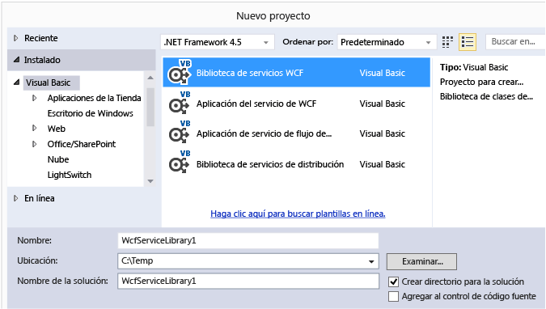
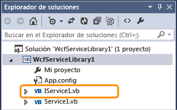
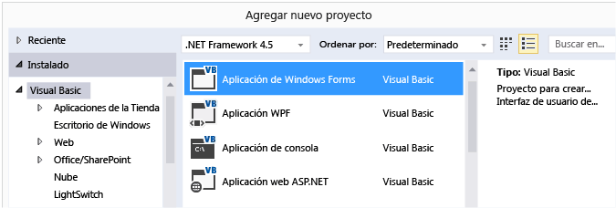

# Tutorial: Crear un servicio WCF simple de formularios Windows Forms
Este tutorial muestra cómo se crea un sencillo servicio de [!INCLUDE[vsindigo](../data-tools/includes/vsindigo_md.md)]. A continuación, se probará y se tendrá acceso a él desde una aplicación de Windows Forms.

[!INCLUDE[note_settings_general](../data-tools/includes/note_settings_general_md.md)]

## Crear el servicio web

#### Para crear un servicio WCF

1.  En el menú **Archivo** , elija **Nuevo** y haga clic en **Proyecto**.

2.  En el **nuevo proyecto** cuadro de diálogo, expanda el **Visual Basic** o **Visual C#** nodo y haga clic en **WCF**, seguido de **WCF Biblioteca de servicio**. Haga clic en **Aceptar** para abrir el proyecto.

     

    > [!NOTE]
    >  Se creará un servicio de trabajo que puede probar y acceder a él. Los dos pasos siguientes muestran cómo puede modificar el método predeterminado para utilizar un tipo de datos diferente. En una aplicación real, también agregaría sus propias funciones al servicio.

3.  

     En **el Explorador de soluciones**, haga doble clic en IService1.vb o IService1.cs y busque la línea siguiente:

     [!code-csharp[WCFWalkthrough#4](../data-tools/codesnippet/CSharp/walkthrough-creating-a-simple-wcf-service-in-windows-forms_1.cs)]
     [!code-vb[WCFWalkthrough#4](../data-tools/codesnippet/VisualBasic/walkthrough-creating-a-simple-wcf-service-in-windows-forms_1.vb)]

     Cambiar el tipo de la `value` parámetro de cadena:

     [!code-csharp[WCFWalkthrough#1](../data-tools/codesnippet/CSharp/walkthrough-creating-a-simple-wcf-service-in-windows-forms_2.cs)]
     [!code-vb[WCFWalkthrough#1](../data-tools/codesnippet/VisualBasic/walkthrough-creating-a-simple-wcf-service-in-windows-forms_2.vb)]

     En el código anterior, observe los atributos `<OperationContract()>` o `[OperationContract]`. Estos atributos son obligatorios para cualquier método expuesto por el servicio.

4.  

     En **el Explorador de soluciones**, haga doble clic en Service1.vb o Service1.cs y busque la línea siguiente:

     [!code-vb[WCFWalkthrough#5](../data-tools/codesnippet/VisualBasic/walkthrough-creating-a-simple-wcf-service-in-windows-forms_3.vb)]
     [!code-csharp[WCFWalkthrough#5](../data-tools/codesnippet/CSharp/walkthrough-creating-a-simple-wcf-service-in-windows-forms_3.cs)]

     Cambiar el tipo del parámetro de valor a la cadena:

     [!code-csharp[WCFWalkthrough#2](../data-tools/codesnippet/CSharp/walkthrough-creating-a-simple-wcf-service-in-windows-forms_4.cs)]
     [!code-vb[WCFWalkthrough#2](../data-tools/codesnippet/VisualBasic/walkthrough-creating-a-simple-wcf-service-in-windows-forms_4.vb)]

## Probar el servicio

#### Para probar un servicio WCF

1.  Presione **F5** para ejecutar el servicio. A **cliente de prueba WCF** se mostrará el formulario y cargará el servicio.

2.  En el **cliente de prueba WCF** formulario, haga doble clic en el **GetData()** método en **IService1**. El **GetData** se mostrará la pestaña.

     

3.  En el **solicitar** cuadro, seleccione la **valor** campo y el tipo `Hello`.

     

4.  Haga clic en el **Invoke** botón. Si un **advertencia de seguridad** aparece el cuadro de diálogo, haga clic en **Aceptar**. El resultado se mostrará en el **respuesta** cuadro.

     

5.  En el **archivo** menú, haga clic en **Exit** para cerrar el formulario de prueba.

## Acceso al servicio

#### Para hacer referencia a un servicio WCF

1.  En el **archivo** menú, elija **agregar** y, a continuación, haga clic en **nuevo proyecto**.

2.  En el **nuevo proyecto** cuadro de diálogo, expanda el **Visual Basic** o **Visual C#** nodo y seleccione **Windows**y, a continuación, seleccione **Aplicación de formularios Windows Forms**. Haga clic en **Aceptar** para abrir el proyecto.

     

3.  Haga clic en **WindowsApplication1** y haga clic en **Agregar referencia de servicio**. El **Agregar referencia de servicio** se abre el cuadro de diálogo.

4.  En el **Agregar referencia de servicio** cuadro de diálogo, haga clic en **Discover**.

     

     **Service1** se mostrará en el **servicios** panel.

5.  Haga clic en **Aceptar** para agregar la referencia de servicio.

#### Para compilar una aplicación cliente

1.  En **el Explorador de soluciones**, haga doble clic en **Form1.vb** o **Form1.cs** para abrir el Diseñador de Windows Forms si no está ya abierto.

2.  Desde el **cuadro de herramientas**, arrastre un `TextBox` (control), un `Label` (control) y un `Button` control al formulario.

     

3.  Haga doble clic en `Button` y agregue el código siguiente al controlador de eventos `Click`:

     [!code-csharp[WCFWalkthrough#3](../data-tools/codesnippet/CSharp/walkthrough-creating-a-simple-wcf-service-in-windows-forms_5.cs)]
     [!code-vb[WCFWalkthrough#3](../data-tools/codesnippet/VisualBasic/walkthrough-creating-a-simple-wcf-service-in-windows-forms_5.vb)]

4.  En **el Explorador de soluciones**, haga clic en **WindowsApplication1** y haga clic en **establecer como proyecto de inicio**.

5.  Presione **F5** para ejecutar el proyecto. Escriba algún texto y haga clic en el botón. La etiqueta mostrará "Escribió:" y el texto que escribió.

     

## Vea también

- [Servicios de Windows Communication Foundation y Servicios de datos de WCF en Visual Studio](../data-tools/windows-communication-foundation-services-and-wcf-data-services-in-visual-studio.md)