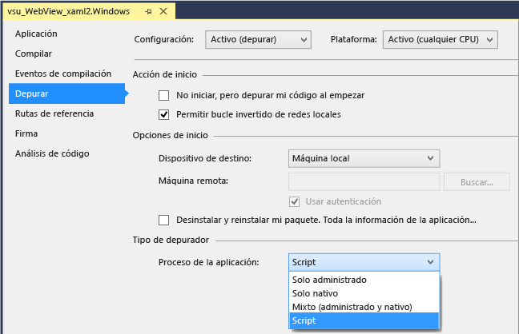
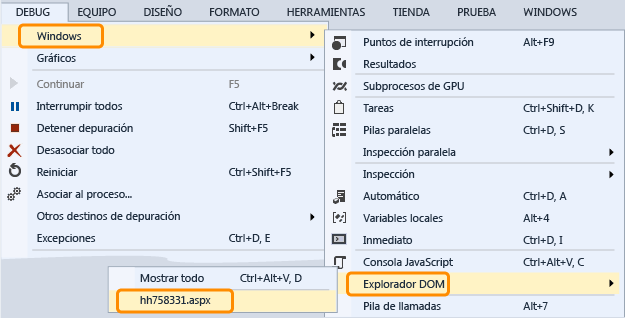

# Depurar un control WebView
[!INCLUDE[vs2017banner](../code-quality/includes/vs2017banner.md)]

  
  
 Para inspeccionar y depurar controles `WebView` en una aplicación de Windows en tiempo de ejecución, puede configurar Visual Studio de modo que adjunte el depurador de script al iniciar la aplicación.  A partir de Visual Studio 2013 Update 2, tiene dos formas de interactuar con los controles `WebView` mediante el depurador:  
  
-   Abrir el [Explorador DOM](../debugger/quickstart-debug-html-and-css.md) de una instancia `WebView`, inspeccionar los elementos DOM, investigar los problemas de estilo CSS y probar los cambios presentados de forma dinámica de los estilos.  
  
-   Seleccionar la página web o `iFrame` mostrado en la instancia `WebView` como destino en la ventana [Consola JavaScript](../debugger/javascript-console-commands.md) e interactuar con la página web mediante los comandos de la consola.  La consola ofrece acceso al contexto de ejecución de script actual.  
  
### Adjuntar el depurador \(C\#, Visual Basic, C\+\+\)  
  
1.  En Visual Studio, agregue un control `WebView` a la aplicación de Windows en tiempo de ejecución.  
  
2.  En el Explorador de soluciones, abra las propiedades del proyecto al elegir **Propiedades** en el menú contextual del proyecto.  
  
3.  Elija **Depurar**.  En la lista **Proceso de aplicación**, elija **Script**.  
  
       
  
4.  \(Opcional\) En las versiones de Visual Studio que no sean Express, deshabilite la depuración justo a tiempo \(JIT\) eligiendo **Herramientas**, **Opciones**, **Depuración**, **Just\-In\-Time** y deshabilitando a continuación la depuración JIT para Script.  
  
    > [!NOTE]
    >  Al deshabilitar la depuración JIT, puede ocultar los cuadros de diálogo de las excepciones no controladas que se producen en algunas páginas web.  En Visual Studio Express, la depuración JIT siempre está deshabilitada.  
  
5.  Presiona F5 para iniciar la depuración.  
  
### Usar el Explorador DOM para inspeccionar y depurar un control WebView  
  
1.  \(C\#, Visual Basic, C\+\+\) Adjunte el depurador de script a la aplicación.  Consulte la primera sección para obtener instrucciones.  
  
2.  Si aún no lo ha hecho, agregue un control `WebView` a la aplicación y presione F5 para iniciar la depuración.  
  
3.  Vaya a la página que contiene el control o controles `Webview`.  
  
4.  Abra la ventana del Explorador DOM del control `WebView` al elegir **Depurar**, **Ventanas**, **Explorador DOM** y, a continuación, elija la dirección URL del control `WebView` que quiera inspeccionar.  
  
       
  
     El Explorador DOM asociado al control `WebView` aparece como una nueva pestaña en Visual Studio.  
  
5.  Visualice y modifique elementos DOM activos y estilos CSS como se describe en [Depurar estilos de CSS mediante el Explorador DOM](../debugger/debug-css-styles-using-dom-explorer.md).  
  
### Usar la ventana Consola JavaScript para inspeccionar y depurar un control WebView  
  
1.  \(C\#, Visual Basic, C\+\+\) Adjunte el depurador de script a la aplicación.  Consulte la primera sección para obtener instrucciones.  
  
2.  Si aún no lo ha hecho, agregue un control `WebView` a la aplicación y presione F5 para iniciar la depuración.  
  
3.  Abra la ventana Consola JavaScript del control `WebView` al elegir **Depurar**, **Ventanas**, **Consola JavaScript**.  
  
     Aparece la ventana Consola JavaScript.  
  
4.  Vaya a la página que contiene el control o controles `Webview`.  
  
5.  En la ventana Consola, seleccione la página web o un `iFrame` mostrado por el control `WebView` en la lista **Destino**.  
  
       
  
    > [!NOTE]
    >  Con la consola, puede interactuar con un único `WebView`, `iFrame`, contrato de participación o trabajo web a la vez.  Cada elemento necesita una instancia independiente del host de plataforma web \(WWAHost.exe\).  Puede interactuar con un host a la vez.  
  
6.  Visualice y modifiuqe variables en la aplicación o usa comandos de la consola como se describe en [Inicio rápido: Depurar JavaScript](../debugger/quickstart-debug-javascript-using-the-console.md) y [Comandos de la Consola JavaScript](../debugger/javascript-console-commands.md).  
  
## Vea también  
 [Inicio rápido: Depurar HTML y CSS](../debugger/quickstart-debug-html-and-css.md)