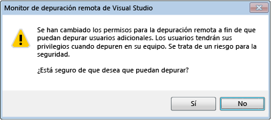

# Seguridad del depurador
La posibilidad de depurar otro proceso le confiere amplios poderes que, de otra forma, no tendría, especialmente al depurar de forma remota. Un depurador malintencionado podría infligir daños generalizados en el equipo depurado.  
  
 Sin embargo, muchos desarrolladores no comprenden que la amenaza de seguridad también puede presentarse en la dirección contraria. Es posible que el código malintencionado del proceso depurado comprometa la seguridad del equipo desde donde se depura: hay una serie de ataques de seguridad contra los que es preciso protegerse.  
  
## Procedimientos recomendados para la seguridad  
 Hay una relación de confianza implícita entre el código que se depura y el depurador. Si está dispuesto a depurar código, también debería ejecutarlo. Lo importante es que debe poder confiar en lo que está depurando. Si no tiene confianza, no debería depurarlo, o debería hacerlo desde un equipo que pueda poner en riesgo y en un entorno aislado.  
  
 Para reducir la superficie de ataque potencial, se debería deshabilitar la depuración de los equipos de producción. Por la misma razón, nunca se debería habilitar indefinidamente.  
  
### Seguridad de la depuración administrada  
 Las siguientes recomendaciones generales se aplican a toda la depuración administrada.  
  
-   Tenga cuidado al asociar al proceso de un usuario de confianza: cuando lo hace, se supone que es digno de confianza. Si intenta asociarse al proceso de un usuario que no es de confianza, aparecerá un cuadro de diálogo de confirmación con una advertencia de seguridad que le preguntará si quiere asociarse al proceso. Los "usuarios de confianza" son, además del propio usuario, un conjunto de usuarios estándar definidos generalmente en los equipos en los que se ha instalado .NET Framework, como **aspnet**, **localsystem**, **networkservice**y **localservice**. Para obtener más información, vea [advertencia de seguridad: la asociación a un proceso que pertenece a un usuario de confianza puede ser peligrosa. Si la información siguiente parece sospechosa o no está seguro, no se conecte a este proceso](../debugger/security-warning-attaching-to-a-process-owned-by-an-untrusted-user-can-be-dangerous-if-the-following-information-looks-suspicious-or-you-are-unsure-do-not-attach-to-this-process.md).  
  
-   Se debe tener cuidado al descargar un proyecto de Internet y cargarlo en [!INCLUDE[vsprvs](../code-quality/includes/vsprvs_md.md)]. Esta práctica es muy arriesgada incluso sin depuración. Si lo hace, está dando por sentado que el proyecto y el código que contiene son dignos de confianza.  
  
 Para obtener más información, consulta [Debugging Managed Code](../debugger/debugging-managed-code.md).  
  
### Seguridad de la depuración remota  
 La depuración local suele ser más segura que la depuración remota. La depuración remota aumenta la superficie total que se puede analizar.  
  
 El Monitor de depuración remota de Visual Studio (msvsmon.exe) se utiliza en la depuración remota, y hay varias recomendaciones de seguridad para configurarlo. La configuración preferida del modo de autenticación es Autenticación de Windows, porque el modo Sin autenticación no es seguro.  
  
   
  
 Si utiliza el modo de Autenticación de Windows, tenga en cuenta que es peligroso conceder permiso a un usuario que no sea de confianza para que se conecte a msvsmon, porque concede al usuario todos los permisos en el equipo.  
  
 No depure un proceso desconocido en un equipo remoto: existe un riesgo de ataques que pueden afectar al equipo en el que se ejecuta el depurador o que podrían poner en peligro a msvsmon.exe, el Monitor de depuración remota de Visual Studio. Si es imprescindible depurar un proceso desconocido, intente hacerlo localmente y utilice un firewall para poder localizar cualquier amenaza potencial.  
  
 Para obtener más información, consulte [depuración remota](../debugger/remote-debugging.md).  
  
### Seguridad de la depuración de servicios Web  
 La depuración local es más segura, pero como probablemente [!INCLUDE[vsprvs](../code-quality/includes/vsprvs_md.md)] no esté instalado en el servidor Web, quizás no pueda realizarla. Normalmente, los servicios Web se depuran de forma remota, excepto durante el desarrollo. Por tanto, las recomendaciones de seguridad para la depuración remota también se aplican a la depuración de servicios Web. A continuación se indican algunos procedimientos adicionales recomendados para la seguridad. Para obtener más información, consulta [Debugging XML Web Services](http://msdn.microsoft.com/en-us/c900b137-9fbd-4f59-91b5-9c2c6ce06f00).  
  
-   No habilite la depuración en un servidor Web que esté en peligro.  
  
-   Asegúrese de que el servidor Web es seguro antes de realizar la depuración. Si no está totalmente seguro, no lo depure.  
  
-   Extreme las precauciones si depura un servicio Web expuesto en Internet.  
  
### Componentes externos  
 Tenga en cuenta el estado de confianza de los componentes externos con los que interactúa su programa, sobre todo si usted no ha escrito el código. Tenga también en cuenta los componentes que pueda utilizar [!INCLUDE[vsprvs](../code-quality/includes/vsprvs_md.md)] o el depurador.  
  
### Símbolos y código fuente  
 Las dos herramientas siguientes de [!INCLUDE[vsprvs](../code-quality/includes/vsprvs_md.md)] merecen una reflexión acerca de la seguridad:  
  
-   Servidor de origen, que proporciona las versiones de código fuente desde un repositorio de código fuente. Resulta útil cuando no se tiene la versión actual del código fuente de un programa. [Security Warning: Debugger Must Execute Untrusted Command](../debugger/security-warning-debugger-must-execute-untrusted-command.md).  
  
-   Servidor de símbolos, que se utiliza para proporcionar los símbolos necesarios para depurar un bloqueo durante una llamada del sistema.  
  
 Vea [especificar símbolos (.pdb) y archivos de código fuente](../debugger/specify-symbol-dot-pdb-and-source-files-in-the-visual-studio-debugger.md)  
  
## Vea también  
 [Preparación y configuración de la depuración](../debugger/debugger-settings-and-preparation.md)   
 [Conceptos básicos del depurador](../debugger/debugger-basics.md)   
 [Advertencia de seguridad: Adjuntar a un proceso que pertenezca a un usuario que no sea de confianza puede ser peligroso. Si la información siguiente parece sospechosa o no está seguro, no se conecte a este proceso](../debugger/security-warning-attaching-to-a-process-owned-by-an-untrusted-user-can-be-dangerous-if-the-following-information-looks-suspicious-or-you-are-unsure-do-not-attach-to-this-process.md)   
 [Advertencia de seguridad: El depurador debe ejecutar un comando que no es de confianza](../debugger/security-warning-debugger-must-execute-untrusted-command.md)