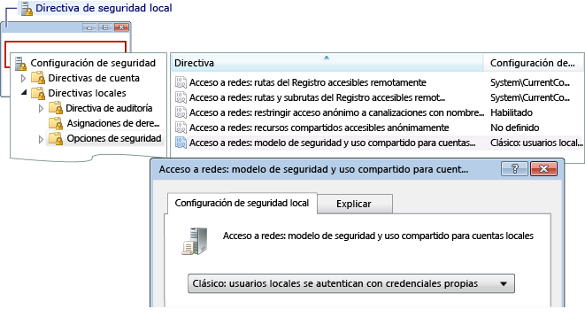

# Error: El grupo de trabajo no ha podido iniciar una sesi&#243;n remota
[!INCLUDE[vs2017banner](../code-quality/includes/vs2017banner.md)]

Este error reza como sigue:  
  
 Error de inicio de sesión: nombre de usuario desconocido o contraseña incorrecta  
  
 **Motivo**  
  
 Este error se produce cuando se está depurando en un equipo de un grupo de trabajo y se intenta conectar con el equipo remoto.  Entre las posibles causas se incluyen:  
  
-   No existe ninguna cuenta que coincida con el nombre y la contraseña en el equipo remoto.  
  
-   Si el equipo de Visual Studio y la máquina remota están en grupos de trabajo, el error se podría producir debido a la configuración predeterminada de la **Directiva de seguridad local** de la máquina remota.  La configuración predeterminada de la **Directiva de seguridad local** es **Solo invitado: los usuarios locales se autentican como invitados**.  Para depurar en esta configuración, es necesario cambiar la configuración del equipo remoto a **Clásico: usuarios locales autenticados como ellos mismos**.  
  
> [!NOTE]
>  Debe ser administrador para llevar a cabo las tareas siguientes.  
  
### Para abrir la ventana Directiva de seguridad local  
  
1.  Inicie el complemento **secpol.msc** en Microsoft Management Console.  Escriba secpol.msc en la búsqueda de Windows, el cuadro Ejecutar de Windows o en un símbolo del sistema.  
  
### Para agregar asignaciones de derechos de usuario  
  
1.  1  
  
2.  Abra la ventana **Directiva de seguridad local**.  
  
3.  Expanda la carpeta **Directivas locales**.  
  
4.  Haga clic en **Asignación de derechos de usuario**.  
  
5.  En la columna **Directiva**, haga doble clic en **Depurar programas** para ver las asignaciones actuales de la directiva de grupo local en el cuadro de diálogo **Configuración de directiva de seguridad local**.  
  
       
  
6.  Para agregar nuevos usuarios, haga clic en el botón **Agregar usuario o grupo**.  
  
### Para cambiar el modelo de seguridad y recursos compartidos  
  
1.  Abra la ventana **Directiva de seguridad local**.  
  
2.  Expanda la carpeta **Directivas locales**.  
  
3.  Haga clic en **Opciones de seguridad**.  
  
4.  En la columna **Directiva**, haga doble clic en **Acceso de red: modelo de seguridad y recursos compartidos para cuentas locales**.  
  
5.  En el cuadro de diálogo **Acceso de red: modelo de seguridad y recursos compartidos para cuentas locales**, cambie el valor a **Clásico: usuarios locales autenticados como ellos mismos** y haga clic en el botón **Aplicar**.  
  
       
  
## Vea también  
 [Errores de la depuración remota y sus soluciones](../debugger/remote-debugging-errors-and-troubleshooting.md)   
 [Depuración remota](../debugger/remote-debugging.md)