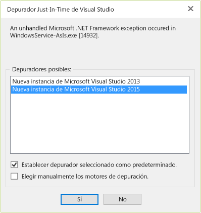

# C&#243;mo: Depurar el m&#233;todo OnStart
[!INCLUDE[vs2017banner](../code-quality/includes/vs2017banner.md)]

Se puede depurar un servicio de Windows si se inicia el servicio y se asocia el depurador al proceso del servicio. Para obtener más información, consulta [How to: Debug Windows Service Applications](../Topic/How%20to:%20Debug%20Windows%20Service%20Applications.md). Sin embargo, para depurar el método <xref:System.ServiceProcess.ServiceBase.OnStart%2A?displayProperty=fullName> de un servicio de Windows, debe iniciar el depurador desde dentro del método.  
  
1.  Agregue una llamada a <xref:System.Diagnostics.Debugger.Launch%2A> al principio del método `OnStart()`.  
  
    ```c#  
    protected override void OnStart(string[] args)  
    {  
        System.Diagnostics.Debugger.Launch();  
     }  
    ```  
  
2.  Inicie el servicio \(puede usar `net start` o iniciarlo en la ventana **Servicios**\).  
  
     Debería ver un cuadro de diálogo similar al siguiente:  
  
       
  
3.  Seleccione **Sí, depurar \<nombre del servicio\>.**  
  
4.  En la ventana del depurador Just\-In\-Time, seleccione la versión de Visual Studio que quiere usar para la depuración.  
  
       
  
5.  Una nueva instancia de Visual Studio se inicia y la ejecución se detiene en el método `Debugger.Launch()`.  
  
## Vea también  
 [Seguridad del depurador](../debugger/debugger-security.md)   
 [Depurar código administrado](../debugger/debugging-managed-code.md)