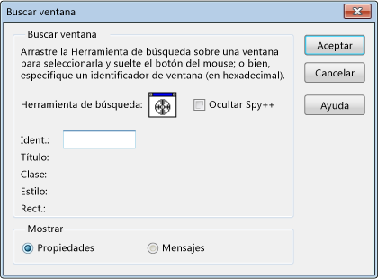

# Cómo: Usar la herramienta de búsqueda
Puede usar la herramienta de búsqueda en el **Buscar ventana** cuadro de diálogo para mostrar la ventana Propiedades o mensajes. La herramienta de búsqueda también puede encontrar ventanas secundarias deshabilitadas y discernir qué ventana resaltar si deshabilita secundarios superposición de windows.  
  
   
Herramienta de búsqueda en el cuadro de diálogo Buscar ventana  
  
 La ilustración anterior muestra el cuadro de diálogo Buscar ventana después del paso 3 siguiente.  
  
### Para mostrar la ventana Propiedades o mensajes  
  
1.  Organizar las ventanas para que estén visibles Spy ++ y la ventana de destino.  
  
2.  Desde el **Spy** menú, elija **Buscar ventana**.  
  
     El [cuadro de diálogo Buscar ventana](../debugger/find-window-dialog-box.md) se abre.  
  
3.  Arrastre el **herramienta de búsqueda** sobre la ventana de destino.  
  
     A medida que arrastra la herramienta, el **Buscar ventana** cuadro de diálogo muestra los detalles de la ventana seleccionada.  
  
     - O  
  
     Si tiene el identificador de la ventana que desea examinar (por ejemplo, si se copian desde el depurador), escríbalo en el **controlar** cuadro de texto.  
  
    > [!TIP]
    >  Para reducir la acumulación de elementos de pantalla, seleccione la **Ocultar Spy** opción. Esta opción oculta la ventana principal de Spy ++, dejando sólo los **Buscar ventana** cuadro de diálogo visible encima de las otras aplicaciones. La ventana principal de Spy ++ se restaura al hacer clic en **Aceptar** o **cancelar**, o cuando se borra el **Ocultar Spy ++** opción.  
  
4.  En **mostrar**, seleccione **propiedades** o **mensajes**.  
  
5.  Press **OK**.  
  
     Si seleccionó **propiedades**, [cuadro de diálogo de propiedades de ventana](../debugger/window-properties-dialog-box.md) se abre. Si seleccionó **mensajes**, [vista mensajes](../debugger/messages-view.md) abre la ventana.  
  
## Vea también  
 [Vistas de Spy ++](../debugger/spy-increment-views.md)   
 [Usar Spy ++](../debugger/using-spy-increment.md)   
 [Referencia de Spy++](../debugger/spy-increment-reference.md)