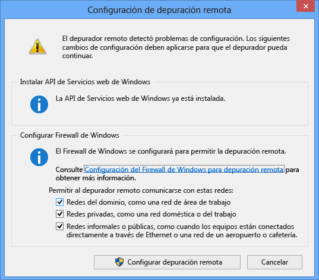

---
translation.priority.ht:
- cs-cz
- de-de
- es-es
- fr-fr
- it-it
- ja-jp
- ko-kr
- pl-pl
- pt-br
- ru-ru
- tr-tr
- zh-cn
- zh-tw
ms.openlocfilehash: b6e312f7e1913a8b4533c0127b966dc3ac0d981d
ms.sourcegitcommit: c57ae28181ffe14a30731736661bf59c3eff1211
ms.translationtype: MT
ms.contentlocale: es-ES
ms.lasthandoff: 07/11/2018
ms.locfileid: "38809278"
---
Debe tener permisos administrativos en el equipo remoto.  
  
1.  Busque la aplicación Depurador remoto. (Busque msvsmon.exe en la ubicación donde se haya instalado o abra el menú Inicio y busque **Remote Debugger**.)
  
     Si se ejecuta el depurador remoto en un servidor remoto, puede haga clic en la aplicación del depurador remoto y elegir **ejecutar como administrador**. Si no se está ejecutando en un servidor remoto, simplemente inícielo con normalidad.
  
3.  Al iniciar las herramientas remotas por primera vez (o antes de que se haya configurado), el **configuración de depuración remota** aparece el cuadro de diálogo.  
  
       
  
4.  Si la API de servicio de Windows no está instalada (que solo se produce en Windows Server 2008 R2), elija el **instalar** botón.  
  
5.  Seleccione los tipos de red en los que desea usar las herramientas remotas. Debe seleccionar al menos un tipo de red. Si los equipos están conectados a través de un dominio, debe elegir el primer elemento. Si los equipos están conectados a través de un grupo de trabajo o un grupo en el hogar, debe elegir el segundo o tercer elemento según corresponda.  
  
6.  Elija **Configurar depuración remota** para configurar el firewall e iniciar la herramienta.  
  
7.  Cuando se completa la configuración, aparecerá la ventana del depurador remoto.
  
     
  
     El depurador remoto ahora está esperando una conexión. Tome nota del nombre del servidor y número de puerto que se muestra, porque debe coincidir con la configuración que posteriormente, usar en Visual Studio.  
  
 Cuando haya terminado la depuración y la necesidad de detener el depurador remoto, haga clic en **archivo > salida** en la ventana. Puede reiniciarlo desde el **iniciar** menú o desde la línea de comandos:  
  
 **\<Directorio de instalación del depurador remoto >\\< x86, x64, ARM, ARM64 o Appx > \msvsmon.exe**.  
