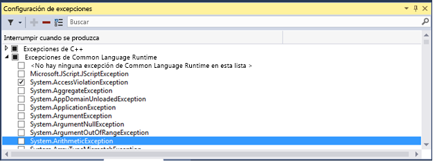
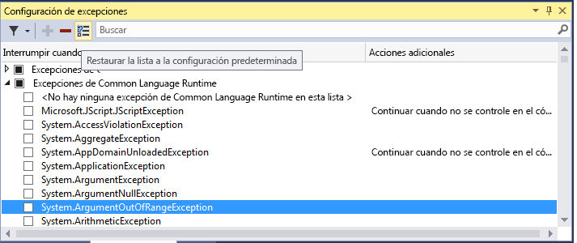
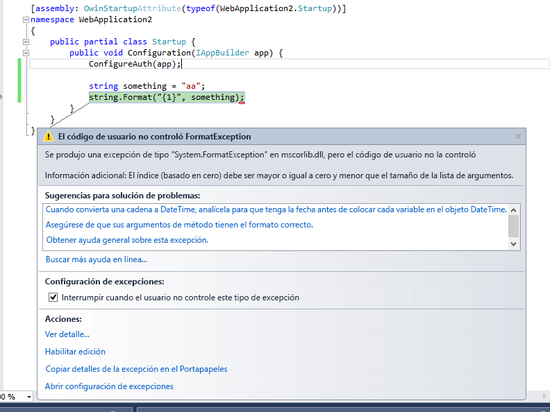
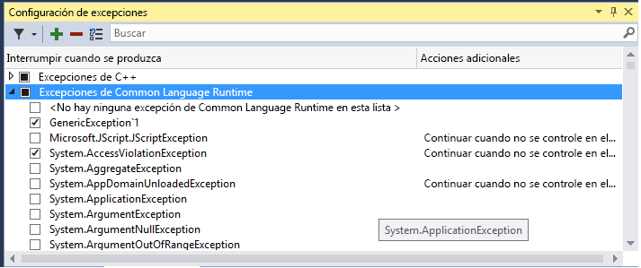

# <a name="manage-exceptions-with-the-debugger-in-visual-studio"></a>Administrar excepciones con el depurador de Visual Studio

Una excepción es una indicación de estado de error que se produce mientras se ejecuta un programa. Puede indicar al depurador qué excepciones (o conjuntos de excepciones) que se interrumpa en y en qué punto desea que el depurador se interrumpa (cuando el depurador interrumpe, se muestra donde se produjo la excepción). También puede agregar o eliminar las excepciones. Con una solución abierta en Visual Studio, utilice **Depurar > Windows > configuración de excepciones** para abrir el **configuración de excepciones** ventana. 

Puede y debe proporcionar controladores que respondan a las excepciones más importantes, pero es importante saber cómo configurar el depurador para interrumpir siempre la ejecución de algunas excepciones.
  
Cuando se produce una excepción, el depurador escribe un mensaje en la ventana Salida. La ejecución se puede interrumpir en los casos siguientes:  
  
-   Cuando se produce una excepción y no se controla.  
  
-   Cuando el depurador está configurado para interrumpir la ejecución antes de que se invoque un controlador.  
  
-   Si ha configurado [solo mi código](../debugger/just-my-code.md), y el depurador está configurado para que se interrumpa en cualquier excepción que no se controla en código de usuario.  
  
> [!NOTE]
>  ASP.NET tiene un controlador de excepciones de nivel superior que muestra las páginas de error en un explorador. No interrumpe la ejecución a menos que **Solo mi código** esté activado. Para obtener un ejemplo, consulta [Setting the debugger to continue on user-unhandled exceptions](../debugger/managing-exceptions-with-the-debugger.md#BKMK_UserUnhandled) a continuación.  
  
> [!NOTE]
>  En una aplicación de Visual Basic, el depurador administra todos los errores como excepciones, incluso si se usan en los controladores de errores de estilo de Error.    
  
## <a name="tell-the-debugger-to-break-when-an-exception-is-thrown"></a>Indicar al depurador que interrumpa cuando se produce una excepción  
El depurador puede interrumpir la ejecución en el momento en que se produce una excepción, permitiendo así depurarla antes de que se invoque un controlador.  
  
En el **configuración de excepciones** ventana (**Depurar > Windows > configuración de excepciones**), expanda el nodo de una categoría de excepciones (por ejemplo, **excepciones Common Language Runtime**, lo que significa que las excepciones. NET) y seleccione la casilla de verificación para una excepción concreta dentro de esa categoría (por ejemplo **System.AccessViolationException**). También puede seleccionar una categoría de excepciones completa.  
  
  

> [!TIP]
> Si quiere buscar una determinada excepción, use la ventana **Buscar** de la barra de herramientas de **Configuración de excepciones** . También puede usar la búsqueda para filtrar espacios de nombres específicos (por ejemplo **System.IO**).
  
Si selecciona una excepción en el **configuración de excepciones** ventana, la ejecución del depurador se interrumpirá siempre que se produzca la excepción, independientemente de si se está controlada o no. En este punto, la excepción se denomina primera excepción. A continuación se muestran un par de escenarios de ejemplo:  
  
*  En la siguiente aplicación de consola de C#, el método Main produce una excepción **AccessViolationException** dentro de un bloque `try/catch` :  
  
    ```CSharp  
    static void Main(string[] args)  
    {  
        try  
        {  
            throw new AccessViolationException();  
            Console.WriteLine("here");  
        }  
        catch (Exception e)  
        {  
            Console.WriteLine("caught exception");  
        }  
        Console.WriteLine("goodbye");  
    }  
    ```  
  
     Si activó **AccessViolationException** en la **Configuración de excepciones**y ejecuta este código en el depurador, la ejecución se interrumpirá en la línea `throw` . A continuación puede continuar la ejecución. La consola debería mostrar ambas líneas:  
  
    ```  
    caught exception  
    goodbye  
    ```  
  
     Sin embargo, no muestra la línea `here` .  
  
*  Una aplicación de consola de C# hace referencia a una biblioteca de clases con una clase que tiene dos métodos, un método que produce una excepción y la controla, y un segundo método que produce la misma excepción y no la controla:  
  
    ```csharp 
    public class Class1  
    {  
        public void ThrowHandledException()  
        {  
            try  
            {  
                throw new AccessViolationException();  
            }  
            catch (AccessViolationException ave)  
            {  
                Console.WriteLine("caught exception" + ave.Message);  
            }  
        }  
  
        public void ThrowUnhandledException()  
        {  
            throw new AccessViolationException();  
        }  
    }  
    ```  
  
     Este es el método Main() de la aplicación de consola:  
  
    ```CSharp  
    static void Main(string[] args)  
    {  
        Class1 class1 = new Class1();  
        class1.ThrowHandledException();  
        class1.ThrowUnhandledException();  
    }  
    ```  
  
     Si activó **AccessViolationException** en la **Configuración de excepciones**y ejecuta este código en el depurador, la ejecución se interrumpirá en la línea `throw` en las dos excepciones **ThrowHandledException()** y **ThrowUnhandledException()**.  
  
 Si desea restaurar la configuración de excepciones a los valores predeterminados, haga clic en el botón **Restaurar** de la barra de herramientas:  
  
   
  
##  <a name="BKMK_UserUnhandled"></a>Indicar al depurador para continuar en excepciones no controladas por el usuario  
 Si está depurando código .NET o JavaScript con [Just My Code](../debugger/just-my-code.md), puede indicar al depurador que no interrumpa la ejecución en excepciones que no se controlan en el código de usuario, pero que sí se controlan en otro lugar.  
  
1.  En la ventana **Configuración de excepciones** , abra el menú contextual de una ventana con el botón derecho y, a continuación, seleccione **Mostrar columnas**. (Si ha desactivado **Solo mi código**, no verá este comando).  
  
2.  Debería ver una segunda columna denominada **Acciones adicionales**. Esta columna muestra **Continuar si no está controlada en el código de usuario** en excepciones específicas, lo que significa que el depurador no se interrumpe si esa excepción no se controla en el código del usuario, pero sí se controla en código externo.  
  
3.  Esta configuración se puede cambiar para excepciones concretas (seleccione la excepción, haga clic con el botón derecho y active o desactive **Continuar si no está controlada en el código de usuario**) o para toda una categoría de excepciones (por ejemplo, todas las excepciones de Common Language Runtime).  
  
 Por ejemplo, para controlar las excepciones, las aplicaciones web ASP.NET las convierten en un código de estado HTTP 500 ([Exception Handling in ASP.NET API](http://www.asp.net/web-api/overview/error-handling/exception-handling)[Control de excepciones en la API de ASP.NET]), lo cual podría no ser una ayuda a la hora de determinar el origen de la excepción. En el ejemplo siguiente, el código del usuario realiza una llamada a `String.Format()` que produce una excepción <xref:System.FormatException>. La ejecución se interrumpe del modo siguiente:  
  
   
  
## <a name="add-and-delete-exceptions"></a>Agregar y eliminar excepciones  
 Las excepciones se pueden agregar y eliminar. Puede eliminar cualquier tipo de excepción de cualquier categoría; para ello, seleccione la excepción y haga clic en el botón **Eliminar** (el signo menos) de la barra de herramientas de **Configuración de excepciones** , o haga clic con el botón derecho en la excepción y seleccione **Eliminar** en el menú contextual. Eliminar una excepción tiene el mismo efecto que no activar la excepción: el depurador no se interrumpirá cuando se produzca la excepción.  
  
 Para agregar una excepción: en la ventana **Configuración de excepciones** , seleccione una de las categorías de excepciones (por ejemplo, **Common Language Runtime**) y haga clic en el botón **Agregar** . Escriba el nombre de la excepción (por ejemplo, **System.UriTemplateMatchException**). La excepción se agrega a la lista (en orden alfabético) y se activa automáticamente.  
  
 Si desea agregar una excepción a las excepciones de acceso a la memoria de GPU, a las excepciones de JavaScript en tiempo de ejecución o a las excepciones de Win32, deberá incluir el código de error y la descripción.  
  
> [!TIP]
>  No olvide revisar la ortografía. El **configuración de excepciones** ventana no comprueba la existencia de una excepción agregada. Por tanto, si escribe **Sytem.UriTemplateMatchException**, obtendrá una entrada para esa excepción (y no para **System.UriTemplateMatchException**).  
  
 Configuración de excepciones se conserva en el archivo .suo de la solución, por lo que se aplican a una solución concreta. No se puede reutilizar esta configuración de soluciones. Actualmente solo se conservan las excepciones agregadas, no las eliminadas. En otras palabras, puede agregar una excepción, cerrar la solución y volver a abrirla, y la excepción seguirá estando ahí. Pero si elimina una excepción y cierra y vuelve a abrir la solución, volverá a aparecer la excepción.  
  
 La ventana **Configuración de excepciones** admite tipos genéricos de excepciones en C#, pero no en Visual Basic. Para interrumpir la ejecución en excepciones como `MyNamespace.GenericException<T>`, agregue la excepción como **MyNamespace.GenericException`1**. Es decir, si creó una excepción como esta:  
  
```CSharp  
public class GenericException<T> : Exception  
{  
    public GenericException() : base("This is a generic exception.")  
    {  
    }  
}  
```  
  
 Puede agregar la excepción a **Configuración de excepciones** del modo siguiente:  
  
   

## <a name="add-conditions-to-an-exception"></a>Agregar condiciones a una excepción

Puede establecer condiciones en las excepciones producidas en el **configuración de excepciones** cuadro de diálogo. Entre las condiciones actualmente compatibles se incluyen los nombres de módulo para incluir o excluir de la excepción. Al establecer los nombres de módulo como condiciones, puede hacer que interrumpa la excepción solo en los módulos de código determinado o puede evitar la interrupción en módulos concretos.

> [!NOTE]
> Agregar condiciones a una excepción es nueva en[!include[vs_dev15](../misc/includes/vs_dev15_md.md)]

Para agregar excepciones condicionales, elija la **Editar condición** icono en el cuadro de diálogo de configuración de excepciones o haga clic en la excepción y elija **editar condiciones**.


  
## <a name="see-also"></a>Vea también  
 [Continuar la ejecución después de una excepción](../debugger/continuing-execution-after-an-exception.md)   
 [Cómo: examinar el código del sistema después de una excepción](../debugger/how-to-examine-system-code-after-an-exception.md)   
 [Cómo: utilizar comprobaciones nativas en tiempo de ejecución](../debugger/how-to-use-native-run-time-checks.md)   
 [Uso de tiempo de ejecución comprueba sin la biblioteca de tiempo de ejecución de C](../debugger/using-run-time-checks-without-the-c-run-time-library.md)   
 [Conceptos básicos del depurador](../debugger/debugger-basics.md)