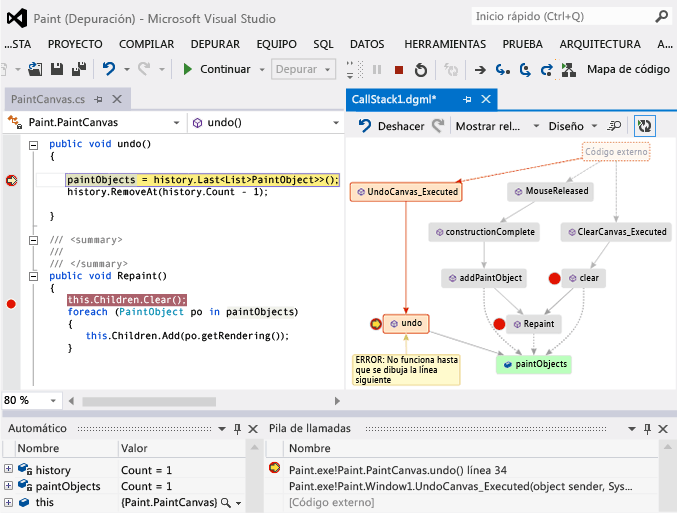
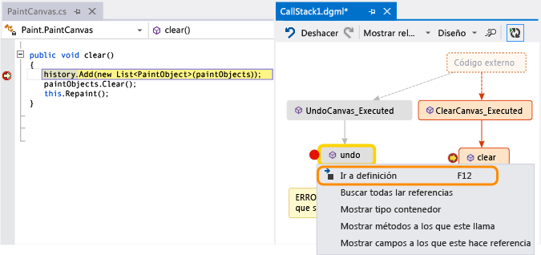
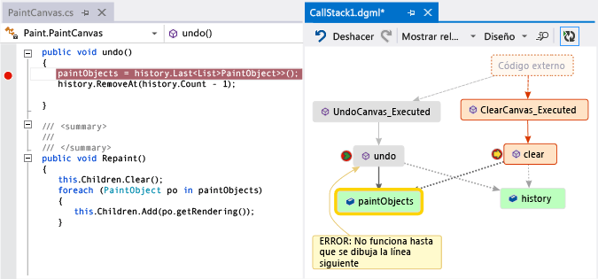
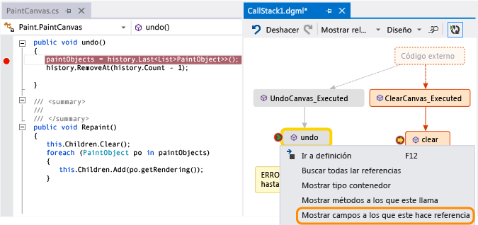
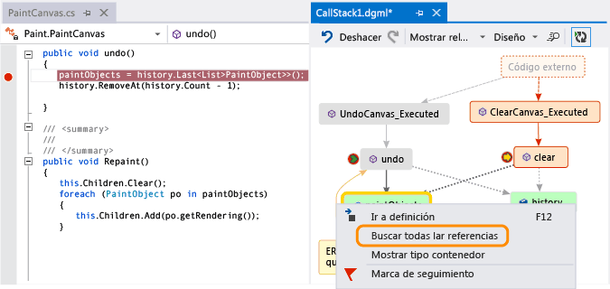
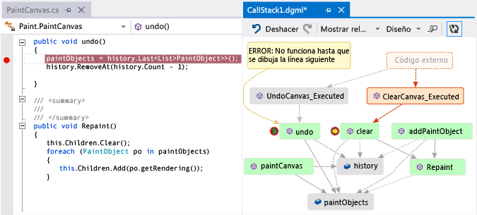
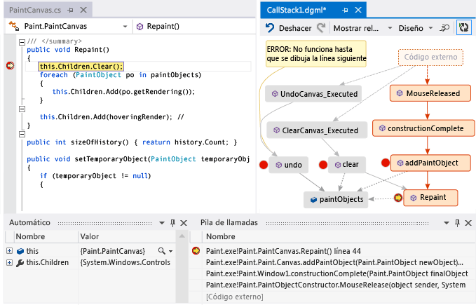
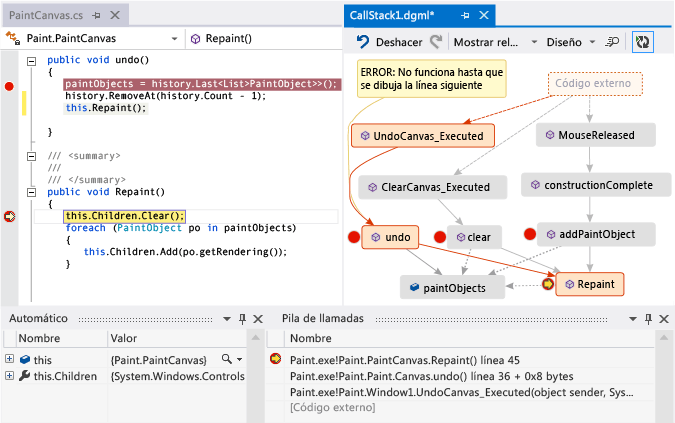
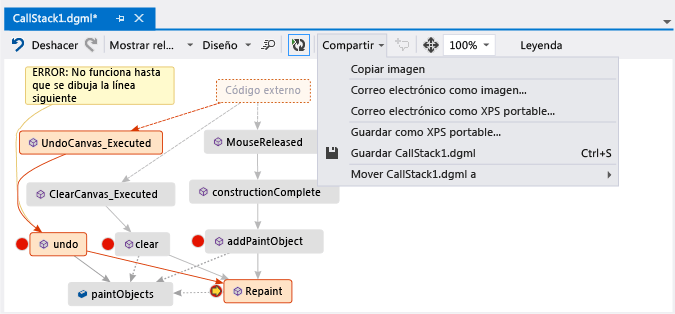

# Crear un mapa visual de la pila de llamadas durante la depuración 

Cree un mapa de código para hacer un seguimiento visual de la pila de llamadas durante la depuración. Puede hacer anotaciones en el mapa para llevar a cabo el seguimiento de lo que hace el código y poder concentrarse en encontrar errores.

Para ver un tutorial, vea este vídeo: [Vídeo: Depurar visualmente con la integración del depurador del mapa de código (Channel 9)](http://go.microsoft.com/fwlink/?LinkId=293418)

Para obtener detalles de los comandos y acciones que puede utilizar con mapas de código, vea [examinar y reorganizar mapas de código](../modeling/browse-and-rearrange-code-maps.md).

>[!IMPORTANT]
>Puede crear únicamente en los mapas de código [edition de Visual Studio Enterprise](https://visualstudio.microsoft.com/downloads/?utm_medium=microsoft&utm_source=docs.microsoft.com&utm_campaign=button+cta&utm_content=download+vs2017).

Este es un vistazo rápido a un mapa de código:

 

##   Asignar la pila de llamadas

1. En un Visual Studio Enterprise C#, Visual Basic, C++, JavaScript o X ++ project, iniciar la depuración seleccionando **depurar** > **Iniciar depuración** o presionando **F5**.
   
1. Después de la aplicación entra en modo de interrupción o entra en una función, seleccione **depurar** > **mapa de código**, o bien presione **Ctrl**+**MAYÚS** +**`**.

   La pila de llamadas actual aparece en naranja en un nuevo mapa de código:

   

El código asignado automáticamente las actualizaciones al continuar la depuración. Cambiar el diseño o elementos de mapa no afecta al código de algún modo. No dude en cambiar el nombre, mover o quitar contenido del mapa.

Para obtener más información sobre un elemento, mantenga el mouse sobre él y examine la información sobre herramientas del elemento. También puede seleccionar **leyenda** en la barra de herramientas para obtener información sobre lo que significa cada icono.

>[!NOTE]
>El mensaje **el diagrama se puede basar en una versión anterior del código** en la parte superior del código de asignación significa que el código podría haber cambiado después de que el mapa se actualizó por última vez. Por ejemplo, una llamada en el mapa tal vez ya no exista en el código. Cierre el mensaje y, a continuación, intente volver a compilar la solución antes de actualizar el mapa de nuevo.

## Mapa de código externo

De forma predeterminada, en el mapa solo se muestra su código. Para ver código externo en el mapa:
  
- Haga clic en el **pila de llamadas** ventana y seleccione **mostrar código externo**:
  
  
- O bien, anule la selección de **habilitar solo mi código** en Visual Studio **herramientas** (o **depurar**) > **opciones**  >   **Depuración**:
  
  

## Controlar el diseño del mapa

Cambiar el diseño del mapa no afecta al código de algún modo. 

Para controlar el diseño del mapa, seleccione el **diseño** menú en la barra de herramientas del mapa. 

En el **diseño** menú, puede:

-   Cambie el diseño predeterminado.
-   Que deje de reorganizarse el mapa automáticamente, anulando la selección de **diseñar automáticamente al depurar**.
-   Reorganizar el mapa lo mínimo posible al agregar elementos, anulando la selección de **diseño Incremental**.

##   Hacer notas sobre el código

Puede agregar comentarios para realizar un seguimiento de lo que sucede en el código. 

Para agregar un comentario, haga clic en el mapa de código y seleccione **editar** > **nuevo comentario**, a continuación, escriba el comentario. 

Para agregar una nueva línea en un comentario, presione **MAYÚS**+**ENTRAR**.

 

##   Actualizar el mapa con la siguiente pila de llamadas

Cuando ejecute la aplicación en el siguiente punto de interrupción o el paso en una función, el mapa agrega automáticamente nuevas pilas de llamadas.

Para detener la asignación de agregar automáticamente nuevas pilas de llamadas, seleccione  en la barra de herramientas del mapa de código. La asignación continúa resaltar las pilas de llamadas existentes. Para agregar manualmente la pila de llamadas actual al mapa, presione **Ctrl**+**MAYÚS**+**`**. 

##   Agregar código relacionado al mapa

Ahora que tiene una asignación, en C# o Visual Basic, puede agregar elementos tales como campos, propiedades y otros métodos para realizar un seguimiento de lo que sucede en el código. 

Para ir a la definición de un método en el código, haga doble clic en el método en el mapa, o selecciónelo y presione **F12**, o haga clic en él y seleccione **ir a definición**.

Para agregar elementos a los que desea realizar el seguimiento en el mapa, haga clic en un método y seleccione los elementos que desea realizar un seguimiento. Los elementos agregados más recientemente aparecen en verde.

>[!NOTE]
>De forma predeterminada, al agregar elementos al mapa también se agregan nodos del grupo primario, como clase, espacio de nombres y ensamblado. Puede activar esta característica y activar seleccionando el **incluir elementos primarios** situado en la barra de herramientas del mapa de código o presionando **Ctrl** mientras se agregan elementos.

Continúe con la compilación del mapa para ver más código.

 

 

##   Buscar errores usando el mapa
 La visualización del código puede ayudarle a encontrar errores con mayor rapidez. Por ejemplo, suponga que está investigando un error en una aplicación de dibujo. Cuando dibuja una línea e intenta deshacerla, no sucede nada hasta que dibuja otra línea.

 Por tanto, establece los puntos de interrupción en los métodos  `clear`, `undo` y `Repaint`, inicia la depuración y compila un mapa como este:

 

 Observe que todos los gestos de usuario en el mapa llaman a `Repaint`, salvo `undo`. Esto podría explicar por qué `undo` no funciona inmediatamente.

 Después de corregir el error y continuar la ejecución de la aplicación, el mapa agrega la nueva llamada de `undo` a `Repaint`:

 

## Compartir el mapa con otros usuarios

Puede exportar un mapa, enviarlo a otros usuarios con Microsoft Outlook, guárdelo en la solución y consultarla en el control de versiones.

Para compartir o guardar el mapa, utilice **compartir** en la barra de herramientas del mapa de código. 

## Vea también
[Asignar dependencias en las soluciones](../modeling/map-dependencies-across-your-solutions.md)

[Usar mapas de código para depurar aplicaciones](../modeling/use-code-maps-to-debug-your-applications.md)

[Buscar posibles problemas mediante analizadores de mapas de código](../modeling/find-potential-problems-using-code-map-analyzers.md)

[Examinar y reorganizar mapas de código](../modeling/browse-and-rearrange-code-maps.md)
