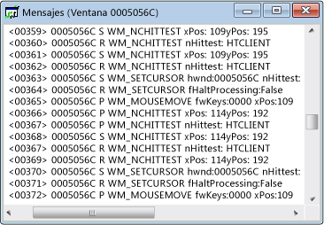

# Messages View
[!INCLUDE[vs2017banner](../code-quality/includes/vs2017banner.md)]

Cada ventana tiene asociada una secuencia de mensajes.  Una ventana de vista Mensajes muestra dicha secuencia.  Se incluyen el identificador de ventana, el código del mensaje y el propio mensaje.  Es posible crear una vista Mensajes tanto para un subproceso como para un proceso.  De esta forma, se pueden ver los mensajes enviados a todas las ventanas que son propiedad de un proceso o subproceso concreto, lo que es especialmente útil para capturar mensajes de inicialización de ventanas.  
  
 La siguiente es una ventana de vista Mensajes típica.  Observe que la primera columna contiene el identificador de ventana y la segunda columna contiene un código de mensaje \(se explica en [Códigos de mensaje](../debugger/message-codes.md)\).  Los parámetros y los valores devueltos descodificados se muestran a la derecha.  
  
   
Vista Mensajes de Spy\+\+  
  
## Procedimientos  
  
#### Para abrir una vista Mensajes para una ventana, proceso o subproceso  
  
1.  Mueva el foco a una [vista Ventanas](../debugger/windows-view.md), [vista Procesos](../debugger/processes-view.md) o [vista Subprocesos](../debugger/threads-view.md).  
  
2.  Busque el nodo correspondiente al elemento cuyos mensajes desea examinar y selecciónelo.  
  
3.  En el menú **Spy**, elija **Mensajes de registro**.  
  
     Se abrirá el [cuadro de diálogo Opciones de mensaje](../debugger/message-options-dialog-box.md).  
  
4.  Seleccione las opciones del mensaje que desea mostrar.  
  
5.  Presione **Aceptar** para empezar a registrar mensajes.  
  
     Se abrirá una ventana de vista Mensajes y se agregará un menú **Mensajes** a la barra de herramientas de Spy\+\+.  Dependiendo de las opciones seleccionadas, se empezarán a transmitir por secuencias mensajes a la ventana de vista Mensajes activa.  
  
6.  Cuando tenga suficientes mensajes, elija **Detener el registro** en el menú **Mensajes**.  
  
## En esta sección  
 [Controlar la vista Mensajes](../debugger/how-to-control-messages-view.md)  
 Explica cómo administrar la vista Mensajes.  
  
 [Abrir la vista Mensajes desde Buscar ventana](_asug_choosing_message_options)  
 Explica cómo abrir la vista Mensajes desde el cuadro de diálogo Buscar ventana.  
  
 [Buscar un mensaje en la vista Mensajes](../debugger/how-to-search-for-a-message-in-messages-view.md)  
 Explica cómo encontrar un mensaje específico en la vista Mensajes.  
  
 [Iniciar y detener la presentación del registro de mensajes](../debugger/how-to-start-and-stop-the-message-log-display.md)  
 Explica cómo iniciar y detener el registro de mensajes.  
  
 [Códigos de mensaje](../debugger/message-codes.md)  
 Define los códigos de los mensajes incluidos en la vista Mensajes.  
  
 [Mostrar las propiedades del mensaje](../debugger/how-to-display-message-properties.md)  
 Indica cómo mostrar más información sobre un mensaje.  
  
## Secciones relacionadas  
 [Vistas de Spy\+\+](../debugger/spy-increment-views.md)  
 Explica las vistas de árbol de Spy\+\+ de ventanas, mensajes, procesos y subprocesos.  
  
 [Usar Spy\+\+](../debugger/using-spy-increment.md)  
 Presenta la herramienta Spy\+\+ y explica cómo se puede usar.  
  
 [Cuadro de diálogo Opciones de mensaje](../debugger/message-options-dialog-box.md)  
 Se usa para seleccionar qué mensajes aparecen en la vista Mensajes activa.  
  
 [Cuadro de diálogo Buscar mensaje](../debugger/message-search-dialog-box.md)  
 Se usa para encontrar el nodo de un mensaje concreto en la vista Mensajes.  
  
 [Cuadro de diálogo Propiedades del mensaje](../debugger/message-properties-dialog-box.md)  
 Se usa para mostrar las propiedades de un mensaje seleccionado en la vista Mensajes.  
  
 [Referencia de Spy\+\+](../debugger/spy-increment-reference.md)  
 Incluye secciones que describen los menús y cuadros de diálogo de Spy\+\+.