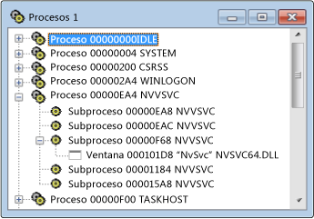

# Vista Procesos
La vista procesos muestra un árbol de todos los procesos activos en el sistema. Se muestran el nombre de identificador y el módulo de proceso. Use la vista procesos si desea examinar un proceso del sistema, que normalmente se corresponde con un programa en ejecución. Los procesos se identifican por nombres de módulos o se designan "procesos del sistema".  
  
 Microsoft Windows admite varios procesos. Cada proceso puede tener uno o varios subprocesos y cada subproceso puede tener uno o más asociados de ventanas de nivel superior. Cada ventana de nivel superior puede poseer una serie de ventanas. Un símbolo + indica que hay un nivel contraído. La vista contraída está formada por una línea por proceso. Haga clic en el signo + para expandir el nivel.  
  
 Use la vista procesos si desea examinar un proceso del sistema, que normalmente se corresponde con un programa en ejecución. Los procesos se identifican por nombres de módulos o se designan "procesos del sistema". Para buscar un proceso, contraiga el árbol y busque en la lista.  
  
## Procedimientos  
  
#### Para abrir la vista procesos  
  
1.  Desde el **Spy** menú, elija **procesos**.  
  
   
Vista de procesos de Spy++  
  
 La ilustración anterior muestra la vista de procesos con los nodos de proceso y subproceso expandidos.  
  
### En esta sección  
 [Buscar un proceso en la vista procesos](../debugger/how-to-search-for-a-process-in-processes-view.md)  
 Explica cómo buscar un proceso específico en la vista procesos.  
  
 [Mostrar propiedades de procesos](../debugger/how-to-display-process-properties.md)  
 Explica cómo mostrar más información acerca de un mensaje.  
  
### Secciones relacionadas  
 [Vistas de Spy++](../debugger/spy-increment-views.md)  
 Explica las vistas de árbol de Spy ++ de ventanas, mensajes, procesos y subprocesos.  
  
 [Usar Spy++](../debugger/using-spy-increment.md)  
 Presenta la herramienta Spy ++ y explica cómo se puede usar.  
  
 [Cuadro de diálogo Buscar proceso](../debugger/process-search-dialog-box.md)  
 Se usa para encontrar el nodo de un proceso específico en la vista procesos.  
  
 [Cuadro de diálogo Propiedades del proceso](../debugger/process-properties-dialog-box.md)  
 Muestra las propiedades de un proceso seleccionado en la vista procesos.  
  
 [Referencia de Spy++](../debugger/spy-increment-reference.md)  
 Incluye secciones que describen cada Spy ++ menú y cuadro de diálogo.