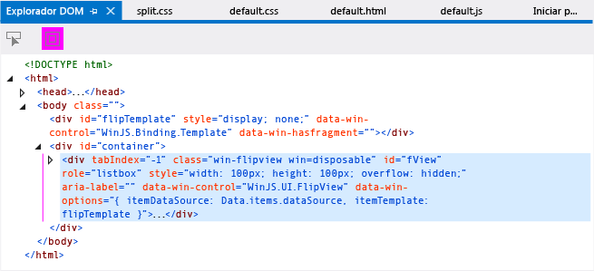
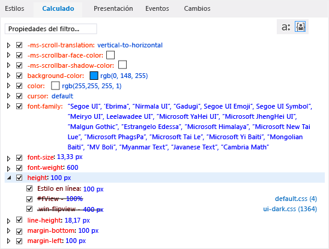
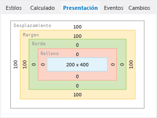

# <a name="debug-html-and-css-in-uwp-apps-in-visual-studio"></a>Depurar HTML y CSS en aplicaciones para UWP en Visual Studio
  
 Para las aplicaciones de JavaScript, Visual Studio ofrece una experiencia de depuración completa que incluye características que los desarrolladores de Internet Explorer y Visual Studio ya conocen. Estas características se admiten para aplicaciones UWP y las aplicaciones creadas con Visual Studio Tools para Apache Cordova.  
  
 Con el modelo de depuración interactivo ofrecido por las herramientas de inspección de DOM, puede ver y modificar el código HTML y CSS presentado, y todo ello sin detener y reiniciar el depurador.
  
 Para obtener información sobre otras características, como el uso de la ventana Consola JavaScript y establecer puntos de interrupción, la depuración de JavaScript consulte [inicio rápido: Depurar JavaScript](../debugger/quickstart-debug-javascript-using-the-console.md) y [depurar aplicaciones en Visual Studio](/visualstudio/debugger/debugging-windows-store-and-windows-universal-apps).  
  
##  <a name="InspectingDOM"></a> Inspeccionar el DOM activo  
 El Explorador DOM muestra una vista de la página presentada. Puedes utilizarlo para cambiar valores y ver inmediatamente los resultados. Eso permite probar los cambios sin necesidad de detener y reiniciar el depurador. El código fuente del proyecto no cambia cuando se interactúa con la página mediante este método. Así pues, cuando encuentre las correcciones de código deseadas, realice los cambios en el código fuente.  
  
> [!TIP]
>  Para evitar detener y reiniciar el depurador al realizar cambios en el código fuente, puede actualizar la aplicación mediante el botón **Actualizar aplicación de Windows** de la barra de herramientas Depurar (o al presionar F4). Para obtener más información, consulte [actualizar una aplicación (JavaScript)](../debugger/refresh-an-app-javascript.md).  
  
 Puedes utilizar el Explorador DOM para:  
  
- Navegar por el subárbol de elementos DOM e inspeccionar el código HTML, CSS y JavaScript presentado.  
  
- Editar de forma dinámica atributos y estilos CSS de los elementos presentados y ver los resultados de inmediato.  
  
- Inspeccionar la aplicación de los estilos CSS a los elementos de la página y realizar el seguimiento de las reglas que se han aplicado.  
  
  Al depurar aplicaciones, con frecuencia tienes que seleccionar elementos en el Explorador DOM. Cuando se selecciona un elemento, los valores que aparecen en las pestañas del lado derecho del Explorador DOM se actualizan automáticamente para reflejar el elemento seleccionado en este. Estas son las pestañas: **Estilos**, **calcula**, **diseño**. Las aplicaciones UWP también admiten la **eventos** y **cambios** pestañas. Para obtener más información sobre la selección de elementos, consulte [Selecting elements](#SelectingElements).  
  
> [!TIP]
>  Si la ventana del Explorador DOM está cerrada, elija **Depurar**>**Ventanas** > **Explorador DOM** para abrirla de nuevo. La ventana únicamente aparece durante las sesiones de depuración de script.  
  
 En el procedimiento siguiente, analizaremos el proceso de depurar de forma interactiva una aplicación utilizando el Explorador DOM. Crearemos una aplicación que usa un control `FlipView` y la depuraremos. La aplicación contiene varios errores.  
  
> [!WARNING]
>  La aplicación de ejemplo siguiente es una aplicación para UWP. Se admiten las mismas características para Cordova, pero la aplicación sería diferente.  
  
#### <a name="to-debug-by-inspecting-the-live-dom"></a>Para depurar inspeccionando el DOM activo  
  
1. Cree una nueva solución en Visual Studio eligiendo **Archivo** > **Nuevo proyecto**.  
  
2. Elija **JavaScript** > **Windows Universal**y, a continuación, elija **WinJS App**.  
  
3. Escriba un nombre para el proyecto, como `FlipViewApp`, y elija **Aceptar** para crear la aplicación.  
  
4. En el elemento BODY de index.html, agregue este código:  
  
   ```html  
   <div id="flipTemplate" data-win-control="WinJS.Binding.Template"  
            style="display:none">  
       <div class="fixedItem" >  
             
       </div>  
   </div>  
   <div id="fView" style="width:100px;height:100px"  
       data-win-control="WinJS.UI.FlipView" data-win-options="{  
       itemDataSource: Data.items.dataSource, itemTemplate: flipTemplate }">  
   </div>  
   ```  
  
5. Abre default.css y agrega el código CSS siguiente:  
  
   ```css  
   #fView {  
       background-color:#0094ff;  
       height: 100%;  
       width: 100%;  
       margin: 25%;  
   }  
   ```  
  
6. Reemplaza el código de default.js con este otro:  
  
   ```javascript  
   (function () {  
       "use strict";  
  
       var app = WinJS.Application;  
       var activation = Windows.ApplicationModel.Activation;  
  
       var myData = [];  
       for (var x = 0; x < 4; x++) {  
           myData[x] = { flipImg: "/images/logo.png" }  
       };  
  
       var pages = new WinJS.Binding.List(myData, { proxy: true });  
  
       app.onactivated = function (args) {  
           if (args.detail.kind === activation.ActivationKind.launch) {  
               if (args.detail.previousExecutionState !==  
               activation.ApplicationExecutionState.terminated) {  
                   // TODO: . . .  
               } else {  
                   // TODO: . . .  
               }  
               args.setPromise(WinJS.UI.processAll());  
  
               updateImages();  
           }  
       };  
  
       function updateImages() {  
  
           pages.setAt(0, { flipImg: "http://public-domain-photos.com/free-stock-photos-1/flowers/cactus-76.jpg" });  
           pages.setAt(1, { flipImg: "http://public-domain-photos.com/free-stock-photos-1/flowers/cactus-77.jpg" });  
           pages.setAt(2, { flipImg: "http://public-domain-photos.com/free-stock-photos-1/flowers/cactus-78.jpg" });  
       };  
  
       app.oncheckpoint = function (args) {  
       };  
  
       app.start();  
  
       var publicMembers = {  
           items: pages  
       };  
  
       WinJS.Namespace.define("Data", publicMembers);  
  
   })();  
   ```  
  
    La siguiente ilustración muestra lo que queremos ver si se ejecuta esta aplicación. En cambio, para que la aplicación tenga este estado, primero tenemos que corregir algunos errores.  
  
      
  
7. Elija **máquina Local** en la lista desplegable lista junto a la **Iniciar depuración** situado en la **depurar** barra de herramientas:  
  
      
  
8. Elija **Depurar** > **Iniciar depuración**o bien presione F5 para ejecutar la aplicación en modo de depuración.  
  
    La aplicación se ejecuta, pero verá una pantalla en blanco principalmente porque el estilo tiene algunos errores en él. La primera imagen `FlipView` aparece en un cuadrado pequeño cerca del centro de la pantalla.  
  
9. Cambia a Visual Studio y elige la pestaña **Explorador DOM** .  
  
   > [!TIP]
   >  Puedes presionar Alt+Tab o F12 para cambiar entre Visual Studio y la aplicación en ejecución.  
  
10. En la ventana del Explorador DOM, selecciona el elemento DIV de la sección cuyo identificador es `"fView"`. Utiliza las teclas de dirección para ver y seleccionar el elemento DIV correcto. (La tecla de flecha derecha te permite ver los elementos secundarios de un elemento).  
  
       
  
    > [!TIP]
    >  También puede seleccionar el elemento DIV en la esquina inferior izquierda de la ventana Consola JavaScript; para ello, escriba `select(fView)` en el indicador de entrada >> y presione Entrar.  
  
     Los valores que aparecen en las pestañas del lado derecho de la ventana del Explorador DOM se actualizan automáticamente para reflejar el elemento actual en el Explorador DOM.  
  
11. Elige la pestaña **Calculado** a la derecha.  
  
     Esta pestaña muestra el valor calculado, o final, para cada propiedad del elemento DOM seleccionado.  
  
12. Abre la regla CSS para el alto. Observa que hay un estilo en línea establecido en 100px que no parece coherente con el valor del alto de 100 % establecido para el selector de CSS `#fView`. El texto tachado para el selector `#fView` indica que el estilo en línea tiene prioridad sobre este estilo.  
  
     En la siguiente ilustración se muestra la pestaña **Calculado** .  
  
       
  
13. En la ventana principal del Explorador DOM, haz doble clic en el estilo en línea para el alto y el ancho del elemento DIV `fView` . Puedes editar aquí los valores. En este escenario, deseamos quitarlos por completo.  
  
14. En la ventana principal, haga doble clic en `width: 100px;height: 100px;`, presione el **eliminar** clave y, a continuación, presione **ENTRAR**. Después de presionar ENTRAR, los nuevos valores se reflejan inmediatamente en la aplicación, aunque no hayas detenido la sesión de depuración.  
  
    > [!IMPORTANT]
    >  Al igual que puedes actualizar atributos en la ventana del Explorador DOM, también puede actualizar los valores que aparecen en las pestañas **Estilos**, **Calculado**y **Diseño** . Para obtener más información, consulte [estilos CSS depurar mediante el explorador DOM](../debugger/debug-css-styles-using-dom-explorer.md) y [diseño de depuración mediante el explorador DOM](../debugger/debug-layout-using-dom-explorer.md).  
  
15. Cambie a la aplicación, selecciónelo, o mediante el uso de ALT+TAB.  
  
     Ahora, el control `FlipView` parece mayor que la pantalla del simulador o el emulador de Windows Phone. Este no es el resultado deseado. Para averiguar más, vuelve a Visual Studio.  
  
16. En el Explorador DOM, selecciona de nuevo la pestaña **Calculado** y abre la regla del alto. El elemento fView sigue mostrando un valor de 100%, según lo esperado desde la CSS, pero el valor calculado es igual al alto de pantalla de la aplicación (por ejemplo, 800 px, 667,67 px o algún otro valor), que es no lo que queremos para esta aplicación. Para investigar en los pasos siguientes se quite el alto y ancho para el `fView` elemento DIV.  
  
17. En la pestaña **Estilos** , desactive las propiedades de ancho y alto del selector de CSS `#fView` .  
  
     La pestaña **Calculado** muestra ahora un alto de 400px. La información indica que este valor se obtiene del selector .win-flipview especificado en ui-dark.css, que es un archivo CSS de plataforma.  
  
18. Cambia de nuevo a la aplicación.  
  
     Las cosas han mejorado. Pero hay un problema más por resolver: los márgenes son demasiado grandes.  
  
19. Para investigar, vaya a Visual Studio y elija la pestaña **Diseño** para ver el modelo de cuadros del elemento.  
  
     En el **diseño** pestaña, verá lo siguiente:  
  
    - 255px (desplazamiento) y 255px (margen) o valores similares, dependiendo de la resolución del dispositivo. 
  
      La ilustración siguiente muestra cómo el **diseño** aspecto de la pestaña si usa un emulador con 100 píxeles de desplazamiento y margen).  
  
        
  
      Esto no parece correcto. La pestaña **Calculado** también muestra los mismos valores de margen.  
  
20. Elige la pestaña **Estilos** y busca el selector de CSS `#fView` . Aquí, se ve el valor del 25 % para la propiedad **margen** .  
  
21. Selecciona el 25 %, cámbialo a 25px y presiona Intro.  
  
22. También en la pestaña **Estilos** , elija la regla del alto para el selector .win-flipview, cambie 400 píxeles por 500 y presione Entrar.  
  
23. Cambia de nuevo a la aplicación. Comprobarás que la posición de los elementos es correcta. Para realizar correcciones en el código fuente y actualizar la aplicación sin detener y reiniciar el depurador, consulta el procedimiento siguiente.  
  
#### <a name="to-refresh-your-app-while-debugging"></a>Para actualizar la aplicación durante la depuración  
  
1.  Mientras la aplicación se está ejecutando, cambia a Visual Studio.  
  
2.  Abre default.html y modifica tu código fuente cambiando el alto y ancho del elemento DIV `"fView"` al 100 %.  
  
3.  Elige el botón **Actualizar aplicación de Windows** situado en la barra de herramientas Depurar (o presiona F4). El botón tiene el siguiente aspecto: . .  
  
     Se recargan las páginas de la aplicación y el simulador o el emulador de Windows Phone vuelven al primer plano.  
  
     Para obtener más información acerca de la característica de actualización, vea [actualizar una aplicación (JavaScript)](../debugger/refresh-an-app-javascript.md).  
  
##  <a name="SelectingElements"></a> Selecting elements  
 Puedes seleccionar elementos DOM de tres maneras al depurar una aplicación:  
  
- Haciendo clic en los elementos directamente en la ventana del Explorador DOM (o utilizando las teclas de dirección).  
  
- Utilizando el botón **Seleccionar elemento** (Ctrl + B).  
  
- Utilizando el botón `select` , que es uno de los [JavaScript Console commands](../debugger/javascript-console-commands.md).  
  
  Cuando utilices la ventana del Explorador DOM para seleccionar elementos y sitúes el puntero del mouse sobre un elemento, el elemento correspondiente se resaltará en la aplicación que se ejecuta. Haz clic en el elemento en DOM Explorer para seleccionarlo, o puedes utilizar las teclas de dirección para resaltar y seleccionar elementos. También puedes seleccionar elementos del Explorador DOM mediante el botón **Seleccionar elemento** . En la ilustración siguiente se muestra el botón **Seleccionar elemento** .  
  
    
  
  Al hacer clic en **Seleccionar elemento** (o presionar Ctrl + B), el modo de selección cambia para que puedas seleccionar un elemento del Explorador DOM haciendo clic en él desde la aplicación que se ejecuta. El modo vuelve a cambiar al modo de selección normal después de un solo clic. Al hacer clic en **Seleccionar elemento**, la aplicación se pone en primer plano. El cursor cambia para reflejar el nuevo modo de selección. Al hacer clic en el elemento con contorno, el Explorador DOM vuelve al primer plano con ese elemento seleccionado.  
  
  Antes de elegir **Seleccionar elemento**, puede especificar si desea resaltar los elementos de la aplicación en ejecución mediante la alternancia del botón **Mostrar cuadros de resaltado de página web para el elemento seleccionado en el árbol DOM** . En la siguiente ilustración se muestra este botón. Los elementos resaltados se muestran de forma predeterminada.  
  
    
  
  Al elegir que se resalten los elementos, se resaltan aquellos sobre los que se mantiene el mouse en el simulador. Los colores de los elementos resaltados coinciden con el modelo de cuadro que aparece en la pestaña **Diseño** del Explorador DOM.  
  
> [!NOTE]
>  El resaltado de elementos al pasar sobre ellos solo se admite en parte en el emulador de Windows Phone.  
  
## <a name="see-also"></a>Vea también  
 [Debug apps in Visual Studio](/visualstudio/debugger/debugging-windows-store-and-windows-universal-apps)   
 [Actualización de una aplicación (JavaScript)](../debugger/refresh-an-app-javascript.md)   
 [Depuración de un control WebView](../debugger/debug-a-webview-control.md)   
 [Métodos abreviados de teclado](../debugger/keyboard-shortcuts-html-and-javascript.md)   
 [JavaScript Console commands](../debugger/javascript-console-commands.md)   
 [Depuración de código de ejemplo HTML, CSS y JavaScript](../debugger/debug-html-css-and-javascript-sample-code.md)   
 [Compatibilidad de productos y accesibilidad](https://msdn.microsoft.com/library/tzbxw1af(VS.120).aspx)