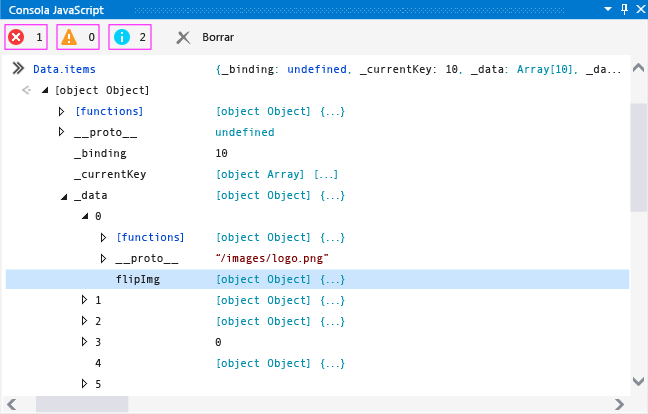
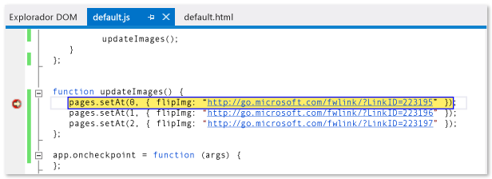
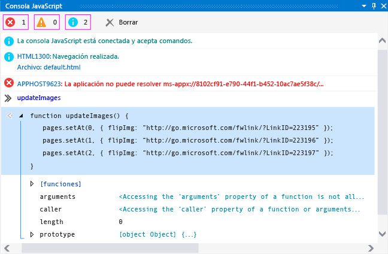

# <a name="quickstart-debug-javascript-using-the-console"></a>Inicio rápido: Depurar JavaScript mediante la consola
  
  
 Puede usar la ventana Consola JavaScript para interactuar con y depurar aplicaciones UWP compiladas mediante JavaScript. Estas características se admiten para aplicaciones UWP, [!INCLUDE[win8_appname_long](../debugger/includes/win8_appname_long_md.md)] aplicaciones, aplicaciones de Windows Phone y aplicaciones creadas con Visual Studio Tools para Apache Cordova. Para consultar los comandos de la consola, consulte [JavaScript Console commands](../debugger/javascript-console-commands.md).  
  
 La ventana Consola JavaScript le permite:  
  
-   Enviar objetos, valores y mensajes desde la aplicación a la ventana de la consola.  
  
-   Ver y modificar los valores de las variables locales y globales en la aplicación en ejecución.  
  
-   Ver los visualizadores de objetos.  
  
-   Ejecutar código JavaScript que se ejecute en el contexto del script actual.  
  
-   Ver los errores y las excepciones de JavaScript, además de las excepciones de Document Object Model (DOM) y de Windows en tiempo de ejecución.  
  
-   Realizar otras tareas, como borrar la pantalla. Consulta [JavaScript Console commands](../debugger/javascript-console-commands.md) para ver la lista completa de comandos.  
  
 En este tema:  
  
-   [Depuración mediante la ventana Consola JavaScript](#InteractiveConsole)  
  
-   [Depuración interactiva y modo de interrupción](#InteractiveDebuggingBreakMode)  
  
-   [Modo de una línea y modo de varias líneas en la ventana Consola JavaScript](#SinglelineMultilineMode)  
  
-   [Cambio del contexto de ejecución del script](#Switching)  
  
> [!TIP]
>  Si la ventana Consola JavaScript está cerrada, elija **Depurar**>**Ventanas** > **Consola de JavaScript** para abrirla de nuevo. La ventana únicamente aparece durante las sesiones de depuración de script.  
  
 La ventana Consola JavaScript le permite interactuar con su aplicación sin tener que detener y reiniciar el depurador. Para obtener más información, consulte [actualizar una aplicación (JavaScript)](../debugger/refresh-an-app-javascript.md). Para obtener información sobre otras características, como el explorador DOM y establecer puntos de interrupción, la depuración de JavaScript, consulte [inicio rápido: depurar HTML y CSS](../debugger/quickstart-debug-html-and-css.md) y [depurar aplicaciones en Visual Studio](../debugger/debug-store-apps-in-visual-studio.md).  
  
##  <a name="InteractiveConsole"></a> Depuración mediante la ventana Consola JavaScript  
 Los siguientes pasos sirven para crear una aplicación `FlipView` y demostrar cómo depurar interactivamente un error de codificación de JavaScript.  
  
> [!CAUTION]
>  La aplicación de muestra es una aplicación de UWP. Sin embargo, las características de consola descritas aquí también se aplican a las aplicaciones creadas con Visual Studio Tools para Apache Cordova.  
  
#### <a name="to-debug-javascript-code-in-the-flipview-app"></a>Para depurar código JavaScript en la aplicación FlipView  
  
1.  Cree una nueva solución en Visual Studio eligiendo **Archivo** > **Nuevo proyecto**.  
  
2.  Elija **JavaScript** > **Tienda**y, después, elija **Aplicaciones Windows** o **Aplicaciones Windows Phone**y, a continuación, elija **Aplicación vacía**.  
  
3.  Escriba un nombre para el proyecto, como `FlipViewApp`, y elija **Aceptar** para crear la aplicación.  
  
4.  En el elemento BODY de default.html, reemplaza el código HTML existente por este código:  
  
    ```html  
    <div id="flipTemplate" data-win-control="WinJS.Binding.Template"  
             style="display:none">  
        <div class="fixedItem" >  
              
        </div>  
    </div>  
    <div id="fView" data-win-control="WinJS.UI.FlipView" data-win-options="{  
        itemDataSource: Data.items.dataSource, itemTemplate: flipTemplate }">  
    </div>  
    ```  
  
5.  Abra default.css y agregue el código CSS para el selector `#fView` :  
  
    ```css  
    #fView {  
        background-color:#0094ff;  
        height: 500px;  
        margin: 25px;  
    }  
    ```  
  
6.  Abre default.js y reemplaza el código por el código JavaScript siguiente:  
  
    ```javascript  
    (function () {  
        "use strict";  
  
        var app = WinJS.Application;  
        var activation = Windows.ApplicationModel.Activation;  
  
        var myData = [];  
        for (var x = 0; x < 4; x++) {  
            myData[x] = { flipImg: "/images/logo.png" }  
        };  
  
        var pages = new WinJS.Binding.List(myData, { proxy: true });  
  
        app.onactivated = function (args) {  
            if (args.detail.kind === activation.ActivationKind.launch) {  
                if (args.detail.previousExecutionState !==  
                activation.ApplicationExecutionState.terminated) {  
                    // TODO: . . .  
                } else {  
                    // TODO: . . .  
                }  
                args.setPromise(WinJS.UI.processAll());  
  
                updateImages();  
            }  
        };  
  
        function updateImages() {  
  
            pages.push(0, { flipImg: "http://go.microsoft.com/fwlink/?LinkID=223195" });  
            pages.push(1, { flipImg: "http://go.microsoft.com/fwlink/?LinkID=223196" });  
            pages.push(2, { flipImg: "http://go.microsoft.com/fwlink/?LinkID=223197" });  
  
        };  
  
        app.oncheckpoint = function (args) {  
        };  
  
        app.start();  
  
        var publicMembers = {  
            items: pages  
        };  
  
        WinJS.Namespace.define("Data", publicMembers);  
  
    })();  
    ```  
  
7.  Si todavía no hay un destino de depuración seleccionado, elija **Simulador** o, para Windows Phone, **Emulator 8.1 WVGA 512MB(ES)** en la lista desplegable junto al botón **Dispositivo** en la barra de herramientas **Depurar** :  
  
       
  
8.  Presiona F5 para iniciar el depurador.  
  
     La aplicación se ejecuta pero faltan las imágenes. Los errores APPHOST de la ventana Consola JavaScript indican que faltan imágenes.  
  
9. Con el `FlipView` aplicación se ejecuta en el simulador o en el emulador de Windows Phone, escriba `Data.items` en el indicador de entrada de la ventana Consola (junto a la ">>" símbolos) y presione ENTRAR.  
  
     Aparece un visualizador para el objeto `items` en la ventana de consola. Esto indica que se ha creado una instancia del objeto `items` y está disponible en el contexto de script actual. En la ventana de consola, puedes hacer clic para recorrer los nodos de un objeto para ver sus valores de propiedad (o usar las teclas de dirección). Si hacemos clic para bajar en el objeto `items._data` , como se ve en esta ilustración, veremos que las referencias al origen de las imágenes son incorrectas, como era de esperar. Las imágenes predeterminadas (logo.png) siguen presentes en el objeto, y hay imágenes que faltan entremezcladas con las imágenes esperadas.  
  
       
  
     Además, tenga en cuenta que hay muchos más elementos en el objeto `items._data` de los que se esperaría.  
  
10. En el símbolo del sistema, escriba `Data.items.push` y presione Entrar. La ventana de la consola muestra un visualizador para la función `push` , que se implementa en un archivo de proyecto de la [!INCLUDE[winjs_long](../debugger/includes/winjs_long_md.md)] . En esta aplicación, estamos utilizando `push` para agregar los elementos correctos. Investigando un poco mediante IntelliSense, descubrimos que deberíamos utilizar `setAt` para reemplazar las imágenes predeterminadas.  
  
11. Para corregir este problema de forma interactiva sin detener la sesión de depuración, abra default.js y seleccione este código de la función `updateImages` :  
  
    ```javascript  
    pages.push(0, { flipImg: "http://go.microsoft.com/fwlink/?LinkID=223195" });  
    pages.push(1, { flipImg: "http://go.microsoft.com/fwlink/?LinkID=223196" });  
    pages.push(2, { flipImg: "http://go.microsoft.com/fwlink/?LinkID=223197" });  
    ```  
  
     Copia y pega este código en el indicador de entrada de la Consola JavaScript.  
  
    > [!TIP]
    >  Al pegar varias líneas de código en el indicador de entrada de la Consola JavaScript, este cambia automáticamente al modo de varias líneas. Puedes presionar Ctrl+Alt+M para activar y desactivar alternativamente el modo de varias líneas. Para ejecutar un script en modo de varias líneas, presiona Ctrl+Intro o elige el símbolo de flecha de la esquina inferior derecha de la ventana. Para obtener más información, consulta [Modo de una línea y modo de varias líneas en la ventana Consola JavaScript](#SinglelineMultilineMode).  
  
12. Corrige las llamadas a funciones `push` en el indicador, reemplazando `pages.push` por `Data.items.setAt`. El código corregido debe ser similar a este:  
  
    ```javascript  
    Data.items.setAt(0, { flipImg: "http://go.microsoft.com/fwlink/?LinkID=223195" });  
    Data.items.setAt(1, { flipImg: "http://go.microsoft.com/fwlink/?LinkID=223196" });  
    Data.items.setAt(2, { flipImg: "http://go.microsoft.com/fwlink/?LinkID=223197" });  
    ```  
  
    > [!TIP]
    >  Si prefieres utilizar el objeto `pages` en lugar de `Data.items`, será necesario que establezcas un punto de interrupción en el código para mantener el objeto `pages` dentro del ámbito.  
  
13. Elige el símbolo de flecha verde para ejecutar el script.  
  
14. Presione Ctrl + Alt + M para cambiar el símbolo del sistema de entrada de la consola al modo de una línea y, a continuación, elija **Borrar entrada** (la "X" roja) para eliminar el código desde el símbolo del sistema de entrada.  
  
15. Escriba `Data.items.length = 3` en el símbolo del sistema y presione Entrar. Al hacerlo, se quitan los elementos extraños de los datos.  
  
16. Comprueba otra vez el simulador o el emulador de Windows Phone. Verás que ya aparecen las imágenes correctas en las páginas correctas de `FlipView` .  
  
17. En DOM Explorer, puedes ver el elemento DIV actualizado y navegar por el subárbol para buscar los elementos IMG esperados.  
  
18. Detenga la depuración eligiendo **Depurar** > **Detener depuración** o presionando Mayús+F5. Luego, corrija el código fuente.  
  
     Para la página de default.html completa que contiene el código de ejemplo corregido, consulte [código de ejemplo de depurar HTML, CSS y JavaScript](../debugger/debug-html-css-and-javascript-sample-code.md).  
  
##  <a name="InteractiveDebuggingBreakMode"></a> Depuración interactiva y modo de interrupción  
 Puedes utilizar puntos de interrupción y depurar el código paso a paso por instrucciones mientras utilizas herramientas de depuración de JavaScript, como la ventana Consola JavaScript. Cuando un programa que se ejecuta en el depurador encuentra un punto de interrupción, el depurador suspende temporalmente la ejecución de ese programa. Cuando se suspende la ejecución, el programa cambia del modo de ejecución al modo de interrupción. Puedes reanudar la ejecución en cualquier momento.  
  
 Aunque un programa esté en modo de interrupción, puede utilizar la ventana Consola JavaScript para ejecutar scripts y comandos válidos en el contexto actual de ejecución. En este procedimiento, utilizaremos la versión corregida de la aplicación `FlipView` que creamos en un procedimiento anterior para mostrar el uso del modo de interrupción.  
  
#### <a name="to-set-a-breakpoint-and-debug-the-app"></a>Para establecer un punto de interrupción y depurar la aplicación  
  
1.  En el archivo default.html de la aplicación `FlipView` que creó antes, abra el menú contextual de la función `updateImages()` y elija **Punto de interrupción** > **Insertar punto de interrupción**.  
  
2.  Elija **Equipo local** o **Emulator 8.1 WVGA 512MB(ES)** en la lista desplegable situada junto al botón **Iniciar depuración** de la barra de herramientas **Depurar** .  
  
3.  Elija **Depurar** > **Iniciar depuración**o presione F5.  
  
     La aplicación entra en el modo de interrupción cuando la ejecución alcanza la función `updateImages()` . La línea actual de ejecución del programa se resalta en amarillo.  
  
       
  
     Puedes cambiar los valores de las variables para modificar inmediatamente el estado del programa sin tener que terminar la sesión de depuración actual.  
  
4.  Escriba `updateImages` en el símbolo del sistema y presione Entrar. Aparece un visualizador para la función en la ventana de la consola.  
  
5.  Selecciona la función en la ventana de la consola para mostrar la implementación de la función.  
  
     En la ilustración siguiente se muestra la ventana de la consola en este punto.  
  
       
  
6.  Copia una línea de la función de la ventana de salida al indicador de entrada, y cambia el valor de índice a 3:  
  
    ```javascript  
    pages.setAt(3, { flipImg: "http://go.microsoft.com/fwlink/?LinkID=223197" });  
    ```  
  
7.  Presiona Intro para ejecutar la línea de código.  
  
     Si quieres recorrer el código línea por línea, presiona F11. Si prefieres continuar con la ejecución del programa, presiona F5.  
  
8.  Presiona F5 para que continúe la ejecución del programa. Aparece la aplicación `FlipView` . Ahora, las cuatro páginas muestran una de las imágenes no predeterminadas.  
  
     Para volver a Visual Studio, presiona F12 o Alt+Tab.  
  
##  <a name="SinglelineMultilineMode"></a> Modo de una línea y modo de varias líneas en la ventana Consola JavaScript  
 El indicador de entrada de la ventana Consola JavaScript admite el modo de una línea y el modo de varias líneas. El procedimiento de depuración interactivo de este tema incluye un ejemplo del uso de ambos modos. Puedes presionar Ctrl+Alt+M para alternar entre los modos.  
  
 El modo de una línea proporciona un historial de entradas. Puedes navegar por el historial de entradas mediante las teclas Flecha arriba y Flecha abajo. El modo de una línea borra el indicador de entrada cuando se ejecutan scripts. Para ejecutar un script en modo de una línea, presiona Intro.  
  
 El modo de varias líneas no borrar el indicador de entrada cuando se ejecutan scripts. Al cambiar al modo de una línea desde el modo de varias líneas, puedes borrar la línea de entrada presionando **Borrar entrada** (la "X" roja). Para ejecutar un script en modo de varias líneas, presiona Ctrl+Intro o elige el símbolo de flecha de la esquina inferior derecha de la ventana.  
  
##  <a name="Switching"></a> Cambio del contexto de ejecución del script  
 La ventana Consola JavaScript permite interactuar con un solo contexto de ejecución, que representa una única instancia del host de la plataforma web (WWAHost.exe). En algunos casos, la aplicación puede iniciar otra instancia del host, como al usar un `iframe`, un contrato de participación, un trabajo web o un control `WebView` . Si se está ejecutando otra instancia del host, puede seleccionar un contexto de ejecución distinto mientras ejecuta la aplicación seleccionando el contexto de ejecución en la lista **Destino** .  
  
 La siguiente ilustración muestra la lista Destino en la ventana Consola JavaScript.  
  
   
  
 Puede cambiar el contexto de ejecución mediante el comando `cd` , pero debe saber el nombre del otro contexto de ejecución, y la referencia que use debe estar en el ámbito. La lista **Destino** permite un acceso mejorado a otros contextos de ejecución.  
  
##  <a name="BrowserSupport"></a> Compatibilidad con explorador y plataforma  
 La ventana Consola JavaScript es compatible con las siguientes plataformas:  
  
-   Aplicaciones UWP, [!INCLUDE[win8_appname_long](../debugger/includes/win8_appname_long_md.md)]y las aplicaciones de Windows Phone con JavaScript y HTML  
  
-   Internet Explorer 11 que se ejecute en [!INCLUDE[win81](../debugger/includes/win81_md.md)]  
  
-   Internet Explorer 10 que se ejecute en [!INCLUDE[win8](../debugger/includes/win8_md.md)]  
  
## <a name="see-also"></a>Vea también  
 [Debug apps in Visual Studio](../debugger/debug-store-apps-in-visual-studio.md)   
 [Comandos de la consola de JavaScript](../debugger/javascript-console-commands.md)   
 [Actualizar una aplicación (JavaScript)](../debugger/refresh-an-app-javascript.md)   
 [Métodos abreviados de teclado](../debugger/keyboard-shortcuts-html-and-javascript.md)   
 [Depurar código de ejemplo HTML, CSS y JavaScript](../debugger/debug-html-css-and-javascript-sample-code.md)   
 [Inicio rápido: Depurar HTML y CSS](../debugger/quickstart-debug-html-and-css.md)   
 [Depurar un control WebView](../debugger/debug-a-webview-control.md)   
 [Compatibilidad de productos y accesibilidad](http://msdn.microsoft.com/library/tzbxw1af\(VS.120\).aspx)