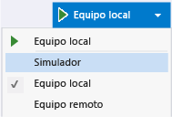

# Actualizar una aplicaci&#243;n (JavaScript)
[!INCLUDE[vs2017banner](../code-quality/includes/vs2017banner.md)]

  
  
 Puedes hacer cambios en el código durante la depuración y, después, actualizar una aplicación de la Tienda Windows desarrollada con JavaScript eligiendo el botón **Actualizar aplicación de Windows** en la barra de herramientas **Depurar**.  Al elegir este botón, se recarga la aplicación sin detener y reiniciar el depurador.  La característica Actualizar te permite modificar código de HTML, CSS y JavaScript, y ver el resultado rápidamente.  Esta función es compatible para las aplicaciones de la Tienda Windows y de la Tienda de Windows Phone.  
  
 La actualización no conserva el estado de la aplicación ni refleja los siguientes cambios en la aplicación:  
  
-   Cambios en el archivo de manifiesto del paquete, incluidos los cambios de imágenes especificadas en el manifiesto del paquete.  
  
-   Cambios de referencias, como agregar o quitar una referencia de SDK, o cambios a los componentes de Windows en tiempo de ejecución \(archivos .winmd\).  
  
-   Cambios de recursos, como los aplicados a cadenas de archivos .resjson.  
  
-   Cambios del archivo de proyecto que dan lugar a cambios del nombre de la ruta de acceso, nuevos archivos de proyecto o archivos eliminados.  
  
-   Cambios de propiedades del proyecto y de elementos, como cambios en el dispositivo de depuración seleccionado, o en la acción de empaquetado de un archivo \(en la ventana Propiedades\).  
  
> [!IMPORTANT]
>  Cuando cambias las referencias, cambias el manifiesto del paquete o realizas otros cambios especificados en la lista anterior, debes detener y reiniciar el depurador para actualizar los archivos de código fuente HTML, CSS y JavaScript.  
  
### Para actualizar una aplicación  
  
1.  En Visual Studio, cree un nuevo proyecto con la plantilla de proyecto Aplicación de navegación.  
  
     Puede ser una aplicación de la Tienda Windows o de la Tienda de Windows Phone, o bien una aplicación universal.  
  
2.  Seleccione un dispositivo de depuración con la plantilla abierta en Visual Studio.  
  
     Si el proyecto de inicio actual es un proyecto de Windows Phone, seleccione un emulador de Windows Phone para el dispositivo de depuración.  También puede seleccionar **Simulador** o **Equipo local**.  
  
       
  
3.  Presiona F5 para ejecutar la aplicación en modo de depuración.  
  
4.  Cambia a Visual Studio.  \(Presiona F12\).  
  
5.  En el **Explorador de soluciones**, vaya a la carpeta **pages** \> **home** y abra home.html.  
  
6.  Cambia el texto del título de la página de  
  
    ```html  
    Welcome to yourAppName!  
    ```  
  
     por otra cosa, así:  
  
    ```html  
    Hello!  
    ```  
  
7.  Haz clic en el botón **Actualizar aplicación de Windows**, que tiene este aspecto: .  \(O bien, presiona F4\).  
  
8.  Cambia a la aplicación.  La aplicación se recarga sin que se reinicie el depurador y aparece el nuevo título de página.  
  
## Vea también  
 [Inicio rápido: Depurar HTML y CSS](../debugger/quickstart-debug-html-and-css.md)