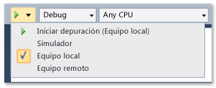

# Ejecutar aplicaciones UWP en el equipo local
  
  
 Para depurar, probar o ejecutar análisis de rendimiento en una aplicación UWP, puede ejecutar la aplicación en el mismo equipo que hospeda Visual Studio. Si la pantalla del dispositivo permite los toques, puede probar todas las funciones de la aplicación. De lo contrario, solo podrá usar gestos de mouse y teclado.  
  
##  Cómo ejecutar en un equipo local  
 Para ejecutar la aplicación en el equipo local, seleccione **equipo Local** en la lista desplegable situada junto al botón Iniciar depuración en el depurador **estándar** barra de herramientas.  
  
   
  
 Si no ve el **estándar** barra de herramientas, haga clic en el **vista** menú, elija **las barras de herramientas**y, a continuación, haga clic en **estándar**.  
  
 La opción que seleccione en la lista desplegable permanece habilitada en el archivo de propiedades del proyecto y se convierte en el destino de ejecución predeterminado.  
  
 Además, puede establecer el destino de ejecución directamente en el archivo de propiedades del proyecto. Haga clic en el nombre del proyecto en **el Explorador de soluciones** y, a continuación, elija **propiedades**. Realice alguno de los siguientes procedimientos:  
  
-   En los proyectos de C# y Visual Basic, haga clic en **depurar** y, a continuación, seleccione **equipo Local** desde el **dispositivo de destino** lista desplegable.  
  
       
  
-   En los proyectos de C++ y JavaScript, expanda la **propiedades de configuración** nodo, haga clic en **depuración**y, a continuación, seleccione **depurador Local de** desde el **depurador Para iniciar** lista.  
  
       