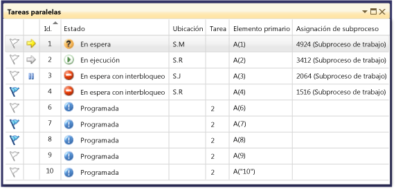
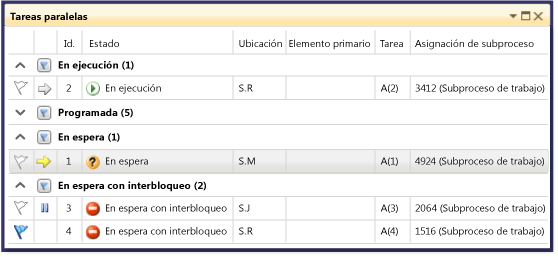
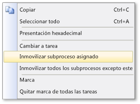

# Usar la ventana Tareas
[!INCLUDE[vs2017banner](../code-quality/includes/vs2017banner.md)]

La ventana **Tareas** se parece a la ventana **Subprocesos**, solo que muestra información sobre cada objeto <xref:System.Threading.Tasks.Task?displayProperty=fullName>, [task\_handle](../Topic/task_group%20Class.md) o [WinJS.Promise](http://msdn.microsoft.com/library/windows/apps/br211867.aspx) en lugar de cada subproceso.  Como los subprocesos, las tareas representan operaciones asincrónicas que se pueden ejecutar simultáneamente; sin embargo, varias tareas se pueden ejecutar en el mismo subproceso.  Consulte [Programación asincrónica en JavaScript \(aplicaciones de la Tienda Windows\)](http://msdn.microsoft.com/library/windows/apps/hh700330.aspx) para obtener más información.  
  
 En código administrado, puede utilizar la ventana **Tareas** cuando trabaje con objetos <xref:System.Threading.Tasks.Task?displayProperty=fullName> o con las palabras clave de **await** y **async** \(**Await** y **Async** en Visual Basic\).  Para obtener más información sobre las tareas en código administrado, consulte [Parallel Programming](../Topic/Parallel%20Programming%20in%20the%20.NET%20Framework.md).  
  
 En código nativo, puede utilizar la ventana **Tareas** cuando trabaje con [grupos de tareas](/visual-cpp/parallel/concrt/task-parallelism-concurrency-runtime), [algoritmos paralelos](/visual-cpp/parallel/concrt/parallel-algorithms), [agentes asincrónicos](/visual-cpp/parallel/concrt/asynchronous-agents) y [tareas ligeras](/visual-cpp/parallel/concrt/task-scheduler-concurrency-runtime).  Para obtener más información sobre tareas en código nativo, vea [Runtime de simultaneidad](/visual-cpp/parallel/concrt/concurrency-runtime).  
  
 En JavaScript, puede usar la ventana Tareas cuando trabaje con código de la sugerencia .then.  
  
 Puede utilizar la ventana **Tareas** cada vez que interrumpa el depurador.  Puede tener acceso a ella en el menú **Depurar** haciendo clic en **Ventanas** y, a continuación, en **Tareas**.  En la siguiente ilustración se muestra la ventana **Tareas** en su modo predeterminado.  
  
   
  
> [!NOTE]
>  En el código administrado, una tarea <xref:System.Threading.Tasks.Task> que tiene un estado de <xref:System.Threading.Tasks.TaskStatus>, <xref:System.Threading.Tasks.TaskStatus>, o <xref:System.Threading.Tasks.TaskStatus> podría no mostrarse en la ventana Tareas si los subprocesos administrados están en un estado de suspensión o combinación.  
  
## Información de la columna Tareas  
 Las columnas de la ventana **Tareas** muestran la siguiente información.  
  
|Nombre de columna|Descripción|  
|-----------------------|-----------------|  
|**Marcas**|Muestra las tareas que están marcadas y permiten marcar o desmarcar una tarea.|  
|**Iconos**|Una flecha amarilla indica la tarea actual.  La tarea actual es la tarea de nivel superior del subproceso actual.   Una flecha blanca indica la tarea de ruptura, es decir, la tarea en curso cuando se invocó el depurador.   El icono de pausa indica una tarea inmovilizada por el usuario.  Puede inmovilizar y liberar una tarea haciendo clic con el botón secundario en ella en la lista.|  
|**Id.**|Un número proporcionado por sistema para la tarea.  En código nativo, ésta es la dirección de la tarea.|  
|**Estado**|El estado actual \(programado, activo, interbloqueado, en espera o completado\) de la tarea.  Una tarea programada es la que aún no se ha ejecutado y, por consiguiente, no tiene pila de llamadas, subproceso asignado ni información relacionada.   Una tarea activa es la que estaba ejecutando código antes de la interrupción del depurador.   Una tarea en espera es la que se bloquea porque está esperando a que se señalice un evento, se libere un bloqueo o termine otra tarea.   Una tarea interbloqueada es una tarea en espera cuyo subproceso está en interbloqueo con otro subproceso.   Mantenga el mouse sobre la celda **Estado** de un interbloqueo o una tarea en espera para ver más información sobre el bloque. **Warning:**  La ventana **Tareas** notifica un interbloqueo solo para una tarea bloqueada que utilice una sincronización primitiva compatible con WCT \(Wait Chain Traversal\).  Por ejemplo, para un objeto <xref:System.Threading.Tasks.Task> interbloqueado que utiliza WCT, el depurador notifica **En espera con interbloqueo**.  Para una tarea interbloqueada administrada por el Runtime de simultaneidad, que no utiliza WCT, el depurador notifica **En espera**.  Para obtener más información sobre WCT, vea [Wait Chain Traversal](http://msdn.microsoft.com/library/ms681622\(VS.85\).aspx).|  
|**Hora de inicio**|La hora en la que se activó la tarea.|  
|**Duración**|El número de segundos que la tarea ha estado activa.|  
|**Tiempo de finalización**|La hora en la que se completó la tarea.|  
|**Ubicación**|La ubicación actual en la pila de llamadas de la tarea.  Desplace el puntero del mouse sobre esta celda para ver la pila de llamadas completa de la tarea.  Las tareas programadas no tienen un valor en esta columna.|  
|**Tarea**|El método inicial y los argumentos que se pasaron a la tarea cuando se creó.|  
|**Elemento primario**|El identificador del subproceso que creó esta ventana.  Si está en blanco, la tarea tiene ningún primario.  Esto solo es aplicable a los programas administrados.|  
|**Asignación de subproceso**|El identificador y nombre del subproceso en el que la tarea se está ejecutando.|  
|**Estado devuelto**|El estado de la tarea cuando se completó.  Los valores del estado devuelto son **Correcto**, **Cancelado** y **Error**.|  
|**AppDomain**|En código administrado, el dominio de aplicación en el que la tarea se está ejecutando.|  
|**task\_group**|En código nativo, la dirección del objeto [task\_group](../Topic/task_group%20Class.md) que programó la tarea.  En los agentes asincrónicos y las tareas ligeras, esta columna se establece en 0.|  
|Proceso|El identificador del proceso en el que se está ejecutando la tarea.|  
|Estado asincrónico|En el código administrado, el estado de la tarea.  De forma predeterminada, se oculta esta columna.  Para mostrar esta columna, abra el menú contextual de uno de los encabezados de columna.  Elija **Columnas**, **AsyncState**.|  
  
 Puede agregar columnas a la vista haciendo clic con el botón secundario en un encabezado de columna y seleccionando las columnas que desea.  \(Quite columnas borrando las selecciones\). También puede reordenar las columnas arrastrándolas a izquierda o derecha.  El menú contextual de la columna se muestra en la siguiente ilustración.  
  
   
  
## Ordenar Tareas  
 Para ordenar las tareas por columnas, haga clic en el encabezado de columna.  Por ejemplo, haciendo clic en el encabezado de columna **Id.**, puede ordenar las tareas por identificador de tarea: 1,2,3,4,5 etc..  Para invertir el criterio de ordenación, haga clic en el encabezado de columna de nuevo.  Una flecha en la columna indica el criterio y la columna de ordenación.  
  
## Agrupar tareas  
 Puede agrupar tareas por cualquier columna en la vista de lista.  Por ejemplo, haciendo clic con el botón secundario en el encabezado de columna **Estado** y **Agrupar por estado**, puede agrupar todas las tareas que tienen el mismo estado.  Por ejemplo, podría ver rápidamente las tareas en espera para ver por qué se bloquean.  También puede contraer un grupo que no es de interés durante la sesión de depuración.  De la misma manera, puede agrupar por otras columnas.  Se puede marcar o quitar la marca de un grupo haciendo clic en el botón del encabezado de grupo.  En la siguiente ilustración se muestra la ventana **Tareas** en modo agrupado.  
  
   
  
## Vista de elemento primario y secundario  
 \(Esta vista solo está disponible en código administrado\). Haciendo clic con el botón secundario en un encabezado de columna y a continuación en **Vista de elemento primario y secundario**, puede cambiar la lista de tareas a una vista jerárquica, en la que cada tarea secundaria es un subnodo que se puede mostrar u ocultar bajo su elemento primario.  En la siguiente ilustración se muestran las tareas en vista de elemento secundario y primario.  
  
   
  
## Marcar tareas  
 Puede marcar el subproceso en el que se está ejecutando una tarea seleccionando el elemento de lista de tareas y, a continuación, eligiendo **Marcar** en el menú contextual, o haciendo clic en el icono de marca de la primera columna.  Si marca varias tareas, después puede ordenarlas en la columna para llevar todas las tareas marcadas a la parte superior de forma que se pueda concentrar en ellas.  También puede utilizar la ventana **Pilas paralelas** para ver las tareas marcadas solamente.  Esto le permite filtrar las tareas que no le interesa depurar.  Las marcas no se conservan entre sesiones de depuración.  
  
## Inmovilizar y reanudar tareas  
 Puede inmovilizar el subproceso en el que una tarea se está ejecutando haciendo clic con el botón secundario en el elemento de lista de tareas y haciendo clic en **Inmovilizar subproceso asignado**.  \(Si la tarea ya está inmovilizada, el comando es **Reanudar subproceso asignado**\). Al inmovilizar un subproceso, no se ejecutará cuando se recorra el código después del punto de interrupción actual.  El comando **Inmovilizar todos los subprocesos menos este** inmoviliza todos los subprocesos salvo el que está ejecutando el elemento de lista de tareas.  
  
 En la siguiente ilustración se muestran el resto de elementos de menú para cada tarea.  
  
   
  
## Vea también  
 [Conceptos básicos del depurador](../debugger/debugger-basics.md)   
 [Depurar código administrado](../debugger/debugging-managed-code.md)   
 [Parallel Programming](../Topic/Parallel%20Programming%20in%20the%20.NET%20Framework.md)   
 [Runtime de simultaneidad](/visual-cpp/parallel/concrt/concurrency-runtime)   
 [Uso de la ventana Tareas paralelas](../debugger/using-the-parallel-stacks-window.md)   
 [Tutorial: Depurar una aplicación paralela](../debugger/walkthrough-debugging-a-parallel-application.md)