# Tutorial: Depurar una aplicación paralela en Visual Studio
Este tutorial muestra cómo utilizar el **tareas paralelas** y **pilas paralelas** windows para depurar una aplicación paralela. Estas ventanas ayudan a entender y comprobar el comportamiento en tiempo de ejecución del código que usa el [tarea Parallel Library (TPL)](/dotnet/standard/parallel-programming/task-parallel-library-tpl) o [Runtime de simultaneidad](/cpp/parallel/concrt/concurrency-runtime). En este tutorial se proporciona código de muestra con puntos de interrupción integrados. Después de que el código se interrumpe, se muestra cómo utilizar el **tareas paralelas** y **pilas paralelas** windows para examinarlo.  
  
 Se enseñan estas tareas:  
  
-   Cómo ver las pilas de llamadas de todos los subprocesos en una vista.  
  
-   Cómo ver la lista de instancias de `System.Threading.Tasks.Task` que se crean en la aplicación.  
  
-   Cómo ver las pilas de llamadas reales de las tareas en lugar de los subprocesos.  
  
-   Cómo navegar al código desde el **tareas paralelas** y **pilas paralelas** windows.  
  
-   Cómo trabajan las ventanas con la escala de tamaño mediante la agrupación, el zoom y otras características relacionadas.  
  
## Requisitos previos  
 En este tutorial se da por supuesto que **solo mi código** está habilitada (está habilitada de forma predeterminada en las versiones más recientes de Visual Studio). En el **herramientas** menú, haga clic en **opciones**, expanda la **depuración** nodo, seleccione **General**y, a continuación, seleccione **habilitar Solo mi código (solo administrado)**. Si no configura esta característica, puede utilizar este tutorial, pero los resultados pueden diferir de las ilustraciones.  
  
## Ejemplo de C#  
 Si utiliza el ejemplo de C#, también se supone que Código externo está oculto. Para alternar si se muestra el código externo, haga clic en el **nombre** encabezado de la tabla de la **pila de llamadas** ventana y luego active o desactive **mostrar código externo**. Si no configura esta característica, puede utilizar este tutorial, pero los resultados pueden diferir de las ilustraciones.  
  
## Ejemplo de C++  
 Si utiliza el ejemplo C++, puede omitir las referencias a Código externo de este tema. El código externo solo se aplica en el ejemplo de C#.  
  
## Ilustraciones  
 Las ilustraciones de este tema se grabaron en un equipo básico quad core que ejecuta el ejemplo de C#. Aunque puede utilizar otras configuraciones para completar este tutorial, las ilustraciones pueden diferir de lo que se muestra en su equipo.  
  
## Crear el proyecto de muestra  
 El código de ejemplo de este tutorial es para una aplicación que no hace nada. El objetivo es entender cómo utilizar las ventanas de herramientas para depurar una aplicación paralela.  
  
#### Para crear el proyecto de ejemplo  
  
1.  En el menú **Archivo** de Visual Studio, apunte a **Nuevo** y haga clic en **Proyecto**.  
  
2.  En el **plantillas instaladas** panel, seleccione Visual C#, Visual Basic o Visual C++. En los lenguajes administrados, asegúrese de que aparece [!INCLUDE[net_v40_short](../code-quality/includes/net_v40_short_md.md)] en el cuadro del marco.  
  
3.  Seleccione **aplicación de consola** y, a continuación, haga clic en **Aceptar**. Mantenga la configuración Debug, que es el valor predeterminado.  
  
4.  Abra el archivo de código .cpp, .cs o .vb del proyecto. Elimine su contenido para crear un archivo de código vacío.  
  
5.  En el archivo de código vacío, pegue el siguiente código en el lenguaje elegido.  
  
 [!code-csharp[Debugger#1](../debugger/codesnippet/CSharp/walkthrough-debugging-a-parallel-application_1.cs)]
 [!code-cpp[Debugger#1](../debugger/codesnippet/CPP/walkthrough-debugging-a-parallel-application_1.cpp)]
 [!code-vb[Debugger#1](../debugger/codesnippet/VisualBasic/walkthrough-debugging-a-parallel-application_1.vb)]  
  
1.  En el **archivo** menú, haga clic en **guardar todo**.  
  
2.  En el **generar** menú, haga clic en **volver a generar solución**.  
  
     Observe que hay cuatro llamadas a `Debugger.Break` (`DebugBreak` en el ejemplo de C++). Por tanto, no tiene que insertar puntos de interrupción; simplemente ejecutando la aplicación, el depurador se interrumpirá cuatro veces.  
  
## Utilizar la ventana Pilas paralelas: vista de subprocesos  
 En el menú **Depurar**, haga clic en **Iniciar depuración**. Espere a que se alcance el primer punto de interrupción.  
  
#### Para ver la pila de llamadas de un subproceso  
  
1.  En el **depurar** menú, elija **Windows** y, a continuación, haga clic en **subprocesos**. Acoplar el **subprocesos** ventana en la parte inferior de Visual Studio.  
  
2.  En el **depurar** menú, elija **Windows** y, a continuación, haga clic en **pila de llamadas**. Acoplar el **pila de llamadas** ventana en la parte inferior de Visual Studio.  
  
3.  Haga doble clic en un subproceso en el **subprocesos** ventana para que sea el actual. Los subprocesos actuales tienen una flecha amarilla. Al cambiar el subproceso actual, la pila de llamadas se muestra en el **pila de llamadas** ventana.  
  
#### Para examinar la ventana Pilas paralelas  
  
1.  En el **depurar** menú, elija **Windows** y, a continuación, haga clic en **pilas paralelas**. Asegúrese de que **subprocesos** está seleccionado en el cuadro situado en la esquina superior izquierda.  
  
     Mediante el uso de la **pilas paralelas** ventana, puede ver varias pilas de llamadas al mismo tiempo en una vista. La siguiente ilustración muestra la **pilas paralelas** ventana anterior la **pila de llamadas** ventana.  
  
     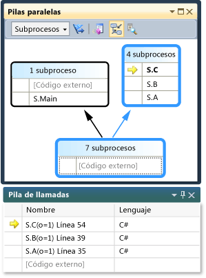  
  
     La pila de llamadas del subproceso principal aparece en un cuadro y las pilas de llamadas de los otros cuatro subprocesos están agrupadas en otro cuadro. Se agrupan cuatro subprocesos porque sus marcos de pila comparten los mismos contextos de método, es decir, están en los mismos métodos: `A`, `B` y `C`. Para ver los identificadores y los nombres de los subprocesos que comparten el mismo cuadro, mantenga el mouse sobre el cuadro con el encabezado (**4 subprocesos**). El subproceso actual se muestra en negrita.  
  
     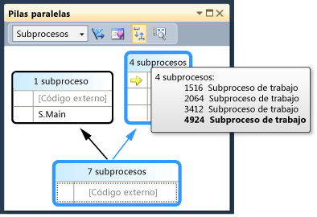  
  
     La flecha amarilla indica el marco de pila activo del subproceso actual.
  
     Puede establecer el grado de detalle desea mostrar para los marcos de pila (**nombres de módulo**, **tipos de parámetro**, **nombres de parámetro**, **valores de parámetro**, **Números de línea** y **desplazamientos de bytes**) con el botón secundario en el **pila de llamadas** ventana.  
  
     Un resaltado azul alrededor de un cuadro indica que el subproceso actual forma parte de ese cuadro. El subproceso actual también está indicado por el marco de pila en negrita de la información sobre herramientas. Si hace doble clic en el subproceso principal en la ventana subprocesos, puede observar que el resaltado azul de la **pilas paralelas** ventana se moverá en consecuencia.  
  
     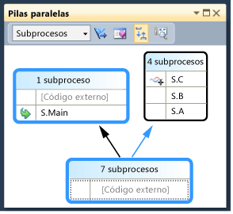  
  
#### Para reanudar la ejecución hasta el segundo punto de interrupción  
  
1.  Para reanudar la ejecución hasta el segundo punto de interrupción en la **depurar** menú, haga clic en **continuar**. La siguiente ilustración muestra el árbol de subproceso en el segundo punto de interrupción.  
  
     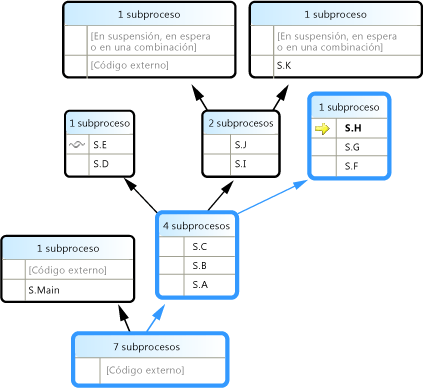  
  
     En el primer punto de interrupción, cuatro subprocesos fueron de S.A a S.B a los métodos S.C. Que información todavía está visible en el **pilas paralelas** ventana, pero los cuatro subprocesos han progresado más. Uno de ellos continuó a S.D y a S.E. Otro continuó hasta S.F, S.G y S.H. Los otros dos continuaron a S.I y S.J, y de allí uno fue a S.K y el otro continuó a código externo de no usuario.  
  
     Puede mantener el mouse sobre el encabezado del cuadro, por ejemplo, **1 subproceso** o **2 subprocesos**, para ver los identificadores de los subprocesos de subproceso. Puede desplazar el puntero del mouse sobre los marcos de pila para ver identificadores de subproceso y otros detalles del marco. El resaltado azul indica el subproceso actual y la flecha amarilla indica el marco de pila activo del subproceso actual.  
  
     El icono de subprocesos (interweaved líneas) indica los marcos de pila activos de los subprocesos que no. En el **pila de llamadas** ventana, haga doble clic en S.B para intercambiar los marcos. El **pilas paralelas** ventana indica que el marco de pila actual del subproceso actual utilizando un icono de flecha verde y curvada.  
  
     En el **subprocesos** ventana, intercambie entre los subprocesos y observe que la vista en la **pilas paralelas** se actualiza la ventana.  
  
     Puede cambiar a otro subproceso o a otro marco de otro subproceso, utilizando el menú contextual de la **pilas paralelas** ventana. Por ejemplo, haga clic en S.J, apunte a **cambiar a marco**y, a continuación, haga clic en un comando.  
  
     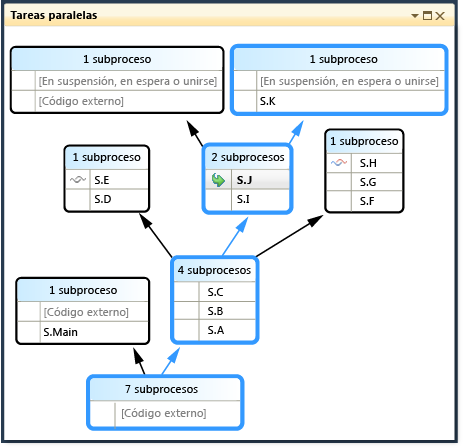  
  
     Haga clic en S.C y señale a **cambiar a marco**. Uno de los comandos tiene una marca de verificación que indica el marco de pila del subproceso actual. Puede cambiar a ese marco del mismo subproceso (la flecha verde se moverá) o puede cambiar al otro subproceso (el resaltado azul también moverá). La ilustración siguiente muestra los submenús.  
  
     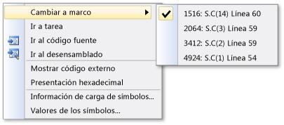  
  
     Cuando un contexto de método está asociado a un solo marco de pila, se muestra el encabezado del cuadro **1 subproceso** y puede cambiar a él haciendo doble clic en. Si hace doble clic en un contexto de método que tiene más que un marco asociado, el menú se abre automáticamente. Cuando desplace el puntero del mouse sobre los contextos de método, observe el triángulo negro a la derecha. Al hacer clic en ese triángulo, también se muestra el menú contextual.  
  
     Con aplicaciones grandes que tienen muchos subprocesos, le interesa centrarse en un subconjunto de subprocesos. El **pilas paralelas** ventana puede mostrar las pilas de llamadas solo para los subprocesos marcados. Para marcar subprocesos, utilice el menú contextual o la primera celda de un subproceso. 

     En la barra de herramientas, haga clic en el **mostrar marcadas únicamente** situado junto al cuadro de lista.  

     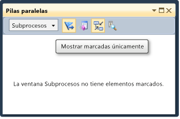  

     Ahora, sólo el subproceso marcado aparece en el **pilas paralelas** ventana.
  
#### Para reanudar la ejecución hasta el tercer punto de interrupción  
  
1.  Para reanudar la ejecución hasta el tercer punto de interrupción en la **depurar** menú, haga clic en **continuar**.  
  
     Cuando varios subprocesos están en el mismo método pero el método no estaba al principio de la pila de llamadas, el método aparece en cuadros diferentes. Un ejemplo en el punto de interrupción actual es S.L, que tiene tres subprocesos y aparece en tres cuadros. Haga doble clic en S.L.  
  
     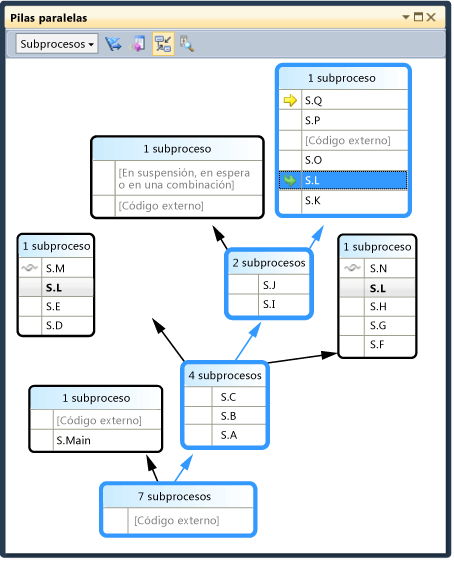  
  
     Observe que S.L está en negrita en los otros dos cuadros para que pueda ver dónde más aparece. Si desea ver qué marcos llaman a S.L y a qué marcos llama, haga clic en el **Alternar vista de método** botón en la barra de herramientas. En la siguiente ilustración muestra la vista de método de la **pilas paralelas** ventana.  
  
       
  
     Observe cómo el diagrama se monta en el método seleccionado y lo coloca en su propio cuadro en el medio de la vista. Los destinatarios y llamadores aparecen en la parte superior e inferior. Haga clic en el **Alternar vista de método** botón nuevo para dejar este modo.  
  
     El menú contextual de la **pilas paralelas** ventana también tiene los siguientes otros elementos.  
  
    -   **Presentación hexadecimal** alterna los números de la información sobre herramientas entre decimal y hexadecimal.  
  
    -   **Configuración de símbolos** abrir los cuadros de diálogo respectivos.  
  
    -   **Mostrar subprocesos en código fuente** alterna la presentación de marcadores de subprocesos en el código fuente, que se muestra en la ubicación de subprocesos en el código fuente.
  
    -   **Mostrar código externo** muestra todos los marcos aun cuando no estén en código de usuario. Pruébelo para ver el diagrama expandirse para alojar los marcos adicionales (que pueden estar atenuados porque no tiene símbolos para ellos).  

2.  En el **pilas paralelas** ventana, asegúrese de que el **desplazar automáticamente a marco de pila actual** botón de la barra de herramientas.  

     Si tiene diagramas grandes y pasa al punto de interrupción siguiente, tal vez le interese la vista para desplazarse de forma automática al marco de pila activo del subproceso actual, es decir, el subproceso que alcanzó primero el punto de interrupción.
  
3.  Antes de continuar, en la **pilas paralelas** ventana, desplácese completamente hacia a la izquierda o hacia abajo.  
  
#### Para reanudar la ejecución hasta el cuarto punto de interrupción  
  
1.  Para reanudar la ejecución hasta el cuarto punto de interrupción en la **depurar** menú, haga clic en **continuar**.  
  
     Observe cómo la vista se desplaza automáticamente para ocupar su lugar. Alterne los subprocesos en la **subprocesos** marcos de pila de conmutador o ventana en la **pila de llamadas** ventana y observe cómo la vista siempre se desplaza automáticamente hasta el marco correcto. Desactivar **desplazar automáticamente a marco de pila actual** opción y ver la diferencia.  
  
     El **vista aérea** también ayuda a diagramas grandes en la **pilas paralelas** ventana. De forma predeterminada, el **vista aérea** se encuentra en. Pero puede cambiar haciendo clic en el botón situado entre las barras de desplazamiento en la esquina inferior derecha de la ventana, tal como se muestra en la siguiente ilustración.  
  
     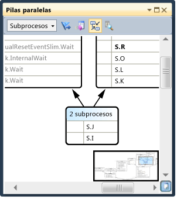  
  
     En la vista de pájaro, puede mover el rectángulo para hacer una rápida panorámica del diagrama.  
  
     Otra manera de mover el diagrama en cualquier dirección es haciendo clic en un área en blanco del diagrama y arrastrando al lugar deseado.  
  
     Para acercar y alejar, mantenga presionada la tecla CTRL mientras mueve la rueda del mouse. Alternativamente, haga clic en el botón Zoom en la barra de herramientas y utilice la herramienta Zoom.  
  
     También puede ver las pilas en dirección descendente en lugar de abajo arriba, haciendo clic en el **herramientas** menú, haga clic en **opciones**y, a continuación, active o desactive la opción situada debajo del **depuración** nodo.  
  
2.  Antes de continuar, en la **depurar** menú, haga clic en **Detener depuración** para finalizar la ejecución.  
  
## Utilizar la ventana Tareas paralelas y la vista Tareas de la ventana Pilas paralelas  
 Recomendamos completar los procedimientos anteriores antes de continuar.  
  
#### Para reiniciar la aplicación hasta que alcance el primer punto de interrupción  
  
1.  En el **depurar** menú, haga clic en **Iniciar depuración** y espere a que el primer punto de interrupción se va a alcanzar.  
  
2.  En el **depurar** menú, elija **Windows** y, a continuación, haga clic en **subprocesos**. Acoplar el **subprocesos** ventana en la parte inferior de Visual Studio.  
  
3.  En el **depurar** menú, elija **Windows** y haga clic en **pila de llamadas**. Acoplar el **pila de llamadas** ventana en la parte inferior de Visual Studio.  
  
4.  Haga doble clic en un subproceso en el **subprocesos** ventana para que sea el actual. Los subprocesos actuales tienen la flecha amarilla. Al cambiar el subproceso actual, las otras ventanas se actualizan. A continuación, examinaremos las tareas.  
  
5.  En el **depurar** menú, elija **Windows**y, a continuación, haga clic en **tareas**. La siguiente ilustración muestra la **tareas** ventana.  
  
       
  
     Por cada tarea que se esté ejecutando, puede leer su identificador, que devuelve la propiedad del mismo nombre, el identificador y nombre del subproceso que lo ejecuta, su ubicación (desplazando el puntero del mouse para mostrar una información sobre herramientas con la pila de llamadas completa). Asimismo, en la **tarea** columna, puede ver el método que se pasó a la tarea; en otras palabras, el punto inicial.  
  
     Puede ordenar cualquier columna. Observe el glifo de ordenación que indica la columna y la dirección de ordenación. También puede reordenar las columnas arrastrándolas a izquierda o derecha.  
  
     La flecha amarilla indica la tarea actual. Puede intercambiar las tareas haciendo doble clic en una tarea o utilizando el menú contextual. Al intercambiar las tareas, el subproceso subyacente pasa a ser el actual y las demás ventanas se actualizan.  
  
     Cuando pasa manualmente de una tarea a otra, la flecha amarilla se mueve, pero una flecha blanca sigue mostrando la tarea que hizo que el depurador se interrumpiera.  
  
#### Para reanudar la ejecución hasta el segundo punto de interrupción  
  
1.  Para reanudar la ejecución hasta el segundo punto de interrupción en la **depurar** menú, haga clic en **continuar**.  
  
     Anteriormente, el **estado** columna mostraba todas las tareas como activo, pero ahora dos de las tareas se bloquean. Las tareas se pueden bloquear por muchas razones diferentes. En el **estado** columna, mantenga el mouse sobre una tarea en espera para saber por qué está bloqueada. Por ejemplo, en la siguiente ilustración, la tarea 3 está esperando a la tarea 4.  
  
       
  
     La tarea 4, a su vez, está esperando a un monitor que pertenece al subproceso asignado a la tarea 2. (Haga clic en la fila de encabezado y elija **columnas** > **asignación de subproceso** para ver el valor de asignación de subproceso para la tarea 2).
  
     
  
     También puede marcar una tarea haciendo clic en la marca de la primera columna de la **tareas** ventana.  
  
     Puede utilizar las marcas para realizar el seguimiento de las tareas entre los puntos de interrupción diferentes en la misma sesión de depuración o filtrar por las tareas cuyas pilas de llamadas se muestren en la **pilas paralelas** ventana.  
  
     Cuando usa el **pilas paralelas** ventana anteriormente, vio los subprocesos de la aplicación. Ver el **pilas paralelas** ventana nuevo, pero esta vez observe las tareas de la aplicación. Haga esto seleccionando **tareas** en el cuadro en la parte superior izquierda. En la siguiente ilustración se muestra la vista Tareas.  
  
     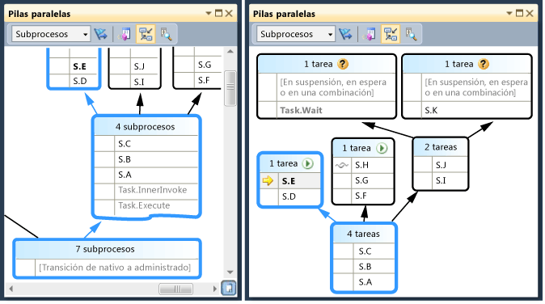  
  
     Subprocesos que no están ejecutando tareas actualmente no se muestran en la vista tareas de la **pilas paralelas** ventana. Asimismo, con los subprocesos que ejecutan tareas, algunos de los marcos de pila que no son pertinentes para las tareas se filtran de la parte superior e inferior de la pila.  
  
     Ver el **tareas** ventana de nuevo. Haga clic con el botón secundario en cualquier encabezado de columna para ver un menú contextual de la columna.  
  
     Puede utilizar el menú contextual para agregar o quitar las columnas. Por ejemplo, la columna AppDomain no está seleccionada; por consiguiente, no se muestra en la lista. Haga clic en **primario**. El **primario** columna aparece sin valores para las cuatro tareas.  
  
#### Para reanudar la ejecución hasta el tercer punto de interrupción  
  
1.  Para reanudar la ejecución hasta el tercer punto de interrupción en la **depurar** menú, haga clic en **continuar**.  
  
     Ahora se está ejecutando una nueva tarea, la tarea 5, y la tarea 4 está en espera. Puede ver por qué desplazando el puntero sobre la tarea en espera la **estado** ventana. En el **primario** columna, observe que la tarea 4 es el elemento primario de la tarea 5.  
  
     Para ver mejor la relación de elementos primarios y secundarios, haga clic en la fila de encabezado de columna y, a continuación, haga clic en **vista de elemento primario**. Vea la ilustración siguiente:  
  
     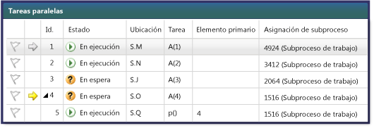  
  
     Observe que la tarea 4 y 5 se están ejecutando en el mismo subproceso (mostrar la **asignación de subproceso** columna si está oculto). Esta información no se muestra en el **subprocesos** ventana; poder verlo aquí es otra ventaja de la **tareas** ventana. Para confirmar esto, vea la **pilas paralelas** ventana. Asegúrese de que está viendo **tareas**. Busque las tareas 4 y 5 haciendo doble clic en ellos en el **tareas** ventana. Al hacerlo, el resaltado azul el **pilas paralelas** se actualiza la ventana. También puede buscar las tareas 4 y 5 examinando la información sobre herramientas en el **pilas paralelas** ventana.  
  
     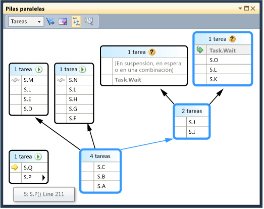  
  
     En el **pilas paralelas** ventana, haga clic en S.P y, a continuación, haga clic en **ir al subproceso**. La ventana cambia a la vista de subprocesos y el marco correspondiente está a la vista. Puede ver ambas tareas en el mismo subproceso.  
  
     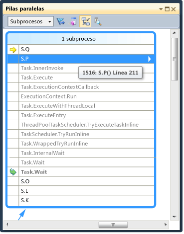  
  
     Esta es otra ventaja de la vista de tareas en el **pilas paralelas** ventana, en comparación con el **subprocesos** ventana.  
  
#### Para reanudar la ejecución hasta el cuarto punto de interrupción  
  
1.  Para reanudar la ejecución hasta el tercer punto de interrupción en la **depurar** menú, haga clic en **continuar**. Haga clic en el **identificador** encabezado de columna para ordenar por identificador. Vea la ilustración siguiente:  
  
     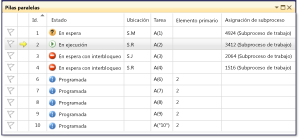  
  
     Como la tarea 5 se ha completado, ya no se muestra. Si no es el caso en el equipo y no se muestra el interbloqueo, avance un paso presionando **F11**.  
  
     Tareas 3 y 4 se están esperando mutuamente y están bloqueadas. Hay también 5 nuevas tareas que son elementos secundarios de la tarea 2 y se programan ahora. Las tareas programadas son tareas que se han iniciado en código pero no se han ejecutado todavía. Por lo tanto, sus **ubicación** y **asignación de subproceso** columnas están vacías.  
  
     Ver el **pilas paralelas** ventana de nuevo. El encabezado de cada cuadro tiene una información sobre herramientas que muestra los identificadores y los nombres de los subprocesos. Cambie a la vista de tareas en el **pilas paralelas** ventana. Desplace el puntero del mouse sobre un encabezado para ver el identificador, el nombre y el estado de la tarea, como se muestra en la siguiente ilustración.  
  
     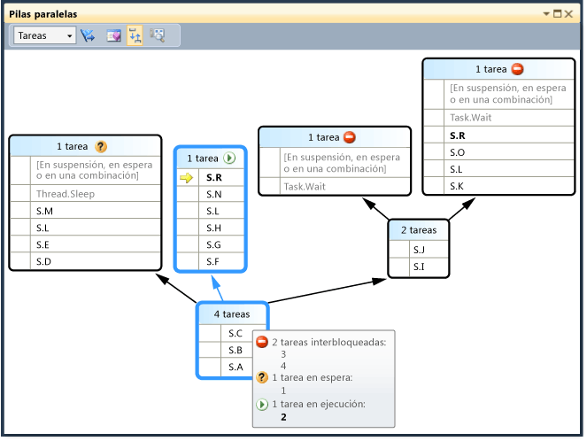  
  
     Puede agrupar las tareas por columna. En el **tareas** ventana, haga clic en el **estado** encabezado de columna y, a continuación, haga clic en **Agrupar por estado**. La siguiente ilustración muestra la **tareas** ventana agrupados por estado.  
  
     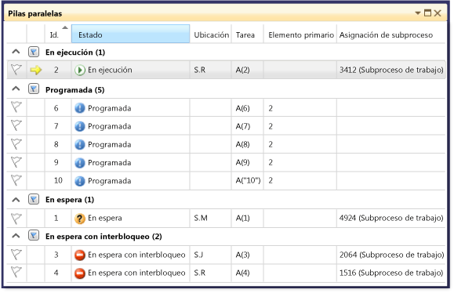  
  
     También puede agrupar por cualquier otra columna. Agrupando las tareas, se puede concentrar en un subconjunto de tareas. Cada grupo contraíble tiene un recuento de los elementos que están agrupados.
  
     La última característica de la **tareas** ventana para examinar es el menú contextual que aparece cuando hace clic en una tarea.  
  
     El menú contextual muestra comandos diferentes, dependiendo del estado de la tarea. Los comandos pueden incluir **copia**, **seleccionar todo**, **presentación Hexadecimal**, **pasar a la tarea**, **inmovilizar asignado Subprocesos**, **inmovilizar todos los subprocesos, pero esto**, y **Reanudar subproceso asignado**, y **marca**.  
  
     Puede inmovilizar el subproceso subyacente de una o varias tareas, y puede inmovilizar todos los subprocesos exceptuando el asignado. Un subproceso inmovilizado se representa en el **tareas** ventana tal y como está en el **subprocesos** ventana por un azul *pausar* icono.  
  
## Resumen  
 Este tutorial se han mostrado las **tareas paralelas** y **pilas paralelas** ventanas del depurador. Utilice estas ventanas en los proyectos reales que utilizan código multithreading. Puede examinar código paralelo escrito en C++, C# o Visual Basic.  
  
## Vea también  
 [Depurar aplicaciones multiproceso](../debugger/walkthrough-debugging-a-parallel-application.md)   
 [Conceptos básicos del depurador](../debugger/debugger-basics.md)   
 [Depurar código administrado](../debugger/debugging-managed-code.md)   
 [Parallel Programming](/dotnet/standard/parallel-programming/index)  (Programación en paralelo)  
 [Runtime de simultaneidad](/cpp/parallel/concrt/concurrency-runtime)   
 [Mediante la ventana Pilas paralelas](../debugger/using-the-parallel-stacks-window.md)   
 [Usar la ventana Tareas](../debugger/using-the-tasks-window.md)