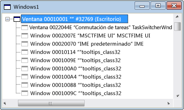

# Windows View
[!INCLUDE[vs2017banner](../code-quality/includes/vs2017banner.md)]

La primera vez que se abre Spy\+\+, la vista Ventanas muestra un árbol con todas las ventanas y controles del sistema.  Se muestran el identificador de ventana y el nombre de clase.  La ventana del escritorio actual está en la parte superior del árbol.  Todas las demás ventanas son elementos secundarios del escritorio y se muestran según la jerarquía de ventanas estándar.  Las ventanas relacionadas aparecen en listas con sangría que se pueden expandir debajo de sus elementos primarios.  
  
 En la ilustración siguiente se muestra una vista Ventanas de Spy\+\+ típica con el nodo superior expandido.  
  
   
Vista Ventanas de Spy\+\+  
  
 La ventana del escritorio actual está en la parte superior del árbol.  Todas las demás ventanas son elementos secundarios del escritorio y se muestran de acuerdo con la jerarquía de ventanas estándar, con las ventanas relacionadas ordenadas según el orden z.  Es posible expandir o contraer cualquier nodo primario del árbol al hacer clic en el símbolo \+ o \- situado al lado del nodo.  
  
 Cuando la vista Ventanas tiene el foco, se puede usar la herramienta de búsqueda del [Cuadro de diálogo Buscar ventana](../debugger/window-search-dialog-box.md) para mostrar información de cualquier ventana abierta en el sistema.  
  
## En esta sección  
 [How to: Use the Finder Tool](../debugger/how-to-use-the-finder-tool.md)  
 Muestra cómo esta herramienta examina las ventanas para encontrar propiedades o mensajes.  
  
 [How to: Search for a Window in Windows View](../debugger/how-to-search-for-a-window-in-windows-view.md)  
 Explica cómo buscar una ventana concreta en la vista Ventanas.  
  
 [How to: Display Window Properties](../debugger/how-to-display-window-properties.md)  
 Procedimientos para abrir el cuadro de diálogo Propiedades de la ventana.  
  
## Secciones relacionadas  
 [Spy\+\+ Views](../debugger/spy-increment-views.md)  
 Explica las vistas de árbol de Spy\+\+ de ventanas, mensajes, procesos y subprocesos.  
  
 [Using Spy\+\+](../debugger/using-spy-increment.md)  
 Presenta la herramienta Spy\+\+ y explica cómo se puede usar.  
  
 [Cuadro de diálogo Buscar ventana](../debugger/find-window-dialog-box.md)  
 Se usa para ver las propiedades o mensajes de una ventana concreta.  
  
 [Cuadro de diálogo Buscar ventana](../debugger/window-search-dialog-box.md)  
 Se usa para encontrar el nodo de una ventana específica en la vista Ventanas.  
  
 [Cuadro de diálogo Propiedades de la ventana](../debugger/window-properties-dialog-box.md)  
 Se usa para mostrar las propiedades de una ventana seleccionada en la vista Ventanas.  
  
 [Spy\+\+ Reference](../debugger/spy-increment-reference.md)  
 Incluye secciones que describen los menús y cuadros de diálogo de Spy\+\+.