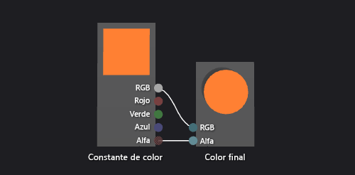

# Cómo: Crear un sombreador de color básico

En este artículo se muestra cómo usar el Diseñador de sombras y el lenguaje DGSL (Directed Graph Shader Language) para crear un sombreador de color plano. Este sombreador establece el color final en un valor de color RGB constante.

## Crear a un sombreador de color plano

Puede implementar un sombreador de color plano escribiendo el valor de color de una constante de color RGB en el color del resultado final.

Antes de empezar, asegúrese de que se muestran la ventana **Propiedades** y el **Cuadro de herramientas**.

1.  Cree un sombreador DGSL con el que trabajar. Para obtener información sobre cómo agregar un sombreador DGSL al proyecto, vea la sección Introducción de [Diseñador de sombras](../designers/shader-designer.md).

2.  Elimine el nodo **Color de punto**. Use la herramienta **Seleccionar** para seleccionar el nodo **Color de punto** y, después, en la barra de menús, elija **Editar**, **Eliminar**.

3.  Agregue un nodo **Constante de color** al gráfico. En el **Cuadro de herramientas**, en **Constantes**, seleccione **Constante de color** y muévala a la superficie de diseño.

4.  Especifique un valor de color para el nodo **Constante de color**. Use la herramienta **Seleccionar** para seleccionar el nodo **Constante de color** y, después, en la ventana **Propiedades**, en la propiedad **Salida**, especifique un valor de color. Para el color naranja, especifique un valor de (1,0, 0,5, 0,2, 1,0).

5.  Conecte la constante de color al color final. Para crear las conexiones, mueva el terminal **RGB** del nodo **Constante de color** al terminal **RGB** del nodo **Color final** y, después, mueva el terminal **Alfa** del nodo **Constante de color** al terminal **Alfa** del nodo **Color final**. Estas conexiones establecen el color final en la constante de color definida en el paso anterior.

La ilustración siguiente muestra el gráfico de sombreador completo y una vista previa del sombreador aplicado a un cubo.

> [!NOTE]
> En la ilustración, el color naranja se especificó para ilustrar mejor el efecto del sombreador.

Es posible que algunas formas proporcionen mejores vistas previas para algunos sombreadores. Para más información sobre cómo obtener una vista previa de los sombreadores en el Diseñador de sombras, vea [Diseñador de sombras](../designers/shader-designer.md).

## Vea también

- [Cómo: Aplicar un sombreador a un modelo en 3D](../designers/how-to-apply-a-shader-to-a-3-d-model.md)
- [Cómo: Exportar un sombreador](../designers/how-to-export-a-shader.md)
- [Diseñador de sombras](../designers/shader-designer.md)
- [Nodos del Diseñador de sombras](../designers/shader-designer-nodes.md)