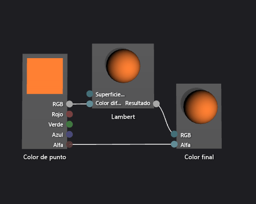

# C&#243;mo: Crear un sombreador Lambert b&#225;sico
[!INCLUDE[vs2017banner](../code-quality/includes/vs2017banner.md)]

En este documento se muestra cómo usar el Diseñador de sombras y el lenguaje DGSL \(Directed Graph Shader Language\) para crear un sombreador de iluminación que implementa el modelo de iluminación de Lambert clásico.  
  
 En este documento se muestran estas actividades:  
  
-   Nodos a un gráfico de presentación  
  
-   Desconectarse de nodos  
  
-   Conectar nodos  
  
## El modelo de iluminación de Lambert  
 El modelo de iluminación de Lambert incorpora iluminación ambiental y direccional para sombrear objetos en una escena 3D.  Los componentes de ambiente proporcionan un nivel de iluminación base en la escena 3D.  Los componentes direccionales proporcionan iluminación adicional \(medida\) de fuentes de luz direccionales.  La iluminación ambiente afecta a todas las superficies de la escena igualmente, sin importar su orientación.  Para una superficie determinada, es un producto de color ambiente de la superficie y el color y la intensidad de iluminación ambiente en la escena.  La iluminación direccional afecta a cada superficie en la escena de manera diferente, en función de la orientación de la superficie con respecto a la dirección de la fuente de luz.  Es un producto de color y la guía difusos de la superficie, y el color, la intensidad, y la dirección de luz.  Las superficies que miran directamente hacia la fuente de luz reciben la máxima contribución y las superficies que miran directamente al otro lado no reciben ninguna contribución.  Bajo el modelo de iluminación de Lamberto, combinan el componente ambiente y uno o más componentes direccionales para determinar la contribución de color difusa total para cada punto del objeto.  
  
 Antes de empezar, asegúrese de que se muestran la ventana **Propiedades** y el **Cuadro de herramientas**.  
  
#### Para crear un sombreador Lambert  
  
1.  Cree un sombreador DGSL con el que trabajar.  Para obtener información sobre cómo agregar un sombreador DGSL al proyecto, vea la sección Introducción de [Diseñador de sombras](../designers/shader-designer.md).  
  
2.  Desconecte el nodo de **Color de punto** de nodo de **Color final** .  Elija el terminal de **RGB** de nodo de **Color de punto** , y elija **Romper vínculos**.  Deje el terminal de **Alfa** conectado.  
  
3.  Agregue un nodo de **Lamberto** al gráfico.  En el **Cuadro de herramientas**, en **Utilidad**, seleccione **Lambert** y muévalo a la superficie de diseño.  El nodo de Lamberto calcula la contribución de color difusa total de píxel, en función de parámetros ambiente y difusos de iluminación.  
  
4.  Conectar el nodo de **Color de punto** al nodo de **Lambert** .  En el modo de **activada** , mueva el terminal de **RGB** de nodo de **Color de punto** el terminal de **Color difuso** de nodo de **Lambert** .  Esta conexión proporciona el nodo de Lamberto con un color difuso interpolado de píxeles.  
  
5.  Conectar el valor de color calculado al color final.  Mueva el terminal de **salida** de nodo de **Lambert** el terminal de **RGB** de nodo de **Color final** .  
  
 La siguiente ilustración muestra el gráfico de sombreador completo y una vista previa del sombreador aplicado a un modelo de tetera.  
  
> [!NOTE]
>  Para ilustrar mejor el efecto de presentación en esta ilustración, color naranja se ha especificado mediante el parámetro de **MaterialDiffuse** de presentación.  Un juego o una aplicación puede utilizar este parámetro para proporcionar un valor de color único para cada objeto.  Para obtener información sobre parámetros materiales, vea la sección sobre los sombreadores previewing de en [Diseñador de sombras](../designers/shader-designer.md).  
  
   
  
 Algunas formas podrían dar mejores vistas previas para algunos los sombreadores.  Para obtener más información sobre cómo obtener una vista previa de los sombreadores del Sombreador Designer, vea la sección de los sombreadores previewing de en [Diseñador de sombras](../designers/shader-designer.md).  
  
 La siguiente ilustración muestra el sombreador descrito en este documento aplicado a un modelo 3D.  
  
   
  
 Para obtener más información sobre cómo aplicar un sombreador a un modelo 3D, vea [Cómo: Aplicar un sombreador a un modelo 3D](../designers/how-to-apply-a-shader-to-a-3-d-model.md).  
  
## Vea también  
 [Cómo: Aplicar un sombreador a un modelo 3D](../designers/how-to-apply-a-shader-to-a-3-d-model.md)   
 [Cómo: Exportar un sombreador](../designers/how-to-export-a-shader.md)   
 [Cómo: Crear un sombreador Phong básico](../designers/how-to-create-a-basic-phong-shader.md)   
 [Diseñador de sombras](../designers/shader-designer.md)   
 [Nodos del Diseñador de sombras](../designers/shader-designer-nodes.md)