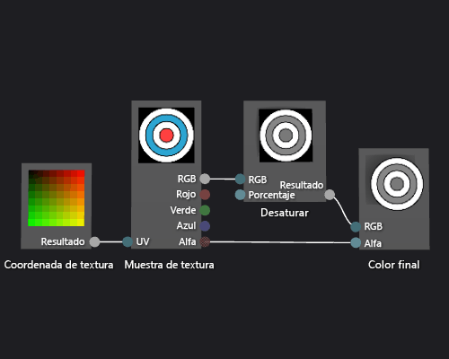

# C&#243;mo: Crear un sombreador de textura de escala de grises
[!INCLUDE[vs2017banner](../code-quality/includes/vs2017banner.md)]

En este documento se muestra cómo usar el Diseñador de sombras y el lenguaje DGSL \(Directed Graph Shader Language\) para crear un sombreador de textura de escala de grises.  Este sombreador modifica el valor de color RGB del ejemplo de textura y, a continuación, lo usa junto con el valor alfa sin modificar para establecer el color final.  
  
## Crear un sombreador de texturas de escala de grises  
 Puede implementar un sombreador de textura de escala de grises modificando el valor de color de una muestra de textura antes de escribirlo en el color del resultado final.  
  
 Antes de empezar, asegúrese de que se muestran la ventana **Propiedades** y el **Cuadro de herramientas**.  
  
#### Para crear un sombreador de textura de escala de grises  
  
1.  Cree un sombreador básico de textura, como se describe en [Cómo: Crear un sombreador de textura básico](../designers/how-to-create-a-basic-texture-shader.md).  
  
2.  Desconecte el terminal de **RGB** del nodo **Muestra de textura** en el termina de **RGB** del nodo **Color final**.  En el modo de **activada** , elija el terminal de **RGB** de nodo de **Muestra de textura** , y elija **Romper vínculos**.  Esto hace sitio para el nodo que se agrega en el paso siguiente.  
  
3.  Agregue un nodo de **Desaturar** al gráfico.  En **Cuadro de herramientas**, en **Filtros**, seleccione **Desaturar** y muévalo a la superficie de diseño.  
  
4.  Calcula el valor de escala de grises utilizando el nodo de **Desaturar** .  En el modo de **activada** , mueva el terminal de **RGB** de nodo de **Muestra de textura** el terminal de **RGB** de nodo de **Desaturar** .  
  
    > [!NOTE]
    >  De forma predeterminada, de **Desaturar** de nodo los desaturates totalmente la entrada color, y utilizan las proporciones estándar de luminancia para la conversión greyscale.  Puede cambiar cómo el nodo de **Desaturar** se comporta cambiando el valor de la propiedad de **Luminancia** , o solo parcialmente desaturating entrada color.  Parcialmente el desaturate entrada color, proporciona un valor escalar en el intervalo \[0,1\) al terminal de **Por ciento** de nodo de **Desaturar** .  
  
5.  Conectar el valor de color de escala de grises al color final.  Mueva el terminal de **salida** de nodo de **Desaturar** el terminal de **RGB** de nodo de **Color final** .  
  
 La siguiente ilustración muestra el gráfico de sombreador completo y una vista previa del sombreador aplicado a un cubo.  
  
> [!NOTE]
>  En esta ilustración, se utiliza un plano como la vista previa, y una textura se ha especificado para ilustrar mejor el efecto de presentación.  
  
   
  
 Algunas formas podrían dar mejores vistas previas para algunos los sombreadores.  Para obtener más información sobre cómo obtener una vista previa de los sombreadores en el Diseñador de sombras, vea [Diseñador de sombras](../designers/shader-designer.md)  
  
## Vea también  
 [Cómo: Aplicar un sombreador a un modelo 3D](../designers/how-to-apply-a-shader-to-a-3-d-model.md)   
 [Cómo: Exportar un sombreador](../designers/how-to-export-a-shader.md)   
 [Editor de imágenes](../designers/image-editor.md)   
 [Diseñador de sombras](../designers/shader-designer.md)   
 [Nodos del Diseñador de sombras](../designers/shader-designer-nodes.md)