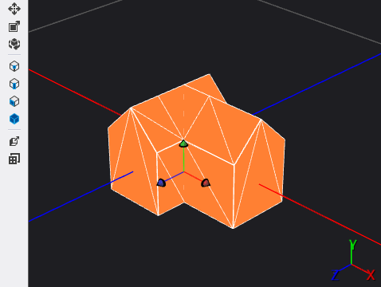

# C&#243;mo: Modificar el punto de pivote de un modelo 3D
[!INCLUDE[vs2017banner](../code-quality/includes/vs2017banner.md)]

En este documento se muestra cómo utilizar el editor modelo para modificar *el punto de pivote* de un modelo 3D.  El punto de pivote es el punto en el espacio que define el centro matemático del objeto para el giro y el ajuste de la escala.  
  
 En este documento se muestra esta actividad:  
  
-   Modificar el punto de pivote de un objeto  
  
## Modificar el punto de pivote de un modelo 3D  
 Puede volver a definir el origen de un modelo 3D modificando el punto de pivote.  
  
 Asegúrese de que se muestren la ventana **Propiedades** y el **Cuadro de herramientas**.  
  
#### Para modificar el punto de pivote de un modelo 3D  
  
1.  Comience con un modelo 3D existente, como el que se describe en [Cómo: Crear un modelo 3D básico](../designers/how-to-create-a-basic-3-d-model.md).  
  
2.  Pase al modo de pivote.  En la barra de herramientas de **Modo modelo de editor** , elija el botón de **Modo de pivote** para activar el modo de pivote.  Aparece un cuadro alrededor del botón de **Modo de pivote** para indicar que el editor modelo es ahora en modo de pivote.  En el modo de pivote, las operaciones como la traslación afectan al punto de pivote del objeto en lugar de la estructura del objeto en el espacio del mundo.  
  
3.  Modifique el punto de pivote del objeto.  En el modo **Seleccionar**, seleccione el objeto y, después, en la barra de herramientas del **Visor de modelos**, elija la herramienta **Trasladar**.  Un cuadro que representa el punto de pivote aparece en la superficie de diseño.  Mueva el cuadro para modificar el punto de pivote del objeto.  
  
     Al mover el cuadro, puede mover el punto de pivote en las tres dimensiones.  Para traducir el punto de pivote a lo largo de un eje, mueva la flecha que corresponde a ese eje.  El cuadro y las flechas cambian a un color amarillo para indicar el eje que se ve afectado por la traducción.  
  
     También puede especificar el punto de pivote mediante la propiedad de **Conversión de pivote** en la ventana **Propiedades**.  
  
    > [!TIP]
    >  Puede ver el efecto del nuevo punto de pivote girando el objeto.  Para girarlo, utilice la herramienta **Girar** o modifique la propiedad **Giro**.  
  
 A continuación se muestra un modelo que tiene un punto de pivote modificado:  
  
   
  
## Vea también  
 [Cómo: Crear un modelo 3D básico](../designers/how-to-create-a-basic-3-d-model.md)   
 [Editor de modelos](../designers/model-editor.md)