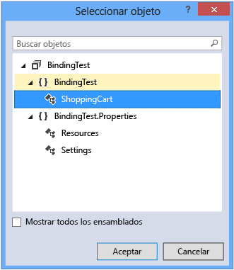
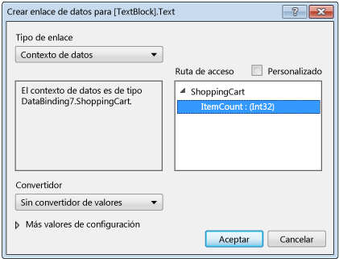

# Tutorial: Enlazar a datos en el Dise&#241;ador XAML
[!INCLUDE[vs2017banner](../code-quality/includes/vs2017banner.md)]

En el Diseñador de XAML, puede establecer las propiedades de enlace de datos mediante el uso de la mesa de trabajo y la ventana Propiedades.  En el ejemplo de este tutorial se muestra cómo enlazar datos a un control.  En concreto, el tutorial muestra cómo crear una clase de carro de la compra simple que tiene una [DependencyProperty](http://msdn.microsoft.com/library/windows/apps/windows.ui.xaml.dependencyproperty.aspx) denominada `ItemCount`, y, a continuación, enlazar la propiedad `ItemCount` a la propiedad **Text** de un control [TextBlock](http://msdn.microsoft.com/library/windows/apps/windows.ui.xaml.controls.textblock.aspx).  
  
### Crear una clase que se va a usar como origen de datos  
  
1.  En el menú **Archivo**, elija **Nuevo**, **Proyecto**.  
  
2.  En el cuadro de diálogo **Nuevo proyecto**, escoja entre el nodo **Visual C\#** o **Visual Basic**, expanda el nodo **Windows** y, a continuación, elija la plantilla de proyecto **Aplicación WPF**.  
  
3.  Asigne un nombre al proyecto BindingTest y, a continuación, elija el botón **Aceptar**.  
  
4.  Abra el archivo MainWindow.xaml.cs \(o MainWindow.xaml.vb\) y agregue el código siguiente.  En C\#, agregue el código en el espacio de nombres `BindingTest` \(antes del paréntesis de cierre final del archivo\).  En Visual Basic, agregue simplemente la nueva clase.  
  
    ```c#  
    public class ShoppingCart : DependencyObject  
    {  
        public int ItemCount  
        {  
            get { return (int)GetValue(ItemCountProperty); }  
            set { SetValue(ItemCountProperty, value); }  
        }  
  
        public static readonly DependencyProperty ItemCountProperty =  
             DependencyProperty.Register("ItemCount", typeof(int),  
             typeof(ShoppingCart), new PropertyMetadata(0));  
    }  
  
    ```  
  
    ```vb  
    Public Class ShoppingCart  
        Inherits DependencyObject  
  
        Public Shared ReadOnly ItemCountProperty As DependencyProperty = DependencyProperty.Register(  
            "ItemCount", GetType(Integer), GetType(ShoppingCart), New PropertyMetadata(0))  
        Public Property ItemCount As Integer  
            Get  
                ItemCount = CType(GetValue(ItemCountProperty), Integer)  
            End Get  
            Set(value As Integer)  
                SetValue(ItemCountProperty, value)  
            End Set  
        End Property  
    End Class  
    ```  
  
     Este código establece el valor 0 como número de elementos predeterminado utilizando el objeto [PropertyMetadata](http://msdn.microsoft.com/library/windows/apps/windows.ui.xaml.propertymetadata.aspx).  
  
5.  En el menú **Archivo**, elija **Compilar**, **Compilar solución**.  
  
### Enlazar la propiedad ItemCount a un control TextBlock  
  
1.  En el Explorador de soluciones, abra el menú contextual de MainWindow.xaml y, a continuación, elija **Diseñador de vistas**.  
  
2.  En el cuadro de herramientas, elija un control [Cuadrilla](http://msdn.microsoft.com/library/windows/apps/windows.ui.xaml.controls.grid.aspx) y agréguelo al formulario.  
  
3.  Con la `Grid` seleccionada, en la ventana Propiedades, elija el botón **nuevo** situado junto a la propiedad **DataContext**.  
  
4.  En el cuadro de diálogo **Seleccionar objeto**, asegúrese de que la casilla de verificación **Mostrar todos los ensamblados** está desactivada, elija **ShoppingCart** en el espacio de nombres **BindingTest** y, a continuación, elija el botón **Aceptar**.  
  
     La siguiente ilustración muestra el cuadro de diálogo **Seleccionar objeto** con **ShoppingCart** seleccionado.  
  
       
  
5.  En el **Cuadro de herramientas**, elija un control `TextBlock` para agregar al formulario.  
  
6.  Con el control `TextBlock` seleccionado, en la ventana Propiedades elija el marcador de propiedad a la derecha de la propiedad **Texto** y, a continuación, elija **Crear enlace de datos** \(el marcador de propiedad parece un pequeño cuadro\).  
  
7.  En el cuadro de diálogo Crear enlace de datos, en el cuadro **Ruta** seleccione la propiedad **ItemCount: \(int32\)** y, a continuación, elija el botón **Aceptar**.  
  
     La siguiente ilustración muestra el cuadro de diálogo **Crear enlace de datos** con la propiedad **ItemCount** seleccionada.  
  
       
  
8.  Presione F5 para ejecutar la aplicación.  
  
     El control `TextBlock` debe mostrar el valor predeterminado 0 como texto.  
  
## Vea también  
 [Tutorial: Crear una UI usando el Diseñador XAML](../designers/creating-a-ui-by-using-xaml-designer-in-visual-studio.md)   
 [NIB: Add Value Converter dialog box](http://msdn.microsoft.com/es-es/c5f3d110-a541-4b55-8bca-928f77778af8)