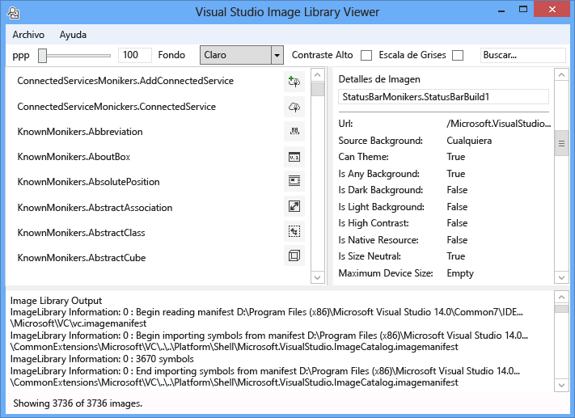
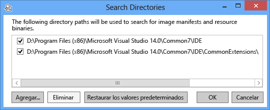
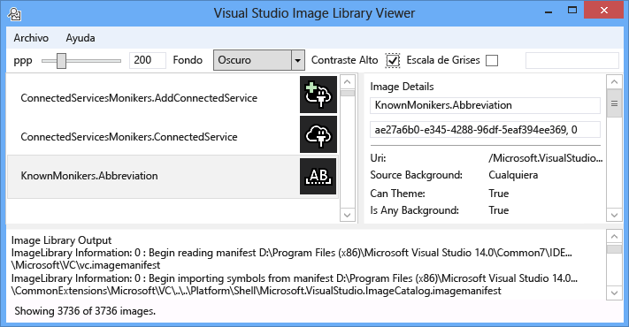
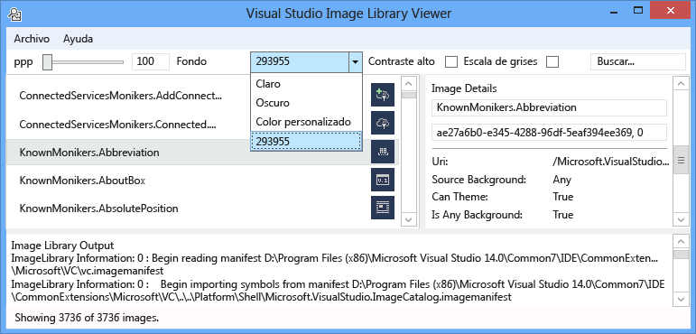
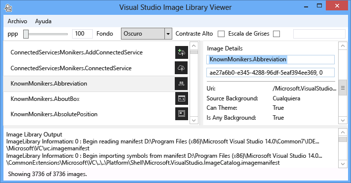
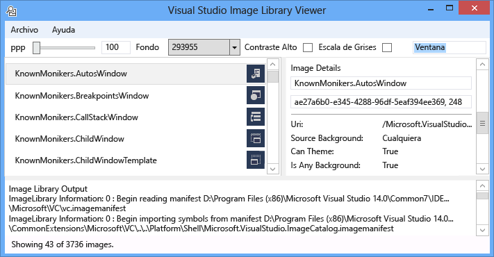
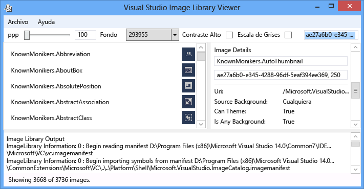
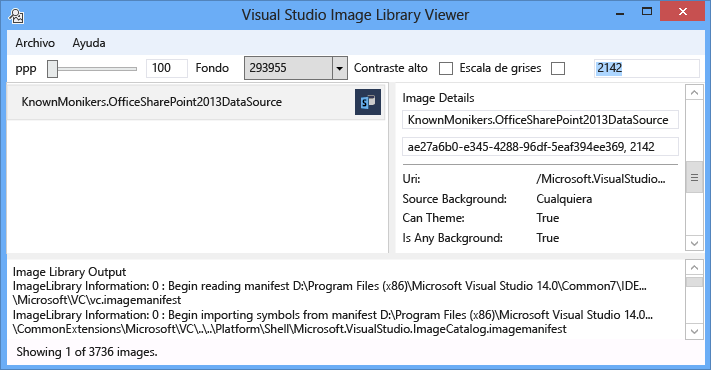

# <a name="image-library-viewer"></a>Visor del archivo de imagen
La herramienta Visor de biblioteca de imágenes de Visual Studio puede cargar y buscar los manifiestos de imagen, que permite al usuario manipularlos en la misma manera que lo haría Visual Studio. El usuario puede modificar fondo, tamaños, valores de PPP, contraste alto y otras opciones. La herramienta también muestra información de carga para cada manifiesto de imagen y muestra información de origen para cada imagen en el manifiesto de imagen. Esta herramienta es útil para:  
  
1.  Diagnóstico de errores  
  
2.  Atributos de garantizar que se establecen correctamente en los manifiestos de imagen personalizada  
  
3.  Buscar imágenes en el catálogo de imagen de Visual Studio para que una extensión de Visual Studio puede utilizar las imágenes que se ajustan el estilo de Visual Studio  
  
   
  
 **Moniker de imagen**  
  
 Un moniker de la imagen (o moniker para abreviar) es un par GUID: ID que identifica de forma única un activo de imagen o imagen lista en la biblioteca de imágenes.  
  
 **Archivos de manifiesto de imagen**  
  
 Archivos de imagen de manifiesto (.imagemanifest) son archivos XML que definen un conjunto de activos de imagen, los monikers que representan esos recursos y la imagen real o imágenes que representan cada activo. Manifiestos de la imagen pueden definir imágenes independientes o listas de imágenes para la compatibilidad heredada de interfaz de usuario. Además, hay atributos que se pueden establecer en el activo o en las imágenes individuales detrás de cada activo para cambiar cuándo y cómo se muestran esos recursos.  
  
 **Esquema del manifiesto de imagen**  
  
 Un manifiesto de imagen completa tiene este aspecto:  
  
```xml  
<ImageManifest>  
      <!-- zero or one Symbols elements -->  
      <Symbols>  
        <!-- zero or more Guid, ID, or String elements -->  
      </Symbols>  
      <!-- zero or one Images elements -->  
      <Images>  
        <!-- zero or more Image elements -->  
      </Images>  
      <!-- zero or one ImageLists elements -->  
      <ImageLists>  
        <!-- zero or more ImageList elements -->  
      </ImageLists>  
</ImageManifest>  
```  
  
 **Símbolos**  
  
 Como ayudan a mejorar la legibilidad y el mantenimiento, el manifiesto de la imagen puede usar símbolos de valores del atributo. Símbolos están definidos de forma similar al siguiente:  
  
```xml  
<Symbols>  
      <Import Manifest="manifest" />  
      <Guid Name="ShellCommandGuid" Value="8ee4f65d-bab4-4cde-b8e7-ac412abbda8a" />  
      <ID Name="cmdidSaveAll" Value="1000" />  
      <String Name="AssemblyName" Value="Microsoft.VisualStudio.Shell.UI.Internal" />  
</Symbols>  
```  
  
|||  
|-|-|  
|**Subelemento**|**Definición**|  
|Importar|Importa los símbolos del archivo de manifiesto especificado para su uso en el manifiesto actual.|  
|GUID|El símbolo representa un GUID y debe coincidir con el formato de GUID.|  
|Id.|El símbolo representa un identificador y debe ser un entero no negativo.|  
|Cadena|El símbolo representa un valor de cadena arbitraria.|  
  
 Los símbolos son entre mayúsculas y minúsculas y que se hace referencia mediante la sintaxis de $(symbol-name):  
  
```xml  
<Image Guid="$(ShellCommandGuid)" ID="$(cmdidSaveAll)" >  
      <Source Uri="/$(AssemblyName);Component/Resources/image.xaml" />  
</Image>  
```  
  
 Algunos símbolos están predefinidos para todos los manifiestos. Se pueden usar en el atributo de identificador Uri de la \<origen > o \<importación > elemento a rutas de acceso de referencia en el equipo local.  
  
|||  
|-|-|  
|**Símbolo**|**Descripción**|  
|CommonProgramFiles|El valor de la variable de entorno % CommonProgramFiles %|  
|LocalAppData|El valor de la variable de entorno % LocalAppData %|  
|ManifestFolder|La carpeta que contiene el archivo de manifiesto|  
|Mis documentos|La ruta de acceso completa de la carpeta Mis documentos del usuario actual|  
|ProgramFiles|El valor de la variable de entorno % ProgramFiles %|  
|Sistema|La carpeta Windows\System32|  
|WinDir|El valor de la variable de entorno % WinDir %|  
  
 **Image**  
  
 El \<imagen > elemento define una imagen que se puede hacer referencia mediante un moniker. El GUID y el Id. de juntas forman el moniker de la imagen. El moniker de la imagen debe ser único en la biblioteca de imágenes completo. Si más de una imagen tiene un moniker determinado, la primera de ellas que se produjeron al compilar la biblioteca es el que se conserva.  
  
 Debe contener al menos un origen. Aunque independiente del tamaño orígenes le proporcionará los mejores resultados en una amplia gama de tamaños, no son necesarios. Si el servicio se le solicita una imagen de un tamaño no está definido en la \<imagen > elemento y no hay ningún origen independiente del tamaño, el servicio de elegir la mejor fuente de específicos de tamaño y escala al tamaño solicitado.  
  
```xml  
<Image Guid="guid" ID="int" AllowColorInversion="true/false">  
      <Source ... />  
      <!-- optional additional Source elements -->  
</Image>  
```  
  
|||  
|-|-|  
|**Attribute**|**Definición**|  
|GUID|[Required] La parte GUID del moniker de imagen|  
|Id.|[Required] La parte del identificador del moniker de imagen|  
|AllowColorInversion|[Opcional, true de forma predeterminada] Indica si la imagen puede tener sus colores invertidos mediante programación cuando se utiliza en un fondo oscuro.|  
  
 **Origen**  
  
 El \<origen > elemento define un elemento de origen de imagen único (XAML y PNG).  
  
```xml  
<Source Uri="uri" Background="background">  
      <!-- optional NativeResource element -->  
 </Source>  
```  
  
|||  
|-|-|  
|**Attribute**|**Definición**|  
|URI|[Required] Un URI que define dónde se puede cargar la imagen desde. Puede ser uno de los siguientes:<br /><br /> -A [Pack URI](http://msdn.microsoft.com/en-US/library/aa970069\(v=vs.100\).aspx) utilizando la aplicación: / / / entidad<br /><br /> -Una referencia de recurso de componente absoluta<br /><br /> -Una ruta de acceso a un archivo que contiene un recurso nativo|  
|Fondo|[Opcional] Indica qué tipo de segundo plano que el origen está pensado para usarse.<br /><br /> Puede ser uno de los siguientes:<br /><br /> - *Luz*: el origen se puede usar en un fondo claro.<br /><br /> - *Oscuro*: el origen se puede usar en un fondo oscuro.<br /><br /> - *HighContrast*: el origen se puede usar en cualquier fondo en modo de contraste alto.<br /><br /> - *HighContrastLight*: el origen se puede usar en un fondo claro en el modo de contraste alto.<br /><br /> -*HighContrastDark*: el origen se puede usar en un fondo oscuro en modo de contraste alto.<br /><br /> Si el **fondo** se omite el atributo, el origen se puede usar en cualquier fondo.<br /><br /> Si **fondo** es *luz*, *oscuro*, *HighContrastLight*, o *HighContrastDark*, el nunca se invierten los colores de la fuente. Si **fondo** se omite o se establece en *HighContrast*, la inversión de colores del código fuente se controla mediante la imagen **AllowColorInversion** atributo.|  
  
 Un \<origen > elemento puede tener exactamente uno de los subelementos opcionales siguientes:  
  
||||  
|-|-|-|  
|**Element**|**Atributos (todas requeridas)**|**Definición**|  
|\<Tamaño >|Valor|El origen se usará para las imágenes del tamaño especificado (en unidades de dispositivo). La imagen estará cuadrada.|  
|\<SizeRange >|MinSize, MaxSize|El origen se usará para las imágenes de MinSize a MaxSize (en unidades de dispositivo), ambos inclusive.. La imagen estará cuadrada.|  
|\<Dimensiones >|Ancho, alto|El origen se usará para las imágenes del ancho y alto (en unidades de dispositivo).|  
|\<DimensionRange >|MinWidth, MinHeight,<br /><br /> MaxWidth, MaxHeight|El origen se usará para las imágenes de ancho/alto mínimo para el ancho/alto máximo (en unidades de dispositivo), ambos inclusive..|  
  
 A \<origen > elemento también puede tener una función opcional \<NativeResource > subelemento, que define un \<origen > que se carga desde un ensamblado nativo en lugar de un ensamblado administrado.  
  
```xml  
<NativeResource Type="type" ID="int" />  
```  
  
|||  
|-|-|  
|**Attribute**|**Definición**|  
|Tipo|[Required] El tipo del recurso nativo, XAML o PNG|  
|Id.|[Required] La parte de identificador entero del recurso nativo|  
  
 **ImageList**  
  
 El \<ImageList > elemento define una colección de imágenes que pueden devolverse en una única barra. La banda se compila a petición, según sea necesario.  
  
```xml  
<ImageList>  
      <ContainedImage Guid="guid" ID="int" External="true/false" />  
      <!-- optional additional ContainedImage elements -->  
 </ImageList>  
```  
  
|||  
|-|-|  
|**Attribute**|**Definición**|  
|GUID|[Required] La parte GUID del moniker de imagen|  
|Id.|[Required] La parte del identificador del moniker de imagen|  
|Externo|[Opcional, valor predeterminado es falso] Indica si el moniker de imagen hace referencia a una imagen en el manifiesto actual.|  
  
 El moniker de la imagen independiente no tiene que hacer referencia a una imagen definida en el manifiesto actual. Si no se encuentra la imagen contenida en la biblioteca de imágenes, una imagen de marcador de posición en blanco se usará en su lugar.  
  
## <a name="how-to-use-the-tool"></a>Cómo usar la herramienta  
 **Validar un manifiesto de imagen personalizada**  
  
 Para crear un manifiesto personalizado, se recomienda que use la herramienta ManifestFromResources para generar automáticamente el manifiesto. Para validar el manifiesto personalizado, inicie el Visor del archivo de imagen y seleccione Archivo > rutas de acceso... para abrir el cuadro de diálogo de directorios de búsqueda. La herramienta usará los directorios de búsqueda para cargar los manifiestos de imagen, pero también la utilizará para buscar los archivos .dll que contienen las imágenes en un manifiesto, por lo que debe asegurarse de incluir el manifiesto y los directorios de archivos DLL en este cuadro de diálogo.  
  
   
  
 Haga clic en **agregar...**  para seleccionar nuevos directorios de búsqueda para buscar los manifiestos y sus DLL correspondientes. La herramienta le recordará estos directorios de búsqueda y puede activar o desactivar activando o desactivando un directorio.  
  
 De forma predeterminada, la herramienta intentará encontrar el directorio de instalación de Visual Studio y agregar esos directorios a la lista de directorios de búsqueda. Puede agregar manualmente los directorios que no encuentra la herramienta.  
  
 Una vez que se cargan todos los manifiestos, la herramienta puede usarse para activar o desactivar **fondo** colores, **PPP**, **contraste alto**, o **escala** para las imágenes para que un usuario puede inspeccionar visualmente el activos de imagen para comprobar que se están representando correctamente para distintas configuraciones.  
  
   
  
 El color de fondo se puede establecer en un valor personalizado, oscuro o claro. Al seleccionar "Color personalizado" abrirá un cuadro de diálogo de selección de color y agregar ese color personalizado a la parte inferior del cuadro combinado de fondo para la recuperación fácil más adelante.  
  
   
  
 Al seleccionar un moniker de la imagen muestra la información para cada imagen real detrás de ese moniker en el panel de detalles de la imagen de la derecha. El panel también permite a los usuarios copiar un moniker por nombre o por valor sin formato GUID: Id.  
  
   
  
 La información mostrada para cada origen de imagen incluye qué tipo de fondo para mostrar en, si se puede aplicar un tema o admite el contraste alto, ¿qué es válida para los tamaños o si es independiente del tamaño y si la imagen procede de un ensamblado nativo.  
  
   
  
 Cuando se valida un manifiesto de imagen, se recomienda que implemente el manifiesto y el archivo DLL en sus ubicaciones reales de la imagen. Comprobará que las rutas de acceso relativas funcionan correctamente y que la biblioteca de imágenes puede buscar y cargar el manifiesto y el archivo DLL de la imagen.  
  
 **Búsqueda de catálogo de imagen KnownMonikers**  
  
 Para adaptarse mejor al estilo de Visual Studio, una extensión de Visual Studio puede usar imágenes en el catálogo de imágenes de Visual Studio en lugar de crear y usar su propio. Esto tiene la ventaja de no tener que mantener esas imágenes y garantiza que la imagen tendrá una imagen de copias de seguridad de valores altos de PPP por lo que debe tener un aspecto correcto en todos los valores de PPP admitido por Visual Studio.  
  
 El Visor del archivo de imagen permite un manifiesto que se debe buscar para que un usuario pueda encontrar el moniker que representa un recurso de imagen y utilizar ese moniker en el código. Para buscar imágenes, escriba el término de búsqueda que desee en el cuadro de búsqueda y presione ENTRAR. La barra de estado en la parte inferior mostrará el número de coincidencias encontrado fuera de las imágenes totales en todos los manifiestos.  
  
   
  
 Cuando se buscan los monikers de imagen en los manifiestos existentes, se recomienda que buscar y usar solo los monikers el Visual Studio imagen del catálogo, otros monikers intencionadamente públicamente accesibles o sus propia monikers personalizados. Si usas monikers no públicos, interfaz de usuario personalizada que se haya interrumpido o sus imágenes cambiaron inesperados si o cuando se cambia o se actualizan los monikers no públicos y las imágenes.  
  
 Además, es posible realizar búsquedas en GUID. Este tipo de búsqueda resulta útil para filtrar la lista para un único manifiesto o subsección único de un manifiesto de manifiesto si contiene varios GUID.  
  
   
  
 Por último, buscar por Id. es posible también.  
  
   
  
## <a name="notes"></a>Notas  
  
-   De forma predeterminada, la herramienta extraerá en varios de los manifiestos de imagen presentes en el directorio de instalación de Visual Studio. Es la única persona que tiene monikers públicamente consumibles el **Microsoft.VisualStudio.ImageCatalog** manifiesto. GUID: ae27a6b0-e345-4288-96df-5eaf394ee369 (hacer **no** reemplazar este GUID en un manifiesto personalizado) tipo: KnownMonikers  
  
-   La herramienta de intentos de inicio para cargar todos los manifiestos de imagen que se encuentra, por lo que podría tardar varios segundos antes de que aparezca realmente la aplicación. También podría ser lento o no responde al cargar los manifiestos.  
  
## <a name="sample-output"></a>Resultados del ejemplo  
 Esta herramienta no genera ningún resultado.