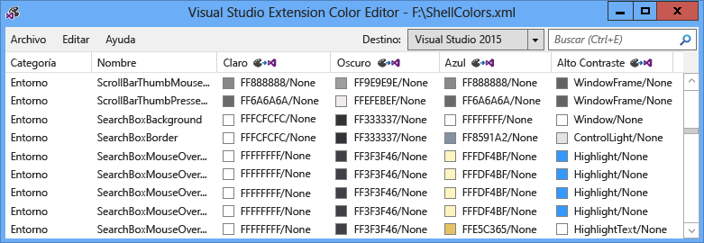
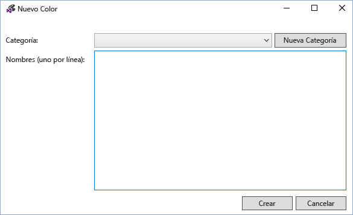
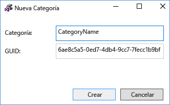
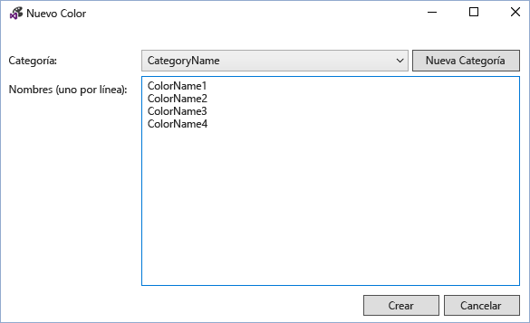
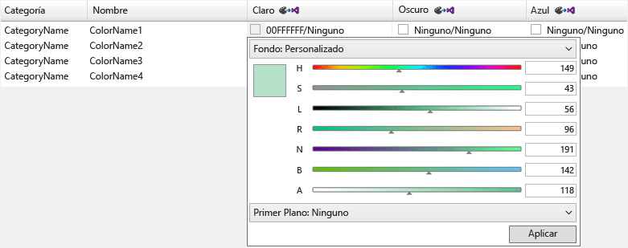
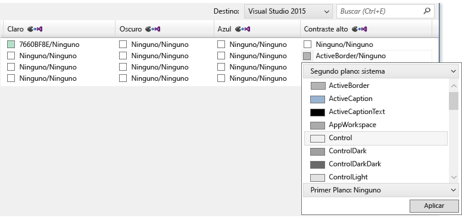
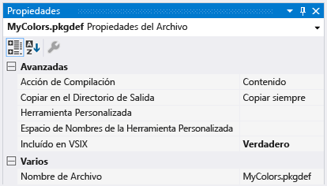
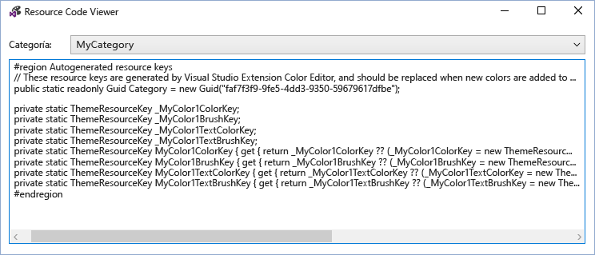

# <a name="vsix-color-editor"></a>Editor de colores VSIX
La herramienta Editor de colores de extensión de Visual Studio puede crear y editar los colores personalizados para Visual Studio. La herramienta también puede generar las claves de recursos de tema para que los colores se pueden utilizar en código. Esta herramienta es útil para hacer que los colores de una extensión de Visual Studio que admite la creación de temas. Esta herramienta puede abrir archivos .pkgdef y XML. Temas visuales Studio (archivos .vstheme) pueden utilizarse con el Editor de colores en extensión de Visual Studio, al cambiar la extensión de archivo a XML. Además, los archivos de .vstheme pueden importarse en un archivo .xml actual.  
  
   
  
 **Archivos de definición de paquete**  
  
 Archivos de definición (.pkgdef) del paquete son los archivos que definen los temas. Los colores a sí mismos se almacenan en archivos .xml de color de tema, que se compilan en un archivo .pkgdef. Los archivos de .pkgdef se implementan en ubicaciones de búsqueda de Visual Studio, procesa en tiempo de ejecución y combinados juntos para definir temas.  
  
 **Tokens de color**  
  
 Un token de color se compone de cuatro elementos:  
  
-   **Nombre de categoría:** una agrupación lógica de un conjunto de colores. Utilice un nombre de categoría existente si ya hay colores que son específicos del elemento deseado de interfaz de usuario o grupo de elementos de interfaz de usuario.  
  
-   **Nombre del token:** un nombre descriptivo para el token de color y conjuntos de símbolo (token). Los juegos incluyen fondo y nombres de token de primer plano (texto), así como todos sus Estados y estos deben tener un nombre para que sea fácil identificar los pares y los Estados que se aplican a.  
  
-   **El valor (o tonos) de color:** necesarios para cada tema de color. Cree siempre fondo y texto de valores de color en pares. Están emparejados de colores de primer plano y fondo para que siempre sea legible en el color de fondo en el que se dibuja el color del texto (primer plano). Estos colores se vinculan y se pueden usar juntas en la interfaz de usuario. Si el fondo no está pensado para su uso con texto, no define un color de primer plano.  
  
-   **Nombre del color del sistema:** para su uso en las presentaciones de alto contraste.  
  
## <a name="how-to-use-the-tool"></a>Cómo usar la herramienta  
 Tanto como sea posible, y en su caso, los colores de Visual Studio existentes se deben utilizar en lugar de realizar otros nuevos. Sin embargo, para casos donde no se definen colores adecuados, se deben crear colores personalizados para mantener una creación de temas de extensión compatibles.  
  
 **Crear nuevos tokens de color**  
  
 Para crear colores personalizados mediante el Editor de colores de extensión de Visual Studio, siga estos pasos:  
  
1.  Determine los nombres de categoría y el símbolo (token) para los nuevos tokens de color.  
  
2.  Elija los matices que utilizará el elemento de interfaz de usuario para cada tema y el color del sistema de contraste alto.  
  
3.  Utilice el editor de colores para crear nuevos tokens de color.  
  
4.  Usar los colores en una extensión de Visual Studio.  
  
5.  Probar los cambios en Visual Studio.  
  
 **Paso 1: Determinar la categoría y nombres de token para los nuevos tokens de color.**  
  
 La denominación preferido esquema para un VSColor es **[categoría] [tipo de interfaz de usuario] [estado]**. No utilice la palabra "color" en los nombres de VSColor, ya que es redundante.  
  
 Nombres de categoría proporcionan agrupaciones lógicas y deben definirse como sigan como sea posible. Por ejemplo, el nombre de una ventana de herramienta única podría ser un nombre de categoría, pero no lo es el nombre de un equipo de proyecto o de unidad empresarial completo. Agrupar las entradas en categorías le ayuda a evitar la confusión entre los colores con el mismo nombre.  
  
 Un nombre de símbolo (token) debe indicar claramente el tipo de elemento y las situaciones o "state", para el que se aplicará el color. Por ejemplo, una activo sugerencia de datos **[tipo de interfaz de usuario]** podría denominarse "**información sobre datos**" y la **[estado]** podría denominarse "**Active**," da lugar a un nombre del color "**DataTipActive**." Puesto que las sugerencias de datos tienen el texto, deben definir un primer plano y un color de fondo. Mediante el uso de un par de primer plano y fondo, el editor de colores creará automáticamente los colores "**DataTipActive**" para el fondo y "**DataTipActiveText**" para el primer plano.  
  
 Si el fragmento de la interfaz de usuario tiene un solo estado, el **[estado]** se puede omitir la parte del nombre. Por ejemplo, si un cuadro de búsqueda con un borde y no hay ningún cambio de estado que afectaría al color del borde, a continuación, el nombre de token de color del borde simplemente se puede llamar "**SearchBoxBorder**."  
  
 Algunos nombres de estado comunes incluyen:  
  
-   Activo  
  
-   Inactivo  
  
-   MouseOver  
  
-   MouseDown  
  
-   Seleccionado  
  
-   Con foco  
  
 Ejemplos de algunos nombres de token para las partes de un control de elemento de lista:  
  
-   ListItem  
  
-   ListItemBorder  
  
-   ListItemMouseOver  
  
-   ListItemMouseOverBorder  
  
-   ListItemSelected  
  
-   ListItemSelectedBorder  
  
-   ListItemDisabled  
  
-   ListItemDisabledBorder  
  
 **Paso 2: Seleccione los matices que utilizará el elemento de interfaz de usuario para cada tema y el color del sistema de contraste alto.**  
  
 Al elegir colores personalizados para la interfaz de usuario, seleccione un elemento de interfaz de usuario existente similar y utilizar sus colores como base. Los colores de elementos de interfaz de usuario en el equipo han experimentado revisión y pruebas, por lo que se van a buscar adecuados y se comporten correctamente en todos los temas.  
  
 **Paso 3: Usar el editor de colores para crear nuevos tokens de color.**  
  
 Inicie el editor de colores y abra o cree un nuevo archivo .xml de colores de tema personalizado. Seleccione **Editar > nuevo Color** en el menú. Se abrirá un cuadro de diálogo para especificar la categoría y uno o varios nombres para las entradas de color dentro de esa categoría:  
  
   
  
 Seleccione una categoría existente o seleccione **nueva categoría** para crear una nueva categoría. Se abrirá otro cuadro de diálogo, creando un nuevo nombre de categoría:  
  
   
  
 La nueva categoría, a continuación, estará disponible en la **nuevo Color** menú desplegable de categorías. Después de elegir una categoría, escriba un nombre por línea para cada nuevo token de color y seleccione "Crear" cuando finaliza:  
  
   
  
 Se muestran los valores de color en pares de primer plano y fondo, con "None" que indica que no se ha definido el color. Nota: si un color no tiene un texto de color/par de colores de fondo, a continuación, solo el fondo debe definirse.  
  
   
  
 Para editar un token de color, seleccione una entrada de color para el tema (columna) de ese token. Agregue el valor de color si escribe un valor de color hexadecimal en formato ARGB de 8 dígitos, escriba un nombre de color del sistema en una celda o mediante el menú desplegable para seleccionar el color deseado a través de un conjunto de controles deslizantes de color o una lista de colores del sistema.  
  
   
  
   
  
 Para los componentes que no es necesario para mostrar el texto, escriba el valor de un solo color: el color de fondo. En caso contrario, especifique valores para el color de fondo y de texto, separado por una barra diagonal.  
  
 Al especificar valores de contraste alto, escriba los nombres válidos de color de sistema de Windows. No escriba los valores ARGB codificado de forma rígida. Puede ver una lista de nombres de colores del sistema válido, seleccione "Segundo plano: sistema" o "Primer plano: sistema" en los menús de lista desplegable del valor de color. Al crear los elementos que tienen componentes de texto, utilice el par de color de fondo o texto correcto sistema o el texto puede ser ilegible.  
  
 Cuando termine de crear, configurar y editar los tokens de color, guardarlos en el formato de .pkgdef o .xml deseado. Los tokens de color con un fondo de ninguna ni un conjunto de primer plano se guarda como colores vacías en formato XML, pero descarta en formato .pkgdef. Un cuadro de diálogo le advertirá de posibles pérdidas de color si intenta guardar colores vacías en un archivo .pkgdef.  
  
 **Paso 4: Utilizar los colores en una extensión de Visual Studio.**  
  
 Después de definir el nuevo color de tokens, incluir la .pkgdef en el archivo de proyecto con "Acción de compilación" establecido en "Contenido" y "Incluir en VSIX" establecido en "True".  
  
   
  
 En la extensión de Color Editor de Visual Studio, elija Archivo > código de recurso de la vista para ver el código que se usa para tener acceso personalizado colores en la interfaz de usuario basada en WPF.  
  
   
  
 Incluir este código en una clase estática en el proyecto. Una referencia a **Microsoft.VisualStudio.Shell.\< VSVersion >.0.dll** debe agregarse al proyecto para usar el **ThemeResourceKey** tipo.  
  
```csharp  
namespace MyCustomColors  
{  
    public static class MyCategory  
    {  
        #region Autogenerated resource keys  
        // These resource keys are generated by Visual Studio Extension Color Editor, and should be replaced when new colors are added to this category.  
        public static readonly Guid Category = new Guid("faf7f3f9-9fe5-4dd3-9350-59679617dfbe");  
  
        private static ThemeResourceKey _MyColor1ColorKey;  
        private static ThemeResourceKey _MyColor1BrushKey;  
        private static ThemeResourceKey _MyColor1TextColorKey;  
        private static ThemeResourceKey _MyColor1TextBrushKey;  
        public static ThemeResourceKey MyColor1ColorKey { get { return _MyColor1ColorKey ?? (_MyColor1ColorKey = new ThemeResourceKey(Category, "MyColor1", ThemeResourceKeyType.BackgroundColor)); } }  
        public static ThemeResourceKey MyColor1BrushKey { get { return _MyColor1BrushKey ?? (_MyColor1BrushKey = new ThemeResourceKey(Category, "MyColor1", ThemeResourceKeyType.BackgroundBrush)); } }  
        public static ThemeResourceKey MyColor1TextColorKey { get { return _MyColor1TextColorKey ?? (_MyColor1TextColorKey = new ThemeResourceKey(Category, "MyColor1", ThemeResourceKeyType.ForegroundColor)); } }  
        public static ThemeResourceKey MyColor1TextBrushKey { get { return _MyColor1TextBrushKey ?? (_MyColor1TextBrushKey = new ThemeResourceKey(Category, "MyColor1", ThemeResourceKeyType.ForegroundBrush)); } }  
        #endregion  
    }  
}  
```  
  
 Esto permite el acceso a los colores del código XAML y permite la interfaz de usuario responder a los cambios de tema.  
  
```xaml  
<UserControl x:Class="NewTestProject.TestPackageControl" Name="MyToolWindow"  
             xmlns="http://schemas.microsoft.com/winfx/2006/xaml/presentation"  
             xmlns:x="http://schemas.microsoft.com/winfx/2006/xaml"  
             xmlns:ns="clr-namespace:MyCustomColors">  
  <Grid>  
    <TextBlock Background="{DynamicResource {x:Static ns:MyCategory.MyColor1BrushKey}}"  
               Foreground="{DynamicResource {x:Static ns:MyCategory.MyColor1TextBrushKey}}"  
      >Sample Text</TextBlock>  
  
  </Grid>  
</UserControl>  
```  
  
 **Paso 5: Probar los cambios en Visual Studio.**  
  
 El editor de colores puede aplicar temporalmente tokens de color para las instancias en ejecución de Visual Studio para ver los cambios en vivo en colores sin volver a generar el paquete de extensión. Para ello, haga clic en el botón "Aplicar este tema para ejecutar windows de Visual Studio" que se encuentra en el encabezado de cada columna de tema. Este tema temporal desaparecerá cuando se cierra el Editor de colores de VSIX.  
  
   
  
 Para realizar los cambios permanentes, volver a generar e implementar la extensión de Visual Studio después de agregar los nuevos colores para el archivo .pkgdef y escribir el código que va a usar los colores. Volver a generar la extensión de Visual Studio combinará los valores del registro para los nuevos colores en el resto de los temas. A continuación, vuelva a iniciar Visual Studio, ver la interfaz de usuario y compruebe que los nuevos colores aparecen como se esperaba.  
  
## <a name="notes"></a>Notas  
 Esta herramienta está diseñada para utilizarse para crear colores personalizados para los temas de Visual Studio preexistentes, o para editar los colores de un tema personalizado de Visual Studio. Para crear temas personalizados de Visual Studio completos, descargue el [extensión de Visual Studio Color Theme Editor](http://visualstudiogallery.msdn.microsoft.com/6f4b51b6-5c6b-4a81-9cb5-f2daa560430b) desde la Galería de extensiones de Visual Studio.  
  
## <a name="sample-output"></a>Resultados del ejemplo  
 **Color de XML**  
  
 El archivo .xml generado por la herramienta será similar al siguiente:  
  
```xml  
<Themes>  
  <Theme Name="Light" GUID="{de3dbbcd-f642-433c-8353-8f1df4370aba}">  
    <Category Name="CategoryName" GUID="{eee9d521-dac2-48d9-9a5e-5c625ba2040c}">  
      <Color Name="ColorName1">  
        <Background Type="CT_RAW" Source="FFFFFFFF" />  
      </Color>  
      <Color Name="ColorName2">  
        <Background Type="CT_RAW" Source="FFFFFFFF" />  
        <Foreground Type="CT_RAW" Source="FF000000" />  
      </Color>  
      <Color Name="ColorName3">  
        <Background Type="CT_RAW" Source="FFFF0000" />  
      </Color>  
      <Color Name="ColorName4">  
        <Background Type="CT_RAW" Source="FF000088" />  
        <Foreground Type="CT_RAW" Source="FFFFFFFF" />  
      </Color>  
    </Category>  
  </Theme>  
  <Theme Name="Dark" GUID="{1ded0138-47ce-435e-84ef-9ec1f439b749}">...</Theme>  
  <Theme Name="Blue" GUID="{a4d6a176-b948-4b29-8c66-53c97a1ed7d0}">...</Theme>  
  <Theme Name="HighContrast" GUID="{a5c004b4-2d4b-494e-bf01-45fc492522c7}">...</Theme>  
</Themes>  
  
```  
  
 **Salida de color PKGDEF**  
  
 El archivo .pkgdef generado por la herramienta será similar al siguiente:  
  
```  
[$RootKey$\Themes\{de3dbbcd-f642-433c-8353-8f1df4370aba}\CategoryName]  
"Data"=hex:78,00,00,00,0b,00,00,00,01,00,00,00,21,d5,e9,ee,c2,da,d9,48,9a,5e,5c,62,5b,a2,04,0c,04,00,00,00,0a,00,00,00,43,6f,6c,6f,72,4e,61,6d,65,31,01,ff,ff,ff,ff,00,0a,00,00,00,43,6f,6c,6f,72,4e,61,6d,65,32,01,ff,ff,ff,ff,01,00,00,00,ff,0a,00,00,00,43,6f,6c,6f,72,4e,61,6d,65,33,01,ff,00,00,ff,00,0a,00,00,00,43,6f,6c,6f,72,4e,61,6d,65,34,01,00,00,88,ff,01,ff,ff,ff,ff  
[$RootKey$\Themes\{1ded0138-47ce-435e-84ef-9ec1f439b749}\CategoryName]  
"Data"=hex:...  
[$RootKey$\Themes\{a4d6a176-b948-4b29-8c66-53c97a1ed7d0}\CategoryName]  
"Data"=hex:...  
[$RootKey$\Themes\{a5c004b4-2d4b-494e-bf01-45fc492522c7}\CategoryName]  
"Data"=hex:...  
  
```  
  
 **Contenedor de claves de recursos de C#**  
  
 Las claves de recursos de color generadas por la herramienta será similares al siguiente:  
  
```csharp  
namespace MyNamespace  
{  
    public static class MyColors  
    {  
        #region Autogenerated resource keys  
        // These resource keys are generated by Visual Studio Extension Color Editor, and should be replaced when new colors are added to this category.  
  
        public static string ColorName1ColorKey { get { return "ColorName1ColorKey"; } }  
        public static string ColorName1BrushKey { get { return "ColorName1BrushKey"; } }  
  
        public static string ColorName2ColorKey { get { return "ColorName2ColorKey"; } }  
        public static string ColorName2BrushKey { get { return "ColorName2BrushKey"; } }  
        public static string ColorName2TextColorKey { get { return "ColorName2TextColorKey"; } }  
        public static string ColorName2TextBrushKey { get { return "ColorName2TextBrushKey"; } }  
  
        public static string ColorName3ColorKey { get { return "ColorName4ColorKey"; } }  
        public static string ColorName3BrushKey { get { return "ColorName4BrushKey"; } }  
        public static string ColorName3TextColorKey { get { return "ColorName4TextColorKey"; } }  
        public static string ColorName3TextBrushKey { get { return "ColorName4TextBrushKey"; } }  
        #endregion  
    }  
}  
```  
  
 **Contenedor de diccionario de recursos WPF**  
  
 El color **ResourceDictionary** las claves generadas por la herramienta será similares al siguiente:  
  
```xaml  
<ResourceDictionary xmlns="http://schemas.microsoft.com/winfx/2006/xaml/presentation"  
        xmlns:x="http://schemas.microsoft.com/winfx/2006/xaml"  
        xmlns:colors="clr-namespace:MyNamespace">  
  
  <SolidColorBrush x:Key="{x:Static colors:MyColors.ColorName1BrushKey}" Color="#FFFFFFFF" />  
  <Color x:Key="{x:Static colors:MyColors.ColorName1ColorKey}" A="255" R="255" G="255" B="255" />  
  
  <SolidColorBrush x:Key="{x:Static colors:MyColors.ColorName2BrushKey}" Color="#FFFFFFFF" />  
  <Color x:Key="{x:Static colors:MyColors.ColorName2ColorKey}" A="255" R="255" G="255" B="255" />  
  <SolidColorBrush x:Key="{x:Static colors:MyColors.ColorName2TextBrushKey}" Color="#FF000000" />  
  <Color x:Key="{x:Static colors:MyColors.ColorName2TextColorKey}" A="255" R="0" G="0" B="0" />  
  
  <SolidColorBrush x:Key="{x:Static colors:MyColors.ColorName3BrushKey}" Color="#FFFF0000" />  
  <Color x:Key="{x:Static colors:MyColors.ColorName3ColorKey}" A="255" R="255" G="0" B="0" />  
  
  <SolidColorBrush x:Key="{x:Static colors:MyColors.ColorName4BrushKey}" Color="#FF000088" />  
  <Color x:Key="{x:Static colors:MyColors.ColorName4ColorKey}" A="255" R="0" G="0" B="136" />  
  <SolidColorBrush x:Key="{x:Static colors:MyColors.ColorName4TextBrushKey}" Color="#FFFFFFFF" />  
  <Color x:Key="{x:Static colors:MyColors.ColorName4TextColorKey}" A="255" R="255" G="255" B="255" />  
</ResourceDictionary>  
```