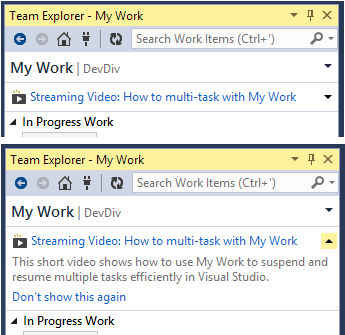
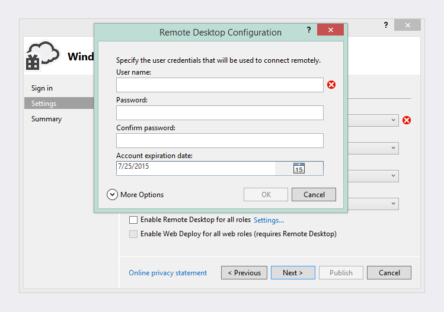

# Fundamentos de la experiencia de usuario de Visual Studio
[!INCLUDE[vs2017banner](../../code-quality/includes/vs2017banner.md)]

## Procedimientos recomendados  
  
### 1. Ser coherente dentro del entorno de Visual Studio.  
  
-   Seguir los patrones de interacción existente dentro del shell.  
  
-   Diseñar características para ser coherente con los requisitos de idioma y artesanía visual del shell.  
  
-   Uso compartido de comandos y controles cuando existen.  
  
-   Comprender la jerarquía de Visual Studio y cómo se establece el contexto y las unidades de la interfaz de usuario.  
  
### 2. Usar el servicio de entorno para fuentes y colores.  
  
-   Interfaz de usuario debe respetar la configuración de fuente del entorno actual, a menos que se expone para la personalización en la página fuentes y colores en el cuadro de diálogo Opciones.  
  
-   Elementos de interfaz de usuario deben usar el VSColor Service, utilizando tokens de entorno compartido o tokens de características específicas.  
  
### 3. Realizar todas las imágenes coherente con el nuevo estilo de VS.  
  
-   Siga los principios de diseño de Visual Studio para iconos, glifos y otros gráficos.  
  
-   No coloque texto en elementos gráficos.  
  
### 4. Diseñar desde una perspectiva centrada en el usuario.  
  
-   Crear el flujo de tareas antes de las características individuales dentro de él.  
  
-   Estar familiarizado con los usuarios y ponen ese conocimiento explícito en su especificación.  
  
-   Cuando revise la interfaz de usuario, evaluar la experiencia completa, así como los detalles.  
  
-   Diseñar la interfaz de usuario para que siga siendo funcional y atractiva, independientemente del idioma o configuración regional.  
  
## Resolución de pantalla  
  
### Resolución mínima  
 La resolución mínima de Dev14 de Visual Studio es 1280 x 1024. Esto significa que es *posible* utilizar Visual Studio en esta solución, aunque quizás no sea una experiencia de usuario óptima. No hay ninguna garantía de que todos los aspectos se podrán usar resolución inferior a 1280 x 1024.  
  
 Tamaño inicial del cuadro de diálogo no debe superar los 1000 píxeles de alto con el fin de ajustarse el marco del IDE dentro de esta resolución mínima de 96 PPP.  
  
### Pantallas de alta densidad  
 Interfaz de usuario de Visual Studio debe funcionar bien en PPP todos los factores que es compatible con Windows de fábrica de escala: 250%, 200% y 150%.  
  
## Antipatrones  
 Visual Studio contiene muchos ejemplos de interfaz de usuario que siguen nuestras directrices y procedimientos recomendados. En un esfuerzo para ser coherente, los desarrolladores a menudo tomado prestado de patrones de diseño de interfaz de usuario de producto similares a lo que está creando. Aunque esto es un buen enfoque que ayuda a nosotros unidad de coherencia en la interacción del usuario y el diseño visual, en algún momento enviamos características con los datos que no cumplan nuestras directrices debido a restricciones de programación o dar de baja prioridad. En estos casos, no queremos que los equipos copiar uno de estos "antipatrones" dado que proliferan UI incorrecta o incoherente en el entorno de Visual Studio.  
  
### Campos\/configuración requerida que se muestra en estado de error predeterminada  
  
#### Objetivos del equipo de características  
  
-   Advertir a los usuarios que ha agregado un elemento que se debe configurar.  
  
-   Dibuje la atención del usuario a las áreas que necesitan la entrada.  
  
#### Antipatrón de solución  
 Tan pronto como el usuario ha iniciado una acción y antes de que se haya completado la tarea, coloque inmediatamente iconos de parada crítica junto a las áreas que necesitan una configuración.  
  
#### Ejemplo: Las declaraciones del Diseñador de manifiestos  
 Adición de una declaración a la lista inmediatamente, coloca en un estado de error, se mantiene hasta que el usuario establece las propiedades necesarias.  
  
 En este caso, hay una preocupación adicional porque el icono utilizado para la alerta contiene una "x", para quitar común no se puede utilizar el icono junto a él. Como resultado, la interfaz de usuario usa un botón de quitar un control más tosco.  
  
   
  
 **Colocar la interfaz de usuario en un estado de error predeterminada es un antipatrón de Visual Studio.**  
  
#### Alternativas  
 Una mejor solución a este problema sería:  
  
-   Permitir que el usuario agregue una declaración sin previo aviso y mueva inmediatamente establecer propiedades en el elemento.  
  
-   Agregar el icono de advertencia \(triángulo gold\) al desplazar el foco del elemento, como agregar otra declaración a la lista o intente cambiar de ficha en el diseñador.  
  
-   Si el usuario intenta cambiar pestañas antes de establecer propiedades en las declaraciones, aparecerá un cuadro de diálogo que explica que no se compilará la aplicación \(o cualquier las implicaciones\) hasta que se resuelvan las advertencias. Si el usuario cierra el cuadro de diálogo y cambia las tabulaciones de todos modos, a continuación, un icono \(crítico o advertencia, según corresponda\) se agrega a la pestaña de declaraciones.  
  
### Obligar al usuario a leer el texto antes de descartar la interfaz de usuario  
  
#### Objetivos del equipo de características  
 No permitir al usuario cerrar la interfaz de usuario sin tener que consultar primero el texto de explicación.  
  
#### Antipatrón  
 El equipo de insertar los vínculos de vídeo en varios lugares de la interfaz de usuario de VS pronunciado contra el modelo común de una X cerrar botón e información sobre herramientas explicación según lo especificado por la experiencia de usuario y en su lugar implementa una lista desplegable y el vínculo "No volver a mostrar".  
  
   
  
 **Incorrecto: forzar al usuario leer texto explicativo antes de descartar la interfaz de usuario es un antipatrón dentro de Visual Studio.**  
  
#### Resultado  
 En lugar de un botón de cierre simple \(un clic\), el usuario está obligado a usar dos clics para descartar simplemente la interfaz de usuario en cada sitio en que aparecen los vínculos de vídeo.  
  
#### Alternativas  
 El diseño correcto para esta situación sería siguen el patrón común en Internet Explorer, Office y Visual Studio: al mantener el mouse, el usuario puede ver la descripción de la información sobre herramientas y un solo clic oculta la interfaz de usuario.  
  
   
  
 **Correcto: por diseño, vínculos de vídeo deben mostrar una información sobre herramientas con información adicional al mantener el mouse y haga clic en la "X" debería descartar el mensaje sin necesidad de intervención.**  
  
### Uso de barras de comandos para la configuración  
   
  
 **Figura A: antipatrón de barra comando**  
  
 **Figura A** representa este antipatrón: poner un valor por debajo de un botón de comando que se aplica a algo más que el comando. En este esquema, hay comandos además de iniciar la depuración, como la vista de explorador, iniciar sin depurar y paso a paso, que respetará la configuración seleccionada.  
  
   
  
 **Figura B: mejor, pero aún un antipatrón de barra de comandos**  
  
 Indeseable ligeramente mejor, pero todavía, se ubican los valores de este tipo en las barras de herramientas, tal como se muestra en **figura B**. Mientras que los botones de división que ocupen menos espacio y por tanto, una mejora en las listas desplegables, ambos diseños todavía están utilizando una barra de herramientas para promover algo que no es realmente un comando.  
  
   
  
 **Utilice figura C: correcta del patrón de barra de comandos de Visual Studio**  
  
 En **figura C**, la configuración está asociada a una serie de comandos. No hay ninguna configuración global que se va a establecer y nos estamos sólo se intercambia entre cuatro comandos. Esta es la única situación en la que los comandos de la barra de herramientas son aceptables.  
  
### Antipatrones de control  
 Algunos antipatrones son uso simplemente incorrecto o la presentación de un control o un grupo de controles.  
  
#### Subrayado que se utiliza como una etiqueta de grupo, no de un hipervínculo  
 Texto subrayado debe usarse sólo para los hipervínculos.  
  
 **Incorrecta:**  
  
   
  
 **Texto subrayado que no es un hipervínculo es un antipatrón de Visual Studio.**  
  
 **Buena:**  
  
   
  
 **Estilo correctamente, el texto de hipervínculo no aparece sin sufijo en la fuente del entorno.**  
  
#### Al hacer clic en una casilla de verificación resultados en un cuadro de diálogo emergente  
 Haga clic en la casilla de verificación "Habilitar Escritorio remoto para todos los roles" en el Asistente "Publicar aplicación de Windows Azure" inmediatamente, se abrirá un cuadro de diálogo emergente de un antipatrón de Visual Studio. Además, el campo de casilla de verificación no rellena con una casilla de verificación después de haberse seleccionado, otro antipatrón de interacción.  
  
   
  
 **Al abrir un cuadro de diálogo después de hacer clic en una casilla de verificación es un antipatrón de Visual Studio.**  
  
### Antipatrones de hipervínculo  
 El ejemplo siguiente contiene dos antipatrones.  
  
1.  Primer plano activar rojo al mantener el mouse significa que no se utiliza el color correcto compartido desde el servicio de la fuente.  
  
2.  No es el texto adecuado para un vínculo a un tema conceptual "Más información". Objetivo del usuario no es más, que es entender las implicaciones de su elección.  
  
   
  
 **Omitiendo el servicio de color y el uso de "Más información" para los hipervínculos son antipatrones de Visual Studio.**  
  
 **Mejor solución:** suponer la pregunta sería se esté preguntando al usuario haciendo clic en el vínculo.  
  
-   ¿Cómo funcionan los servicios de Windows Azure?  
  
-   ¿Cuándo es necesario un proyecto de servicios móviles de Windows Azure?  
  
#### Uso de "Haga clic aquí" para vínculos  
 Los hipervínculos deben autodescriptivos. Es un antipatrón usar "Haga clic aquí" o cualquier variación similar.  
  
 **Incorrecta:** "Haga clic aquí para obtener instrucciones sobre cómo crear un nuevo proyecto".  
  
 **Buena:** "¿Cómo creo un nuevo proyecto?"