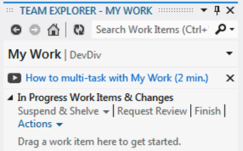
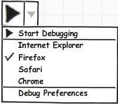

# Essentials UX para Visual Studio
## Procedimientos recomendados  
  
### 1. Ser coherente dentro del entorno de Visual Studio.  
  
-   Siga existente [patrones de interacción](interaction-patterns-for-visual-studio.md) dentro del shell.  
  
-   Diseñar características que se va a ser coherente con el lenguaje visual del shell y [requisitos de acabado](evaluation-tools-for-visual-studio.md).  
  
-   Uso compartido de comandos y controla cuando existen.  
  
-   Comprender la jerarquía de Visual Studio y cómo se establece el contexto y las unidades de la interfaz de usuario.  
  
### 2. Usar el servicio de entorno para fuentes y colores.  
  
-   Interfaz de usuario debe respetar actual [fuente del entorno](fonts-and-formatting-for-visual-studio.md) configuración a menos que se expone para la personalización en la página fuentes y colores en el cuadro de diálogo de opciones.  
  
-   Elementos de interfaz de usuario deben usar el [VSColor Service](colors-and-styling-for-visual-studio.md), usar compartidos tokens de entorno o específico de la característica de símbolos (tokens).  
  
### 3. Hacer que todas las imágenes sea coherente con el nuevo estilo de VS.  
  
-   Siga los principios de diseño de Visual Studio para iconos, glifos y otros gráficos.  
  
-   No se debe colocar el texto en elementos gráficos.  
  
### 4. Diseñar desde una perspectiva centrada en el usuario.  
  
-   Crear el flujo de tareas antes de las características individuales dentro de él.  
  
-   Estar familiarizado con los usuarios y ponen ese conocimiento explícito en su especificación.  
  
-   Al revisar la interfaz de usuario, evaluar la experiencia completa, así como los detalles.  
  
-   Diseñar la interfaz de usuario para que permanezca funcional y atractiva independientemente del idioma o configuración regional.  
  
## Resolución de pantalla  
  
### Resolución mínima  
 - La resolución mínima de Dev14 de Visual Studio es **1280 x 720**. Esto significa que es *posibles* se usa Visual Studio en esta solución, aunque es posible que no sea una experiencia de usuario óptima. No hay ninguna garantía de que todos los aspectos se podrán usar resolución inferior a 1280 x 720.  
  
 - La resolución de destino para Visual Studio es **1366 x 768**. Ésta es la resolución más bajo en el que te prometemos un *buena* experiencia del usuario.

 - Alto del cuadro de diálogo inicial debe ser **menor que 700 píxeles**, por lo que se ajuste a la resolución mínima del marco del IDE a 96 PPP.
  
### Pantallas de alta densidad  
 Interfaz de usuario en Visual Studio debe funcionar bien en PPP todos los factores que Windows admite de fábrica de escala: 150%, 200% y % de 250.  
  
## Antipatrones  
 Visual Studio contiene muchos ejemplos de interfaz de usuario que siguen nuestras directrices y procedimientos recomendados. En un esfuerzo para que sean coherentes, los desarrolladores a menudo pedir prestado a los patrones de diseño de interfaz de usuario de producto similares a lo que va a compilar. Aunque se trata de un buen enfoque que ayuda a nosotros unidad de coherencia en la interacción del usuario y el diseño visual, que en ocasiones enviamos características con algunos detalles que no cumplan nuestras directrices debido a restricciones de programación o dar de baja prioridad. En estos casos, no queremos que los equipos para copiar uno de estos "antipatrones" porque proliferan interfaz de usuario incorrecta o incoherente en el entorno de Visual Studio.  
  
### Requiere configuración de campos que se muestra en estado de error predeterminada  
  
#### Objetivos del equipo de características  
  
-   Advierta a los usuarios que se ha agregado un elemento que se debe configurar.  
  
-   Dibuje la atención del usuario a las áreas que se necesita una entrada.  
  
#### Antipatrón de solución  
 Tan pronto como el usuario ha iniciado una acción y antes de que haya completado la tarea, coloque inmediatamente parada crítica iconos junto a las áreas que necesitan una configuración.  
  
#### Ejemplo: Las declaraciones de diseñador de manifiestos  
 Agregar una declaración a la lista inmediatamente, coloca en un estado de error, lo que se conserven hasta que el usuario establece las propiedades necesarias.  
  
 En este caso, hay una preocupación adicional porque el icono utilizado para la alerta contiene una "&times;" icono, por lo que no se puede usar el icono de eliminación común junto a él. Como resultado, la interfaz de usuario usa un botón de quitar un control más inadecuado.  
  
 ![Colocación de interfaz de usuario en un estado de error de forma predeterminada es un antipatrón de Visual Studio. ] (../../extensibility/ux-guidelines/media/manifestdesignererrordeclarationsanti-pattern.png "ManifestDesignererrordeclarationsanti patrón") Colocación de interfaz de usuario en un estado de error de forma predeterminada es un antipatrón de Visual Studio.
  
#### Alternativas  
 Una mejor solución a este problema sería:  
  
-   Permitir al usuario que agregue una declaración sin previo aviso y, a continuación, mover inmediatamente establecer propiedades en el elemento.  
  
-   Agregar el icono de advertencia (triángulo gold) al pasar el foco del elemento, como, por ejemplo, para agregar otra declaración a la lista o intente cambiar de ficha en el diseñador.  
  
-   Si el usuario intenta cambiar pestañas antes de establecer las propiedades en todas las declaraciones, extraer un cuadro de diálogo que explica que no se compilará la aplicación (o cualquier las implicaciones) hasta que se resuelvan las advertencias. Si el usuario cierra el cuadro de diálogo y cambia las tabulaciones todos modos, a continuación, un icono (crítico o advertencia, según corresponda) se agrega a la ficha de declaraciones.  
  
### Varios clics para descartar la interfaz de usuario  
  
#### Objetivos del equipo de características  
 No se permite el usuario descartar la interfaz de usuario sin tener que consultar primero el texto de explicación.  
  
#### Antipatrón  
 El equipo de insertar los vínculos de vídeo en varios lugares de la interfaz de usuario de VS decidió con el modelo común de la "&times;" explicación de información sobre herramientas y el botón Cerrar como especificado UX y, en su lugar implementa una lista desplegable y "No volver a mostrar" vincula.  

#### Ejemplo: vínculos a vídeos en Team Explorer
Forzar el usuario pueda leer el texto explicativo antes al descartar la interfaz de usuario es un antipatrón dentro de Visual Studio. Vínculos vídeo correctamente diseñado deben mostrar una información sobre herramientas con información adicional al mantener el mouse y haga clic en el "&times;" debe descartar el mensaje sin necesidad de intervención.

  Patrón de vínculo de vídeo incorrecto
  
#### Resultado  
 En lugar de un botón de cierre simple (un solo clic), el usuario está obligado a utilizar dos clics para descartar simplemente la interfaz de usuario en todos los lugares que aparecen los vínculos de vídeo.  
  
#### Alternativas  
 El diseño correcto para esta situación sería seguir el patrón común para Internet Explorer, Office y Visual Studio: al mantener el mouse, el usuario puede ver la descripción de la información sobre herramientas y un solo clic oculta la interfaz de usuario.  
  
  Patrón de vínculo de vídeo correcto
  
### Usar barras de comandos para la configuración  
 **Figura A** representa este antipatrón: poner un valor por debajo de un botón de comando que se aplica a algo más que el comando. En este esquema, hay comandos además de iniciar la depuración, como la vista de explorador, iniciar sin depurar y paso a paso, que respetará la configuración seleccionada.  

   Figura r: antipatrón de barra comando
  
 Indeseable ligeramente mejor, pero aún, es sinónimo de poner la configuración de este tipo en las barras de herramientas, como se muestra en **figura B**. Aunque los botones de expansión que ocupen menos espacio y son, por tanto, una mejora en listas desplegables, ambos diseños se sigue usando una barra de herramientas para promocionar algo que no es realmente un comando.  
 
  Figura B: mejor, pero que todavía un antipatrón de barra de comandos
 
  En el enfoque correcto que se muestra en **figura C**, la configuración está vinculada a una serie de comandos. No hay ninguna configuración global que se va a establecer y solo estamos cambiar entre cuatro comandos. Esta es la única situación en la que los comandos en la barra de herramientas son aceptables. 

  Usar figura C: correcto del patrón de barra de comandos de Visual Studio
   
### Antipatrones de control  
 Algunos antipatrones son uso simplemente incorrecta o la presentación de un control o un grupo de controles.  
  
#### Subrayado se utiliza como etiqueta de grupo, no un hipervínculo  
 Utilizar texto subrayado debe utilizarse solo para los hipervínculos.  
  
 **Incorrecta:**    
 ![Texto subrayado que no sea un hipervínculo es un antipatrón de Visual Studio. ] (../../extensibility/ux-guidelines/media/0102-g_grouplabelincorrect.png "g_GroupLabelIncorrect 0102") Texto subrayado que no sea un hipervínculo es un antipatrón de Visual Studio.
  
 **Buena:**   
 ![Un estilo correctamente, texto de hipervínculo no aparece sin adornar de la fuente del entorno. ] (../../extensibility/ux-guidelines/media/0102-h_grouplabelcorrect.png "h_GroupLabelCorrect 0102") Un estilo correctamente, texto de hipervínculo no aparece sin adornar de la fuente del entorno.
  
#### Al hacer clic en una casilla de verificación resultados en un cuadro de diálogo emergente  
 Haga clic en la casilla de verificación "Habilitar Escritorio remoto para todos los roles" en el Asistente "Publicar aplicación de Windows Azure" inmediatamente, se abrirá un cuadro de diálogo emergente, antipatrón de Visual Studio. Además, el campo de casilla de verificación no rellena con una casilla de verificación después de que se selecciona, otro antipatrón de interacción.  
  
 ![Abrir un cuadro de diálogo después de hacer clic en una casilla de verificación es un antipatrón de Visual Studio. ] (../../extensibility/ux-guidelines/media/0102-i_checkboxpopup.png "i_CheckboxPopup 0102") Abrir un cuadro de diálogo después de hacer clic en una casilla de verificación es un antipatrón de Visual Studio.
  
### Antipatrones de hipervínculo  
 El ejemplo siguiente contiene dos antipatrones.  
  
1.  Primer plano activar rojo al mantener el mouse significa que no se utiliza el color correcto compartido desde el servicio de la fuente.  
  
2.  "Más" no es el texto adecuado para un vínculo a un tema conceptual. Objetivo del usuario no es más, es para entender las implicaciones de su elección.  
  
 ![Se omitirá el servicio de color y el uso de "Obtener más información" para los hipervínculos están antipatrones de Visual Studio. ] (../../extensibility/ux-guidelines/media/0102-j_hyperlinkincorrect.png "j_HyperlinkIncorrect 0102") Se omitirá el servicio de color y el uso de "Obtener más información" para los hipervínculos están antipatrones de Visual Studio.  
  
 **Una mejor solución:** suponer la pregunta ¿se pregunte al usuario, haga clic en el vínculo.  
  
-   ¿Cómo funcionan los servicios de Windows Azure?  
  
-   ¿Cuándo se necesita un proyecto de servicios móviles de Windows Azure?  
  
#### Usando "Haga clic aquí" para vínculos  
 Hipervínculos deben ser autodescriptivos. Es un antipatrón para usar "Haga clic aquí" o cualquier variación similar.  
  
 **Incorrecta:** "Haga clic aquí para obtener instrucciones sobre cómo crear un nuevo proyecto".
  
 **Anuncio:** "¿Cómo creo un nuevo proyecto?"