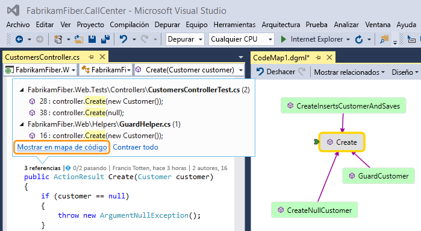
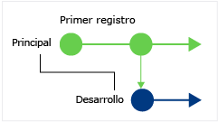
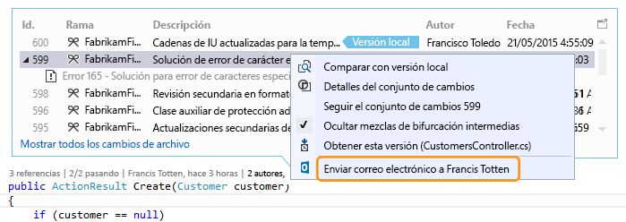
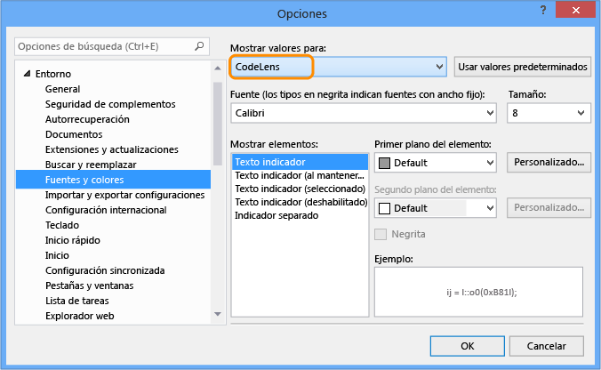
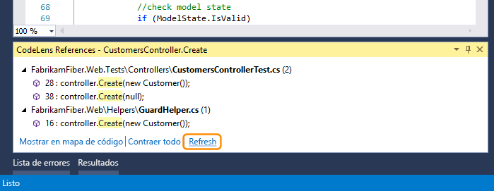

# Buscar cambios en el código y otro historial con CodeLens
Averigüe qué ocurrió con el código mientras sigue centrado en su trabajo sin dejar el editar. Busque referencias y cambios de código, errores vinculados, elementos de trabajo, revisiones de código y pruebas unitarias.  
  
> [!NOTE]
>  CodeLens solo está disponible en las ediciones Visual Studio Enterprise y Visual Studio Professional. No está disponible en la edición Visual Studio Community.  
  
 Vea dónde y cómo se usan las partes individuales del código de la solución:  
  
   
  
 Póngase en contacto con su equipo para informar de los cambios en el código sin salir del editor:  
  
   
  
 Para elegir qué indicadores desea ver, o para activar o desactivar CodeLens, vaya a **Herramientas**, **Opciones**, **Editor de texto**, **Todos los lenguajes**, **CodeLens**.  
  
##   Buscar referencias al código  
 Necesitará:  
  
-   Visual Studio Enterprise o Visual Studio Professional  
  
-   Código de Visual C# .NET o Visual Basic .NET  
  
 Elija el indicador **referencias** (**Alt + 2**). Si ve **0 referencias**, significa que no tiene ninguna referencia de código de Visual C# o Visual Basic. Esto no incluye referencias de otros elementos, como archivos XAML y ASPX.  
  
   
  
 Para ver el código de referencia, mueva el ratón sobre la referencia:  
  
   
  
 Para abrir el archivo que contiene la referencia, haga doble clic en la referencia.  
  
 Para ver las relaciones entre este código y sus referencias, [cree un mapa de código](../modeling/map-dependencies-across-your-solutions.md) y seleccione **Mostrar todas las referencias** en el menú contextual del mapa de código.  
  
   
  
##   Buscar el historial del código y los elementos vinculados  
 Revise el historial del código para averiguar qué ocurrió. O bien, revise esos cambios antes de combinarlos con su código para saber cómo los cambios de otras bifurcaciones podrían afectarlo.  
  
 Necesitará:  
  
-   Visual Studio Enterprise o Visual Studio Professional  
  
-   Team Foundation Server 2013 o versiones posteriores, Visual Studio Team Services o Git.  
  
-   [Lync 2010 o posterior o Skype Empresarial](http://technet.microsoft.com/en-us/lync)para ponerse en contacto con su equipo desde el editor de código  
  
 Para el código de Visual C# .NET o Visual Basic .NET que está almacenado con control de versiones de Team Foundation (TFVC) o Git, los detalles de CodeLens se obtienen en los niveles de clase y método (indicadores*code-element-level* ). Si el repositorio Git está hospedado en TfGit, también obtendrá vínculos a elementos de trabajo TFS.  
  
   
  
 Para los demás tipos de archivos que se pueden abrir en el editor de Visual Studio, los detalles de CodeLens se obtienen para todo el archivo en un mismo lugar, en la parte inferior de la ventana (indicadores de*nivel de archivo* ).  
  
   
  
 Para seleccionar los indicadores con el teclado, mantenga pulsada la tecla **ALT** para mostrar las teclas numéricas relacionadas.  
  
   
  
### Buscar cambios en el código  
 Vea quién modificó su código C# o Visual Basic, así como los cambios que se realizaron, en los indicadores de nivel de elemento de código. Esto es lo que se ve cuando se usa el control de versiones de Team Foundation (TFVC) en Team Foundation Server o Visual Studio Team Services.  
  
   
  
 El período de tiempo predeterminado son los últimos 12 meses. Para cambiar el código si se almacena en Team Foundation Server, ejecute el [comando TFSConfig](http://msdn.microsoft.com/en-us/94424190-3b6b-4f33-a6b6-5807f4225b62) junto con el comando [CodeIndex](../ide/codeindex-command.md) y la marca **/indexHistoryPeriod** .  
  
 Para ver un historial detallado de todos los cambios, incluidos los de hace más de un año, elija **Mostrar todos los cambios de archivo**.  
  
   
  
 Esto abre la ventana Historial para los conjuntos de cambios.  
  
   
  
 Esto es lo que se ve cuando los archivos están en un repositorio Git y se elige el indicador de cambios en el nivel de elemento de código.  
  
   
  
 Busque los cambios realizados en todo un archivo (salvo en archivos de C# y Visual Basic) en los indicadores de nivel de archivo de la parte inferior de la ventana.  
  
   
  
 Para obtener más detalles sobre un cambio, haga clic con el botón secundario en ese elemento. En función de si está usando TFVC o Git, obtendrá una serie de opciones para comparar las versiones del archivo, ver detalles y realizar el seguimiento del conjunto de cambios, obtener la versión seleccionada del archivo y enviar un correo electrónico al autor del cambio. Algunos de estos detalles aparecen en Team Explorer.  
  
 También puede ver quién cambió el código a lo largo del tiempo. Esto puede ayudarle a identificar patrones en los cambios de su equipo y a evaluar su impacto.  
  
   
  
#### Buscar cambios en la bifurcación actual  
 Suponga que su equipo tiene varias bifurcaciones, una bifurcación Main y una Development secundaria, para reducir el riesgo de que el código estable se interrumpa:  
  
   
  
 Averigüe cuántas personas realizaron cambios en el código y cuántos cambios se realizaron (**Alt + 6**) en la bifurcación Main:  
  
   
  
#### Buscar cuándo se bifurcó el código  
 Vaya al código de la bifurcación secundaria, por ejemplo, la bifurcación Dev aquí. Elija el indicador de cambios (**Alt + 6**):  
  
   
  
#### Buscar cambios entrantes de otras bifurcaciones  
   
  
 …como esta corrección de errores en la bifurcación Dev que se muestra aquí:  
  
   
  
 Puede revisar este cambio sin salir de la bifurcación actual (Main):  
  
   
  
#### Buscar cuándo se combinan los cambios  
 De este modo puede ver los cambios incluidos en la bifurcación:  
  
   
  
 Por ejemplo, el código de la bifurcación Main ahora incluye la corrección de errores de la bifurcación Dev:  
  
   
  
#### Comparar un cambio entrante con la versión local (Mayús + F10)  
   
  
 También puede hacer doble clic en el conjunto de cambios.  
  
#### ¿Qué significan los iconos?  
  
|**Iconos**|**¿De dónde procede el cambio?**|  
|--------------|-----------------------------------------|  
||La bifurcación actual|  
||La bifurcación primaria|  
||Una bifurcación secundaria|  
||Una bifurcación del mismo nivel|  
||Una bifurcación más alejada que una primaria, secundaria o del mismo nivel|  
||Una combinación de la bifurcación primaria y una bifurcación secundaria|  
||Una combinación de una bifurcación secundaria con la bifurcación secundaria|  
||Una combinación de una bifurcación no relacionada (combinación sin base)|  
  
### Buscar elementos de trabajo vinculados  
   
  
### Buscar revisiones de código vinculadas  
   
  
### Buscar errores vinculados  
   
  
### Ponerse en contacto con el propietario de un elemento  
   
  
 Abra el menú contextual de un elemento para ver las opciones de contacto. Si tiene Lync o Skype Empresarial instalado, verá estas opciones:  
  
   
  
##   Buscar pruebas unitarias para el código  
 Obtenga más información sobre las pruebas unitarias que existen para el código sin tener que abrir el Explorador de pruebas. Necesitará:  
  
-   Visual Studio Enterprise o Visual Studio Professional  
  
-   Código de Visual C# .NET o Visual Basic .NET  
  
-   Un [proyecto de prueba unitaria](../test/unit-test-your-code.md) con pruebas unitarias para el código de aplicación  
  
1.  Vaya a código de la aplicación que tenga pruebas unitarias.  
  
2.  Revise las pruebas para ese código (**Alt + 3**).  
  
       
  
3.  Si ve un icono de advertencia , ejecute las pruebas.  
  
       
  
4.  Para revisar la definición de una prueba, haga doble clic en el elemento de prueba en la ventana de indicador de CodeLens para abrir el archivo de código en el editor.  
  
       
  
5.  Revise los resultados de la prueba. Pulse el indicador de estado de la prueba ( o ), o presione **Alt + 1**.  
  
       
  
6.  Para ver cuántas personas cambiaron esta prueba, quién la cambió o cuántos cambios se realizaron, [Busque el historial del código y los elementos vinculados](#FindCodeHistory).  
  
##   Preguntas y respuestas  
  
###   P: ¿Cómo activo o desactivo CodeLens? O bien, ¿cómo elijo qué indicadores se ven?  
 **R:**  Puede activar o desactivar todos los indicadores, excepto el indicador de referencias. Vaya a **Herramientas**, **Opciones**, **Editor de texto**, **Todos los idiomas**, **CodeLens**.  
  
 Cuando se activen los indicadores, también podrá abrir las opciones de CodeLens desde estos.  
  
   
  
 Active o desactive los indicadores de nivel de archivo de CodeLens con los iconos de botón de contenido adicional de la parte inferior de la ventana del editor.  
  
   
  
###   P: ¿Dónde está CodeLens?  
 **R:** CodeLens aparece en el código de Visual C# .NET y Visual Basic .NET, en el nivel de método, de clase, de indexador y de propiedad. CodeLens aparece en el nivel de archivo para todos los demás tipos de archivos.  
  
-   Asegúrese de que CodeLens esté activado. Vaya a **Herramientas**, **Opciones**, **Editor de texto**, **Todos los idiomas**, **CodeLens**.  
  
-   Si el código está almacenado en TFS, asegúrese de que la indización de código esté activada. Para ello, use el [comando CodeIndex](../ide/codeindex-command.md) con el [comando TSF Config](http://msdn.microsoft.com/en-us/94424190-3b6b-4f33-a6b6-5807f4225b62).  
  
-   Los indicadores relacionados con TFS aparecen solo cuando los elementos de trabajo se vinculan al código y cuando tiene permisos para abrir los elementos de trabajo vinculados. [Confirme que tiene permisos de miembro del equipo.](http://msdn.microsoft.com/en-us/f58805de-ba61-4d09-8f2d-d3ab9662ecfd)  
  
-   Los indicadores de pruebas unitarias no aparecen cuando el código de la aplicación no tiene pruebas unitarias. Dichos indicadores aparecen automáticamente en los proyectos de prueba. Si sabe que el código de la aplicación tiene pruebas unitarias, pero los indicadores de prueba no aparecen, pruebe a compilar la solución (**Ctrl + Mayús + B**).  
  
### P: ¿Por qué no veo los detalles de los elementos de trabajo de una confirmación?  
 **R:** Esto podría deberse a que CodeLens no puede encontrar los elementos de trabajo en TFS. Compruebe que está conectado al proyecto de equipo que tenga esos elementos de trabajo y que tiene permisos para verlos. Esto también puede ocurrir si la descripción de confirmación tiene información incorrecta sobre los identificadores de los elementos de trabajo en TFS.  
  
###   P: ¿Por qué no se ven los indicadores de Lync o Skype?  
 **R:** No aparecen si no inició sesión en Lync o Skype Empresarial, si no tiene instalada ninguna de esas soluciones o si su configuración no es compatible. Pero podrá seguir enviando correo:  
  
   
  
 **¿Qué configuraciones de Lync o Skype se admiten?**  
  
-   Skype Empresarial (32 o 64 bits)  
  
-   Solo Lync 2010 o posterior (32 bits o 64 bits), pero no Lync Basic 2013 con Windows 8.1  
  
 CodeLens no admite tener instaladas distintas versiones de Lync o Skype. Puede que no estén localizadas para todas las versiones localizadas de Visual Studio.  
  
### P: ¿Cómo se cambian la fuente y el color de CodeLens?  
 **R:** Vaya a **Herramientas**, **Opciones**, **Entorno**, **Fuentes y colores**.  
  
   
  
 Para usar el teclado:  
  
1.  Presione **Alt + T + O** para abrir el cuadro **Opciones** .  
  
2.  Presione **Flecha arriba** o **Flecha abajo** para ir al nodo **Entorno** y, a continuación, presione **Flecha izquierda** para expandir el nodo.  
  
3.  Presione **Flecha abajo** para ir a **Fuentes y colores**.  
  
4.  Presione **TAB** para ir a la lista **Mostrar valores para** y, a continuación, presione **Flecha abajo** para seleccionar **CodeLens**.  
  
### P: ¿Se puede mover la pantalla de aviso de CodeLens?  
 **A:** Sí, seleccione  para acoplar CodeLens como una ventana.  
  
   
  
   
  
### P: ¿Cómo se actualizan los indicadores?  
 **R:** Esto depende del indicador:  
  
-   **Referencias**: este indicador se actualiza automáticamente cuando cambia el código. Si tiene este indicador acoplado como una ventana independiente, actualice el indicador manualmente aquí:  
  
       
  
-   **Equipo**: actualice estos indicadores manualmente aquí:  
  
       
  
-   **Prueba**: [Busque pruebas unitarias para el código](#FindRunUnitTests) para actualizar este indicador.  
  
###   P: ¿Qué es la "Versión local"?  
 **R:** La flecha **Versión local** apunta al conjunto de cambios más reciente de la versión local de este archivo. Cuando el servidor tiene conjuntos de cambios más recientes, estos aparecen encima o debajo de la flecha **Versión local** , según el orden usado para ordenar los conjuntos de cambios.  
  
### P: ¿Puedo administrar cómo CodeLens procesa código para mostrar el historial y los elementos vinculados?  
 **R:** Sí, si el código está en TFS, use el [comando CodeIndex](../ide/codeindex-command.md) con el [comando TSF Config](http://msdn.microsoft.com/en-us/94424190-3b6b-4f33-a6b6-5807f4225b62).
