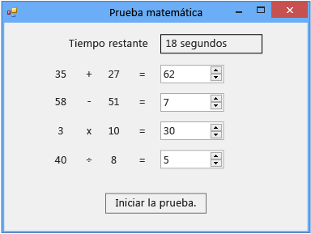

# Paso 7: Agregar problemas de multiplicaci&#243;n y divisi&#243;n
[!INCLUDE[vs2017banner](../code-quality/includes/vs2017banner.md)]

En la séptima parte de este tutorial, agregará los problemas de multiplicación y división, pero primero piense en cómo realizar ese cambio.  Piense en el paso inicial, que requiere almacenar valores.  
  
### Para agregar problemas de multiplicación y división  
  
1.  Agregue cuatro variables de entero más al formulario.  
  
     [!code-vb[VbExpressTutorial3Step7#15](../ide/codesnippet/VisualBasic/step-7-add-multiplication-and-division-problems_1.vb)]
     [!code-cs[VbExpressTutorial3Step7#15](../ide/codesnippet/CSharp/step-7-add-multiplication-and-division-problems_1.cs)]  
  
2.  Tal como hizo antes, modifique el método `StartTheQuiz()` para rellenar los problemas de multiplicación y división con números aleatorios.  
  
     [!code-vb[VbExpressTutorial3Step7#16](../ide/codesnippet/VisualBasic/step-7-add-multiplication-and-division-problems_2.vb)]
     [!code-cs[VbExpressTutorial3Step7#16](../ide/codesnippet/CSharp/step-7-add-multiplication-and-division-problems_2.cs)]  
  
3.  Modifique el método `CheckTheAnswer()` para que también compruebe los problemas de multiplicación y división.  
  
     [!code-vb[VbExpressTutorial3Step7#17](../ide/codesnippet/VisualBasic/step-7-add-multiplication-and-division-problems_3.vb)]
     [!code-cs[VbExpressTutorial3Step7#17](../ide/codesnippet/CSharp/step-7-add-multiplication-and-division-problems_3.cs)]  
  
     Dado que no resulta fácil escribir el signo de multiplicación \(×\) y el signo de división \(÷\) mediante el teclado, Visual C\# y Visual Basic aceptan el asterisco \(\*\) para la multiplicación y la barra diagonal \(\/\) para la división.  
  
4.  Cambie la última parte del controlador de evento Tick del temporizador para que rellene la respuesta correcta cuando se agote el tiempo.  
  
     [!code-vb[VbExpressTutorial3Step7#23](../ide/codesnippet/VisualBasic/step-7-add-multiplication-and-division-problems_4.vb)]
     [!code-cs[VbExpressTutorial3Step7#23](../ide/codesnippet/CSharp/step-7-add-multiplication-and-division-problems_4.cs)]  
  
5.  Guarde y ejecute el programa.  
  
     Los jugadores deben responder a cuatro problemas para completarla, como se muestra en la ilustración siguiente.  
  
       
Prueba matemática con cuatro problemas  
  
### Para continuar o revisar  
  
-   Para ir al siguiente paso del tutorial, vea [Paso 8: Personalizar la prueba](../ide/step-8-customize-the-quiz.md).  
  
-   Para volver al paso anterior del tutorial, vea [Paso 6: Agregar un problema de resta](../ide/step-6-add-a-subtraction-problem.md).