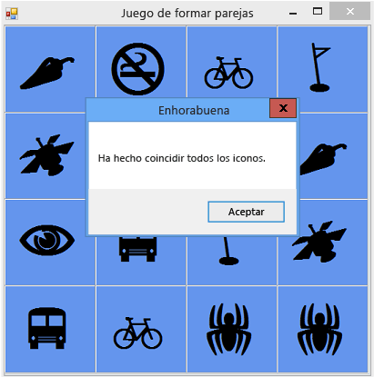

# Paso 8: Agregar un método para comprobar si el jugador ganó
Ha creado un juego divertido, pero necesita un elemento adicional para terminarlo. El juego debe finalizar cuando el jugador gana, de modo que necesita agregar un método `CheckForWinner()` para comprobar si el jugador ha ganado.

## Para agregar un método que compruebe si el jugador ganó

1.  Agregue un método `CheckForWinner()` al final del código, debajo del controlador de eventos `timer1_Tick()`, como se muestra en el código siguiente.

     [!code-csharp[VbExpressTutorial4Step8#10](../ide/codesnippet/CSharp/step-8-add-a-method-to-verify-whether-the-player-won_1.cs)]
     [!code-vb[VbExpressTutorial4Step8#10](../ide/codesnippet/VisualBasic/step-8-add-a-method-to-verify-whether-the-player-won_1.vb)]

     El método utiliza otro bucle `foreach` en Visual C# o `For Each` en Visual Basic para recorrer cada etiqueta de <xref:System.Windows.Forms.TableLayoutPanel>. Usa el operador de igualdad (`==` en Visual C# y `=` en Visual Basic) para comprobar el color del icono de cada etiqueta y si coincide con el fondo. Si los colores coinciden, el icono sigue siendo invisible y el jugador no ha hallado las parejas de los iconos restantes. En ese caso, el programa utiliza una instrucción `return` para omitir el resto del método. Si el bucle pasa por todas las etiquetas sin ejecutar la instrucción `return`, indica que se han logrado hallar todas las parejas de iconos del formulario. El programa muestra un control MessageBox para felicitar al participante y después llama al método `Close()` del formulario para finalizar el juego.

2.  A continuación, haga que el controlador del evento `CheckForWinner()` de la etiqueta llame al nuevo método <xref:System.Windows.Forms.Control.Click>. Asegúrese de que el programa comprueba si existe un ganador inmediatamente después de mostrar el segundo icono que el jugador elige. Busque la línea donde estableció el color del segundo icono elegido y llame al método `CheckForWinner()` inmediatamente después, tal como se muestra en el siguiente código.

     [!code-csharp[VbExpressTutorial4Step8#11](../ide/codesnippet/CSharp/step-8-add-a-method-to-verify-whether-the-player-won_2.cs)]
     [!code-vb[VbExpressTutorial4Step8#11](../ide/codesnippet/VisualBasic/step-8-add-a-method-to-verify-whether-the-player-won_2.vb)]

3.  Guarde y ejecute el programa. Reproduzca el juego y halle las coincidencias de todos los iconos. Al ganar, el programa muestra un elemento **MessageBox** de felicitación (tal como se muestra en la siguiente imagen) y, a continuación, cierra el cuadro.

     
**Juego de formar parejas** con **MessageBox**

## Para continuar o revisar

-   Para ir al siguiente paso del tutorial, vea [Paso 9: Probar otras características](../ide/step-9-try-other-features.md).

-   Para volver al paso anterior del tutorial, vea [Paso 7: Mantener visibles los pares](../ide/step-7-keep-pairs-visible.md).
