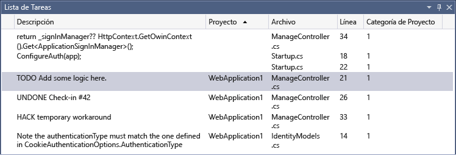

# <a name="using-the-task-list"></a>Usar la Lista de tareas

Use la **Lista de tareas** para hacer un seguimiento de los comentarios de código que usan tokens como `TODO` y `HACK`(o tokens personalizados) y administrar los accesos directos que le llevarán directamente a una ubicación predefinida del código. Haga clic en el elemento de la lista para ir a su ubicación en el código fuente.

## <a name="the-task-list-window"></a>La ventana Lista de tareas

Cuando la ventana **Lista de tareas** está abierta, aparece en la parte inferior de la ventana de la aplicación.

### <a name="to-open-the-task-list"></a>Para abrir la Lista de tareas

- En el menú **Ver**, elija **Lista de tareas** (teclado: CTRL+\\, T).

    

### <a name="to-change-the-sort-order-of-the-list"></a>Para cambiar el criterio de ordenación de la lista

- Haga clic en el encabezado de cualquier columna. Para refinar los resultados de la búsqueda, presione la tecla Mayúsculas y haga clic en otro encabezado de columna.

     Como alternativa, en el menú contextual, elija **Ordenar por**y elija un encabezado. Para refinar los resultados de la búsqueda, presione la tecla Mayúsculas y elija un segundo encabezado de columna.

### <a name="to-show-or-hide-columns"></a>Para mostrar u ocultar columnas

- En el menú contextual, elija **Mostrar columnas**. Elija las columnas que desee mostrar u ocultar.

### <a name="to-change-the-order-of-the-columns"></a>Para cambiar el orden de las columnas

- Arrastre cualquier encabezado de columna hasta la ubicación que desee.

## <a name="user-tasks"></a>Tareas de usuario

La característica de tareas de usuario se retiró en Visual Studio 2015 y versiones posteriores. Cuando se abre una solución que tiene datos de tareas de usuario de Visual Studio 2013 y versiones anteriores, dichos datos no se verán afectados en el archivo .suo, pero las tareas de usuario no se mostrarán en la lista de tareas.

Si desea seguir teniendo acceso y actualizar los datos de tareas de usuario, debe abrir el proyecto en Visual Studio 2013 y copiar el contenido de las tareas de usuario en la herramienta de administración de proyecto preferido (por ejemplo, Team Foundation Server).

## <a name="tokens-and-comments"></a>Tokens y comentarios

Un comentario en el código precedido de un marcador de comentario y un token predefinido aparecerán en la ventana **Lista de tareas** . Por ejemplo, el siguiente comentario de C# tiene tres partes distintas:

- El marcador de comentario (`//`)

- El token, por ejemplo (`TODO`)

- El comentario (el resto del texto)

```csharp
// TODO: Load state from previously suspended application
```

Dado que `TODO` es un token predefinido, este comentario aparece como una tarea `TODO` en la lista.

###  <a name="customTokens"></a> Tokens personalizados

De forma predeterminada, Visual Studio incluye los tokens siguientes: HACK, TODO, UNDONE, NOTE. Estos no distinguen mayúsculas de minúsculas.

También puede crear tokens propios personalizados.

#### <a name="to-create-a-custom-token"></a>Para crear un token personalizado

1. En el menú **Herramientas** , elija **Opciones**.

2. Abra la carpeta **Entorno** y, a continuación, elija **Lista de tareas**.

     Se muestra la [página Opciones de la lista de tareas](../ide/reference/task-list-environment-options-dialog-box.md).

     

3. En la categoría **Tokens** , en el cuadro de texto **Nombre** , escriba el nombre del token; por ejemplo, "BUG".

4. En la lista desplegable **Prioridad** , elija una prioridad predeterminada para el nuevo token. Elija el botón de **Agregar** .

###  <a name="cppComments"></a> Comentarios TODO en C++

De forma predeterminada, los comentarios TODO en C++ no se muestran en la ventana **Lista de tareas** . Esto se puede cambiar:

#### <a name="to-turn-off-c-todo-comments"></a>Para desactivar los comentarios TODO en C++

En el menú **Herramientas**, elija **Opciones** > **Editor de texto** > **C/C++** > **Vista** > **Enumerar tareas de comentario** y establezca el valor en false.

## <a name="shortcuts"></a>Accesos directos

Un *acceso directo* es un marcador en el código al que se le realiza el seguimiento en la **Lista de tareas**; su icono es diferente al de los marcadores normales. Haga doble clic en el acceso directo en la **Lista de tareas** para ir a la ubicación correspondiente en el código.


### <a name="to-create-a-shortcut"></a>Para crear un acceso directo

Para crear un acceso directo, inserte el puntero donde quiera colocar un acceso directo en el código. Elija **Edición** > **Marcadores** > **Agregar acceso directo de la Lista de tareas** o presione **CTRL** + **K**, **CTRL** + **H**.

Para navegar por los accesos directos en el código, elija un acceso directo de la lista y, después, elija **Tarea siguiente** o **Tarea anterior** en el menú contextual.

## <a name="see-also"></a>Vea también

[Lista de tareas, Entorno, Opciones (Cuadro de diálogo)](../ide/reference/task-list-environment-options-dialog-box.md)