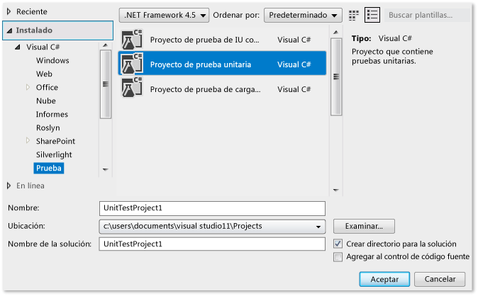
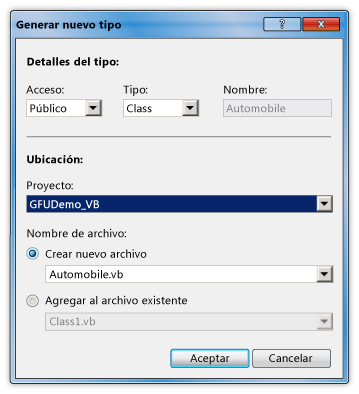
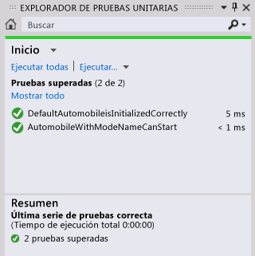

# Tutorial: Compatibilidad del desarrollo de pruebas en primer lugar con la caracter&#237;stica de generaci&#243;n a partir del uso
[!INCLUDE[vs2017banner](../code-quality/includes/vs2017banner.md)]

En este tema se muestra cómo usar la característica [Generar a partir del uso](../misc/generate-from-usage.md) que admite el desarrollo de prueba previa.  
  
 El *desarrollo de prueba previa* es un enfoque de diseño de software en el que primero se escriben pruebas unitarias basadas en las especificaciones del producto y, a continuación, se escribe el código fuente que se necesita para que las pruebas se realicen correctamente.[!INCLUDE[vsprvs](../code-quality/includes/vsprvs_md.md)] admite el desarrollo de prueba previa mediante la generación de nuevos tipos y miembros en el código fuente al hacerles referencia en los casos de prueba, antes de que se definan.  
  
 [!INCLUDE[vsprvs](../code-quality/includes/vsprvs_md.md)] genera los nuevos tipos y miembros con una interrupción mínima del flujo de trabajo. Puede crear códigos auxiliares para tipos, métodos, propiedades, campos o constructores sin abandonar su ubicación actual en el código. Al abrir un cuadro de diálogo para especificar opciones para la generación de tipos, el foco vuelve inmediatamente al archivo abierto actual cuando se cierra el cuadro de diálogo.  
  
 La característica Generar a partir del uso puede usarse con marcos de pruebas que se integran con [!INCLUDE[vsprvs](../code-quality/includes/vsprvs_md.md)]. En este tema se muestra el marco de pruebas unitarias de Microsoft.  
  
 [!INCLUDE[note_settings_general](../data-tools/includes/note_settings_general_md.md)]  
  
### Para crear un proyecto de biblioteca de clases de Windows y un proyecto de prueba  
  
1.  En [!INCLUDE[csprcs](../data-tools/includes/csprcs_md.md)] o [!INCLUDE[vbprvb](../code-quality/includes/vbprvb_md.md)], cree un nuevo proyecto de biblioteca de clases de Windows. Asígnele el nombre `GFUDemo_VB` o `GFUDemo_CS`, en función de qué lenguaje use.  
  
2.  En el **Explorador de soluciones**, haga clic con el botón derecho en el icono de la solución en la parte superior, elija **Agregar** y luego haga clic en **Nuevo proyecto**. En el cuadro de diálogo **Tipos de proyecto** del cuadro de diálogo **Nuevo proyecto**, haga clic en **Probar**.  
  
3.  En el panel **Plantillas** panel, haga clic en **Proyecto de prueba unitaria** y acepte el nombre predeterminado de UnitTestProject1. En la siguiente ilustración se muestra el cuadro de diálogo cuando aparece en [!INCLUDE[csprcs](../data-tools/includes/csprcs_md.md)]. En [!INCLUDE[vbprvb](../code-quality/includes/vbprvb_md.md)], el cuadro de diálogo es similar.  
  
       
Cuadro de diálogo Nuevo proyecto  
  
4.  Haga clic en **Aceptar** para cerrar el cuadro de diálogo **Nuevo proyecto**. Ahora está listo para empezar a escribir pruebas.  
  
### Para generar una nueva clase de una prueba unitaria  
  
1.  Un proyecto de prueba contiene un archivo denominado UnitTest1. Haga doble clic en este archivo en el **Explorador de soluciones** para abrirlo en el Editor de código. Se han generado una clase de prueba y un método de prueba.  
  
2.  Busque la declaración de la clase `UnitTest1` y cambie su nombre a `AutomobileTest`. En C\#, si un constructor `UnitTest1()` está presente, cambie su nombre a `AutomobileTest()`.  
  
    > [!NOTE]
    >  IntelliSense proporciona ahora dos alternativas para la finalización de instrucciones de IntelliSense: el *modo de finalización* y el *modo de sugerencia*. Use el modo de sugerencia para situaciones en que se usan clases y miembros antes de definirlos. Cuando se abre una ventana de IntelliSense, puede presionar CTRL\+ALT\+BARRA ESPACIADORA para alternar entre el modo de finalización y el modo de sugerencia. Vea [Utilizar IntelliSense](../ide/using-intellisense.md) para obtener más información. El modo de sugerencia le ayudará cuando escriba `Automobile` en el paso siguiente.  
  
3.  Busque el método `TestMethod1()` y cambie su nombre a `DefaultAutomobileIsInitializedCorrectly()`. En este método, cree una nueva instancia de una clase denominada `Automobile`, como se muestra en las siguientes ilustraciones. Aparece un subrayado ondulado que indica un error en tiempo de compilación y aparece una etiqueta inteligente bajo el nombre de tipo. La ubicación exacta de la etiqueta inteligente varía, en función de si usa [!INCLUDE[vbprvb](../code-quality/includes/vbprvb_md.md)] o [!INCLUDE[csprcs](../data-tools/includes/csprcs_md.md)].  
  
       
Visual Basic  
  
       
Visual C\#  
  
4.  Sitúe el puntero del mouse sobre la etiqueta inteligente para ver un mensaje de error que indica que ningún tipo denominado `Automobile` se ha definido todavía. Haga clic en la etiqueta inteligente o presione CTRL \+. \(CTRL\+punto\) para abrir el menú contextual Generar a partir del uso, como se muestra en las ilustraciones siguientes.  
  
       
Visual Basic  
  
       
Visual C\#  
  
5.  Ahora tiene dos opciones. Puede hacer clic en **Generar 'Class Automobile'** para crear un nuevo archivo en el proyecto de prueba y rellenarlo con una clase vacía denominada `Automobile`. Se trata de una forma rápida de crear una nueva clase en un nuevo archivo que tiene los modificadores de acceso predeterminados en el proyecto actual. También puede hacer clic en **Generar nuevo tipo** para abrir el cuadro de diálogo **Generar nuevo tipo**. Esto proporciona opciones que incluyen colocar la clase en un archivo existente y agregar el archivo a otro proyecto.  
  
     Haga clic en **Generar nuevo tipo** para abrir el cuadro de diálogo **Generar nuevo tipo** que se muestra en la siguiente ilustración. En la lista **Proyecto**, haga clic en **GFUDemo\_VB** o **GFUDemo\_CS** para indicar a [!INCLUDE[vsprvs](../code-quality/includes/vsprvs_md.md)] que agregue el archivo al proyecto de código fuente en lugar del proyecto de prueba.  
  
       
Cuadro de diálogo Generar nuevo tipo  
  
6.  Haga clic en **Aceptar** para cerrar el cuadro de diálogo y crear el nuevo archivo.  
  
7.  En **el Explorador de soluciones**, busque el nuevo archivo Automobile.vb o Automobile.cs para comprobar que se encuentra en el nodo del proyecto GFUDemo\_VB o GFUDemo\_CS. En el Editor de código, el foco aún está en `AutomobileTest.DefaultAutomobileIsInitializedCorrectly`. Puede continuar escribiendo su prueba con un mínimo de interrupción.  
  
### Para generar código auxiliar de propiedad  
  
1.  Supongamos que la especificación del producto indica que la clase `Automobile` tiene dos propiedades públicas denominadas `Model` y `TopSpeed`. El constructor predeterminado debe inicializar estas propiedades con los valores predeterminados `"Not specified"` y `-1`. La siguiente prueba unitaria comprobará que el constructor predeterminado establece las propiedades en sus valores predeterminados correctos.  
  
     Agregue la siguiente línea de código a `DefaultAutomobileIsInitializedCorrectly`.  
  
     [!CODE [VbTDDWalkthrough#1](../CodeSnippet/VS_Snippets_VBCSharp/vbtddwalkthrough#1)]  
  
     Dado que el código hace referencia a dos propiedades no definidas en `Automobile`, aparece una etiqueta inteligente. Haga clic en la etiqueta inteligente para `Model` y, a continuación, haga clic en **Generar código auxiliar de propiedad**. Genere código auxiliar de propiedad también para la propiedad `TopSpeed`.  
  
     En la clase `Automobile`, los tipos de las nuevas propiedades se infieren correctamente del contexto.  
  
     En la siguiente ilustración se muestra el menú contextual de la etiqueta inteligente.  
  
       
Visual Basic  
  
       
Visual C\#  
  
### Para buscar el código fuente  
  
1.  Use la característica **Navegar a** para navegar hasta el archivo de código fuente Automobile.cs o Automobile.vb para que pueda comprobar que se han generado las nuevas propiedades.  
  
     La característica **Navegar a** permite especificar rápidamente una cadena de texto, como un nombre de tipo o parte de un nombre, e ir a la ubicación deseada haciendo clic en el elemento de la lista de resultados.  
  
     Abra el cuadro de diálogo **Navegar a** haciendo clic en el Editor de código y presionando CTRL\+, \(CTRL\+coma\). En el cuadro de texto, escriba `automobile`. Haga clic en la clase **Automobile** en la lista y, a continuación, haga clic en **Aceptar**.  
  
     La ventana **Navegar a** se muestra en la siguiente ilustración.  
  
       
Ventana Navegar a  
  
### Para generar un código auxiliar para un nuevo constructor  
  
1.  En este método de prueba, generará código auxiliar de constructor que inicializará las propiedades `Model` y `TopSpeed` para que tengan los valores que especifique. Más adelante, agregará más código para completar la prueba. Agregue el siguiente método de prueba adicional a su clase `AutomobileTest`.  
  
     [!CODE [VbTDDWalkthrough#2](../CodeSnippet/VS_Snippets_VBCSharp/vbtddwalkthrough#2)]  
  
2.  Haga clic en la etiqueta inteligente bajo el nuevo constructor de clase y, a continuación, haga clic en **Generar código auxiliar de constructor**. En el archivo de clase `Automobile`, observe que el nuevo constructor ha examinado los nombres de las variables locales que se usan en la llamada al constructor, ha encontrado propiedades que tienen los mismos nombres en la clase `Automobile` y el código proporcionado en el cuerpo del constructor para almacenar los valores de argumento en las propiedades `Model` y `TopSpeed`. \(En [!INCLUDE[vbprvb](../code-quality/includes/vbprvb_md.md)], los campos `_model` y `_topSpeed` en el nuevo constructor son los campos de copia de seguridad definidos de forma implícita para las propiedades `Model` y `TopSpeed`\).  
  
3.  Después de generar el nuevo constructor, aparece un subrayado ondulado bajo la llamada al constructor predeterminado en `DefaultAutomobileIsInitializedCorrectly`. El mensaje de error indica que la clase `Automobile` no tiene ningún constructor que no tome ningún argumento. Para generar un constructor predeterminado explícito que no tenga parámetros, haga clic en la etiqueta inteligente y, a continuación, haga clic en **Generar código auxiliar de constructor**.  
  
### Para generar un código auxiliar para un método  
  
1.  Suponga que la especificación indica que un nuevo `Automobile` se puede poner en estado en ejecución si sus propiedades `Model` y `TopSpeed` se establecen en un valor distinto de los valores predeterminados. Agregue las líneas siguientes al método `AutomobileWithModelNameCanStart`.  
  
     [!CODE [VbTDDWalkthrough#3](../CodeSnippet/VS_Snippets_VBCSharp/vbtddwalkthrough#3)]  
  
2.  Haga clic en la etiqueta inteligente para la llamada de método `myAuto.Start` y, a continuación, haga clic en **Generar código auxiliar del método**.  
  
3.  Haga clic en la etiqueta inteligente para la propiedad `IsRunning` y, a continuación, haga clic en **Generar código auxiliar del método**. La clase `Automobile` contiene ahora el código siguiente.  
  
     [!CODE [VbTDDWalkthrough#4](../CodeSnippet/VS_Snippets_VBCSharp/vbtddwalkthrough#4)]  
  
### Para ejecutar las pruebas  
  
1.  En el menú **Prueba unitaria**, elija **Ejecutar pruebas unitarias** y, a continuación, haga clic en **Todas las pruebas**. Este comando ejecuta todas las pruebas en todos los marcos de pruebas escritos para la solución actual.  
  
     En este caso, hay dos pruebas y ambas finalizan con errores, como se esperaba. La prueba `DefaultAutomobileIsInitializedCorrectly` produce un error porque la condición `Assert.IsTrue` devuelve `False`. La prueba `AutomobileWithModelNameCanStart` produce un error porque el método `Start` de la clase `Automobile` emite una excepción.  
  
     La ventana **Navegar a** se muestra en la siguiente ilustración.  
  
       
Resultados de pruebas \(ventana\)  
  
2.  En la ventana **Resultados de pruebas**, haga doble clic en cada fila de resultados de pruebas para ir a la ubicación de cada error de prueba.  
  
### Para implementar el código fuente  
  
1.  Agregue el siguiente código al constructor predeterminado hasta que las propiedades `Model`, `TopSpeed` y `IsRunning` se inicialicen con sus valores predeterminados correctos de `"Not specified"`, `-1` y `True` \(`true`\).  
  
     [!CODE [VbTDDWalkthrough#5](../CodeSnippet/VS_Snippets_VBCSharp/vbtddwalkthrough#5)]  
  
2.  Cuando se llama al método `Start`, se debe establecer la marca `IsRunning` en true solo si las propiedades `Model` o `TopSpeed` se establecen en un valor distinto de su valor predeterminado. Quite `NotImplementedException` del cuerpo del método y agregue el código siguiente.  
  
     [!CODE [VbTDDWalkthrough#6](../CodeSnippet/VS_Snippets_VBCSharp/vbtddwalkthrough#6)]  
  
### Para ejecutar las pruebas de nuevo  
  
1.  En el menú **Probar**, elija **Ejecutar** y, a continuación, haga clic en **Todas las pruebas de la solución**. Esta vez las pruebas son correctas. La ventana **Navegar a** se muestra en la siguiente ilustración.  
  
       
Resultados de pruebas \(ventana\)  
  
## Vea también  
 [Generar a partir del uso](../misc/generate-from-usage.md)   
 [Escribir código](../ide/writing-code-in-the-code-and-text-editor.md)   
 [Utilizar IntelliSense](../ide/using-intellisense.md)   
 [Haga una prueba unitaria de su código](../test/unit-test-your-code.md)