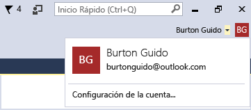
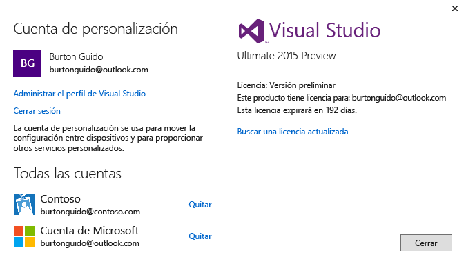

# Trabajar con varias cuentas de usuario

Si tiene varias cuentas de Microsoft y/o cuentas profesionales o educativas, puede agregarlas todas a Visual Studio para que pueda acceder a los recursos desde cualquier cuenta sin tener que iniciar sesión separadamente. En estos momentos, Azure, Application Insights, Team Foundation Server y los servicios de Office 365 admiten la experiencia de inicio de sesión simplificada. Más adelante pueden hacerse disponibles otros servicios.

Después de agregar varias cuentas en un equipo, el conjunto de cuentas lo acompañará si inicia sesión en Visual Studio desde otro equipo. Es importante tener en cuenta que, aunque los nombres de cuenta tienen movilidad, las credenciales no. Por lo tanto, se le pedirá que escriba las credenciales de las otras cuentas la primera vez que intente usar sus recursos en el nuevo equipo.

En este tutorial enseñamos a agregar varias cuentas de Visual Studio y a ver los recursos accesibles desde esas cuentas reflejados en sitios como el cuadro de diálogo **Agregar servicio conectado** , **Explorador de servidores**y **Team Explorer**.

## Iniciar sesión en Visual Studio

- Inicie sesión en Visual Studio con una cuenta Microsoft o una cuenta profesional. Debería ver su nombre de usuario en la esquina superior de la ventana, tal como se muestra a continuación:

     

### Obtener acceso a su cuenta de Azure en el Explorador de servidores

Presione **Ctrl + Alt + S** para abrir **Explorador de servidores**. Pulse el icono de Azure y, cuando se expanda, debería ver los recursos disponibles en la cuenta de Azure que está asociada con el identificador que ha usado para iniciar sesión en Visual Studio. Debe aparecer algo parecido a lo que se muestra a continuación (con la excepción de que verá sus propios recursos).

La primera vez que use Visual Studio en cualquier dispositivo específico, el cuadro de diálogo solo mostrará las suscripciones registradas en el Id. con el que ha iniciado sesión en el IDE. Puede acceder a los recursos de cualquiera de las demás cuentas directamente desde el **Explorador de servidores** : haga clic con el botón secundario en el nodo de Azure, elija **Administrar y filtrar suscripciones** y, luego, agregue las cuentas desde el control de selector de cuenta. Si lo desea, después puede elegir otra cuenta haciendo clic en la flecha hacia abajo y eligiendo en la lista de cuentas. Después de elegir la cuenta, puede indicar qué suscripciones de esa cuenta desea mostrar en el Explorador de servidores.

La próxima vez que abra el Explorador de servidores, se mostrarán los recursos de esas suscripciones.

### Obtener acceso a su cuenta de Azure a través del cuadro de diálogo Agregar servicio conectado

1. Cree un proyecto de aplicación para UWP en C#.

1. Pulse el nodo de proyecto en el Explorador de soluciones y, después, seleccione **Agregar, Servicio conectado**. Aparece el asistente **Agregar servicio conectado** con la lista de los servicios de la cuenta de Azure que está asociada con su id. de inicio de sesión de Visual Studio. No tiene que iniciar sesión por separado en Azure. Sin embargo, deberá iniciar sesión en las otras cuentas la primera vez que intente acceder a sus recursos desde un equipo determinado.

    > [!WARNING]
    > Si es la primera vez que va a crear una aplicación para UWP en Visual Studio en un equipo específico, se le pedirá que habilite el dispositivo para el modo de desarrollo. Para ello, vaya a **Configuración &#124; Actualizaciones y seguridad &#124; Para desarrolladores** en el equipo. Para obtener más información, vea [Habilitar el dispositivo para el desarrollo](/windows/uwp/get-started/enable-your-device-for-development).

###  Obtener acceso a Azure Active Directory en un proyecto web

Azure AD ofrece compatibilidad para el inicio de sesión único de usuario final en las aplicaciones web ASP.NET MVC o autenticación AD en los servicios web de API. La autenticación de dominio es diferente de la autenticación de cuentas de usuario individuales; los usuarios que tienen acceso a su dominio de Active Directory pueden usar sus cuentas de Azure AD existentes para conectarse a sus aplicaciones web. Las aplicaciones de Office 365 también pueden utilizar la autenticación de dominio. Para ver esto en funcionamiento, cree una aplicación web (**Archivo, Nuevo proyecto, C#, Nube, Aplicación web ASP.NET**). En el cuadro de diálogo Nuevo proyecto ASP.NET, elija **Cambiar autenticación**. El Asistente para autenticación aparece y le permite elegir qué tipo de autenticación se utilizará en la aplicación.

Para obtener más información sobre los diferentes tipos de autenticación en ASP.NET, vea [Creating ASP.NET Web Projects in Visual Studio 2013 (Crear proyectos web de ASP.NET en Visual Studio 2013)](http://www.asp.net/visual-studio/overview/2013/creating-web-projects-in-visual-studio#orgauth) (la información sobre autenticación sigue siendo pertinente para las versiones actuales de Visual Studio).

### Obtener acceso a la cuenta de Visual Studio Team Services

En el menú principal, pulse **Equipo, Conectar con Team Foundation Server** para mostrar la ventana **Team Explorer**. Haga clic en **Seleccionar proyectos de equipo**y luego, en el cuadro de lista, en **Seleccionar Team Foundation Server**, debería ver la dirección URL de su cuenta de Visual Studio Team Services. Cuando seleccione la dirección URL, se iniciará sesión sin tener que volver a escribir las credenciales.

## Agregar una segunda cuenta de usuario a Visual Studio

Haga clic en la flecha hacia abajo que hay al lado de su nombre de usuario en la esquina superior de Visual Studio. Luego, pulse el elemento de menú **Configuración de la cuenta**. Aparece el cuadro de diálogo **Administrador de cuentas** y muestra la cuenta con la que inició sesión. Pulse el vínculo **Agregar una cuenta** en la esquina inferior del cuadro de diálogo para agregar una cuenta de Microsoft o una cuenta profesional o educativa nuevas.

Siga los avisos para escribir las credenciales de la cuenta nueva. La ilustración siguiente muestra el Administrador de cuentas después de que un usuario haya agregado su cuenta profesional de Contoso.com.

## Volver a visitar el asistente Agregar servicios conectados y Explorador de servidores

Vaya ahora al **Explorador de servidores** y haga de nuevo doble clic en el nodo de Azure y elija **Administrar y filtrar suscripciones**. Elija la nueva cuenta, haga clic en la flecha desplegable junto a la cuenta actual y elija las suscripciones que desea mostrar en el Explorador de servidores. Debería ver todos los servicios asociados a la suscripción especificada. Aunque no tenga iniciada sesión en el IDE de Visual Studio con la segunda cuenta, ha iniciado sesión en los servicios y recursos de esa cuenta. Lo mismo sirve para **Proyecto, Agregar servicio conectado** y **Equipo, Conectar con Team Foundation Server**.

## Vea también

[Inicio de sesión en Visual Studio](signing-in-to-visual-studio.md)
