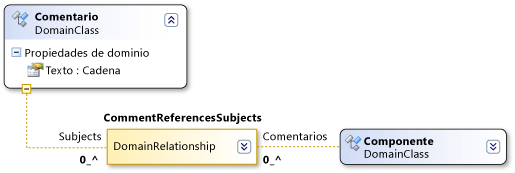

# Sintaxis de las rutas de dominio
Las definiciones de DSL usan una sintaxis del estilo de XPath para ubicar elementos específicos en un modelo.

 Normalmente no tiene que trabajar con esta sintaxis directamente. Cuando aparece en las ventanas DSL Details (Detalles de DSL) o Properties (Propiedades), puede hacer clic en la flecha hacia abajo y usar el editor de rutas. Sin embargo, la ruta aparece con este formato en el campo después de haber usado el editor.

 Una ruta de dominio adopta el formato siguiente:

 *¡RelationshipName.PropertyName/! Rol*

 

 La sintaxis atraviesa el árbol del modelo. Por ejemplo, la relación de dominio **CommentReferencesSubjects** en la ilustración anterior tiene un **asuntos** rol. El segmento de ruta de acceso **/! Subjectt** especifica que la ruta de acceso se ejecuta en los elementos que se tiene accesibles a través de la **asuntos** rol.

 Cada segmento comienza con el nombre de una relación de dominio. Si el recorrido es de un elemento a una relación, el segmento de ruta de acceso aparece como *Relationship.PropertyName*. Si el salto es de un vínculo a un elemento, aparece el segmento de ruta de acceso como *relación /! RoleName*.

 La sintaxis de una ruta se separa con barras inclinadas. Cada segmento de ruta es un salto desde un elemento a un vínculo (una instancia de una relación) o desde un vínculo a un elemento. Los segmentos de ruta suelen aparecer en parejas. Un segmento de ruta representa un salto desde un elemento a un vínculo, y el siguiente representa un salto desde el vínculo al elemento del otro extremo. (Un vínculo puede ser también origen o destino de una relación).

 El nombre que use para el salto elemento-vínculo es el valor de `Property Name` del rol. El nombre que use para el salto vínculo-elemento es el nombre del rol de destino.

## Vea también

- [Introducción a los modelos, las clases y las relaciones](../modeling/understanding-models-classes-and-relationships.md)