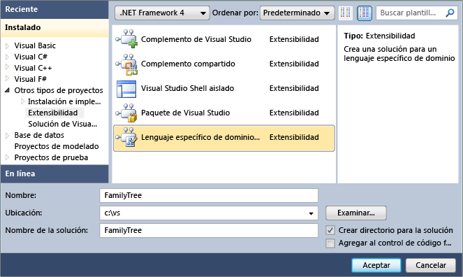
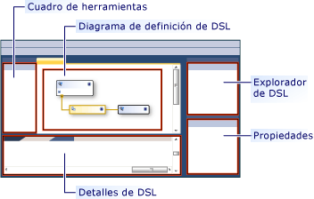
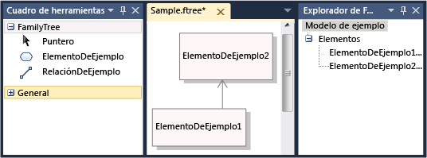
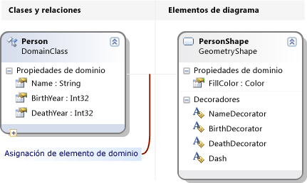
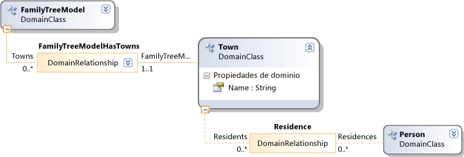
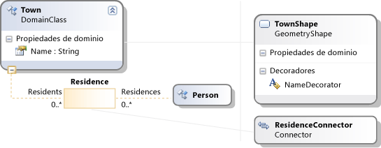

# <a name="getting-started-with-domain-specific-languages"></a>Introducción a los lenguajes específicos de dominio
Este tema explica los conceptos básicos de definición y uso de un lenguaje específico de dominio (DSL) creado con el SDK de modelado de Visual Studio.

> [!NOTE]
> En Visual Studio de 2017, el SDK de transformación de plantilla de texto y el SDK de modelado de Visual Studio se instalan automáticamente al instalar características específicas de Visual Studio. Para obtener más información, consulte [esta entrada de blog](https://blogs.msdn.microsoft.com/visualstudioalm/2016/12/12/the-visual-studio-modeling-sdk-is-now-available-with-visual-studio-2017/).

Si está familiarizado con DSL, recomendamos que trabaje a través de la **DSL herramientas laboratorio**, que encontrará en este sitio: [Visualizaton y SDK de modelado](http://go.microsoft.com/fwlink/?LinkID=186128)  
  
## <a name="what-can-you-do-with-a-domain-specific-language"></a>¿Qué puede hacer con un lenguaje específico de dominio?  
 Un lenguaje específico de dominio es una notación, normalmente gráfica, de que está diseñada para utilizarse para un propósito específico. Por el contrario, los lenguajes como UML son uso generales. En un DSL, puede definir los tipos de elemento de modelo y sus relaciones y cómo van a mostrar en la pantalla.  
  
 Al diseñar un DSL, puede distribuirla como parte de un paquete de extensión de integración de Visual Studio (VSIX). Los usuarios trabajan con DSL en Visual Studio:  
  
   
  
 La notación es solo una parte de un DSL. Junto con la notación, el paquete VSIX incluye herramientas que se pueden aplicar a los usuarios para ayudarles a editar y generar material de sus modelos.  
  
 Una de las aplicaciones principales de DSL consiste en generar código de programa, archivos de configuración y otros artefactos. Especialmente en proyectos grandes y líneas de productos, donde se creará varias variantes de un producto, generar muchos de los aspectos de la variable de DSL puede proporcionar un gran aumento de confiabilidad y una respuesta muy rápida a los cambios de requisitos.  
  
 El resto de esta información general es un tutorial que presenta las operaciones básicas de creación y uso de un lenguaje específico de dominio en Visual Studio.  
  
## <a name="prerequisites"></a>Requisitos previos  
 Para definir un DSL, debe tener instalados los siguientes componentes:  
  
|||  
|-|-|  
|Visual Studio|[http://go.microsoft.com/fwlink/?LinkId=185579](http://go.microsoft.com/fwlink/?LinkId=185579)|  
|[!INCLUDE[vssdk_current_short](../modeling/includes/vssdk_current_short_md.md)]|[http://go.microsoft.com/fwlink/?LinkId=185580](http://go.microsoft.com/fwlink/?LinkId=185580)|  
|Modelado del SDK para Visual Studio||  


[!INCLUDE[modeling_sdk_info](includes/modeling_sdk_info.md)]

  
## <a name="creating-a-dsl-solution"></a>Crear una solución DSL  
 Para crear un nuevo lenguaje específico de dominio, crea una nueva solución de Visual Studio mediante la plantilla de proyecto de lenguaje específico de dominio.  
  
#### <a name="to-create-a-dsl-solution"></a>Para crear una solución de DSL  
  
1.  En el menú **Archivo** , elija **Nuevo**y haga clic en **Proyecto**.  
  
2.  En **tipos de proyecto**, expanda la **otros tipos de proyectos** nodo y haga clic en **extensibilidad**.  
  
3.  Haga clic en **Diseñador de lenguaje específico de dominio**.  
  
       
  
4.  En el **nombre** , escriba **árbol genealógico**. Haga clic en **Aceptar**.  
  
     El **Asistente de lenguaje específico de dominio** abre y muestra una lista de soluciones DSL de plantilla.  
  
     Haga clic en cada plantilla para ver una descripción  
  
     Las plantillas son útiles puntos de partida. Cada uno de ellos proporciona una completa ADSL, que se puede modificar para satisfacer sus necesidades. Por lo general, deberá elegir la plantilla más cercano que desea crear.  
  
5.  En este tutorial, elija la **lenguaje mínimo** plantilla.  
  
6.  Escriba una extensión de nombre de archivo para su DSL en la página del asistente correspondiente. Esta es la extensión que usarán los archivos que contienen instancias de su DSL.  
  
    -   Elija una extensión que no está asociada a ninguna aplicación en el equipo o en cualquier equipo donde desea instalar el ADSL. Por ejemplo, **docx** y **htm** sería inaceptable archivo extensiones de nombre.  
  
    -   El asistente le advertirá en caso de que la extensión que haya especificado se esté usando como un DSL. Piense en usar una extensión de nombre de archivo diferente. También puede restablecer la instancia de Visual Studio SDK Experimental para borrar antiguos diseñadores experimentales. Haga clic en **iniciar**, haga clic en **todos los programas**, **Microsoft Visual Studio 2010 SDK**, **herramientas**y, a continuación, **restablecer Microsoft Instancia Visual Studio 2010 Experimental**.  
  
7.  Inspeccionar las otras páginas y, a continuación, haga clic en **finalizar**.  
  
     Se genera una solución que contiene dos proyectos. Se denominan Dsl y DslPackage. Es decir, un archivo de diagrama abre DslDefinition.dsl con nombre.  
  
    > [!NOTE]
    >  La mayoría del código que puede ver en las carpetas de los dos proyectos se genera a partir de DslDefinition.dsl. Por este motivo, se realizan modificaciones mayoría para ADSL en este archivo.  
  
 Ahora, la interfaz de usuario es similar a la imagen siguiente.  
  
   
  
 Esta solución define un lenguaje específico de dominio. Para obtener más información, consulte [información general de la interfaz de usuario de herramientas de lenguaje específico de dominio](../modeling/overview-of-the-domain-specific-language-tools-user-interface.md).  
  
## <a name="the-important-parts-of-the-dsl-solution"></a>Las partes importantes de la solución DSL  
 Tenga en cuenta los siguientes aspectos de la nueva solución.  
  
-   **Dsl\DslDefinition.DSL** éste es el archivo que aparece cuando se crea una solución DSL. Casi todo el código de la solución se genera a partir de este archivo y la mayoría de los cambios realizados en una definición DSL se realice aquí. Para obtener más información, consulte trabajo con el [trabajar con el diagrama de definición DSL](../modeling/working-with-the-dsl-definition-diagram.md).  
  
-   **Proyecto de DSL** este proyecto contiene código que define el lenguaje específico de dominio.  
  
-   **Proyecto DslPackage** este proyecto contiene código que permite las instancias de DSL para abrir y editar en Visual Studio.  
  
##  <a name="Debugging"></a>Ejecuta DSL  
 Puede ejecutar la solución DSL tan pronto como se ha creado. Más adelante, puede modificar la definición DSL gradualmente, ejecutando la solución de nuevo después de cada cambio.  
  
#### <a name="to-experiment-with-the-dsl"></a>Para experimentar con DSL  
  
1.  Haga clic en **Transformar todas las plantillas** en la barra de herramientas del explorador de soluciones. Esto vuelve a generar la mayoría del código fuente de DslDefinition.dsl.  
  
    > [!NOTE]
    >  Cada vez que cambie DslDefinition.dsl, debe hacer clic en **Transformar todas las plantillas** antes de volver a generar la solución. Este paso se puede automatizar. Para obtener más información, consulte [cómo automatizar Transformar todas las plantillas](http://msdn.microsoft.com/b63cfe20-fe5e-47cc-9506-59b29bca768a).
  
2.  Presione F5, o bien, en la **depurar** menú, haga clic en **Iniciar depuración**.  
  
     Compilaciones de DSL y está instalado en la instancia experimental de Visual Studio.
  
     Inicia una instancia experimental de Visual Studio. La instancia experimental toma su configuración de un subárbol del registro, donde se registran las extensiones de Visual Studio para fines de depuración independiente. Instancias normales de Visual Studio no tiene acceso a las extensiones registradas no existe.  
  
3.  En la instancia experimental de Visual Studio, abra el archivo de modelo denominado **prueba** de **el Explorador de soluciones**.  
  
     \- o -  
  
     Haga clic en el proyecto de depuración, seleccione **agregar**y, a continuación, haga clic en **elemento**. En el **Agregar elemento** cuadro de diálogo, seleccione el tipo de archivo del ADSL.  
  
     Se abre el archivo de modelo como un diagrama en blanco.  
  
     El cuadro de herramientas se abre y muestra herramientas apropiadas para el tipo de diagrama.  
  
4.  Usar las herramientas para crear formas y conectores en el diagrama.  
  
    1.  Para crear formas, arrastre desde la herramienta de forma de ejemplo en el diagrama.  
  
    2.  Para conectar dos formas, haga clic en la herramienta Conector de ejemplo, haga clic en la primera forma y, a continuación, haga clic en la segunda forma.  
  
5.  Haga clic en las etiquetas de las formas para cambiarlos.  
  
 El Visual Studio experimental se parecerán al ejemplo siguiente:  
  
   
  
### <a name="the-content-of-a-model"></a>El contenido de un modelo  
 El contenido de un archivo que es una instancia de un DSL se denomina un *modelo*. El modelo contiene *modelo ** elementos* y *vínculos* entre los elementos. La definición DSL especifica qué tipos de elementos del modelo y vínculos pueden estar en el modelo. Por ejemplo, en un DSL creado a partir de la plantilla de idioma mínima, hay un tipo de elemento de modelo y un tipo de vínculo.  
  
 La definición DSL puede especificar cómo aparece el modelo en un diagrama. Puede elegir entre una variedad de estilos de formas y conectores. Puede especificar que algunas formas aparecen dentro de otras formas.  
  
 Puede ver un modelo como un árbol en el **explorador** ver mientras se está editando un modelo. Cuando se agregan formas al diagrama, los elementos del modelo también aparecen en el explorador. El explorador se puede utilizar incluso si no hay ningún diagrama.  
  
 Si no ve el explorador en la instancia de depuración de Visual Studio, en el **vista** menú, seleccione **otras ventanas**y, a continuación, haga clic en  *\<su idioma >* **Explorer**.  
  
### <a name="the-api-of-your-dsl"></a>La API del ADSL  
 ADSL genera una API que permite leer y actualizar los modelos que sean instancias de DSL. Es una aplicación de la API generar archivos de texto de un modelo. Para obtener más información, consulte [generación de código en tiempo de diseño mediante el uso de plantillas de texto T4](../modeling/design-time-code-generation-by-using-t4-text-templates.md).  
  
 En la solución de depuración, abra los archivos de plantilla con la extensión "tt". Estos ejemplos muestran cómo puede generar texto a partir de modelos y probar la API del ADSL. Uno de los ejemplos se escribe [!INCLUDE[vbprvb](../code-quality/includes/vbprvb_md.md)], el otro en [!INCLUDE[csprcs](../data-tools/includes/csprcs_md.md)].  
  
 En cada plantilla de archivo es el archivo que genera. Expanda el archivo de plantilla en el Explorador de soluciones y abra el archivo generado.  
  
 El archivo de plantilla contiene un segmento corto de código que enumera todos los elementos en el modelo.  
  
 El archivo generado contiene el resultado.  
  
 Al cambiar un archivo de modelo, verá los cambios correspondientes en los archivos generados después de regenerar los archivos.  
  
##### <a name="to-regenerate-text-files-after-you-change-the-model-file"></a>Volver a generar archivos de texto después de cambiar el archivo de modelo  
  
1.  En la instancia experimental de Visual Studio, guarde el archivo de modelo.  
  
2.  Asegúrese de que el parámetro de nombre de archivo en cada archivo .tt hace referencia al archivo de modelo que está usando para los experimentos. Guarde el archivo .tt.  
  
3.  Haga clic en **Transformar todas las plantillas** en la barra de herramientas de **el Explorador de soluciones**.  
  
     \- o -  
  
     Haga clic en las plantillas que desea volver a generar y, a continuación, haga clic en **ejecutar herramienta personalizada**.  
  
 Puede agregar cualquier número de archivos de plantilla de texto a un proyecto. Cada plantilla genera un archivo de resultados.  
  
> [!NOTE]
>  Al cambiar la definición de ADSL, el código de plantilla de texto de ejemplo no funcionará, a menos que lo actualice.  
  
 Para obtener más información, consulte [generar código desde un lenguaje específico de dominio](../modeling/generating-code-from-a-domain-specific-language.md) y [escribir código para personalizar un lenguaje específico de dominio](../modeling/writing-code-to-customise-a-domain-specific-language.md).  
  
## <a name="customizing-the-dsl"></a>Personalizar el DSL  
 Si desea modificar la definición DSL, cierre la instancia experimental y actualizar la definición en la instancia principal de Visual Studio.  
  
> [!NOTE]
>  Después de haber modificado la definición DSL, podría perder información en los modelos de prueba creados con versiones anteriores.  Por ejemplo, la solución de depuración contiene un archivo que se denomina Sample, que contiene algunas formas y conectores. Después de empezar a desarrollar su definición DSL, no estarán visibles y se perderán cuando se guarde el archivo.  
  
 Puede realizar una amplia variedad de extensiones en el ADSL. Los ejemplos siguientes le proporcionará una impresión de las posibilidades.  
  
 Después de cada cambio, guarde la definición DSL, haga clic en **Transformar todas las plantillas** en **el Explorador de soluciones**y, a continuación, presione **F5** para experimentar con DSL modificada.  
  
### <a name="rename-the-types-and-tools"></a>Cambiar el nombre de los tipos y herramientas  
 Cambiar el nombre de las clases de dominio existentes y relaciones. Por ejemplo, a partir de una definición Dsl creado a partir de la plantilla de idioma mínima, puede realizar las siguientes operaciones de cambio de nombre, para realizar la DSL representan árboles de familia.  
  
##### <a name="to-rename-domain-classes-relationships-and-tools"></a>Para cambiar el nombre de las herramientas, las relaciones y las clases de dominio  
  
1.  En el diagrama DslDefinition, cambie el nombre **ExampleModel** a **FamilyTreeModel**, **ExampleElement** a **persona**,  **Destinos** a **elementos primarios**, y **orígenes** a **elementos secundarios**. Puede hacer clic en cada etiqueta para cambiarla.  
  
       
  
2.  Cambiar el nombre de las herramientas de elemento y el conector.  
  
    1.  Abra la ventana del explorador de DSL haciendo clic en la pestaña en el Explorador de soluciones. Si no puede ver, en la **vista** menú, seleccione **otras ventanas** y, a continuación, haga clic en **DSL explorador**. El Explorador de DSL solo está visible cuando el diagrama de definición DSL es la ventana activa.  
  
    2.  Abra la ventana Propiedades y colóquela para que pueda ver el Explorador de DSL y propiedades al mismo tiempo.  
  
    3.  En el Explorador de DSL, expanda **Editor**, **pestañas del cuadro de herramientas**,  *\<ADSL >*y, a continuación, **herramientas**.  
  
    4.  Haga clic en **ExampleElement**. Este es el elemento de cuadro de herramientas que se utiliza para crear elementos.  
  
    5.  En la ventana Propiedades, cambie la **nombre** propiedad **persona**.  
  
         Tenga en cuenta que la **título** propiedad también cambia.  
  
    6.  En la misma manera, cambie el nombre de la **ExampleConnector** herramienta a **ParentLink**. Modificar el **título** propiedad para que no sea una copia de la propiedad Name. Por ejemplo, escriba **vínculo primario**.  
  
3.  Vuelva a generar el ADSL.  
  
    1.  Guarde el archivo de definición DSL.  
  
    2.  Haga clic en **Transformar todas las plantillas** en la barra de herramientas del explorador de soluciones  
  
    3.  Presione F5. Espere hasta que aparezca la instancia experimental de Visual Studio.  
  
4.  En la solución de depuración en la instancia experimental de Visual Studio, abra un archivo de modelo de prueba. Arrastrar elementos a él desde el cuadro de herramientas. Tenga en cuenta que los títulos de herramienta y los nombres de tipo en el Explorador de DSL han cambiado.  
  
5.  Guarde el archivo de modelo.  
  
6.  Abra un archivo .tt y reemplace las apariciones de los nombres de propiedad y el tipo anteriores con los nuevos nombres.  
  
7.  Asegúrese de que el nombre de archivo que se especifica en el archivo .tt especifica el modelo de prueba.  
  
8.  Guarde el archivo .tt. Abra el archivo generado para ver el resultado de ejecutar el código en el archivo .tt. Compruebe que es correcta.  
  
### <a name="add-domain-properties-to-classes"></a>Agregar propiedades a las clases  
 Agregar propiedades a una clase de dominio, por ejemplo, para representar los años de nacimiento y muerte de una persona.  
  
 Para hacer que las nuevas propiedades visible en el diagrama, debe agregar *decoradores* a la forma que muestre el elemento de modelo. También debe asignar las propiedades a los decoradores.  
  
##### <a name="to-add-properties-and-display-them"></a>Para agregar propiedades y mostrarlos  
  
1.  Agregue las propiedades.  
  
    1.  En el diagrama de definición DSL, haga clic en el **persona** clase de dominio, seleccione **agregar**y, a continuación, haga clic en **propiedad Domain**.  
  
    2.  Escriba una lista de nuevos nombres de propiedad, como **nacimiento** y **muerte**. Presione **ENTRAR** después de cada uno de ellos.  
  
2.  Agregar decoradores que mostrarán las propiedades de la forma.  
  
    1.  Siga la línea gris que abarca desde la clase de persona dominio al otro lado del diagrama. Se trata de una asignación de elemento de diagrama. La clase de dominio vincula a una clase de forma.  
  
    2.  Haga clic en esta clase de forma, seleccione **agregar**y, a continuación, haga clic en **texto decorador**.  
  
    3.  Agregue dos decoradores con nombres como **BirthDecorator** y **DeathDecorator**.  
  
    4.  Seleccione cada elemento decorator de nuevo y, en la ventana Propiedades, establezca la **posición** campo. Esto determina dónde se mostrará el valor de propiedad de dominio en la forma. Por ejemplo, establecer **InnerBottomLeft** y **InnerBottomRight**.  
  
           
  
3.  Asignar los decoradores a las propiedades.  
  
    1.  Abra la ventana de detalles de DSL. Normalmente es en una ficha situada junto a la ventana de salida. Si no puede ver, en la **vista** menú, elija **otras ventanas**y, a continuación, haga clic en **detalles de DSL**.  
  
    2.  En el diagrama de definición DSL, haga clic en la línea que conecta el **persona** clase de dominio a la clase de forma.  
  
    3.  En **detalles de DSL**, en la **decorador mapas** , haga clic en la casilla de verificación en un decorador no asignada. En **propiedad Display**, seleccione la propiedad de dominio al que desea asignar. Por ejemplo, una asignación **BirthDecorator** a **nacimiento**.  
  
4.  Guarde el ADSL, haga clic en Transformar todas las plantillas y presione F5.  
  
5.  En un diagrama de modelo de ejemplo, compruebe que ahora puede haga clic en las posiciones que eligió y especifique valores en ellos. Además, cuando selecciona un **persona** forma, la ventana Propiedades muestra las nuevas propiedades de nacimiento y muerte.  
  
6.  En un archivo .tt, puede agregar código que obtiene las propiedades de cada persona.  
  
   
  
### <a name="define-new-classes"></a>Definir nuevas clases  
 Puede agregar clases de dominio y relaciones a un modelo. Por ejemplo, podría crear una nueva clase para representar pueblos y una nueva relación para representar que una persona duración en una ciudad.  
  
 Para realizar los distintos tipos distintos en un diagrama del modelo, puede asignar las clases de dominio diferentes tipos de forma o formas con otra geometría y colores.  
  
##### <a name="to-add-and-display-a-new-domain-class"></a>Para agregar y mostrar una nueva clase de dominio  
  
1.  Agregar una clase de dominio y conviértala en un elemento secundario de la raíz del modelo.  
  
    1.  En el diagrama de definición DSL, haga clic en el **incrustar relación** de herramientas, haga clic en la clase raíz **FamilyTreeModel**y, a continuación, haga clic en una parte vacía del diagrama.  
  
         Aparece una nueva clase de dominio, que está conectado a la FamilyTreeModel con una relación de incrustación.  
  
         Establezca su nombre, por ejemplo **Pueblo**.  
  
        > [!NOTE]
        >  Cada clase de dominio excepto la raíz del modelo debe ser el destino de al menos una relación de incrustación, o debe heredar de una clase que es el destino de una inserción. Por esta razón, es conveniente con frecuencia crear una clase de dominio mediante la herramienta de la relación de incrustación.  
  
    2.  Agregar una propiedad de dominio a la nueva clase, por ejemplo **nombre**.  
  
2.  Agregar una relación de referencia entre la persona y ciudad.  
  
    1.  Haga clic en el **relación de referencia** de herramientas, haga clic en persona y, a continuación, haga clic en Ciudad.  
  
           
  
        > [!NOTE]
        >  Las relaciones de referencia representan las referencias cruzadas de una parte del árbol del modelo a otro.  
  
3.  Agregue una forma para representar pueblos en los diagramas de modelo.  
  
    1.  Arrastre un **forma geométrica** en el cuadro de herramientas al diagrama y cambie su nombre, por ejemplo **TownShape**.  
  
    2.  En la ventana Propiedades, establezca los campos de la apariencia de la nueva forma, por ejemplo, Color de relleno y Geometry.  
  
    3.  Agregar un elemento Decorator para mostrar el nombre de la ciudad y cámbiele el nombre NameDecorator. Establezca la propiedad de posición.  
  
4.  La clase de dominio de ciudad se asignan a la TownShape.  
  
    1.  Haga clic en el **mapa de elemento de diagrama** herramienta, a continuación, haga clic en la clase de dominio de ciudad y, a continuación, la clase de forma TownShape.  
  
    2.  En el **decorador mapas** pestaña de la **detalles de DSL** seleccionado de la ventana con el conector de mapa, comprobar NameDecorator y establecer **propiedad Display** al nombre.  
  
5.  Crear un conector para mostrar la relación entre la persona y ciudades.  
  
    1.  Arrastre un conector en el cuadro de herramientas al diagrama. Cámbiele el nombre y establecer sus propiedades de apariencia.  
  
    2.  Use la **mapa de elemento de diagrama** herramienta para vincular el nuevo conector a la relación entre la persona y ciudad.  
  
           
  
6.  Crear una herramienta de elemento para hacer que una ciudad de nuevo.  
  
    1.  En **DSL explorador**, expanda **Editor** , a continuación, **pestañas del cuadro de herramientas**.  
  
    2.  Haga clic en  *\<ADSL >* y, a continuación, haga clic en **Agregar nuevo elemento de herramienta**.  
  
    3.  Establecer el **nombre** propiedad de la herramienta de nuevo y establezca su **clase** propiedad a la misma ciudad.  
  
    4.  Establecer el **icono cuadro de herramientas** propiedad. Haga clic en **[...]**  y en el **nombre de archivo** , a continuación, seleccione un archivo de icono.  
  
7.  Crear una herramienta de conector para hacer que un vínculo entre pueblos y a los usuarios.  
  
    1.  Haga clic en  *\<ADSL >* y, a continuación, haga clic en **agregar una nueva herramienta de conector**.  
  
    2.  Establezca la propiedad de nombre de la nueva herramienta.  
  
    3.  En el **ConnectionBuilder** propiedad, seleccione el generador que contiene el nombre de la relación de la ciudad de la persona.  
  
    4.  Establecer el **icono cuadro de herramientas**.  
  
8.  Guardar la definición DSL, haga clic en **Transformar todas las plantillas**y, a continuación, presione **F5**.  
  
9. En la instancia experimental de Visual Studio, abra un archivo de modelo de prueba. Usar las nuevas herramientas para crear pueblos y vínculos entre los pueblos y las personas. Tenga en cuenta que solo se pueden crear vínculos entre los tipos correctos de elemento.  
  
10. Crear código que enumera la ciudad en la que vive cada persona. Plantillas de texto son uno de los lugares donde puede ejecutar este código. Por ejemplo, puede modificar el archivo de Sample.tt existente en la solución de depuración para que contenga el código siguiente:  
  
    ```  
    <#@ template inherits="Microsoft.VisualStudio.TextTemplating.VSHost.ModelingTextTransformation" debug="true" #>  
    <#@ output extension=".txt" #>  
    <#@ FamilyTree processor="FamilyTreeDirectiveProcessor" requires="fileName='Sample.ftree'" #>  
  
    <#  
      foreach (Person person in this.FamilyTreeModel.People)  
      {  
    #>  
        <#= person.Name #><#if (person.Town != null) {#> of <#= person.Town.Name #> <#}#>  
  
    <#  
          foreach (Person child in person.Children)  
      {  
    #>  
                <#= child.Name #>  
    <#  
      }  
      }  
    #>  
  
    ```  
  
     Cuando se guarda el archivo *.tt, creará un archivo subsidiario que contiene la lista de personas y los sus hogares. Para obtener más información, consulte [generar código desde un lenguaje específico de dominio](../modeling/generating-code-from-a-domain-specific-language.md).  
  
## <a name="validation-and-commands"></a>Validación y comandos  
 También puede desarrollar aún más este DSL agregando restricciones de validación. Estas restricciones son métodos que se pueden definir, asegúrese de que el modelo está en un estado correcto. Por ejemplo, podría definir una restricción para asegurarse de que la fecha de nacimiento de un elemento secundario es posterior a la de sus elementos primarios. La característica de validación muestra una advertencia cuando el usuario DSL intenta guardar un modelo que infringe alguna de las restricciones. Para obtener más información, consulte [validación en un lenguaje específico de dominio](../modeling/validation-in-a-domain-specific-language.md).  
  
 También puede definir los comandos de menú que el usuario puede invocar. Comandos pueden modificar el modelo. También pueden interactuar con otros modelos en Visual Studio y recursos externos. Para obtener más información, consulte [Cómo: modificar un comando de menú estándar](../modeling/how-to-modify-a-standard-menu-command-in-a-domain-specific-language.md).  
  
## <a name="deploying-the-dsl"></a>Implementación de DSL  
 Para permitir que otros usuarios usar el lenguaje específico de dominio, se distribuye un archivo de extensión de Visual Studio (VSIX). Se crea cuando se compila la solución DSL.  
  
 Busque el archivo .vsix en la carpeta bin de la solución. Cópielo en el equipo en el que desea instalar. En ese equipo, haga doble clic en el archivo VSIX. DSL puede utilizarse en todas las instancias de Visual Studio en ese equipo.  
  
 Puede utilizar el mismo procedimiento para instalar DSL en su propio equipo, por lo que no es necesario usar la instancia experimental de Visual Studio.  
  
 Para obtener más información, consulte [implementar soluciones de lenguaje específico de dominio](../modeling/deploying-domain-specific-language-solutions.md).  
  
##  <a name="Reset"></a>Quitar el antiguo DSL Experimental  
 Si ha creado DSL experimental que ya no desea, puede quitarlos del equipo mediante el restablecimiento de la instancia Experimental de Visual Studio.  
  
 Esto quitará del equipo todos los lenguajes DSL experimental y otras extensiones de Visual Studio experimental. Se trata de extensiones que se han ejecutado en modo de depuración.  
  
 Este procedimiento no quita DSL ni otras extensiones de Visual Studio que se han instalado completamente ejecutando el archivo VSIX.  
  
#### <a name="to-reset-the-visual-studio-experimental-instance"></a>Para restablecer la instancia Experimental de Visual Studio  
  
1.  Haga clic en **iniciar**, haga clic en **todos los programas**, **Microsoft Visual Studio 2010 SDK**, **herramientas**y, a continuación, **restablecer Microsoft Instancia Visual Studio 2010 Experimental**.  
  
2.  Vuelva a generar cualquier DSL experimental o en otras extensiones de Visual Studio experimental que desea utilizar.  
  
## <a name="see-also"></a>Vea también

[Descripción de los modelos, así que las clases y relaciones](../modeling/understanding-models-classes-and-relationships.md)   
[Cómo definir lenguajes específicos de dominio](../modeling/how-to-define-a-domain-specific-language.md)

