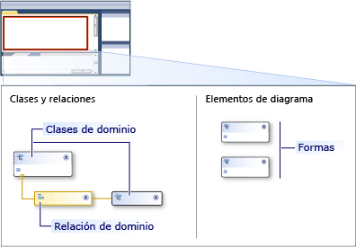
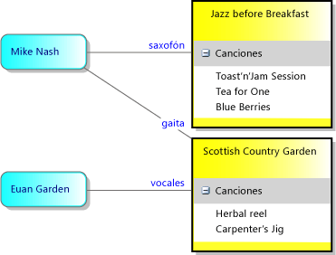
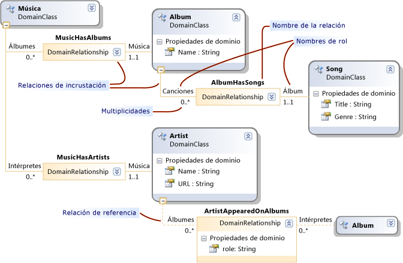
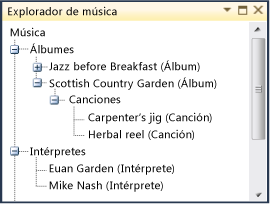

# Introducción a los modelos, las clases y las relaciones
Un lenguaje específico de dominio (DSL) se define mediante su archivo de definición DSL, junto con cualquier código de programa personalizado que se haya escrito. La mayoría del código de programa en la solución DSL se genera a partir de este archivo.  
  
 Este tema explica las características principales de la definición DSL.  
  
## La definición de DSL  
 Cuando se abre `Dsl\DslDefinition.dsl`, [!INCLUDE[vsprvs](../code-quality/includes/vsprvs_md.md)] pantalla será similar a la siguiente imagen.  
  
   
  
 La información más importante en la definición de DSL se muestra en el diagrama de definición DSL. Obtener información adicional, que también es parte de DslDefinition.dsl, se muestra en el Explorador de DSL, que normalmente aparece en el lado del diagrama. Trabajar con el diagrama para las tareas más frecuentes y con el Explorador de DSL para las personalizaciones más avanzadas.  
  
 El diagrama de definición DSL muestra las clases de dominio que definen los elementos del modelo y las relaciones que definen vínculos entre elementos del modelo. También muestra las formas y conectores que se usan para mostrar los elementos del modelo para el usuario.  
  
   
  
 Cuando se selecciona un elemento en la definición DSL, en el diagrama o en el Explorador de DSL, se muestra información sobre él en la ventana Propiedades. Información adicional puede mostrarse en la ventana Detalles de DSL.  
  
### Los modelos son instancias de DSL  
 A *modelo* es una instancia del ADSL creada por un usuario. Un modelo contiene elementos del modelo, que son instancias de las clases de dominio que definen y los vínculos entre los elementos, que son instancias de las relaciones de dominio que defina. También puede tener un modelo de formas y conectores, que muestran los elementos del modelo y los vínculos en un diagrama. La definición DSL incluye las clases de forma, las clases de conector y una clase para el diagrama.  
  
 Una definición de DSL es también conocido como un *modelo de dominio*. Un modelo de definición DSL o de dominio es la representación en tiempo de diseño del lenguaje específico de dominio, mientras que el modelo es la creación de instancias de tiempo de ejecución del lenguaje específico de dominio.  
  
## Las clases de dominio definen elementos del modelo  
 Clases de dominio se utilizan para crear los diversos elementos en el dominio y las relaciones de dominio son los vínculos entre los elementos. Únicamente son la representación en tiempo de diseño de los elementos y los vínculos que se crearán instancias por los usuarios del lenguaje específico de diseño cuando crean sus modelos.  
  
 En esta ilustración se muestra un modelo que se ha creado por el usuario de una biblioteca de música ADSL. Álbumes de música se representan mediante cuadros que contienen listas de canciones. Intérpretes se representan mediante cuadros de esquinas redondeadas y están conectados a los álbumes que han contribuido.  
  
   
  
 La definición DSL separa los dos aspectos. La apariencia de los elementos del modelo en el diagrama del modelo se define mediante el uso de las clases de formas y las clases de conector. La información que lleva en el modelo se define mediante las clases de dominio y las relaciones de dominio.  
  
 La ilustración siguiente muestra las clases de dominio y las relaciones en la definición DSL de la biblioteca de música.  
  
   
  
 La ilustración muestra cuatro clases de dominio: música, álbum, intérprete y canción. Las clases de dominio definen propiedades de dominio como nombre, título y así sucesivamente. En el modelo de instancia, los valores de algunas de estas propiedades se muestran en el diagrama.  
  
 Entre las clases son las relaciones de dominio: MusicHasAlbums, MusicHasArtists, AlbumbHasSongs y ArtistAppearedOnAlbums. Las relaciones tienen multiplicidades como 1..1, 0.. *. Por ejemplo, todas las canciones deben estar relacionado con exactamente un álbum a través de la relación AlbumHasSongs. Cada álbum puede tener cualquier número de canciones.  
  
### Reorganizar el diagrama de definición DSL  
 Tenga en cuenta que una clase de dominio puede aparecer varias veces en el diagrama de definición DSL, como álbum en esta imagen. Siempre hay una vista principal, y puede haber algunas *referencia* vistas.  
  
 Para reorganizar el diagrama de definición DSL, hacer lo siguiente:  
  
-   Intercambiar principal y hacen referencia a vistas mediante la **poner árbol aquí** y **división árbol** comandos. Haga clic en una clase de dominio individual para ver estos comandos.  
  
-   Cambiar el orden de las clases de dominio y las clases de formas, presione Ctrl+flecha arriba y Ctrl+flecha abajo.  
  
-   Contraer o expandir las clases mediante el icono a la superior derecha de cada forma.  
  
-   Contraer partes del árbol, haga clic en el signo menos (-) en la parte inferior de una clase de dominio.  
  
## Herencia  
 Clases de dominio pueden definirse mediante herencia. Para crear una derivación de herencia, haga clic en la herramienta de herencia, haga clic en la clase derivada y, a continuación, haga clic en la clase base. Un elemento del modelo tiene todas las propiedades que se definen en su propia clase de dominio, junto con todas las propiedades que se hereda de la clase base. También hereda sus roles en las relaciones.  
  
 También puede utilizarse la herencia entre las relaciones, formas y conectores. Herencia debe mantener dentro del mismo grupo. Una forma no puede heredar de una clase de dominio.  
  
## Relaciones de dominio  
 Elementos del modelo se pueden vincular mediante relaciones. Vínculos siempre son binarios; se vinculan a exactamente dos elementos. Sin embargo, cualquier elemento puede tener muchos vínculos a otros objetos, y que incluso puede haber más de un vínculo entre el mismo par de elementos.  
  
 Tal y como se pueden definir clases diferentes de elementos, puede definir diferentes clases de vínculos. La clase de un vínculo se denomina un *relación de dominio*. Una relación de dominio especifica qué clases de elemento se pueden conectar sus instancias. Cada extremo de una relación se denomina un *rol*, y la relación de dominio define los nombres de las dos funciones, así como para la relación propiamente dicha.  
  
 Hay dos tipos de relaciones de dominio: incrustar relaciones y referencia. En el diagrama de definición DSL, relaciones de incrustación tienen líneas sólidas en cada rol y las relaciones de referencia han líneas de guiones.  
  
### Incrustación de relaciones  
 Todos los elementos de un modelo, salvo por su raíz es el destino de un vínculo de incrustación. Por lo tanto, todo el modelo conforma un único árbol de incrustación de vínculos. Una relación de incrustación representa contención o la propiedad. Dos elementos del modelo que están relacionados de esta manera son también conocido como primarios y secundarios. El elemento secundario se dice que se incrustan en el elemento primario.  
  
 Incrustación de vínculos no se normalmente muestran explícitamente que los conectores en un diagrama. En su lugar, normalmente se representan mediante la contención. La raíz del modelo se representa mediante el diagrama y elementos incrustados en ella se muestran como formas del diagrama.  
  
 En el ejemplo, la clase raíz música tiene una relación de incrustación MusicHasAlbums a álbum, que tiene un AlbumHasSongs incrustación canción. Canciones se muestran como elementos en una lista dentro de cada álbum. Música también tiene una incrustación MusicHasArtists a la clase de intérprete, cuyas instancias también aparecen como formas en el diagrama.  
  
 De forma predeterminada, los elementos incrustados se eliminan automáticamente cuando se eliminan sus elementos primarios.  
  
 Cuando se guarda un modelo de archivos en formato XML, los elementos incrustados están anidados dentro de sus elementos primarios, a menos que haya personalizado la serialización.  
  
> [!NOTE]
>  Incrustación no es lo mismo que herencia. Los elementos secundarios en una relación de incrustación no heredan propiedades del elemento primario. Una incrustación es un tipo de vínculo entre elementos del modelo. Herencia es una relación entre las clases y no crea vínculos entre elementos del modelo.  
  
### Reglas de incrustación  
 Todos los elementos de un modelo de instancia deben ser el destino de exactamente un vínculo de incrustación, excepto la raíz del modelo.  
  
 Por lo tanto, cada clase de dominio no abstracta, excepto la clase raíz, debe ser el destino de al menos una relación de incrustación o debe heredar una incrustación de una clase base. Una clase puede ser el destino de las incrustaciones de dos o más, pero sus elementos de modelo de instancia solo pueden tener un elemento primario a la vez. La multiplicidad de destino a origen debe ser de 0.. 1 o 1.. 1.  
  
### El explorador muestra el árbol de incrustación  
 La definición DSL también crea un explorador, que los usuarios ven junto con su diagrama del modelo.  
  
   
  
 El explorador muestra todos los elementos en el modelo, incluso aquellos para los que no ha definido ninguna forma. Muestran los elementos y relaciones de incrustación, pero no hacer referencia a las relaciones.  
  
 Para ver los valores de las propiedades de dominio de un elemento, el usuario selecciona un elemento en el diagrama del modelo o en el Explorador de modelos y abre la ventana Propiedades. Muestra todas las propiedades de dominio, los que no se muestran en el diagrama incluidos. En el ejemplo, cada canción tiene un título y un género, pero solo el valor de título se muestra en el diagrama.  
  
## Relaciones de referencia  
 Una relación de referencia representa cualquier tipo de relación que es no incrustar.  
  
 Las relaciones de referencia normalmente se muestran en un diagrama que los conectores entre las formas.  
  
 En la representación XML del modelo, un vínculo de referencia entre dos elementos se representa mediante *monikers.* Es decir, monikers son nombres que identifican de forma exclusiva cada elemento en el modelo. El nodo XML para cada elemento del modelo contiene un nodo que especifica el nombre de la relación y el moniker del otro elemento.  
  
## Roles  
 Cada relación de dominio tiene dos funciones, un rol de origen y un rol de destino.  
  
 En la siguiente imagen, la línea entre las **Publisher** clase de dominio y el **PublisherCatalog** relación de dominio es el rol de origen. La línea entre la relación de dominio y el **álbum** clase de dominio es el rol de destino.  
  
 ![Las funciones y propiedades. ] (../modeling/media/propertycode.png "PropertyCode")  
  
 Los nombres asociados con una relación son especialmente importantes cuando se escribe código de programa que atraviesa el modelo. Por ejemplo, cuando se compila la solución DSL, la clase generada publicador tiene una propiedad de catálogo que es una colección de álbumes. La clase álbum tiene una propiedad de publicador que es una única instancia de la clase de publicador.  
  
 Cuando se crea una relación en una definición DSL, los nombres de propiedad y la relación tienen valores predeterminados. Sin embargo, puede cambiarlos.  
  
## Multiplicidades  
 Multiplicidades especifican cuántos elementos puede tener el mismo rol en una relación de dominio. En el ejemplo, el cero a varios (0..\*) configuración de la multiplicidad en el **catálogo** rol especifica que cualquier instancia de la **Publisher** clase de dominio puede tener tantos  **PublisherCatalog** relación vincula como desee darle.  
  
 Configurar la multiplicidad de un rol escribiendo en el diagrama o modificando la `Multiplicity` propiedad en el **propiedades** ventana. En la tabla siguiente describe la configuración de esta propiedad.  
  
|Tipo de multiplicidad|Descripción|  
|-----------------------|-----------------|  
|0.. * (cero a muchos)|Cada instancia de la clase de dominio puede tener varias instancias de la relación o ninguna instancia de la relación.|  
|De 0 a 1 (cero a uno)|Cada instancia de la clase de dominio puede tener no más de una instancia de la relación o ninguna instancia de la relación.|  
|1..1 (uno)|Cada instancia de la clase de dominio puede tener una instancia de la relación. No se puede crear más de una instancia de esta relación desde cualquier instancia de la clase de función. Si está habilitada la validación, aparecerá un error de validación cuando cualquier instancia de la clase de función no tiene ninguna instancia de la relación.|  
|1.. * (uno a varios)|Cada instancia de la clase en el rol que tiene una multiplicidad de este puede tener varias instancias de la relación, y cada instancia debe tener al menos una instancia de la relación. Si está habilitada la validación, aparecerá un error de validación cuando cualquier instancia de la clase de función no tiene ninguna instancia de la relación.|  
  
## Relaciones de dominio como clases  
 Un vínculo se representa en el almacén como una instancia de LinkElement, que es una clase derivada de ModelElement. Puede definir estas propiedades en el diagrama del modelo de dominio en las relaciones de dominio.  
  
 También puede establecer una relación de origen o destino de otras relaciones. En el diagrama de modelo de dominio, haga clic en la relación de dominio y, a continuación, haga clic en **mostrar como clase**. Aparecerá un cuadro de clase adicional. Relaciones, a continuación, puede conectarse a él.  
  
 Puede definir una relación en parte por herencia, igual que lo haría con las clases de dominio. Seleccione la relación derivada y establezca **Base relación** en la ventana Propiedades.  
  
 Una relación derivada especializa su relación de base. El dominio de las clases que TI vínculos deben derivarse de o igual a las clases vinculadas mediante la relación de base. Cuando se crea un vínculo de la relación derivada en un modelo, es una instancia de la clase derivada y las relaciones de base. En el código de programa, puede navegar con el extremo opuesto del vínculo mediante las propiedades generadas por la base o la clase derivada.  
  
## Vea también  
 [Glosario de herramientas de lenguaje específico de dominio](http://msdn.microsoft.com/ca5e84cb-a315-465c-be24-76aa3df276aa)
