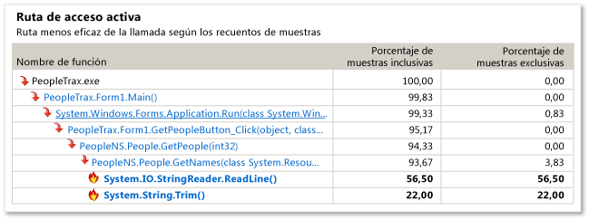
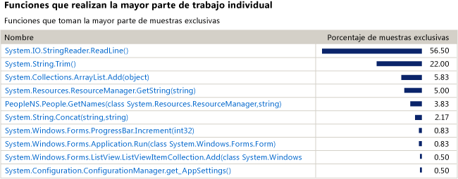
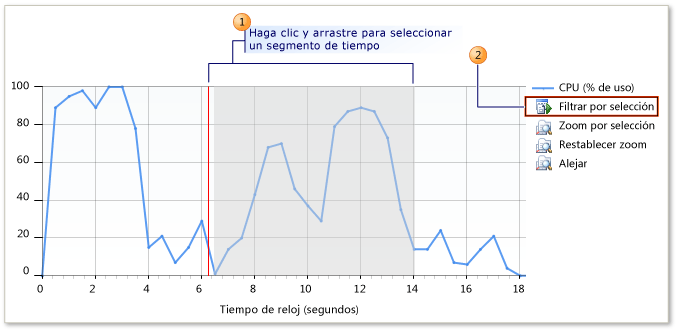

# Guía para principiantes para el muestreo de la CPU
Puede utilizar las herramientas de generación de perfiles de Visual Studio para analizar problemas de rendimiento en su aplicación. Este procedimiento muestra cómo utilizar datos de **muestreo**.

> [!NOTE]
>  Se recomienda que utilice la herramienta [Uso de CPU](../profiling/beginners-guide-to-performance-profiling.md) en la ventana de herramientas de diagnóstico en lugar de la herramienta de muestreo de la CPU heredada, a menos que necesite características especializadas, como la compatibilidad de instrumentación.
  
 El **muestreo** es un método estadístico de generación de perfiles que le muestra las funciones de la aplicación que realizan la mayor parte del trabajo del modo de usuario. Muestreo es un buen lugar para empezar a buscar dónde acelerar la aplicación.  
  
 El método de **muestreo** recopila a intervalos especificados información sobre las funciones que se ejecutan en la aplicación. Después de acabar una generación de perfiles, la vista **Resumen** muestra el árbol con las llamadas de función más activas, lo que se denomina la **ruta de acceso activa**. Ahí es donde se llevó a cabo la mayor parte del trabajo de la aplicación. La vista también enumera qué funciones realizaron más trabajo individual y proporciona un gráfico de escala de tiempo que se puede usar para centrarse en segmentos específicos de la sesión de muestreo.  
  
 Si **Muestreo** no le proporciona los datos que necesita, otros métodos de recolección de las herramientas de generación de perfiles proporcionan diferentes tipos de información que pueden resultarle útiles. Para obtener más información sobre estos otros métodos, consulte [Cómo: Elegir métodos de recopilación](../profiling/how-to-choose-collection-methods.md).  
  
> [!TIP]
>  Si se generan perfiles de código que llama a funciones de Windows, asegúrese de que dispone de los archivos .pdb más recientes. Sin estos archivos, las vistas de informe mostrarán nombres de funciones de Windows crípticos y difíciles de entender. Para obtener más información sobre cómo asegurarse de que tiene los archivos necesarios, consulte [Cómo: Hacer referencia a información de símbolos de Windows](../profiling/how-to-reference-windows-symbol-information.md).  
  
##   Crear y ejecutar una sesión de rendimiento  
 Para obtener los datos que necesita analizar, debe crear una sesión de rendimiento y luego ejecutar la sesión. El **Asistente de rendimiento** le permite hacer ambas cosas.  
  
 Si no está generando perfiles para una aplicación de escritorio de Windows o una aplicación ASP.NET, debe utilizar una de las otras herramientas de generación de perfiles. Consulte [Herramientas de generación de perfiles](../profiling/profiling-tools.md).  
  
#### Para crear y ejecutar una sesión de rendimiento:  
  
1.  Abra la solución en Visual Studio. Establezca la configuración en Versión. (Busque el cuadro **Configuraciones de soluciones** en la barra de herramientas, que se establece en **Depurar** de forma predeterminada. Cámbielo a **Versión**).  
  
    > [!IMPORTANT]
    >  Si no es administrador en el equipo que está usando, debería ejecutar Visual Studio como administrador mientras usa el generador de perfiles. (Haga clic con el botón secundario en el icono de la aplicación de Visual Studio y luego haga clic en **Ejecutar como administrador**.  
  
2.  En el menú **Depurar**, seleccione **Generador de perfiles** y, a continuación, seleccione **Performance Profiler** (Generador de perfiles de rendimiento).  
  
3.  Marque la opción **Asistente de rendimiento** y haga clic en **Iniciar**.  
  
4.  Marque la opción **Muestreo de la CPU (recomendado)** opción y haga clic en **Finalizar**.  
  
5.  La aplicación se inicia y el generador de perfiles empieza a recopilar datos.  
  
6.  Emplee la funcionalidad que podría tener problemas de rendimiento.  
  
7.  Cierre la aplicación como haría normalmente.  
  
     Cuando termine de ejecutar la aplicación, la vista **Resumen** de los datos de generación de perfiles aparece en la ventana principal de Visual Studio y se muestra un icono para la nueva sesión en la ventana **Explorador de rendimiento**.  
  
##   Paso 2: Analizar los datos de muestreo  
 Cuando termine de ejecutar una sesión de rendimiento, la vista **Resumen** del informe de generación de perfiles se muestra en la ventana principal de Visual Studio.  
  
 Se recomienda empezar a analizar los datos examinando la **ruta de acceso activa** y, después, la lista de funciones que realizan la mayor parte del trabajo. Para acabar, céntrese en otras funciones mediante la **escala de tiempo de resumen**. También puede ver sugerencias y advertencias sobre la generación de perfiles en la ventana **Lista de errores**.  
  
 Tenga en cuenta que el método de muestreo podría no proporcionarle la información que necesita. Por ejemplo, solo se recopilan muestras cuando la aplicación ejecuta código en el modo usuario. Por tanto, algunas funciones, como las operaciones de entrada y salida, no se registran en el muestreo. Las herramientas de generación de perfiles proporcionan varios métodos de recopilación que le permiten centrarse en los datos importantes. Para obtener más información sobre los demás métodos, consulte [Cómo: Elegir métodos de recopilación](../profiling/how-to-choose-collection-methods.md).  
  
 Cada área numerada de la ilustración se corresponde con un paso del procedimiento.  
  
   
  
#### Para analizar datos de muestreo:  
  
1.  En la vista **Resumen**, la **ruta de acceso activa** muestra la rama del árbol de llamadas de la aplicación con el mayor número de muestras inclusivas. Es la ruta de ejecución más activa en el momento del muestreo de datos. Un valor inclusivo muy alto puede indicar que el algoritmo que genera el árbol de llamadas puede optimizarse. Busque en el código la función que está más abajo en la ruta. Observe que la ruta también puede incluir funciones del sistema o funciones en módulos externos.  
  
       
  
    1.  **Muestras inclusivas** indica cuánto trabajo realizaron la función y las funciones llamadas por ella. Los recuentos inclusivos altos señalan las funciones más costosas en términos generales.  
  
    2.  **Muestras exclusivas** indica cuánto trabajo realizó el código del cuerpo de la función, sin incluir el trabajo de las funciones llamadas por dicha función. Recuentos exclusivos altos pueden indicar un cuello de botella de rendimiento dentro de la propia función.  
  
2.  Haga clic en el nombre de la función para mostrar la vista **Detalles de la función** de los datos de generación de perfiles. La vista **Detalles de la función** presenta una imagen gráfica de los datos de generación de perfiles para la función seleccionada, en la que se muestran todas las funciones que la llamaron y todas las funciones a las que llamó.  
  
    -   El tamaño de los bloques muestra la frecuencia relativa con que las funciones llaman o son llamadas.  
  
    -   Puede hacer clic en el nombre de una función que llama o es llamada para hacerla función seleccionada de la vista Detalles de la función.  
  
    -   En el recuadro inferior de las ventanas **Detalles de la función** se muestra el propio código de la función. Si examina el código y encuentra una oportunidad de optimizar su rendimiento, haga clic en el nombre de archivo del código fuente para abrirlo en el editor de Visual Studio.  
  
3.  Para continuar el análisis, seleccione **Resumen** en la lista desplegable Vista para volver a la vista **Resumen**. Luego, examine las funciones de **Funciones que realizan la mayor parte del trabajo individual**. Esta lista muestra las funciones con las muestras exclusivas más altas. El código de estas funciones realizó un trabajo considerable y podría ser posible optimizarlo. Para analizar mejor una función determinada, haga clic en su nombre para que se muestre en la vista **Detalles de la función**.  
  
       
  
     Para continuar la investigación de la ejecución de la generación de perfiles, puede volver a analizar un segmento de los datos de generación de perfiles con la escala de tiempo de la vista **Resumen** y mostrar para dicho segmento seleccionado la **ruta de acceso activa** y las **funciones que realizan la mayor parte del trabajo individual**. Por ejemplo, centrarse en un pico más pequeño de la escala de tiempo podría revelar árboles de llamadas costosos y funciones que no se mostraron en el análisis completo.  
  
     Para volver a analizar un segmento, selecciónelo dentro del cuadro Escala de tiempo de resumen y, luego, haga clic en **Filtrar por selección**.  
  
       
  
4.  El generador de perfiles también utiliza un conjunto de reglas para sugerir formas de mejorar la ejecución de generación de perfiles e identificar posibles problemas de rendimiento. Si se encuentra algún problema, se muestra una advertencia en la ventana **Lista de errores**. Para abrir la ventana **Lista de errores**, en el menú **Ver**, haga clic en **Lista de errores**.  
  
    -   Para ver en la vista **Detalles de la función** la función que ha generado una advertencia, haga doble clic en esta.  
  
    -   Para ver información detallada sobre la advertencia, haga clic con el botón secundario en el error y, luego, haga clic en **Ayuda para Mostrar mensaje**  
  
##   Paso 3: Revise el código y vuelva a ejecutar una sesión  
 Después de encontrar y optimizar una o más funciones, puede repetir la ejecución de generación de perfiles y comparar los datos para ver qué diferencia han supuesto los cambios para el rendimiento de la aplicación.  
  
#### Revisar el código y volver a ejecutar el generador de perfiles  
  
1.  Cambie el código.  
  
2.  Para abrir el **Explorador de rendimiento**, en el menú **Depurar**, haga clic en **Generador de perfiles**, a continuación en **Explorador de rendimiento** y después en **Mostrar Explorador de rendimiento**.  
  
3.  En el **Explorador de rendimiento**, haga clic con el botón secundario en la sesión que quiere volver a ejecutar y, luego, haga clic en **Iniciar con generación de perfiles**.  
  
4.  Después de volver a ejecutar la sesión, se agrega otro archivo de datos a la carpeta **Informes** de la sesión en el **Explorador de rendimiento**. Seleccione los datos de generación de perfiles originales y nuevos, haga clic con el botón secundario en la selección y, luego, haga clic en **Comparar informes de rendimiento**.  
  
     Se abre una nueva ventana de informe que muestra los resultados de la comparación. Para obtener más información sobre cómo utilizar la vista de comparación, consulte [Cómo: Comparar archivos de datos de rendimiento](../profiling/how-to-compare-performance-data-files.md).
  
## Vea también  
 [Explorador de rendimiento](../profiling/performance-explorer.md)   
 [Introducción](../profiling/getting-started-with-performance-tools.md)   
 [Información general](../profiling/overviews-performance-tools.md)  
 [Generación de perfiles en Visual Studio](../profiling/index.md)  
 [Guía de características de generación de perfiles](../profiling/profiling-feature-tour.md)