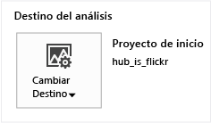
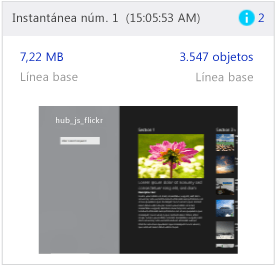
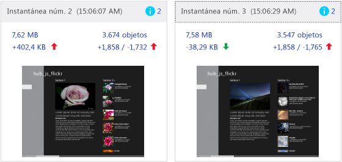
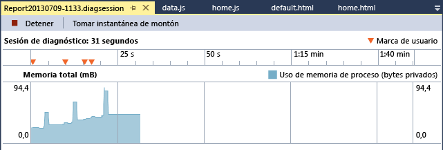
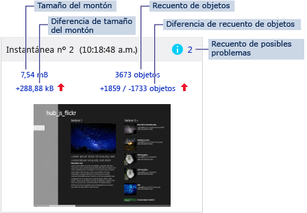
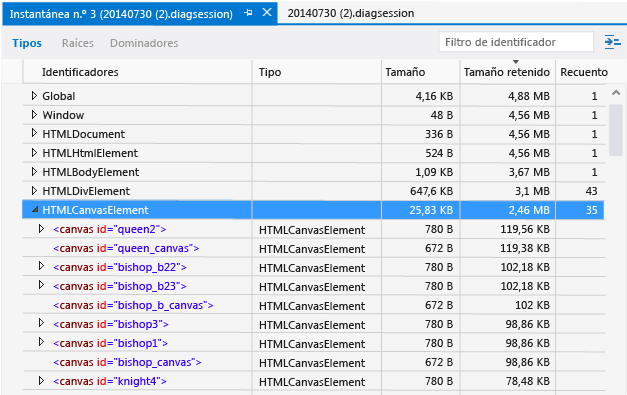
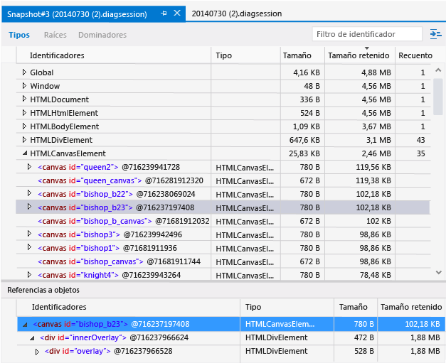

# <a name="analyze-javascript-memory-usage-in-uwp-apps"></a>Análisis del uso de memoria de JavaScript en aplicaciones de UWP
El analizador de memoria de JavaScript está disponible en Visual Studio para ayudarle a entender el uso de memoria y a localizar fugas de memoria en las aplicaciones para UWP creadas para Windows con JavaScript. Las aplicaciones compatibles comprenden las aplicaciones universales de Windows.
  
 El analizador de memoria de JavaScript puede hacer lo siguiente por ti:  
  
-   Ayudarte a buscar rápidamente problemas de uso de memoria en la aplicación resaltando los datos más importantes.  
  
     Estos datos se muestran en resúmenes de instantánea que indican las diferencias entre dos instantáneas y proporcionan vínculos a vistas más detalladas.  
  
-   Proporcionar vistas de dominadores, tipos, y raíces para ayudar a aislar problemas.  
  
-   Reducir la información no procesable en los datos del montón de JavaScript.  
  
     Los objetos que no se crean directamente en el código de la aplicación se filtran automáticamente. También puedes filtrar datos por nombre de objeto.  
  
## <a name="run-the-javascript-memory-analyzer"></a>Ejecutar el analizador de memoria de JavaScript  
 Puede usar el analizador de memoria cuando tenga abierta en Visual Studio una aplicación de UWP en funcionamiento.
  
#### <a name="to-run-the-memory-analyzer"></a>Para ejecutar el analizador de memoria  
  
1.  Abra Visual Studio.  
  
2.  Si está ejecutando la aplicación desde Visual Studio, en la lista **Iniciar depuración** de la barra de herramientas **Estándar**, elija el destino de depuración del proyecto: **Equipo local** o **Dispositivo**.  
  
3.  En la barra de menús, elija **Depurar** > **Generador de perfiles de rendimiento**.  
  
     De forma predeterminada, se analiza el proyecto de inicio actual. Si quieres cambiar el destino de análisis, elige **Cambiar destino**.  
  
       
  
     Tienes las siguientes opciones disponibles para el destino de análisis:  
  
    -   **Proyecto de inicio**. Analiza el proyecto de inicio actual. Si estás ejecutando la aplicación en un equipo remoto, debes elegir esta opción, que es el valor predeterminado.  
  
    -   **Aplicación en ejecución**. Permite seleccionar una aplicación para UWP de una lista de aplicaciones en ejecución. No puedes utilizar esta opción si estás ejecutando la aplicación en un equipo remoto.  
  
         Usa esta opción para analizar el uso de memoria de las aplicaciones que se ejecutan en el equipo cuando no tienes acceso al código fuente.  
  
    -   **Aplicación instalada**. Permite seleccionar la aplicación para UWP instalada que quiere analizar. No puedes utilizar esta opción si estás ejecutando la aplicación en un equipo remoto.  
  
         Usa esta opción para analizar el uso de memoria de las aplicaciones que has instalado en el equipo cuando no tienes acceso al código fuente. Esta opción también es útil cuando solo deseas analizar el uso de memoria de cualquier aplicación, fuera de tu propio desarrollo de aplicaciones.  
  
4.  En **Herramientas disponibles**, activa la casilla **Memoria de JavaScript** y elige **Inicio**.  
  
5.  Al iniciar el analizador de memoria, puede aparecer una ventana de Control de cuentas de usuario que solicite tu permiso para ejecutar Visual Studio ETW Collector.exe. Elija **Sí**.  
  
     Interactúa con la aplicación para probar los escenarios pertinentes de uso de memoria y ver el gráfico de memoria, como se describe en las secciones siguientes.  
  
6.  Cambia a Visual Studio presionando **Alt**+**Tab**.  
  
7.  Para ver datos recopilados por el analizador de memoria, elige **Tomar instantánea de montón**. Consulte [View a snapshot summary](#view-a-snapshot-summary) más adelante en este tema.  
  
## <a name="check-memory-usage"></a>Comprobar el uso de la memoria  
 Puedes intentar identificar pérdidas de memoria mediante distintas vistas en el analizador de memoria de JavaScript. Si ya sospecha que la aplicación pierde memoria, consulte [Isolate a memory leak](#isolate-a-memory-leak) para obtener una sugerencia de flujo de trabajo.  
  
 Usa las siguientes vistas para ayudar a identificar pérdidas de memoria en una aplicación:  
  
-   [Ver el resumen de uso de memoria activo](#view-live-memory-usage-summary). Utiliza el gráfico de uso de memoria para buscar aumentos repentinos del uso de memoria o un uso de esta en continuo aumento como resultado de acciones concretas. Usa la vista de resumen de uso de memoria activa para tomar instantáneas del montón. Las instantáneas aparecen como una colección bajo el gráfico de uso de memoria.  
  
    > [!TIP]
    >  Verás un pico en el uso de memoria cuando tomes una instantánea. Utiliza los resúmenes de instantánea para obtener una indicación más precisa del aumento de memoria.  
  
-   [View a snapshot summary](#view-a-snapshot-summary). Puedes ver la información del resumen de instantánea durante una sesión de generación de perfiles de memoria o después de esta. Usa los resúmenes de instantánea para vincularlos a los detalles y las vistas de diferencia de instantánea.  
  
    > [!TIP]
    >  Por lo general, las vistas de diferencia de instantánea proporcionarán la información más útil sobre las pérdidas de memoria.  
  
-   [Ver detalles de la instantánea](#view-snapshot-details). Muestra datos detallados de uso de memoria de una sola instantánea.  
  
-   [Ver una diferencia de instantánea](#view-a-snapshot-diff). Muestra valores diferenciales entre las instantáneas. Estas vistas muestran diferencias respecto al tamaño del objeto y los recuentos de objetos.  
  
## <a name="isolate-a-memory-leak"></a>Isolate a memory leak  
 Estos pasos proporcionan un flujo de trabajo que puede ayudarte a usar el analizador de memoria de JavaScript de forma más eficaz. Estos pasos pueden resultar útiles si sospechas que tu aplicación tiene una pérdida de memoria. Para obtener un tutorial que le guíe a lo largo del proceso de identificación de una fuga de memoria en una aplicación en funcionamiento, vea [Tutorial: Buscar una fuga de memoria (JavaScript)](../profiling/walkthrough-find-a-memory-leak-javascript.md).  
  
1. Abre la aplicación en Visual Studio.  
  
2. Ejecuta el analizador de memoria de JavaScript. Para obtener más información, consulta [Ejecutar el analizador de memoria de JavaScript](#run-the-JavaScript-memory-analyzer).  
  
3. Ejecuta la aplicación en el escenario que quieres probar. Por ejemplo, el escenario puede implicar una mutación DOM grande al cargar una página determinada o al iniciarse la aplicación.  
  
4. Repite el escenario entre 1 y 4 veces más.  
  
   > [!TIP]
   >  Al repetir el escenario de prueba varias veces, puedes contribuir a garantizar que el trabajo de inicialización se filtre de los resultados.  
  
5. Cambia a Visual Studio (presione **Alt**+**Tab**).  
  
6. Elige **Tomar instantánea de montón**para tomar una instantánea de montón de línea de base.  
  
    En la ilustración siguiente se muestra un ejemplo de una instantánea de línea de base.  
  
      
  
   > [!TIP]
   >  Para un control más preciso sobre el tiempo de las instantáneas, puede usar el comando [Associate source code with memory usage data](#associate-source-code-with-memory-usage-data) en el código.  
  
7. Ve a la aplicación y repite el escenario que estás probando (solo una vez).  
  
8. Cambia a Visual Studio y toma una segunda instantánea.  
  
9. Ve a la aplicación y repite el escenario que estás probando (solo una vez).  
  
10. Cambia a Visual Studio y toma una tercera instantánea.  
  
     En la ilustración siguiente se muestra un ejemplo de una segunda y tercera instantánea.  
  
       
  
     Al tomar una instantánea de línea de base, una segunda y una tercera en este flujo de trabajo, puedes filtrar los cambios que no estén asociados a pérdidas de memoria con más facilidad. Por ejemplo, puede haber cambios esperados, como la actualización de encabezados y pies de página en una página, que generen algunos cambios en cuanto al uso de memoria, pero que no estén relacionados con pérdidas de esta.  
  
11. A partir de la tercera instantánea, elige un vínculo a una de las vistas diferenciales:  
  
    - Tamaño diferencial del montón (vínculo izquierdo debajo del tamaño del montón). El texto del vínculo muestra la diferencia entre el tamaño del montón de la instantánea actual y el de la instantánea anterior.  
  
    - Recuento diferencial de objetos (vínculo derecho debajo del recuento de objetos). El texto del vínculo muestra dos valores (por ejemplo, +1858 / -1765): El primer valor es el número de objetos nuevos agregados desde la instantánea anterior, mientras que el segundo es el número de objetos que se han quitado desde la instantánea anterior.  
  
      Estos vínculos abren una vista diferencial de detalles de instantánea de tipos en el montón, ordenada por tamaño retenido o recuento de objetos, en función de qué vínculo se abriera.  
  
12. Elige una de las siguientes opciones de filtro **Ámbito** para ayudar a identificar problemas de uso de memoria:  
  
    -   **Objetos dejados de la instantánea n.º 2**.  
  
    -   **Objetos agregados entre las instantáneas n.º 2 y 3**  
  
    > [!TIP]
    >  Usa la vista filtrada de objetos dejados desde la instantánea anterior para investigar pérdidas de memoria. Por ejemplo, si el recuento diferencial de objetos es de +205/-195, esta vista mostrará los 10 objetos dejados, que son probables candidatos para las pérdidas de memoria.  
  
     En la siguiente ilustración se muestra una vista diferencial de objetos dejados desde la instantánea n.º 2.  
  
       
  
     En la ilustración anterior, se ve que se han dejado dos objetos desde la instantánea anterior. Investiga si se trata del comportamiento esperado de esta aplicación. Si no, podría indicar una pérdida de memoria.  
  
13. Para ver dónde tienen la raíz los objetos de las vistas diferenciales en el objeto global, lo que impide que se detecten durante la recolección de elementos no utilizados, abre el menú contextual de un objeto y, a continuación, elige **Mostrar en vista de raíces**. Puede haber un gran número de objetos retenidos en memoria porque es un único objeto (o unos cuantos objetos) los que hacen referencia a ellos con la raíz en el objeto global.  
  
14. Si hay demasiados objetos en la vista de objetos dejados, intenta aislar aún más el periodo en que se produce la pérdida de memoria y vuelve a tomar las tres instantáneas. Para aislar aún más la pérdida de memoria, use [Associate source code with memory usage data](#associate-source-code-with-memory-usage-data), [Associate source code with memory usage data](#associate-source-code-with-memory-usage-data)y otros datos de uso de memoria disponibles en el analizador de memoria.  
  
## <a name="view-live-memory-usage-summary"></a>Ver el resumen de uso de memoria activo  
 La vista de resumen de uso de memoria activo proporciona un gráfico de uso de memoria de la aplicación actual y una colección de todos los mosaicos de resumen de la instantánea. En esta vista, puedes realizar tareas básicas como tomar instantáneas, analizar información de resumen y navegar a otras vistas. Cuando se detiene la recolección de datos, el gráfico de memoria desaparece y solo se ve la vista [View a snapshot summary](#view-a-snapshot-summary) .  
  
 El gráfico de memoria muestra una vista dinámica de la memoria de proceso de la aplicación, que incluye bytes privados, memoria nativa y el montón de JavaScript. El gráfico de memoria es una vista desplazable de la memoria de proceso. Este es su aspecto:  
  
   
  
 Si ha agregado marcas de usuario al código de la aplicación (consulte [Associate source code with memory usage data](#associate-source-code-with-memory-usage-data)), aparece un triángulo invertido en el gráfico de uso de memoria para indicar cuándo se alcanza esa sección de código.  
  
 Parte de la memoria mostrada en el gráfico de memoria está asignada por el runtime de JavaScript. No puedes controlar este uso de memoria en tu aplicación. El uso de memoria que se muestra en el gráfico aumenta cuando tomas la primera instantánea y, a continuación, aumenta más despacio para cada instantánea adicional.  
  
## <a name="view-a-snapshot-summary"></a>View a snapshot summary  
 Para tomar una instantánea del estado actual del uso de memoria de la aplicación, elige **Tomar instantánea de montón** en el gráfico de memoria. Un mosaico de resumen de instantánea, que aparece en el resumen de uso de memoria activo (mientras se ejecuta la aplicación) y en el resumen de instantánea (cuando se detiene la aplicación), proporciona información sobre la pila de JavaScript y vínculos a información más detallada. Si tomas dos o más instantáneas, una instantánea proporciona información adicional comparando sus datos con los de la instantánea anterior.  
  
> [!NOTE]
>  El analizador de memoria de JavaScript fuerza una recolección de elementos no utilizados antes de cada instantánea. Esto ayuda a garantizar que los resultados sean más coherentes entre las distintas ejecuciones.  
  
 A continuación se incluye un ejemplo de un resumen de instantánea cuando se realizan varias instantáneas.  
  
   
  
 El resumen de la instantánea incluye:  
  
-   Título de la instantánea y marca de tiempo.  
  
-   Recuento de posibles problemas (marcados con un icono azul de información). Este número, si aparece, identifica posibles problemas de memoria, como nodos que no están asociados a DOM. El recuento vincula a la vista Tipos de la instantánea, que está ordenada por tipo de problema para resaltar los problemas potenciales. Se muestra la descripción del problema con una información sobre herramientas.  
  
-   Tamaño del montón. Este número incluye los elementos y los objetos DOM que el runtime de JavaScript agrega al montón de JavaScript. El tamaño del montón vincula a la vista Tipos de la instantánea.  
  
-   Tamaño diferencial del montón. Este valor muestra la diferencia entre el tamaño del montón de la instantánea actual y el de la instantánea anterior. El valor va seguido de una flecha arriba de color rojo si hay un aumento de memoria o de una flecha abajo de color verde si hay una disminución de memoria. Si el tamaño del montón no ha cambiado entre las instantáneas, verás el texto **No cambia** en lugar de un número. Para la primera instantánea, verás el texto **Línea de base**. El tamaño del montón diferencial es un vínculo a la vista Tipos de la diferencia de instantánea.  
  
-   Recuento de objetos. Este recuento solo muestra los objetos creados en la aplicación y filtra los objetos integrados creados por el runtime de JavaScript. El recuento de objetos tiene un vínculo a la vista Tipos de los detalles de la instantánea.  
  
-   Recuento diferencial de objetos. Muestra dos valores: El primer valor es el número de objetos nuevos agregados desde la instantánea anterior, mientras que el segundo es el número de objetos que se han quitado desde la instantánea anterior. Por ejemplo, la ilustración muestra que se agregaron 1.859 objetos y se quitaron 1.733 objetos de la instantánea 1. Esta información va seguida de una flecha arriba de color rojo si el recuento total de objetos ha aumentado o de una flecha abajo de color verde si se ha reducido. Si el recuento de objetos no ha cambiado, verás el texto **No cambia** en lugar de un número. Para la primera instantánea, verás el texto **Línea de base**. El recuento diferencial de objetos es un vínculo a la vista Tipos de la diferencia de instantánea.  
  
-   Captura de la pantalla en el momento en que se toma la instantánea.  
  
## <a name="view-snapshot-details"></a>Ver detalles de la instantánea  
 Puedes ver información detallada sobre el uso de memoria de cada instantánea en las vistas de detalles de la instantánea.  
  
 En la vista Resumen de la instantánea, elige un vínculo para ver los detalles de la instantánea. Por ejemplo, el vínculo de tamaño del montón abre los detalles de instantánea con la vista Tipos abierta de manera predeterminada.  
  
 En esta ilustración se muestra la vista Tipos en un detalle de instantánea, con los datos de uso de memoria ordenados por tamaño retenido.  
  
   
  
 En la vista de detalles de instantánea, puedes revisar los datos de uso de memoria por tipo, raíz o dominador mediante la elección de una opción de la barra de herramientas:  
  
- **Tipos**. Muestra el número de instancias y el tamaño total de objetos en el montón, agrupados por tipo de objeto. De forma predeterminada, están ordenados por número de instancia.  
  
  > [!TIP]
  >  Normalmente, las vistas diferenciales de los tipos en el montón de objetos son las más útiles para identificar una pérdida de memoria; estas vistas ofrecen un filtro **Ámbito** para ayudar a identificar objetos dejados.  
  
- **Raíces**. Muestra una vista jerárquica de objetos desde los objetos raíz a las referencias secundarias. De forma predeterminada, los nodos secundarios están ordenados por la columna de tamaño retenido, apareciendo el mayor en la parte superior.  
  
- **Dominadores**. Muestra una lista de objetos en el montón que tienen referencias exclusivas a otros objetos. Los dominadores se ordenan por tamaño retenido.  
  
  > [!TIP]
  >  Cuando se quita un dominador de la memoria, se recupera toda la memoria que retiene el objeto. En unas pocas aplicaciones, la vista Dominadores podría ayudar a aclarar tamaños de memoria retenida, porque se puede investigar la cadena de referencia de objetos completa.  
  
  Las tres vistas muestran tipos de valor similares, entre los que se incluyen:  
  
- **Identificadores**. Nombre que identifica mejor el objeto. Por ejemplo, para los elementos HTML, los detalles de instantánea muestran el valor del atributo ID, si se usa alguno.  
  
- **Tipo**. Tipo de objeto (por ejemplo, elemento de vínculo HTML o elemento div).  
  
- **Tamaño**. Tamaño del objeto, sin incluir el tamaño de los objetos a los que se hace referencia.  
  
- **Tamaño retenido**. Tamaño del objeto más el de todos los objetos secundarios que no tienen ningún otro objeto primario. A efectos prácticos, esta suma es la cantidad de memoria retenida por el objeto, por lo que si eliminas el objeto recuperas la cantidad de memoria especificada.  
  
- **Recuento**. Número de instancias de objeto. Este valor solo aparece en la vista Tipos.  
  
## <a name="view-a-snapshot-diff"></a>Ver una diferencia de instantánea  
 En el analizador de memoria de JavaScript, puedes comparar una instantánea con la instantánea anterior en las vistas de diferencia de instantánea.  
  
 En la vista de resumen de la instantánea, puedes ver los detalles diferenciales de las instantáneas eligiendo los vínculos de tamaño diferencial del montón o de recuento diferencial de objetos después de haberse tomado dos o más instantáneas.  
  
 Puedes ver información diferencial sobre tipos, raíces y dominadores. La diferencia de instantánea muestra información, como los objetos que se agregaron al montón entre las dos instantáneas.  
  
 En esta ilustración se muestra la vista Tipos de una diferencia de instantánea.  
  
   
  
 En la ventana de diferencia de instantánea, las vistas Dominadores, Tipos y Raíces son iguales que en la ventana [Ver detalles de la instantánea](#view-snapshot-details) . La diferencia de instantánea muestra la misma información que los detalles de instantánea, con estos valores adicionales:  
  
- **Diferencia de tamaño**. Diferencia entre el tamaño del objeto en la instantánea actual y su tamaño en la instantánea anterior, sin incluir el tamaño de los objetos a los que se hace referencia.  
  
- **Diferencia de tamaño retenido**. Diferencia entre el tamaño retenido del objeto en la instantánea actual y su tamaño retenido en la instantánea anterior. El tamaño retenido incluye el tamaño del objeto más el tamaño de todos los objetos secundarios que no tienen ningún otro objeto primario. A efectos prácticos, el tamaño retenido es la cantidad de memoria retenida por el objeto, por lo que si eliminas el objeto recuperas la cantidad de memoria especificada.  
  
  Para filtrar información diferencial entre instantáneas, elige uno de los filtros **Ámbito** de la parte superior de las vistas diferenciales.  
  
- **Objetos dejados de la instantánea n.º \<número>**. Este filtro muestra la diferencia entre los objetos agregados al montón y quitados de él con respecto a la instantánea de línea de base y la anterior. Por ejemplo, si el resumen de instantánea muestra +205/-195 en el recuento de objetos, este filtro te mostrará los diez objetos que se agregaron pero no se quitaron.  
  
  > [!TIP]
  >  Para mostrar la información más útil en este filtro, siga los pasos descritos en [Isolate a memory leak](#isolate-a-memory-leak).  
  
- **Objetos agregados entre las instantáneas n.º \<número> y \<número>**. Este filtro muestra todos los objetos agregados al montón desde la instantánea anterior.  
  
- **Todos los objetos de la instantánea n.º \<número>**. Este valor de filtro no filtra ningún objeto en el montón.  
  
  Para mostrar las referencias de objeto que no coinciden con el filtro **Ámbito** actual, seleccione **Mostrar referencias no coincidentes** en la lista de configuración  de la esquina superior derecha del panel. Si habilita este valor, las referencias no coincidentes se muestran con un texto gris.  
  
> [!TIP]
>  Se recomienda seguir los pasos de [Isolate a memory leak](#isolate-a-memory-leak) y luego usar el filtro de objetos dejados **Ámbito** para ayudar a identificar los objetos que producen la pérdida de memoria.  
  
## <a name="view-objects-by-dominator"></a>Ver objetos por dominador  
 En las vistas Tipos y Dominadores, puede elegir si quiere ver los objetos incluidos en los dominadores (esta es la vista predeterminada en la pestaña **Dominadores**). Al seleccionar esta vista, solo se muestran los dominadores en la vista de nivel superior de los objetos. (Los objetos que son descendientes de objetos no globales se ocultan en la vista de nivel superior). Para algunas aplicaciones, esto puede aclarar qué objetos causan una pérdida de memoria mediante la reducción del ruido en los datos.  
  
 Para alternar la vista de los objetos por dominador, elija el botón **Incluir objetos por dominador** .   
  
 Para obtener más información sobre los dominadores, consulte [Ver detalles de la instantánea](#view-snapshot-details).  
  
## <a name="filter-data-by-identifier"></a>Filtrar datos por identificador  
 En las vistas Dominadores y Tipos, puedes filtrar datos buscando determinados identificadores. Para buscar un identificador, simplemente escribe su nombre en el cuadro de texto **Filtro de identificador** arriba a la derecha. Al empezar a escribir caracteres, se filtran los identificadores que no contienen los caracteres escritos.  
  
 Cada vista tiene su propio filtro, por lo que el filtro no se conserva al pasar a otra vista.  
  
## <a name="find-an-object-in-the-object-tree"></a>Buscar un objeto en el árbol de objetos  
 En las vistas Tipos y Dominadores, puedes ver la relación de un objeto determinado con el objeto `Global` . Los objetos con raíz en el objeto `Global` no se detectarán durante la recolección de elementos no utilizados. Puedes buscar fácilmente un objeto conocido en la vista Raíces sin buscar a través del árbol de objetos de `Global` . Para ello, abre el menú contextual de un objeto en la vista Dominadores o Tipo y elige **Mostrar en vista de raíces**.  
  
## <a name="view-shared-object-references"></a>Ver referencias de objeto compartidas  
 En las vistas Tipos y Dominadores, el panel inferior contiene una lista de referencias de objeto que muestra las referencias compartidas. Al elegir un objeto en el panel superior, la lista de referencias de objeto muestra todos los objetos que apuntan a ese objeto.  
  
> [!NOTE]
>  Las referencias circulares se muestran con un asterisco (*) e información sobre herramientas y no se pueden expandir. De lo contrario, le impedirían recorrer el árbol de referencias e identificar objetos que retienen memoria.  
  
 Si quiere obtener ayuda adicional para identificar objetos equivalentes, elija **Mostrar identificadores de objeto** en la lista de configuración  de la esquina superior derecha del panel superior. Esta opción muestra los identificadores de objeto junto a sus nombres en la lista **Identificadores** (los identificadores aparecen en todas las vistas y no solo en la lista de referencias de objeto). Los objetos que tienen el mismo identificador son referencias compartidas.  
  
 En la ilustración siguiente se muestra la lista de referencias de objeto de un elemento seleccionado con los identificadores mostrados.  
  
   
  
## <a name="show-built-in-objects"></a>Mostrar objetos integrados  
 De forma predeterminada, las vistas Dominadores y Tipos solo muestran los objetos que creas en la aplicación. Esto ayuda a filtrar información innecesaria y aislar problemas relacionados con la aplicación. Sin embargo, a veces puede ser útil ver todos los objetos que el runtime de JavaScript genera para la aplicación.  
  
 Para mostrar estos objetos, elija **Mostrar elementos integrados** en la lista de configuración , en la esquina superior derecha del panel.  
  
## <a name="save-diagnostic-session-files"></a>Guardar archivos de sesión de diagnóstico  
 Los resúmenes de instantánea de diagnóstico y sus vistas de detalles asociadas se guardan como archivos *.diagsession*. El**Explorador de soluciones** muestra las sesiones de diagnóstico anteriores en la carpeta Diagnostic Sessions. En el **Explorador de soluciones**, puedes abrir sesiones anteriores o quitar o cambiar el nombre de archivos.  
  
## <a name="associate-source-code-with-memory-usage-data"></a>Asociar código fuente con los datos de uso de memoria  
 Para ayudar a aislar la sección de código que tienes problemas de memoria, usa los siguientes métodos:  
  
- Busca nombres de clase e identificadores de elementos DOM en las vistas de detalles y de diferencias.  
  
- Busca valores de cadena en las vistas de detalles y diferencial que puedan estar asociados al código fuente.  
  
- Use el comando [Buscar un objeto en el árbol de objetos](#find-an-object-in-the-object-tree) para recorrer el árbol de objetos. Esto podría ayudar a identificar el código fuente asociado.  
  
- Agrega comandos del analizador de memoria al código fuente.  
  
  Puedes usar los comandos siguientes en el código fuente:  
  
- `console.takeHeapSnapshot` toma una instantánea de montón que aparece en el analizador de memoria de JavaScript. Este comando es uno de los [JavaScript Console commands](../debugger/javascript-console-commands.md).  
  
- `performance.mark` establece una marca de usuario (el triángulo invertido) que aparece en la escala de tiempo del gráfico de memoria en la vista de resumen mientras se ejecuta la aplicación. Este comando toma un argumento de cadena que describe el evento y aparece como información sobre herramientas en el gráfico de memoria. Esta descripción no debe tener más de 100 caracteres.  
  
> [!TIP]
>  Usa `console.takeHeapSnapshot` para acelerar el análisis al repetir escenarios de uso de memoria.  
  
 Estos comandos producen una excepción si los agregas a tu aplicación y ejecutas la aplicación fuera del analizador de memoria de JavaScript. Sin embargo, puedes probar si los comandos existen antes de utilizarlos. (Los comandos no existen al principio de la fase de inicio de sesión). Para comprobar si puedes llamar de manera segura a `takeHeapSnapshot`, usa este código:  
  
```javascript  
if (console && console.takeHeapSnapshot) {  
    console.takeHeapSnapshot();  
}  
```  
  
 Para comprobar si puedes llamar de manera segura a `performance.mark`, usa este código:  
  
```javascript  
if (performance && performance.mark) {  
    performance.mark("message_string");  
}  
  
```  
  
 A continuación se incluye un gráfico de memoria con varias marcas de usuario e información sobre herramientas para la marca de usuario seleccionada, para la que el argumento de cadena `performance.mark` está establecido en "datos generados":  
  
   
  
## <a name="tips-to-identify-memory-issues"></a>Sugerencias para identificar problemas de memoria  
  
-   Siga el flujo de trabajo descrito en [Aislar una pérdida de memoria](#isolate-a-memory-leak) y use el filtro **Objetos dejados de la instantánea nº \<número>** en una vista de diferencias para identificar los posibles candidatos para las pérdidas de memoria.  
  
-   Usa [Buscar un objeto en el árbol de objetos](#find-an-object-in-the-object-tree) para ver dónde se hace referencia a un objeto en la jerarquía de memoria. La vista Raíces muestra cómo está enraizado un objeto al objeto global, lo que evitaría que se detectara durante la recolección de elementos no utilizados.  
  
-   Cuando la causa de un problema de memoria resulta difícil de identificar, usa las distintas vistas (como Dominadores y Tipos) para buscar elementos en común, especialmente para ayudar a identificar un objeto (o unos pocos objetos) que puedan contener referencias a muchos de los demás objetos que aparecen en la vista.  
  
-   Buscar objetos que se conserven en memoria involuntariamente después de que el usuario haya navegado a una nueva página. Esta es una causa frecuente de los problemas de memoria. Por ejemplo:  
  
    -   El uso incorrecto de la función [URL.CreateObjectUrl](https://developer.mozilla.org/docs/Web/API/URL/createObjectURL) puede producir este problema.  
  
    -   Algunos objetos pueden proporcionar un método `dispose` y recomendaciones de uso. Por ejemplo, debería llamar a `dispose` en [WinJS.Binding.List](/previous-versions/windows/apps/hh700774\(v\=win.10\)) si llama al método `createFiltered` de la lista y luego sale de una página.  
  
    -   Podrías tener que quitar uno o varios agentes de escucha de eventos. Para obtener más información, consulta [View DOM event listeners](/visualstudio/debugger/quickstart-debug-html-and-css).  
  
-   Mira la última parte de [este vídeo](https://channel9.msdn.com/Events/Build/2013/3-316) de la conferencia Build 2013 sobre el analizador de memoria de JavaScript.  
  
-   Lea [Administración de la memoria en aplicaciones para UWP](https://msdn.microsoft.com/magazine/jj651575.aspx).  
  
-   Considera la posibilidad de modificar temporalmente el código para aislar problemas. Por ejemplo, puedes:  
  
    -   Usar los comandos del analizador de memoria, `console.takeSnapshot` y `performance.mark`. (Vea [Associate source code with memory usage data](#associate-source-code-with-memory-usage-data).)  
  
         Puedes usar estos comandos para intentar aislar los problemas que no se pueden aislar manualmente tomando una instantánea del montón.  
  
    -   Crea un objeto de prueba y realiza un seguimiento de él en las vistas del analizador de memoria de JavaScript, como la vista Tipos. Por ejemplo, puedes adjuntar un objeto muy grande a otro para ver si un objeto o elemento determinado se ha detectado durante la recolección de elementos no utilizados.  