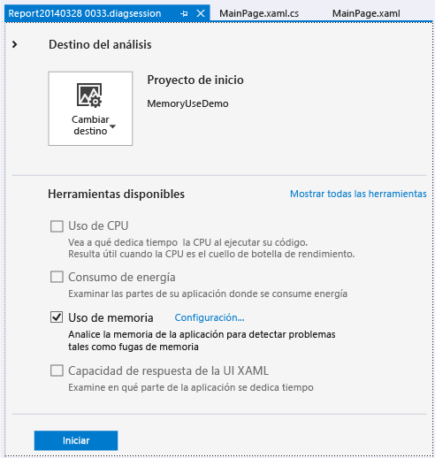
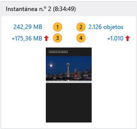
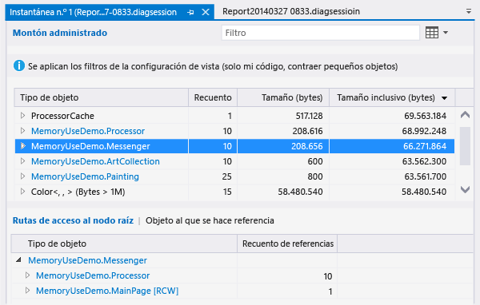
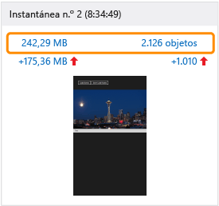
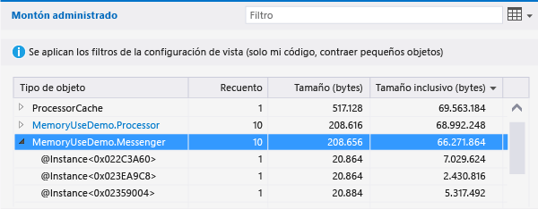
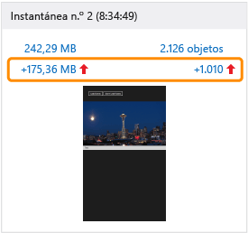
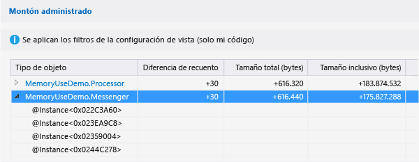
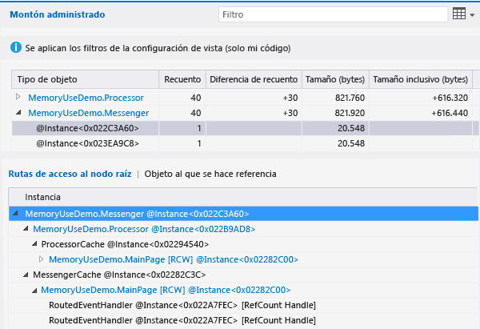

# Uso de memoria sin el depurador
Puede usar la herramienta **Uso de memoria** sin depuración para lo siguiente:  
  
-   Supervisar el uso de memoria de la aplicación directamente en Visual Studio mientras desarrolla un escenario.  
  
-   Crear instantáneas detalladas del estado de la memoria de la aplicación.  
  
-   Comparar instantáneas para localizar la causa raíz de problemas de memoria.  
  
 En este tema se describe cómo usar la herramienta Uso de memoria para analizar aplicaciones XAML universales de Windows. Si desea analizar el uso de memoria en aplicaciones universales de Windows que usan JavaScript y HTML, consulte [Analizar el uso de memoria (JavaScript)](http://msdn.microsoft.com/library/windows/apps/jj819176.aspx).  
  
##   Iniciar una sesión de diagnóstico de uso de memoria  
  
1.  Abra en Visual Studio un proyecto de Windows universal de C#.  
  
2.  En la barra de menús, elija **Depurar / Generador de perfiles de rendimiento...**  
  
3.  Seleccione **Uso de memoria** y después elija el botón **Iniciar** situado en la parte inferior de la página.  
  
       
  
##   Supervisar el uso de memoria  
 Aunque puede usar la herramienta **Uso de memoria** para generar informes detallados que puede usar para buscar y corregir errores, también puede usarlo para estudiar los efectos de memoria en tiempo real de un escenario que esté desarrollando.  
  
 Al iniciar una sesión de diagnóstico, se inicia la aplicación y la ventana **Herramientas de diagnóstico** muestra un gráfico de escala de tiempo del uso de memoria de la aplicación.  
  
   
  
 El gráfico de escala de tiempo muestra las fluctuaciones de memoria de la aplicación mientras se ejecuta. Los picos del gráfico suelen indicar que hay código recopilando o creando datos que luego descarta una vez que termina el procesamiento. Los picos acusados indican áreas que se podrían optimizar. Más preocupante es un aumento del consumo de memoria que no se devuelva, ya que podría indicar un uso de memoria ineficaz o incluso una fuga de la misma.  
  
###   Cerrar una sesión de supervisión  
   
  
 Para detener una sesión de supervisión sin crear un informe, simplemente cierre la ventana de diagnóstico. Para generar un informe si ha tomado instantáneas de memoria, seleccione **Detener**.  
  
##   Tomar instantáneas del estado de memoria de la aplicación  
 Si detecta un problema de memoria que quiera investigar, puede tomar instantáneas durante la sesión de diagnóstico para capturar objetos de memoria en momentos concretos. Dado que una aplicación usa un gran número de muchos tipos de objetos, es posible que quiera concentrar el análisis en un escenario. También es buena idea obtener una instantánea de línea de base de la aplicación antes de la aparición del problema de memoria, otra tras la primera aparición del problema y una o varias más si puede repetir el escenario.  
  
 Para recopilar instantáneas, inicie una nueva sesión de diagnóstico. Elija **Tomar instantánea** cuando quiera capturar los datos de memoria. Para generar un informe, seleccione **Detener**.  
  
##   Página de información general de uso de memoria  
 Una vez detenida la recopilación de datos, la herramienta Uso de memoria detiene la aplicación y muestra el informe general.  
  
   
  
###   Vistas de instantánea de uso de memoria  
 Para abrir informes detallados en nuevas ventanas de Visual Studio se usan vistas de instantánea. Hay dos tipos de vistas de instantánea:  
  
-   Un [Informe detallado de instantánea](../profiling/memory-usage-without-debugging2.md#BKMK_Snapshot_details_reports) muestra los tipos y las instancias en una instantánea.  
  
-   Un [Informe de diferencias de instantáneas (diff)](../profiling/memory-usage-without-debugging2.md#BKMK_Snapshot_difference__diff__reports) compara los tipos y las instancias en las dos instantáneas.  
  
   
  
 Los elementos numerados de la imagen de la vista de instantánea son vínculos que abren vistas de informe de Uso de memoria.  
  
|||  
|-|-|  
||El texto del vínculo muestra el número total de bytes en memoria cuando se tomó la instantánea.   Seleccione este vínculo para mostrar un informe de detalles de instantánea ordenado por el tamaño total de las instancias de tipo.|  
||El texto del vínculo muestra el número total de objetos en memoria cuando se tomó la instantánea.   Seleccione este vínculo para mostrar un informe de detalles de instantánea ordenado por el recuento de instancias de los tipos.|  
||El texto del vínculo muestra la diferencia entre el tamaño total de objetos en memoria en el momento de esta instantánea y el tamaño total de la instantánea anterior.   Si el tamaño de memoria de esta instantánea es mayor que el de la anterior, el texto del vínculo es un número positivo, y es negativo si el tamaño es menor. El texto del vínculo **Línea de base** indica que esta instantánea es la primera de la sesión de diagnóstico; **Ninguna diferencia** indica que la diferencia es cero.   Seleccione este vínculo para mostrar un informe diferencial de instantánea ordenado por la diferencia en cuanto al tamaño total de instancias de los tipos.|  
||El texto del vínculo muestra la diferencia entre el número total de objetos de memoria de esta instantánea y el número de objetos de la instantánea anterior.   Seleccione este vínculo para mostrar un informe diferencial de instantánea ordenado por la diferencia en cuanto al recuento total de instancias de los tipos.|  
  
##   Informes de instantánea  
   
  
###   Árboles de informe de instantánea  
  
####   Montón administrado  
 El árbol de montón administrado [árbol de Montón administrado (detalles de instantánea)](../profiling/memory-usage-without-debugging2.md#BKMK_Managed_Heap_tree__Snapshot_details_) y el [árbol Montón administrado (diferencias de instantáneas)](../profiling/memory-usage-without-debugging2.md#BKMK_Managed_Heap_tree__Snapshot_diff_) muestran los tipos y las instancias en el informe. Al seleccionar un tipo o una instancia se muestran los árboles **Rutas de acceso al nodo raíz** y **Objetos a los que se hace referencia** para el elemento seleccionado.  
  
####   Rutas de acceso al nodo raíz  
 El [árbol Rutas de acceso al nodo raíz (detalles de instantánea)](../profiling/memory-usage-without-debugging2.md#BKMK_Paths_to_Root_tree__Snapshot_details_) y el [árbol Rutas de acceso al nodo raíz (diferencias de instantáneas)](../profiling/memory-usage-without-debugging2.md#BKMK_Paths_to_Root_tree__Snapshot_diff_) muestran la cadena de objetos que hace referencia al tipo o a la instancia. El recolector de elementos no utilizados de .NET Framework borra un objeto de la memoria únicamente si todas las referencias a él se han liberado.  
  
####   Objetos a los que se hace referencia  
 El [árbol Objetos a los que se hace referencia (detalles de instantánea)](../profiling/memory-usage-without-debugging2.md#BKMK_Referenced_Objects_tree__Snapshot_details_) y el [árbol Objetos a los que se hace referencia (diferencias de instantáneas)](../profiling/memory-usage-without-debugging2.md#BKMK_Referenced_Objects_tree__Snapshot_diff_) muestran los objetos a los que hace referencia el tipo o la instancia seleccionados.  
  
###   Campos Tipo de objeto e Instancia  
 Cuando una entrada **Tipo de objeto** tiene entradas secundarias, puede elegir el icono de flecha para mostrarlas. Si el color del texto de **Tipo de objeto** es azul, puede elegirlo para ir al objeto en su archivo de código fuente. El archivo de código fuente se abre en una ventana independiente.  
  
 Los nombres de instancia son identificadores únicos generados por la herramienta Uso de memoria.  
  
 Si observa un tipo que no puede identificar fácilmente o que no sabe cómo interactúa con el código, es probable que sea un objeto de .NET Framework, del sistema operativo o del compilador que muestra la herramienta Uso de memoria porque está implicado en las cadenas de propiedad de los objetos.  
  
###   Filtros de árbol de informes  
 La mayoría de las aplicaciones contiene un número de tipos asombrosamente grande, la mayor parte de los cuales no resulta muy interesante para el desarrollador de aplicaciones. La herramienta **Uso de memoria** define dos filtros que se pueden usar para ocultar la mayoría de estos tipos en los árboles **Montón administrado** y **Rutas de acceso al nodo raíz**. También es posible filtrar un árbol por nombre de tipo.  
  
   
  
####   Filtrar  
 Escriba una cadena en el cuadro **Filtrar** para restringir las vistas del árbol a tipos que contengan el texto especificado. El filtro no distingue mayúsculas de minúsculas y reconoce la cadena especificada en cualquier parte de los nombres de tipo.  
  
####   Contraer objetos pequeños  
 Si se aplica este filtro, aquellos tipos cuyo **Tamaño (bytes)** sea inferior al 0,5 por ciento del tamaño total de la memoria de instantánea se ocultan en la lista **Montón administrado**.  
  
####   Solo mi código  
 El filtro **Solo mi código** oculta la mayoría de las instancias generadas por código externo. Los tipos externos son propiedad del sistema operativo o de componentes de Framework o son generados por el compilador.  
  
##   Informes de detalles de instantánea  
 El informe de detalles de instantánea se usa para centrarse en una instantánea de una sesión de diagnóstico. Para abrir un informe de detalles, elija uno de los vínculos de una vista de instantánea, tal como se muestra en la siguiente imagen. Ambos vínculos abren el mismo informe, la única diferencia es el orden de inicio del árbol **Montón administrado** en el informe. En ambos casos, se puede cambiar el orden después de abrir el informe.  
  
   
  
-   El vínculo **MB** ordena el informe por la columna **Tamaño inclusivo (bytes)**.  
  
-   El vínculo **Objetos** ordena el informe por la columna **Recuento**.  
  
###   Árbol Montón administrado (detalles de instantánea)  
 El árbol **Montón administrado** enumera los tipos de objetos retenidos en memoria. Puede expandir un nombre de tipo para ver las diez mayores instancias del tipo, ordenadas por tamaño. Al seleccionar un tipo o una instancia se muestran los árboles **Rutas de acceso al nodo raíz** y **Objetos a los que se hace referencia** para el elemento seleccionado.  
  
   
  
|||  
|-|-|  
|**Tipo de objeto**|Nombre del tipo o instancia del objeto.|  
|**Recuento**|Número de instancias del objeto del tipo. Para una instancia el número siempre es 1.|  
|**Tamaño (bytes)**|Para un tipo, tamaño de todas las instancias del tipo en la instantánea de memoria, sin incluir el tamaño de objetos incluidos en las instancias.   Para una instancia, tipo, tamaño del objeto sin incluir el tamaño de objetos incluidos en la instancia. instancias.|  
|**Tamaño inclusivo (bytes)**|Tamaño de las instancias del tipo o tamaño de una única instancia, incluso el tamaño de los objetos incluidos.|  
  
###   Rutas de acceso al árbol raíz (detalles de instantánea)  
 El árbol **Ruta de acceso al nodo raíz** muestra la cadena de objetos que hace referencia al tipo o instancia. El recolector de elementos no utilizados de .NET Framework borra un objeto de la memoria únicamente si todas las referencias a él se han liberado.  
  
   
  
 Cuando ve un tipo en el árbol **Rutas de acceso al nodo raíz**, el número de objetos de los tipos que retienen referencias a ese tipo se muestra en la columna **Recuento de referencias**. La columna no aparece al analizar una instancia.  
  
###   Árbol Objetos a los que se hace referencia (detalles de instantánea)  
 El árbol **Objetos a los que se hace referencia** muestra los objetos a los que hace referencia el tipo o instancia seleccionado.  
  
   
  
|||  
|-|-|  
|**Tipo o instancia de objeto**|Nombre del tipo o instancia del objeto.|  
|**Tamaño (bytes)**|Para un tipo, tamaño de todas las instancias del tipo, sin incluir el tamaño de objetos incluidos en el tipo.   Para una instancia, tamaño del objeto sin incluir el tamaño de objetos incluidos en el objeto.|  
|**Tamaño inclusivo (bytes)**|Tamaño de las instancias del tipo o tamaño de la instancia, incluso el tamaño de los objetos incluidos.|  
  
##   Informes de diferencias de instantánea  
 Un informe de diferencias de instantánea muestra los cambios entre una instantánea principal y la tomada inmediatamente antes. Para abrir un informe de diferencias, elija uno de los vínculos de una vista de instantánea, tal como se muestra en la siguiente imagen. Ambos vínculos abren el mismo informe, la única diferencia es el orden de inicio del árbol **Montón administrado** en el informe. Puede cambiar el orden después de abrir el informe.  
  
   
  
-   El vínculo **MB** ordena el informe por la columna **Tamaño inclusivo (bytes)**.  
  
-   El vínculo **Objetos** ordena el informe por la columna **Recuento**.  
  
###   Árbol Montón administrado (diferencias de instantánea)  
 El árbol **Montón administrado** enumera los tipos de objetos retenidos en memoria. Puede expandir un nombre de tipo para ver las diez mayores instancias del tipo, ordenadas por tamaño. Al seleccionar un tipo o una instancia se muestran los árboles **Rutas de acceso al nodo raíz** y **Objetos a los que se hace referencia** para el elemento seleccionado.  
  
   
  
 Tenga en cuenta que en la imagen se han contraído las columnas **Recuento**, **Tamaño (bytes)** y **Tamaño inclusivo (bytes)**.  
  
|||  
|-|-|  
|**Tipo de objeto**|Nombre del tipo o instancia del objeto.|  
|**Recuento**|Número de instancias de un tipo en la instantánea principal. **Recuento** siempre es 1 para una instancia.|  
|**Diferencia de recuento**|Para un tipo, diferencia en cuanto al número de instancias del tipo entre la instantánea principal y la anterior. Para una instancia el campo está en blanco.|  
|**Tamaño (bytes)**|Tamaño de los objetos de la instantánea principal, sin incluir el tamaño de los objetos incluidos en los objetos. Para un tipo, **Tamaño (bytes)** y **Tamaño inclusivo (bytes)** son los totales de los tamaños de las instancias del tipo.|  
|**Diferencia de tamaño total (bytes)**|Para un tipo, diferencia en el tamaño total de instancias del tipo entre la instantánea principal y la anterior, sin incluir el tamaño de objetos incluidos en las instancias. Para una instancia el campo está en blanco.|  
|**Tamaño inclusivo (bytes)**|Tamaño de los objetos de la instantánea principal, incluso el tamaño de los objetos incluidos en los objetos.|  
|**Diferencia de tamaño inclusivo (bytes)**|Para un tipo, diferencia en el tamaño de todas las instancias del tipo entre la instantánea principal y la anterior, incluso el tamaño de objetos incluidos en los objetos. Para una instancia el campo está en blanco.|  
  
###   Árbol Rutas de acceso al nodo raíz (diferencias de instantánea)  
 El árbol **Ruta de acceso al nodo raíz** muestra la cadena de objetos que hace referencia al tipo o instancia. El recolector de elementos no utilizados de .NET Framework borra un objeto de la memoria únicamente si todas las referencias a él se han liberado.  
  
   
  
###   Árbol Objetos a los que se hace referencia (diferencias de instantánea)  
 El árbol **Objetos a los que se hace referencia** muestra los objetos a los que hace referencia el tipo o instancia principal.  
  
   
  
|||  
|-|-|  
|**Tipo o instancia de objeto**|Nombre del tipo o instancia del objeto.|  
|**Tamaño (bytes)**|Para una instancia, tamaño del objeto en la instantánea principal, sin incluir el tamaño de objetos incluidos en la instancia.   Para un tipo, tamaño total de las instancias del tipo en la instantánea principal, sin incluir el tamaño de objetos incluidos en la instancia.|  
|**Tamaño inclusivo (bytes)**|Tamaño de los objetos de la instantánea principal, incluso el tamaño de los objetos incluidos en los objetos.|  
  
## Vea también  
 [Memoria de JavaScript](../profiling/javascript-memory.md)
 [Herramientas de generación de perfiles](../profiling/profiling-tools.md)
 [Procedimientos recomendados para aplicaciones de la Tienda Windows con C++, C# y Visual Basic](http://msdn.microsoft.com/library/windows/apps/hh750313.aspx)   
 [Diagnosticar problemas de memoria con la nueva herramienta Uso de memoria en Visual Studio](http://go.microsoft.com/fwlink/p/?LinkId=394706)
