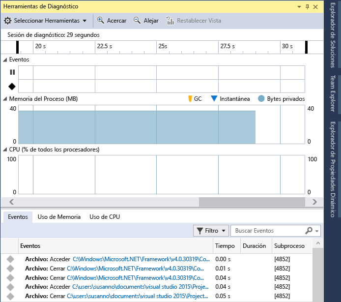
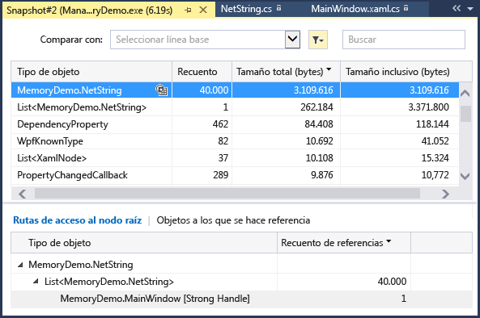
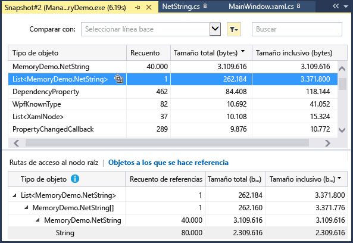
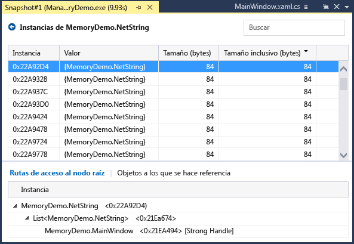
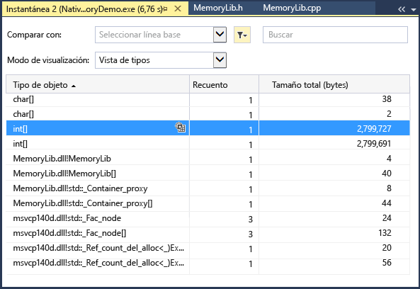

# Medición del uso de memoria en Visual Studio
Busque pérdidas de memoria y memoria ineficaz durante la depuración con la herramienta de diagnóstico **Uso de memoria** integrada del depurador. La herramienta Uso de memoria permite tomar una o más *instantáneas* del montón de memoria nativa y administrada para que pueda conocer el impacto del uso de memoria de los tipos de objeto. Puede recopilar instantáneas de aplicaciones .NET, nativas o de modo mixto (.NET y nativo).  
  
 En el gráfico siguiente se muestra la ventana **Herramientas de diagnóstico** (disponible en Visual Studio 2015 Update 1 y versiones posteriores):  
  
   
  
 Aunque puede recopilar instantáneas de memoria en cualquier momento en la herramienta **Uso de memoria** , puede usar el depurador de Visual Studio para controlar cómo se ejecuta la aplicación mientras investiga los problemas de rendimiento. Las acciones del depurador como establecer puntos de interrupción, ejecutar paso a paso e interrumpir todos, entre otras, pueden ayudarle a centrarse en las investigaciones de rendimiento en las rutas de acceso de código que son más importantes. Si realiza esas acciones mientras la aplicación se ejecuta, puede eliminar el ruido del código que no le interesa y reducir considerablemente la cantidad de tiempo necesario para diagnosticar un problema.  
  
 También puede usar la herramienta de memoria fuera del depurador. Vea [Memory Usage without Debugging](../profiling/memory-usage-without-debugging2.md) (Uso de memoria sin depuración). Puede usar las herramientas de generación de perfiles sin el depurador adjunto con Windows 7 y versiones posteriores. Para ejecutar las herramientas de generación de perfiles con el depurador se requiere Windows 8 y versiones posteriores (ventana **Herramientas de diagnóstico**).
  
> [!NOTE]
>  **Compatibilidad con el asignador personalizado** El generador de perfiles de memoria nativa funciona mediante la recopilación de datos de asignación de eventos de [ETW](/windows-hardware/drivers/devtest/event-tracing-for-windows--etw-) que se emiten en tiempo de ejecución.  Los asignadores de CRT y Windows SDK se han anotado en el nivel de origen para que se pueden capturar los datos de asignación.  Si escribe sus propios asignadores, las funciones que devuelven un puntero a la memoria de montón recientemente asignada se pueden decorar con [__declspec](/cpp/cpp/declspec)(allocator), tal como se muestra en este ejemplo para myMalloc:  
>   
>  `__declspec(allocator) void* myMalloc(size_t size)` 

En este tutorial va a:

> [!div class="checklist"]
> * Tomar instantáneas de la memoria
> * Analizar el uso de memoria

## Recopilar datos de uso de memoria

1.  Abra el proyecto que desee depurar en Visual Studio y establezca un punto de interrupción en la aplicación en el punto donde desee empezar a examinar el uso de memoria.

    Si tiene un área donde sospecha que hay un problema de memoria, establezca el primer punto de interrupción antes de que se produzca dicho problema.

    > [!TIP]
    >  Dado que puede resultar complicado capturar el perfil de memoria de una operación que le interese cuando la aplicación asigna y desasigna memoria con frecuencia, establezca puntos de interrupción al principio y al final de la operación (o revise paso a paso la operación) para buscar el punto exacto en que se modificó la memoria. 

2.  Establezca un segundo punto de interrupción al final de la función o la región de código que quiera analizar (o después de que se produzca un problema de memoria sospechado).
  
3.  La ventana **Herramientas de diagnóstico** aparece automáticamente a no ser que la desactive. Para que la ventana se vuelva a mostrar, haga clic en **Depurar** > **Windows** > **Mostrar Herramientas de diagnóstico**.

4.  Elija **Uso de memoria** con la opción **Seleccionar herramientas** en la barra de herramientas.

     

5.  Haga clic en **Depurar / Iniciar depuración** (o **Inicio** en la barra de herramientas o **F5**).

     Cuando la aplicación finaliza la carga, se muestra la vista Resumen de las herramientas de diagnóstico.

     

     > [!NOTE]
     >  Dado que la recopilación de datos de memoria puede afectar al rendimiento de depuración de las aplicaciones nativas o de modo mixto, las instantáneas de memoria están deshabilitadas de forma predeterminada. Para habilitar las instantáneas en aplicaciones nativas o de modo mixto, inicie una sesión de depuración (tecla de método abreviado: **F5**). Cuando aparezca la ventana **Herramientas de diagnóstico**, seleccione la pestaña **Uso de memoria** y luego elija **Generación de perfiles de montón**.  
     >   
     >    
     >   
     >  Detenga (tecla de método abreviado: **Mayús**+**F5**) y reinicie la depuración.  

6.  Para tomar una instantánea al comienzo de la sesión de depuración, elija **Instantánea** en la barra de herramientas reducida **Uso de memoria**. (Puede ser útil para establecer un punto de interrupción aquí también.)

     
     
     > [!TIP]
     >  Para crear una línea base para las comparaciones de memoria, considere la posibilidad de tomar una instantánea al comienzo de la sesión de depuración.  

6.  Ejecute el escenario que hará que se alcance el primer punto de interrupción.

7.  Mientras el depurador está en pausa en el primer punto de interrupción, elija **Instantánea** en la barra de herramientas reducida **Uso de memoria**.  

8.  Presione **F5** para ejecutar la aplicación hasta el segundo punto de interrupción.

9.  Ahora, haga otra instantánea.

     En este punto, puede empezar a analizar los datos.    
  
## Analizar el uso de memoria
Las filas de la tabla de resumen Uso de memoria enumeran las instantáneas que se tomaron durante la sesión de depuración y proporcionan vínculos a vistas más detalladas.

 El nombre de las columnas dependen del modo de depuración seleccionado en las propiedades del proyecto: .NET, nativo o mixto (.NET y nativo).  
  
-   Las columnas **Objetos (dif.)** y **Asignaciones (dif.)** muestran el número de objetos en la memoria .NET y nativa cuando se tomó la instantánea.  
  
-   La columna **Tamaño de montón (dif.)** muestra el número de bytes en los montones .NET y nativos. 

Cuando se toman varias instantáneas, las celdas de la tabla de resumen incluyen el cambio de valor entre la instantánea de la fila y la instantánea anterior.  

Para analizar el uso de memoria, haga clic en uno de los vínculos que abre un informe detallado del uso de memoria:  

- Para ver los detalles de la diferencia entre la instantánea actual y la anterior, elija el vínculo de cambio a la izquierda de la flecha (). Una flecha roja indica un aumento en el uso de memoria, mientras que una flecha verde indica una disminución.

  > [!TIP]
  >  Para ayudar a identificar problemas de memoria más rápidamente, los informes de diferencias se ordenan por tipos de objeto que más aumentaron en número total (haga clic en el vínculo de cambio en la columna **Objetos (dif.)**) o que más aumentaron en el tamaño total del montón (haga clic en el vínculo de cambio en la columna **Tamaño de montón (dif.)**).

- Para ver los detalles únicamente de la instantánea seleccionada, haga clic en el vínculo de no cambio. 
  
  El informe aparece en una ventana separada.   
  
### Informes de tipos administrados  
 Elija el vínculo actual de una celda **Objetos (dif.)** o **Asignaciones (dif.)** de la tabla de resumen Uso de memoria.  
  
   
  
 El panel superior muestra el número y el tamaño de los tipos en la instantánea, incluido el tamaño de todos los objetos a los que hace referencia el tipo (**Tamaño inclusivo**).  
  
 El árbol **Rutas de acceso al nodo raíz** en el panel inferior muestra los objetos que hacen referencia al tipo seleccionado en el panel superior. El recolector de elementos no utilizados de .NET Framework limpia la memoria de un objeto solo cuando se libera el último tipo que hace referencia a él.  
  
 El árbol **Tipos a los que se hace referencia** muestra las referencias que se incluyen en el tipo seleccionado en el panel superior.  
  
   
  
 Para mostrar las instancias de un tipo seleccionado en el panel superior, seleccione el icono .  
  
   
  
 La vista **Instancias** muestra las instancias del objeto seleccionado en la instantánea en el panel superior. Los paneles **Rutas de acceso al nodo raíz** y **Objetos a los que se hace referencia** muestran los objetos que hacen referencia a la instancia seleccionada y los tipos a los que hace referencia la instancia seleccionada. Cuando el depurador se detiene en el punto donde se tomó la instantánea, puede desplazar el puntero sobre la celda **Valor** para mostrar los valores del objeto en la información sobre herramientas.  
  
### Informes de tipo nativo  
 Elija el vínculo actual de una celda **Asignaciones (dif.)** o **Tamaño de montón (dif.)** en la tabla de resumen Uso de memoria de la ventana **Herramientas de diagnóstico** .  
  
   
  
 La **Vista de tipos** muestra el número y el tamaño de los tipos de la instantánea.  
  
-   Elija el icono de instancias () de un tipo seleccionado para mostrar información sobre los objetos del tipo seleccionado en la instantánea.  
  
     La vista **Instancias** muestra cada instancia del tipo seleccionado. Al seleccionar una instancia se muestra la pila de llamadas que produjo la creación de la instancia en el panel **Pila de llamadas de asignación** .  
  
       
  
-   Elija **Vista de pilas** en la lista **Modo de vista** para ver la pila de asignación del tipo seleccionado.  
  
       
  
### Informes de cambios (diferencias)  
  
- Elija el vínculo de cambio en una celda de la tabla de resumen de la pestaña **Uso de memoria** en la ventana **Herramientas de diagnóstico** .  
  
     
  
- Elija una instantánea de la lista **Comparar con** en un informe administrado o nativo.  
  
     
  
  El informe de cambios agrega columnas (marcadas con **(Dif.)**) al informe base, que muestran la diferencia entre el valor de la instantánea de base y la instantánea de comparación. Este es el aspecto de un informe de diferencias de la vista de tipo nativo:  
  
    
  
## Blogs y vídeos  

| | |
|---------|---------|
|  | [Vea un vídeo](https://mva.microsoft.com/en-US/training-courses-embed/getting-started-with-visual-studio-2017-17798/Profiling-with-Diagnostics-Tools-in-Visual-Studio-2017-daHnzMD6D_9211787171) sobre cómo utilizar las herramientas de diagnóstico en el que se muestra cómo analizar el uso de CPU y de memoria en Visual Studio 2017. |

 [Analyze CPU and Memory While Debugging](https://blogs.msdn.microsoft.com/visualstudio/2016/02/15/analyze-cpu-memory-while-debugging/) (Análisis de la CPU y la memoria durante la depuración)  
  
 [Blog de Visual C++: Generación de perfiles de memoria en Visual C++ 2015](https://blogs.msdn.microsoft.com/vcblog/2015/10/21/memory-profiling-in-visual-c-2015/)  

## Pasos siguientes

En este tutorial, ha aprendido cómo recopilar y analizar los datos de uso de la memoria. Si ha completado el [paseo por el generador de perfiles](../profiling/profiling-feature-tour.md), puede que desee obtener una visión rápida de cómo analizar el uso de la CPU en las aplicaciones.

> [!div class="nextstepaction"]
> [Análisis del uso de la CPU](../profiling/beginners-guide-to-performance-profiling.md) 