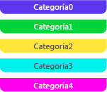

# Marcadores de intervalo
[!INCLUDE[vs2017banner](../code-quality/includes/vs2017banner.md)]

Un marcador del intervalo representa una fase significativa de la aplicación.  Por ejemplo, se puede utilizar un intervalo para representar un intervalo de tiempo durante el que se está procesando un elemento de trabajo determinado.  Su longitud representa la duración de la fase correspondiente de la aplicación.  Esta ilustración muestra un intervalo del Visualizador de simultaneidad:  
  
   
Un marcador de intervalo en el Visualizador de simultaneidad  
  
## Categoría de intervalos  
 Los marcadores de intervalos se muestran en uno de los cinco colores diferentes, según su categoría.  Se repiten los colores si hay más de cinco categorías.  La categoría puede ser cualquier entero.  Esta ilustración muestra los cinco colores posibles:  
  
   
Los colores de las primeras cinco categorías de intervalos  
  
## Marcadores de agregación de intervalo  
 Los marcadores de intervalo aparecen a veces tan cerca uno de otro en el Visualizador de simultaneidad que no se pueden dibujar individualmente.  Cuando esto ocurre, se muestra *un marcador deshabilitado de agregación del intervalo* que representa los intervalos subyacentes.  Cuando se sitúa el puntero en uno de estos iconos, un mensaje muestra el número de intervalos subyacentes que se representan.  Para ver los intervalos, acérquelos con el zoom.  Si los acerca hasta el final y aun sigue obteniendo un marcador de agregación del intervalo, se pueden ver los marcadores subyacentes del intervalo en [Informe de marcadores](../profiling/markers-report.md).  Esta ilustración muestra un marcador de agregación de intervalo:  
  
   
Un marcador de agregación de intervalo  
  
## Vea también  
 [Marcadores del Visualizador de simultaneidad](../profiling/concurrency-visualizer-markers.md)   
 [SDK del Visualizador de simultaneidad](../profiling/concurrency-visualizer-sdk.md)