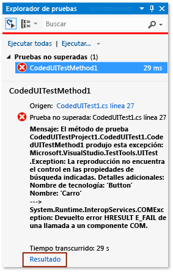
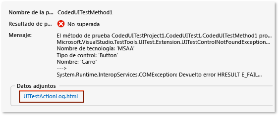
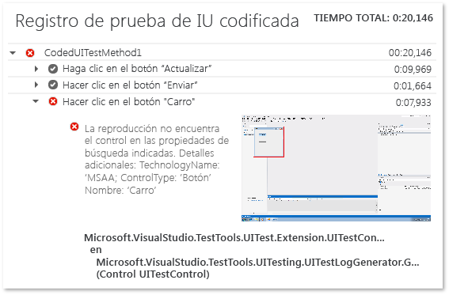

# <a name="analyzing-coded-ui-tests-using-coded-ui-test-logs"></a>Analizar pruebas de IU codificadas usando los registros de pruebas de IU codificadas

Los registros de pruebas de IU codificadas filtran y guardan información importante sobre las series de pruebas de IU codificadas. Los registros se muestran en un formato que permite depurar problemas rápidamente.

## <a name="step-1-enable-logging"></a>Paso 1: habilitar el registro

En función de su escenario, use uno de los siguientes métodos para habilitar el registro:

- .NET Framework versión 4 de destino sin archivo *App.config* en el proyecto de prueba:

   1. Abra el archivo **QTAgent32_40.exe.config**. De forma predeterminada, este archivo se encuentra en *%ProgramFiles(x86)%\Microsoft Visual Studio\2017\Enterprise\Common7\IDE*.

   2. Modifique el valor de EqtTraceLevel para que tenga el nivel de registro que quiera.

   3. Guarde el archivo.

- .NET Framework versión 4.5 de destino sin archivo *App.config* en el proyecto de prueba:

   1. Abra el archivo **QTAgent32.exe.config**. De forma predeterminada, este archivo se encuentra en *%ProgramFiles(x86)%\Microsoft Visual Studio\2017\Enterprise\Common7\IDE*.

   2. Modifique el valor de EqtTraceLevel para que tenga el nivel de registro que quiera.

   3. Guarde el archivo.

- Archivo *App.config* en el proyecto de prueba:

    - Abra el archivo *App.config* en el proyecto y agregue el siguiente código bajo el nodo de configuración:

      ```xml
      <system.diagnostics>
        <switches>
          <add name="EqtTraceLevel" value="4" />
        </switches>
      </system.diagnostics>`
      ```

- Habilitar el registro desde el propio código de prueba:

   <xref:Microsoft.VisualStudio.TestTools.UITesting.PlaybackSettings.LoggerOverrideState%2A> = HtmlLoggerState.AllActionSnapshot;

## <a name="step-2-run-your-coded-ui-test-and-view-the-log"></a>Paso 2: ejecutar la prueba de interfaz de usuario codificada y ver el registro

Cuando ejecute una prueba automatizada de IU una vez realizadas las modificaciones en el archivo **QTAgent32.exe.config**, verá que hay un vínculo de salida en los resultados del Explorador de pruebas. Los archivos de registro no solo se generan cuando la prueba produzca un error, sino también para las pruebas correctas cuando el nivel de seguimiento sea "detallado".

1.  En el menú **Prueba**, seleccione **Ventanas** y después elija **Explorador de pruebas**.

2.  En el menú **Compilar** , elija **Compilar solución**.

3.  En el Explorador de pruebas, seleccione la prueba de IU codificada que quiera ejecutar, abra el menú contextual y después elija **Ejecutar pruebas seleccionadas**.

     Las pruebas automatizadas se ejecutan e indican si se superan o no.

    > [!TIP]
    > Para ver el Explorador de pruebas, elija **Prueba** > **Ventanas** y, después, seleccione **Explorador de pruebas**.

4.  Elija el vínculo **Resultado** en el Explorador de pruebas.

     

     Con esto se muestra la salida de la prueba, que incluye un vínculo al registro de acciones.

     

5.  Elija el vínculo *UITestActionLog.html*.

     El registro se muestra en el explorador web.

     

## <a name="see-also"></a>Vea también

- [Usar Automatización de la interfaz de usuario para probar el código](../test/use-ui-automation-to-test-your-code.md)
- [Cómo: Ejecutar pruebas desde Microsoft Visual Studio](http://msdn.microsoft.com/Library/1a1207a9-2a33-4a1e-a1e3-ddf0181b1046)