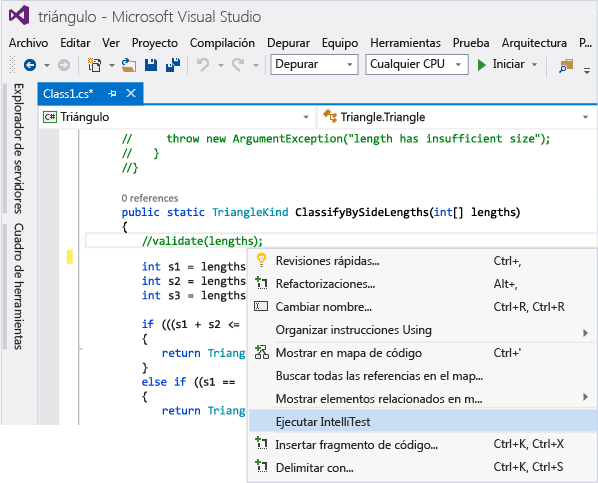
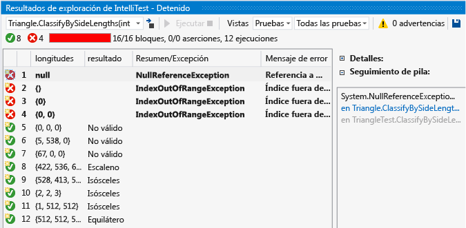
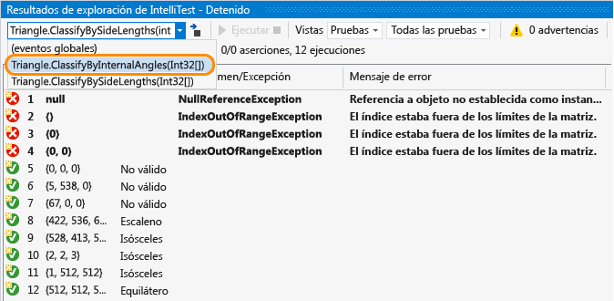
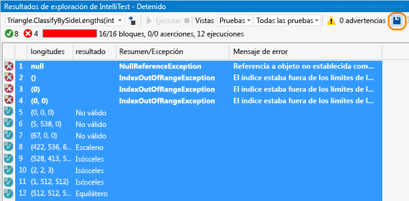
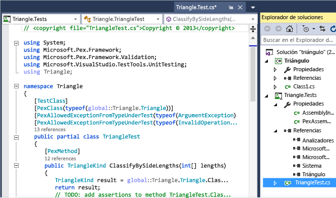
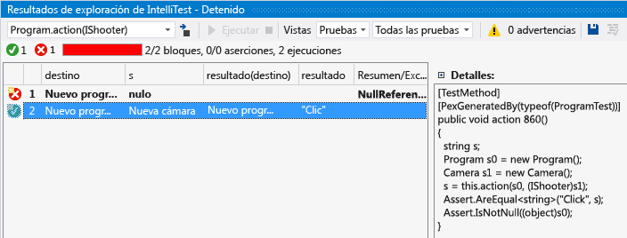
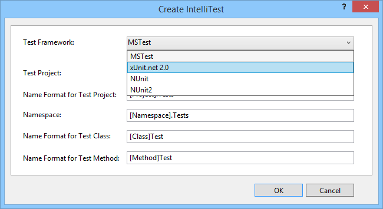

# Generar pruebas unitarias para el código con IntelliTest
IntelliTest explora el código .NET para generar datos de prueba y un conjunto de pruebas unitarias. Para cada instrucción en el código, se genera una entrada de prueba que ejecutará esa instrucción. Se lleva a cabo un análisis de caso para cada bifurcación condicional en el código. Por ejemplo, se analizan las instrucciones `if`, las aserciones y todas las operaciones que pueden producir excepciones. Con este análisis puede generar los datos de pruebas que deben usarse en una prueba unitaria parametrizada para cada método. También crea pruebas unitarias con una cobertura de código elevada.

 Cuando ejecuta Intelltest, puede ver fácilmente qué pruebas son las que fallan y agregar cualquier código para corregirlas. Puede seleccionar las pruebas generadas que quiere guardar en un proyecto de prueba para proporcionar un conjunto de regresión. Cuando cambie el código, vuelva a ejecutar IntelliTest para mantener sincronizadas las pruebas generadas con los cambios de código.

## Disponibilidad y extensiones

Los comandos de menú **Crear IntelliTest** y **Ejecutar IntelliTest**:

* Solo están disponibles en la edición Enterprise de Visual Studio 2015 y versiones posteriores.

* Solo admiten código de C# que tenga como destino .NET Framework.

* Son [extensibles](#extend-framework) y admiten la emisión de pruebas en formato MSTest, MSTest V2, NUnit y xUnit.

* No admiten la configuración x64.

## Explorar: use IntelliTest para explorar el código y generar pruebas unitarias
 Para generar las pruebas unitarias, los tipos deben ser públicos. De lo contrario, [cree pruebas unitarias](#NoRun) primero antes de generarlos.

1.  Abra su solución en Visual Studio. Luego, abra el archivo de clase que tiene los métodos que desea probar.

2.  Haga clic con el botón derecho en un método del código y genere las pruebas unitarias para el código del método haciendo clic en **Ejecutar IntelliTest** .

     

     IntelliTest ejecuta el código muchas veces con diferentes entradas. Cada ejecución se representa en la tabla que muestra los datos de las pruebas entrantes y la salida o excepción resultante.

     

     Para generar pruebas unitarias para todos los métodos públicos en una clase, simplemente haga clic con el botón secundario en la clase en lugar del método específico. A continuación, elija **Ejecutar IntelliTest**. Use la lista desplegable en la ventana **Resultados de exploración** para visualizar las pruebas unitarias y los datos entrantes para cada método en la clase.

     

     En cuanto a las pruebas superadas, compruebe que los resultados de los cuales se informa en la columna de resultados coincidan con sus expectativas con respecto a su código. Si algunas pruebas generan un error, corrija el código según corresponda. Después vuelva a ejecutar IntelliTest para validar las correcciones.

## Persistir: guarde las pruebas unitarias como un conjunto de regresión

1.  Seleccione las filas de datos que desea guardar con la prueba unitaria parametrizada en un proyecto de pruebas.

     

     Puede ver el proyecto de prueba y la prueba unitaria parametrizada que se ha creado; las pruebas unitarias individuales correspondientes a cada una de las filas se guardan en el archivo *.g.cs* del proyecto de prueba y, la prueba unitaria parametrizada, en el archivo *.cs* correspondiente. Puede ejecutar las pruebas unitarias y ver los resultados desde el Explorador de pruebas, tal como lo haría con cualquier prueba unitaria que haya creado manualmente.

     

     También se agregan al proyecto de pruebas todas las referencias necesarias.

     Si el código del método cambia, vuelva a ejecutar IntelliTest para mantener sincronizadas las pruebas unitarias con los cambios.

## Ayudar: use IntelliTest para centrarse en la exploración del código

1.  Si el código es más complejo, IntelliTest le facilitará la exploración. Por ejemplo, si un método tiene una interfaz como parámetro y varias clases implementan dicha interfaz, IntelliTest descubre esas clases y notifica una advertencia.

     Vea las advertencias para decidir qué quiere hacer.

     

2.  Tras investigar el código e identificar qué desea probar, puede corregir la advertencia para elegir las clases con las que se debe probar la interfaz.

     

     Esta opción se agrega al archivo *PexAssemblyInfo.cs*.

     `[assembly: PexUseType(typeof(Camera))]`

3.  Ahora puede volver a ejecutar IntelliTest para generar una prueba unitaria parametrizada y datos de pruebas, solo con el uso de la clase que corrigió.

     

## Especificar: use IntelliTest para validar las propiedades de corrección especificadas en el código

Especifique la relación general entre entradas y salidas que deben validar las pruebas unitarias generadas. Esta especificación se encapsula en un método similar a un método de prueba, aunque está cuantificado de forma universal. Este es el método de prueba unitaria parametrizada. Las aserciones que se realicen deberán resultar válidas para todos los valores de entrada posibles que IntelliTest pueda generar.

##  Preguntas y respuestas

### P: ¿Se puede usar IntelliTest para código no administrado?

**R:** No, IntelliTest solo funciona con código administrado.

### P: ¿Cuándo se supera o falla una prueba generada?

**R:** Se supera al igual que otras pruebas unitarias, es decir, si no ocurre ninguna excepción. Falla si se produce un error de aserción o si el código que se prueba detecta una excepción no controlada.

 Si tiene una prueba que puede superarse si se detectan determinadas excepciones, puede establecer uno de los siguientes atributos según sus requisitos en el método de prueba, clase de prueba o nivel de ensamblado:

-   **PexAllowedExceptionAttribute**

-   **PexAllowedExceptionFromTypeAttribute**

-   **PexAllowedExceptionFromTypeUnderTestAttribute**

-   **PexAllowedExceptionFromAssemblyAttribute**

### P: ¿Puedo agregar suposiciones a la prueba unitaria parametrizada?

**R:** Sí. Use suposiciones para especificar los datos de pruebas que no se necesitan para la prueba unitaria para un método específico. Use la clase <xref:Microsoft.Pex.Framework.PexAssume> para agregar hipótesis. Por ejemplo, puede agregar una suposición en que la variable de longitud no sea nula como esta.

 `PexAssume.IsNotNull(lengths);`

 Si agrega una suposición y vuelve a ejecutar IntelliTest, pueden eliminarse los datos de pruebas que ya no son relevantes.

### P: ¿Puedo agregar aserciones a la prueba unitaria parametrizada?

**R:** Sí. IntelliTest comprobará que las aserciones de su instrucción sean realmente correctas cuando ejecute las pruebas unitarias. Use la clase <xref:Microsoft.Pex.Framework.PexAssert> o la API de aserción que se incluye en el marco de pruebas para agregar aserciones. Por ejemplo, puede agregar una aserción de que dos variables son iguales.

 `PexAssert.AreEqual(a, b);`

 Si agrega una aserción y vuelve a ejecutar IntelliTest, este comprobará que su aserción sea válida o, en caso contrario, la prueba fallará.

###   P: ¿puedo generar pruebas unitarias con parámetros sin ejecutar primero IntelliTest?

**A:** Sí, haga clic con el botón secundario en la clase o método y elija **crear IntelliTest**.

 

 Acepte el formato predeterminado para generar las pruebas o cambie la denominación del proyecto y las pruebas. Puede crear un nuevo proyecto de prueba o guardar las pruebas en un proyecto existente.

 

### P: ¿Puedo usar otros marcos de pruebas unitarias con IntelliTest?

**A:** Sí, siga estos pasos para [buscar e instalar otros marcos](../test/install-third-party-unit-test-frameworks.md).
Las extensiones de marcos de pruebas también están disponibles en Visual Studio Marketplace:

* [Extensión de NUnit para los generadores de pruebas](https://marketplace.visualstudio.com/items?itemName=NUnitDevelopers.TestGeneratorNUnitextension-18371)
* [Extensión de xUnit.net para los generadores de pruebas](https://marketplace.visualstudio.com/items?itemName=BradWilson.xUnitnetTestExtensions)

Después de reiniciar Visual Studio y volver a abrir la solución, haga clic con el botón secundario en la clase o método y elija **Crear IntelliTest**. Seleccione su marco instalado aquí:

A continuación, ejecute IntelliTest para generar pruebas unitarias individuales en sus correspondientes archivos *.g.cs*.

### P: ¿Puedo obtener más información acerca de cómo se generan las pruebas?

**A:** Sí, para obtener una visión general, lea esta [publicación de blog](http://blogs.msdn.com/b/visualstudioalm/archive/2015/07/05/intellitest-one-test-to-rule-them-all.aspx).
