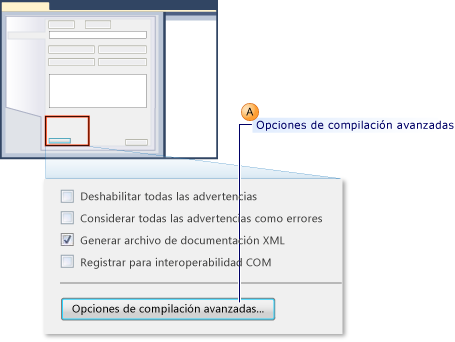
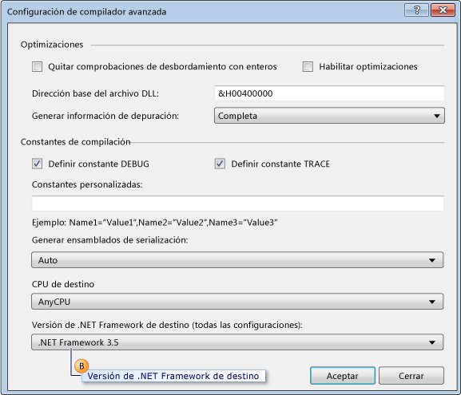

# C&#243;mo: Configurar pruebas unitarias cuyo destino sea una versi&#243;n anterior de .NET Framework
[!INCLUDE[vs2017banner](../code-quality/includes/vs2017banner.md)]

Cuando se crea un proyecto de prueba en Microsoft Visual Studio, la versión más reciente de .NET Framework se establece como destino, de forma predeterminada.  Además, si se actualizan proyectos de prueba de versiones anteriores de Visual Studio, se actualizan para dirigirlas a la versión más reciente de .NET Framework.  Cuando se editan las propiedades del proyecto, se puede redirigir explícitamente el proyecto a versiones anteriores de .NET Framework.  
  
 Se pueden crear proyectos de prueba unitaria que estén dirigidos a versiones específicas de .NET Framework.  La versión debe ser la 3.5 o posterior y no puede ser una versión del cliente.  Visual Studio habilita la siguiente compatibilidad básica para las pruebas unitarias que estén dirigidas a versiones específicas:  
  
-   Se pueden crear proyectos de prueba unitaria y dirigirlos a una versión concreta de .NET Framework.  
  
-   Se pueden ejecutar pruebas unitarias orientadas a una versión concreta de .NET Framework de Visual Studio en el equipo local.  
  
-   Se pueden ejecutar las pruebas unitarias que estén dirigidas a una versión concreta de .NET Framework utilizando MSTest.exe desde la consola de comandos.  
  
-   Puede ejecutar pruebas unitarias en un agente de compilación como parte de una compilación.  
  
 **Probar aplicaciones de SharePoint**  
  
 Las funcionalidades indicadas anteriormente también permiten escribir pruebas unitarias y pruebas de integración para aplicaciones SharePoint usando Visual Studio.  [!INCLUDE[crabout](../test/includes/crabout_md.md)] cómo desarrollar aplicaciones de SharePoint mediante Visual Studio, consulte [Crear soluciones de SharePoint](/office-dev/office-dev/create-sharepoint-solutions), [Compilar y depurar soluciones de SharePoint](/office-dev/office-dev/building-and-debugging-sharepoint-solutions) y [Comprobar y depurar código de SharePoint](/office-dev/office-dev/verifying-and-debugging-sharepoint-code).  
  
 **Limitaciones**  
  
 Las siguientes limitaciones se aplican cuando se redirigen los proyectos de prueba para utilizar versiones anteriores de .NET Framework:  
  
-   En .NET Framework 3.5, la compatibilidad con múltiples versiones \(multi\-targeting\) se admite en proyectos de prueba que solo contienen pruebas unitarias.  .NET Framework 3.5 no es compatible con ningún otro tipo de prueba, como pruebas de IU codificada o pruebas de carga.  Los cambios de destino están bloqueados en los tipos de prueba que no son pruebas unitarias.  
  
-   La ejecución de las pruebas dirigidas a una versión anterior de .NET Framework sólo se admite en el adaptador host predeterminado.  No se admite en el adaptador host de ASP.NET.  Las aplicaciones ASP.NET que tienen que ejecutarse en el contexto del servidor de desarrollo de ASP.NET deben ser compatibles con la versión actual de .NET Framework.  
  
-   La compatibilidad con la recolección de datos está deshabilitada cuando se ejecutan pruebas que admiten la compatibilidad con múltiples versiones \(multi\-targeting\) de .NET Framework 3.5.  Puede ejecutar la cobertura de código utilizando las herramientas de línea de comandos de Visual Studio.  
  
-   Las pruebas unitarias que usan .NET Framework 3.5 no puede ejecutarse en un equipo remoto.  
  
-   No se pueden establecer pruebas unitarias para versiones anteriores del marco.  
  
### Cambiar el destino a una versión concreta de .NET Framework para proyectos de prueba unitaria de Visual Basic  
  
1.  Cree un nuevo proyecto de prueba unitaria de Visual Basic.  En el menú **Archivo**, elija **Nuevo** y, a continuación, elija **Proyecto**.  
  
     Aparecerá el cuadro de diálogo **Nuevo proyecto**.  
  
2.  En **Plantillas instaladas**, expanda **Visual Basic**.  Seleccione **Prueba** y, a continuación, seleccione la plantilla **Proyecto de prueba**.  
  
3.  En el cuadro de texto **Nombre**, escriba un nombre para su proyecto de prueba de Visual Basic y, a continuación, elija **Aceptar**.  
  
4.  En el Explorador de soluciones, elija **Propiedades** en el menú contextual del nuevo proyecto de prueba de Visual Basic.  
  
     Se muestran las propiedades del proyecto de prueba de Visual Basic.  
  
5.  En la pestaña **Compilar** elija **Opciones de compilación avanzadas** tal y como se muestra en la siguiente ilustración.  
  
       
  
6.  Utilice la lista desplegable **Marco de destino \(todas las configuraciones\)** para cambiar la versión de destino a **.NET Framework 3.5** o a una versión posterior tal y como se muestra en la llamada B de la siguiente ilustración.  No debería especificarse una versión del cliente.  
  
       
  
### Cambiar el destino a una versión concreta de .NET Framework para proyectos de prueba unitaria de Visual C\#  
  
1.  Cree un nuevo proyecto de prueba unitaria de Visual C\#.  En el menú **Archivo**, elija **Nuevo** y, a continuación, elija **Proyecto**.  
  
     Aparecerá el cuadro de diálogo **Nuevo proyecto**.  
  
2.  En **Plantillas instaladas**, expanda **Visual C\#**.  Seleccione **Prueba** y, a continuación, seleccione la plantilla **Proyecto de prueba**.  
  
3.  En el cuadro de texto **Nombre**, escriba un nombre para su proyecto de prueba de Visual C\# y, a continuación, elija **Aceptar**.  
  
4.  En el Explorador de soluciones, elija **Propiedades** en el acceso directo del nuevo proyecto de prueba de Visual C\#.  
  
     Se muestran las propiedades del proyecto de prueba de Visual C\#.  
  
5.  En la pestaña **Aplicación** elija **Marco de destino** y elija **.NET Framework 3.5** o una versión posterior de la lista desplegable para cambiar el marco de destino como se muestra en la siguiente ilustración.  No debería especificarse una versión del cliente.  
  
       
  
### Cambiar el destino a una versión concreta de .NET Framework para proyectos de prueba unitaria de C\+\+\/CLI  
  
1.  Cree un nuevo proyecto de prueba unitaria de C\+\+.  En el menú **Archivo**, seleccione **Nuevo** y, a continuación, haga clic en **Proyecto**.  
  
     Aparecerá el cuadro de diálogo **Nuevo proyecto**.  
  
    > [!WARNING]
    >  Para compilar las pruebas unitarias de C\+\+\/CLI para una versión anterior de .NET Framework para Visual C\+\+, se debe utilizar la versión correspondiente de Visual Studio.  Por ejemplo, para usar como destino .NET Framework 3.5, se debe instalar [!INCLUDE[vs_orcas_long](../debugger/includes/vs_orcas_long_md.md)] y [!INCLUDE[vs_orcas_long](../debugger/includes/vs_orcas_long_md.md)] Service Pack 1.  
  
2.  En **Plantillas instaladas**, expanda **Visual C \+\+**.  Seleccione **Prueba** y, a continuación, seleccione la plantilla **Proyecto de prueba**.  
  
3.  En el cuadro de texto **Nombre**, escriba un nombre para su proyecto de prueba de C\+\+ y, a continuación, haga clic en **Aceptar**.  
  
4.  En el Explorador de soluciones, elija **Descargar el proyecto** del nuevo proyecto de prueba de Visual C\+\+.  
  
5.  En el explorador de soluciones, elija el proyecto de prueba descargado de Visual C\+\+ y elija **edición \<nombre del proyecto\>.vcxproj**.  
  
     El archivo .vcxproj se abre en el editor.  
  
6.  Establezca `TargetFrameworkVersion` a la versión 3.5 o una versión posterior en `PropertyGroup` etiquetada `"Globals"`.  No debe especificarse una versión del cliente:  
  
    ```  
    <PropertyGroup Label="Globals">  
        <TargetName>DefaultTest</TargetName>  
        <ProjectTypes>{3AC096D0-A1C2-E12C-1390-A8335801FDAB};{8BC9CEB8-8B4A-11D0-8D11-00A0C91BC942}</ProjectTypes>  
        <ProjectGUID>{CE16D77A-E364-4ACD-948B-1EB6218B0EA3}</ProjectGUID>  
        <TargetFrameworkVersion>3.5</TargetFrameworkVersion>  
        <Keyword>ManagedCProj</Keyword>  
        <RootNamespace>CPP_Test</RootNamespace>  
      </PropertyGroup>  
  
    ```  
  
7.  Guarde y cierre el archivo .vcxproj.  
  
8.  En el Explorador de soluciones, elija **Volver a cargar el proyecto** seleccione en el acceso directo del nuevo proyecto de prueba de Visual C\+\+.  
  
## Vea también  
 [Crear y ejecutar pruebas unitarias para código existente](http://msdn.microsoft.com/es-es/e8370b93-085b-41c9-8dec-655bd886f173)   
 [Crear soluciones de SharePoint](/office-dev/office-dev/create-sharepoint-solutions)   
 [Compilar y depurar soluciones de SharePoint](/office-dev/office-dev/building-and-debugging-sharepoint-solutions)   
 [Configuración de compilador avanzada \(Cuadro de diálogo, Visual Basic\)](../ide/reference/advanced-compiler-settings-dialog-box-visual-basic.md)