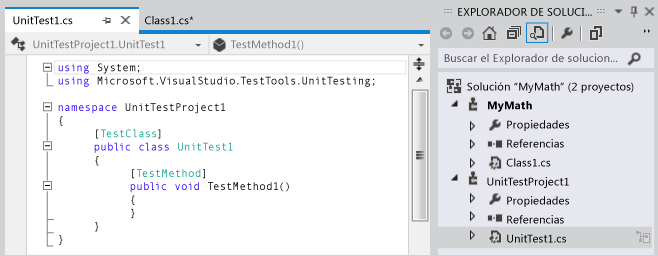
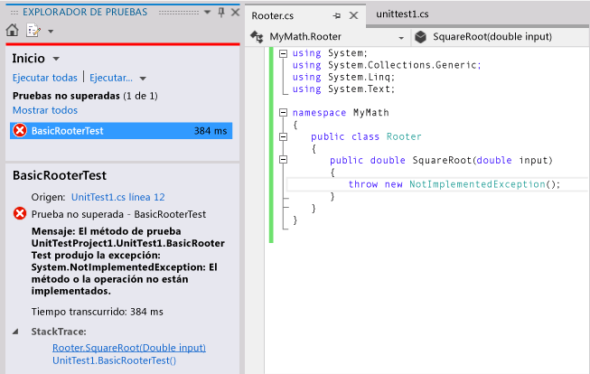
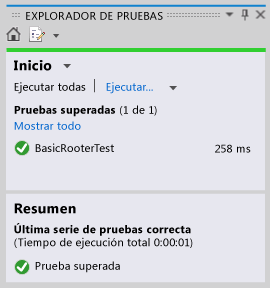
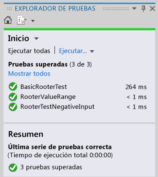

# <a name="quick-start-test-driven-development-with-test-explorer"></a>Inicio rápido: Desarrollo controlado por pruebas con el Explorador de pruebas
Es recomendable crear pruebas unitarias para hacer que el código funcione correctamente a través de varios pasos incrementales de desarrollo. Hay varios marcos que se pueden utilizar para escribir pruebas unitarias, incluidos algunos desarrollados por terceros. Algunos marcos de prueba están especializados para pruebas en plataformas o lenguas diferentes. El Explorador de pruebas proporciona una sola interfaz para las pruebas unitarias en cualquiera de estos marcos. Hay adaptadores disponibles para los marcos más comunes y es posible escribir adaptadores propios para otros marcos.  
  
 El Explorador de pruebas reemplaza las ventanas de prueba unitaria que se encontraban en versiones anteriores de Visual Studio. Las ventajas incluyen:  
  
-   Ejecutar pruebas de .NET, no administradas, bases de datos y otros tipos utilizando una única interfaz.  
  
-   Usar el marco de pruebas unitarias que quiera, como NUnit o MSTest.  
  
-   Ver en una ventana toda la información necesaria.  
  
## <a name="using-test-explorer"></a>Usar el Explorador de pruebas  
 ")  
  
#### <a name="to-run-unit-tests-by-using-test-explorer"></a>Para ejecutar pruebas unitarias mediante el Explorador de pruebas  
  
1.  Crear pruebas unitarias que utilicen los marcos de prueba de su elección.  
  
     Por ejemplo, para crear una prueba que utilice el marco de trabajo de MSTest:  
  
    1.  Cree un proyecto de prueba.  
  
         En el cuadro de diálogo **Nuevo proyecto** , expanda **Visual Basic**, **Visual C#**o **Visual C++**y, a continuación, elija **Prueba**.  
  
         Seleccione **Proyecto de prueba unitaria**.  
  
    2.  Escriba cada prueba unitaria como un método. Anteponga el atributo `[TestMethod]` a cada método de prueba.  
  
2.  Si las pruebas individuales no tienen ninguna dependencia que impida que se ejecuten en cualquier orden, active la ejecución de pruebas paralelas con el botón de alternancia  en la barra de herramientas. Esto puede reducir considerablemente el tiempo necesario para ejecutar todas las pruebas.  
  
3.  En la barra de menús, elija **Prueba**, **Ejecutar pruebas unitarias**, **Todas las pruebas**.  
  
     La solución se compila y se ejecutan las pruebas.  
  
     Se abre el Explorador de pruebas y se muestra un resumen de los resultados.  
  
 **Para ver una lista completa de pruebas:** elija **Mostrar todo** en cualquier categoría.  
  
 **Para ver los detalles de un resultado de pruebas:** seleccione la prueba en el Explorador de pruebas para ver detalles tales como los mensajes de excepción en el panel de detalles.  
  
 **Para navegar hasta el código de una prueba:** haga doble clic en la prueba en el Explorador de pruebas o elija **Abrir prueba** en el acceso directo.  
  
 **Para depurar una prueba:** abra el acceso directo de una o varias pruebas y, a continuación, elija **Depurar pruebas seleccionadas**.  
  
> [!IMPORTANT]
>  Los resultados que se muestran son para la ejecución más reciente. La barra de resultados coloreados presenta solo los resultados de las pruebas ejecutadas. Por ejemplo, si se ejecutan varias pruebas y alguna de ellas produce un error y, a continuación, se ejecutan solo las pruebas que se completan correctamente, la barra de resultados mostrará todo en color verde.  
  
> [!NOTE]
>  Si no aparece ninguna prueba, asegúrese de haber instalado un adaptador para conectar el Explorador de pruebas al marco de pruebas que se está usando. Para obtener más información, consulte [Usar diferentes marcos de prueba con el Explorador de pruebas](#frameworks).  
  
##  <a name="walkthrough"></a> Tutorial: utilizar pruebas unitarias para desarrollar un método  
 En este tutorial se muestra cómo desarrollar un método probado en C# con el marco de pruebas unitarias de Microsoft. Se puede adaptar fácilmente a otros lenguajes y utilizar otros marcos de prueba tales como NUnit. Para obtener más información, vea [Usar diferentes marcos de prueba](#frameworks).  
  
#### <a name="creating-the-test-and-method"></a>Crear la prueba y el método  
  
1.  Crear un proyecto de biblioteca de clases de Visual C#. Este proyecto contendrá el código que se va a entregar. En este ejemplo, se denomina `MyMath`.  
  
2.  Cree un proyecto de prueba.  
  
    -   En el cuadro de diálogo **Nuevo proyecto** , elija **Visual C#**, **Prueba** y, a continuación, elija **Proyecto de prueba unitaria**.  
  
           
  
3.  Escriba un método de prueba básico. Compruebe el resultado obtenido para una entrada específica:  
  
    ```c#  
  
    [TestMethod]  
    public void BasicRooterTest()  
    {  
      // Create an instance to test:  
      Rooter rooter = new Rooter();  
      // Define a test input and output value:  
      double expectedResult = 2.0;  
      double input = expectedResult * expectedResult;  
      // Run the method under test:  
      double actualResult = rooter.SquareRoot(input);  
      // Verify the result:  
      Assert.AreEqual(expectedResult, actualResult,  
          delta: expectedResult / 100);  
    }  
    ```  
  
4.  Genere el método a partir de la prueba.  
  
    1.  Coloque el cursor en `Rooter`y a continuación, en el acceso directo, elija **Generar**, **Nuevo tipo**.  
  
    2.  En el cuadro de diálogo **Generar nuevo tipo** , establezca **Proyecto** en el proyecto de biblioteca de clases. En este ejemplo, es `MyMath`.  
  
    3.  Coloque el cursor en `SquareRoot`y a continuación, en el acceso directo, elija **Generar**, **Código auxiliar de método**.  
  
5.  Ejecute la prueba unitaria.  
  
    1.  En el menú **Prueba** , elija **Ejecutar pruebas unitarias**, **Todas las pruebas**.  
  
         La solución se compila y se ejecuta.  
  
         El Explorador de pruebas se abre y muestra los resultados.  
  
         La prueba aparece bajo **Pruebas no superadas**.  
  
6.  Seleccione el nombre de la prueba.  
  
     Los detalles de la prueba aparecen en la parte inferior del Explorador de pruebas.  
  
7.  Seleccione los elementos bajo **Seguimiento de la pila** para ver dónde se produjo un error en la prueba.  
  
   
  
 En este punto, se ha creado una prueba y un código auxiliar que se modificarán para que la prueba se complete correctamente.  
  
#### <a name="after-every-change-make-all-the-tests-pass"></a>Después de cada cambio, haga que todas las pruebas se completen correctamente  
  
1.  En `MyMath\Rooter.cs`, mejore el código de `SquareRoot`:  
  
    ```c#  
    public double SquareRoot(double input)  
     {  
       return input / 2;  
     }  
    ```  
  
2.  En el Explorador de pruebas, elija **Ejecutar todas**.  
  
     El código se compila y se ejecuta la prueba.  
  
     La prueba se supera.  
  
       
  
#### <a name="add-tests-to-extend-the-range-of-inputs"></a>Agregar pruebas para ampliar el intervalo de entradas  
  
1.  Para mejorar su confianza en que el código funcione en todos los casos, agregue pruebas para in intervalo más amplio de valores de entrada.  
  
    > [!TIP]
    >  Evite modificar las pruebas existentes que se completan correctamente. En su lugar, agregue nuevas pruebas. Cambie las pruebas existentes solo si cambian los requisitos de usuario. Esta directiva ayuda a garantizar que no se pierda la función existente mientras se trabaja para ampliar el código.  
  
     En la clase de prueba, agregue la siguiente prueba para un intervalo de valores de entrada:  
  
    ```c#  
    [TestMethod]  
    public void RooterValueRange()  
    {  
      // Create an instance to test:  
      Rooter rooter = new Rooter();  
      // Try a range of values:  
      for (double expectedResult = 1e-8;  
          expectedResult < 1e+8;  
          expectedResult = expectedResult * 3.2)  
      {  
        RooterOneValue(rooter, expectedResult);  
      }  
    }  
  
    private void RooterOneValue(Rooter rooter, double expectedResult)  
    {  
      double input = expectedResult * expectedResult;  
      double actualResult = rooter.SquareRoot(input);  
      Assert.AreEqual(expectedResult, actualResult,  
          delta: expectedResult / 1000);  
    }  
    ```  
  
2.  En el Explorador de pruebas, elija **Ejecutar todas**.  
  
     La nueva prueba no se supera, aunque la primera aún se completa correctamente.  
  
     Para encontrar el punto de error, seleccione la prueba que no se completa correctamente y, en la parte inferior del Explorador de pruebas, seleccione el elemento superior del **Seguimiento de la pila**.  
  
3.  Inspeccione el método que se está probando para ver qué puede ser incorrecto. En la clase `MyMath.Rooter` , reescriba el código:  
  
    ```  
    public double SquareRoot(double input)  
    {  
      double result = input;  
      double previousResult = -input;  
      while (Math.Abs(previousResult - result) > result / 1000)  
      {  
        previousResult = result;  
        result = result - (result * result - input) / (2 * result);  
      }  
      return result;  
    }  
    ```  
  
4.  En el Explorador de pruebas, elija **Ejecutar todas**.  
  
     Ahora ambas pruebas se completan correctamente.  
  
#### <a name="add-tests-for-exceptional-cases"></a>Agregue pruebas para casos excepcionales  
  
1.  Agregue una prueba para entradas negativas:  
  
    ```c#  
    [TestMethod]  
     public void RooterTestNegativeInputx()  
     {  
         Rooter rooter = new Rooter();  
         try  
         {  
             rooter.SquareRoot(-10);  
         }  
         catch (ArgumentOutOfRangeException e)  
         {  
             return;  
         }  
         Assert.Fail();  
     }  
    ```  
  
2.  En el Explorador de pruebas, elija **Ejecutar todas**.  
  
     El método en prueba entra en bucle y debe cancelarse manualmente.  
  
3.  Elija **Cancelar**.  
  
     La prueba se para después de 10 segundos.  
  
4.  Corrija el código del método:  
  
    ```c#  
  
    public double SquareRoot(double input)  
    {  
      if (input <= 0.0)   
      {  
        throw new ArgumentOutOfRangeException();  
      }   
    ...  
    ```  
  
5.  En el Explorador de pruebas, elija **Ejecutar todas**.  
  
     Todas las pruebas se completan correctamente.  
  
#### <a name="refactor-without-changing-tests"></a>Refactorizar sin cambiar las pruebas  
  
1.  Simplifique el código, pero no cambie las pruebas.  
  
    > [!TIP]
    >  Una *refactorización* es un cambio que está pensado para que el código se ejecute mejor o para hacer que el código sea más fácil de entender. No está pensado para alterar el comportamiento del código y, por tanto, no se cambian las pruebas.  
    >   
    >  Se recomienda realizar los pasos de refactorización independientemente de los pasos que amplían la funcionalidad. Mantener las pruebas sin cambios aporta la confianza de no haber introducido errores accidentalmente durante la refactorización.  
  
    ```c#  
    public class Rooter  
    {  
      public double SquareRoot(double input)  
      {  
        if (input <= 0.0)   
        {  
          throw new ArgumentOutOfRangeException();  
        }  
        double result = input;  
        double previousResult = -input;  
        while (Math.Abs(previousResult - result) > result / 1000)  
        {  
          previousResult = result;  
          result = (result + input / result) / 2;  
          //was: result = result - (result * result - input) / (2*result);  
        }  
        return result;  
      }  
    }  
    ```  
  
2.  Elija **Ejecutar todas**.  
  
     Todas las pruebas se completan correctamente.  
  
     

