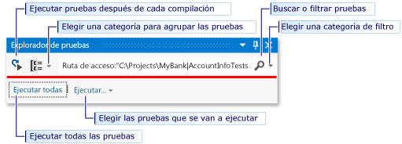
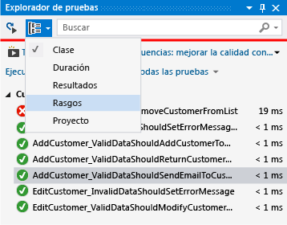
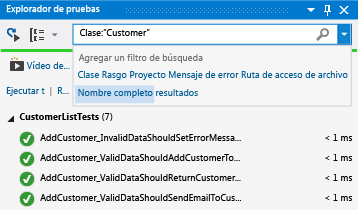
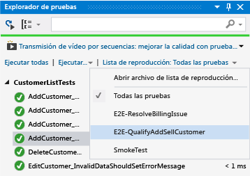

# <a name="run-unit-tests-with-test-explorer"></a>Ejecutar pruebas unitarias con el Explorador de pruebas
Con el Explorador de pruebas puede ejecutar pruebas unitarias de Visual Studio o proyectos de prueba unitaria de terceros, agrupar pruebas en categorías, filtrar la lista de pruebas, y crear, guardar y ejecutar las listas de reproducción de pruebas. También puede depurar las pruebas, y analizar la cobertura de código y el rendimiento de la prueba.  
  
##  <a name="BKMK_Contents"></a> Contenido  
 [Marcos de pruebas unitarias y proyectos de prueba](#BKMK_Unit_test_frameworks_and_test_projects)  
  
 [Ejecutar pruebas en Explorador de pruebas](#BKMK_Run_tests_in_Test_Explorer)  
  
 [Ver los resultados de las pruebas](#BKMK_View_test_results)  
  
 [Agrupar y filtrar la lista de pruebas](#BKMK_Group_and_filter_the_test_list)  
  
 [Crear listas de reproducción personalizadas](#BKMK_Create_custom_playlists)  
  
 [Depurar y analizar pruebas unitarias](#BKMK_Debug_and_analyze_unit_tests)  
  
 [Recursos externos](#BKMK_External_resources)  
  
##  <a name="BKMK_Unit_test_frameworks_and_test_projects"></a> Marcos de pruebas unitarias y proyectos de prueba  
 Visual Studio incluye los marcos de pruebas unitarias de Microsoft para código administrado y nativo. No obstante, el Explorador de pruebas también puede ejecutar cualquier marco de pruebas unitarias que haya implementado un adaptador de este explorador. Para más información sobre cómo instalar los marcos de pruebas unitarias de terceros, vea [Instalar marcos de prueba unitaria de terceros](../test/install-third-party-unit-test-frameworks.md).  
  
 El Explorador de pruebas puede ejecutar pruebas de varios proyectos de prueba en una solución y desde las clases de prueba que forman parte de los proyectos de código de producción. En los proyectos de prueba pueden usarse marcos de pruebas unitarias diferentes. Cuando se escribe el código sometido a prueba para .NET Framework, el proyecto de prueba puede escribirse en cualquier lenguaje que también contemple .NET Framework como destino, independientemente del lenguaje del código de destino. Los proyectos de código de C/C ++ nativos deben probarse con el marco de pruebas unitarias de C++. Para obtener más información, vea [Writing unit tests for C/C++](writing-unit-tests-for-c-cpp.md) (Escribir pruebas unitarias para C/C++).
  
  [Contenido](#BKMK_Contents)  
  
##  <a name="BKMK_Run_tests_in_Test_Explorer"></a> Ejecutar pruebas en el Explorador de pruebas  
 [Ejecutar pruebas](#BKMK_Run_tests) **&#124;** [Ejecutar pruebas después de cada compilación](#BKMK_Run_tests_after_every_build)  
  
 Al compilar el proyecto de prueba, las pruebas aparecen en el Explorador de pruebas. Si el Explorador de pruebas no está visible, elija **Prueba** en el menú de Visual Studio, elija **Ventanas**y, después, **Explorador de pruebas**.  
  
   
  
 Al ejecutar, escribir y volver a ejecutar las pruebas, el Explorador de pruebas muestra los resultados en los grupos predeterminados de **Pruebas no superadas**, **Pruebas superadas**, **Pruebas omitidas** y **Pruebas no ejecutadas**. Puede cambiar la manera en que el Explorador de pruebas agrupa las pruebas.  
  
 Desde la barra de herramientas del Explorador de pruebas puede realizar gran parte del trabajo de búsqueda, organización y ejecución de las pruebas.  
  
   
  
  [Contenido](#BKMK_Contents)  
  
###  <a name="BKMK_Run_tests"></a> Ejecutar pruebas  
 Puede ejecutar todas las pruebas de la solución, todas las pruebas de un grupo o un conjunto de pruebas seleccionado. Realice una de las siguientes acciones:  
  
-   Para ejecutar todas las pruebas de una solución, elija **Ejecutar todas**.  
  
-   Para ejecutar todas las pruebas de un grupo predeterminado, elija **Ejecutar...** y el grupo en el menú.  
  
-   Seleccione las pruebas individuales que desea ejecutar, abra el menú contextual de una prueba seleccionada y elija **Ejecutar pruebas seleccionadas**.  
  
-   Si las pruebas individuales no tienen ninguna dependencia que impida que se ejecuten en cualquier orden, active la ejecución de pruebas paralelas con el botón de alternancia  en la barra de herramientas. Esto puede reducir considerablemente el tiempo necesario para ejecutar todas las pruebas.  
  
 Según se vayan ejecutando las pruebas, se animará la barra de superado o no superado en la parte superior de la ventana del Explorador de pruebas. Al finalizar la ejecución de las pruebas, la barra de superado o no superado se pondrá verde si se superan todas las pruebas. En caso contrario, se pondrá roja.  
  
  [Contenido](#BKMK_Contents)  
  
###  <a name="BKMK_Run_tests_after_every_build"></a> Ejecutar pruebas después de cada compilación  
  
> [!WARNING]
>  Visual Studio Enterprise permite ejecutar pruebas unitarias después de cada compilación.  
  
|||  
|-|-|  
||Para ejecutar pruebas unitarias después de cada compilación local, elija **Prueba** en el menú estándar, o **Ejecutar pruebas después de compilar** en la barra de herramientas del Explorador de pruebas.|  
  
  [Contenido](#BKMK_Contents)  
  
##  <a name="BKMK_View_test_results"></a> Ver los resultados de las pruebas  
 [Ver detalles de la prueba](#BKMK_View_test_details) **&#124;** [Ver el código fuente de un método de prueba](#BKMK_View_the_source_code_of_a_test_method)  
  
 Al ejecutar, escribir y volver a ejecutar las pruebas, el Explorador de pruebas muestra los resultados en los grupos de **Pruebas no superadas**, **Pruebas superadas**, **Pruebas omitidas** y **Pruebas no ejecutadas**. El panel de detalles de la parte inferior del Explorador de pruebas muestra un resumen de la ejecución de la prueba.  
  
###  <a name="BKMK_View_test_details"></a> Ver detalles de la prueba  
 Para ver los detalles de una prueba individual, selecciónela.  
  
   
  
 El panel de detalles de la prueba muestra la información siguiente:  
  
-   El nombre de archivo de origen y el número de línea del método de prueba.  
  
-   Estado de la prueba.  
  
-   El tiempo que ha tardado en ejecutarse el método de prueba.  
  
 Si la prueba no se supera, en el panel de detalles se mostrará también:  
  
-   El mensaje que ha devuelto el marco de pruebas unitarias para la prueba.  
  
-   El seguimiento de la pila en el momento en que la prueba generó el error.  
  
  [Contenido](#BKMK_Contents)  
  
###  <a name="BKMK_View_the_source_code_of_a_test_method"></a> Ver el código fuente de un método de prueba  
 Para mostrar el código fuente de un método de prueba en el editor de Visual Studio, seleccione la prueba y elija **Abrir prueba** en el menú contextual (teclado: F12).  
  
  [Contenido](#BKMK_Contents)  
  
##  <a name="BKMK_Group_and_filter_the_test_list"></a> Agrupar y filtrar la lista de pruebas  
 [Agrupar la lista de pruebas](#BKMK_Grouping_the_test_list) **&#124;** [Agrupar por rasgos](#BKMK_Group_by_traits) **&#124;** [Buscar y filtrar la lista de pruebas](#BKMK_Search_and_filter_the_test_list)  
  
 El Explorador de pruebas permite agrupar las pruebas en las categorías predefinidas. En la mayoría de los marcos de pruebas unitarias que se ejecutan en el Explorador de pruebas podrá definir las categorías y los pares categoría-valor para agrupar las pruebas que desee. Para filtrar la lista de pruebas, también puede establecer coincidencias entre las cadenas y las propiedades de las pruebas.  
  
###  <a name="BKMK_Grouping_the_test_list"></a> Agrupar la lista de pruebas  
 Para cambiar la forma en que se organizan las pruebas, seleccione la flecha abajo situada junto al botón **Agrupar por**  y seleccione un nuevo criterio de agrupación.  
  
   
  
### <a name="test-explorer-groups"></a>Grupos del Explorador de pruebas  
  
|Agrupar|Descripción|  
|-----------|-----------------|  
|**Duración**|Agrupa las pruebas por tiempo de ejecución: **Rápido**, **Medio**y **Lento**.|  
|**Resultado**|Agrupa las pruebas por resultados de ejecución: **Pruebas no superadas**, **Pruebas omitidas**y **Pruebas superadas**.|  
|**Rasgos**|Agrupa las pruebas por los pares categoría-valor definidos. La sintaxis para especificar los valores y las categorías de rasgo se define desde el marco de pruebas unitarias.|  
|**Proyecto**|Agrupa las pruebas por el nombre de los proyectos.|  
  
  [Contenido](#BKMK_Contents)  
  
###  <a name="BKMK_Group_by_traits"></a> Agrupar por rasgos  
 Por lo general, un rasgo es un par nombre-valor de categoría, pero también puede ser una sola categoría. Los rasgos se pueden asignar a los métodos identificados como métodos de prueba desde el marco de pruebas unitarias. Un marco de pruebas unitarias puede definir categorías de rasgo. Si lo desea, puede agregar valores a las categorías de rasgo para definir sus propios pares nombre-valor de categoría. La sintaxis para especificar los valores y las categorías de rasgo se define desde el marco de pruebas unitarias.  
  
 **Rasgos del marco de pruebas unitarias de Microsoft para código administrado**  
  
 En el marco de pruebas unitarias de Microsoft para aplicaciones administradas, el par nombre-valor de rasgo se define en un atributo  <xref:Microsoft.VisualStudio.TestTools.UnitTesting.TestPropertyAttribute> . El marco de pruebas también contiene estos rasgos predefinidos:  
  
|Rasgo|Descripción|  
|-----------|-----------------|  
|<xref:Microsoft.VisualStudio.TestTools.UnitTesting.OwnerAttribute>|La categoría de propietario se define desde el marco de pruebas unitarias y requiere un valor de cadena del propietario.|  
|<xref:Microsoft.VisualStudio.TestTools.UnitTesting.PriorityAttribute>|La categoría de prioridad se define desde el marco de pruebas unitarias y requiere un valor entero de la prioridad.|  
|<xref:Microsoft.VisualStudio.TestTools.UnitTesting.TestCategoryAttribute>|El atributo TestCategory permite proporcionar una categoría sin ningún valor. Las categorías que define el atributo TestCategory también pueden ser categorías del atributo TestProperty.|  
|<xref:Microsoft.VisualStudio.TestTools.UnitTesting.TestPropertyAttribute>|El atributo TestProperty permite definir un par categoría-valor de rasgo.|  
  
 **Rasgos del marco de pruebas unitarias de Microsoft para C++**  
  Vea [How to use the Microsoft Unit Testing Framework for C++](how-to-use-microsoft-test-framework-for-cpp.md) (Cómo usar el marco de pruebas unitarias de Microsoft para C++).
  
  [Contenido](#BKMK_Contents)  
  
###  <a name="BKMK_Search_and_filter_the_test_list"></a> Buscar y filtrar la lista de pruebas  
 Puede limitar los métodos de prueba en los proyectos que vea y ejecute con los filtros del Explorador de pruebas.  
  
 Si escribe una cadena en el cuadro de búsqueda del Explorador de pruebas y elige ENTRAR, la lista de pruebas se filtrará para mostrar solo las pruebas cuyos nombres completos contengan dicha cadena.  
  
 Para filtrar por otros criterios:  
  
1.  Abra la lista desplegable situada a la derecha del cuadro de búsqueda.  
  
2.  Elija un criterio nuevo.  
  
3.  Escriba el valor de filtro entre comillas.  
  
   
  
> [!NOTE]
>  Las búsquedas distinguen entre mayúsculas y minúsculas, y coinciden con la cadena especificada en cualquier parte del valor de criterios.  
  
|Calificador:|Descripción|  
|---------------|-----------------|  
|**Rasgo**|Busca coincidencias en el valor y en la categoría de rasgo. La sintaxis para especificar los valores y las categorías de rasgo se define en el marco de pruebas unitarias.|  
|**Proyecto**|Busca coincidencias en los nombres de proyecto de prueba.|  
|**Mensaje de error**|Busca coincidencias en los mensajes de error definidos por el usuario que devuelven las aserciones con errores.|  
|**Ruta de acceso del archivo**|Busca coincidencias en el nombre de archivo completo de los archivos de origen de prueba.|  
|**Nombre completo**|Busca coincidencias en el nombre de archivo completo de los métodos, las clases y los espacios de nombres de prueba.|  
|**Salida**|Busca en los mensajes de error definidos por el usuario que se escriben en los resultados estándar (stdout) o en los errores estándar (stderr). La sintaxis para especificar los mensajes de salida se define en el marco de pruebas unitarias.|  
|**Resultado**|Busca coincidencias en los nombres de categoría del Explorador de pruebas: **Pruebas no superadas**, **Pruebas omitidas**y **Pruebas superadas**.|  
  
 Puede excluir un subconjunto de resultados de un filtro con la sintaxis siguiente:  
  
```  
FilterName:"Criteria" -FilterName:"SubsetCriteria"  
```  
  
 Por ejemplo,  
  
```  
FullName:"MyClass" - FullName:"PerfTest"  
```  
  
 Devuelve todas las pruebas que incluyen "MyClass" en el nombre, excepto las que también incluyan "PerfTest".  
  
  [Contenido](#BKMK_Contents)  
  
##  <a name="BKMK_Create_custom_playlists"></a> Crear listas de reproducción personalizadas  
 Puede crear y guardar una lista de pruebas que desea ejecutar o ver como grupo. Al seleccionar una lista de reproducción, las pruebas de la lista aparecerán en el Explorador de pruebas. Si lo desea, puede agregar una prueba a varias listas de reproducción. Para acceder a todas las pruebas de un proyecto, elija la lista de reproducción predeterminada **Todas las pruebas** .  
  
   
  
 **Para crear una lista de reproducción**, elija una o varias pruebas en el Explorador de pruebas. En el menú contextual, elija **Agregar a lista de reproducción**y **Nueva lista de reproducción**. Guarde el archivo con la ubicación y el nombre especificados en el cuadro de diálogo **Crear nueva lista de reproducción** .  
  
 **Para agregar pruebas a una lista de reproducción**, elija una o varias pruebas en el Explorador de pruebas. En el menú contextual, elija **Agregar a lista de reproducción**y la lista de reproducción a la que desea agregar las pruebas.  
  
 **Para abrir una lista de reproducción**, elija Prueba y Lista de reproducción en el menú de Visual Studio, y seleccione un elemento entre las listas de reproducción usadas recientemente. O bien, elija Abrir lista de reproducción para especificar el nombre y la ubicación de la lista de reproducción específica.  
  
 Si las pruebas individuales no tienen ninguna dependencia que impida que se ejecuten en cualquier orden, active la ejecución de pruebas paralelas con el botón de alternancia  en la barra de herramientas. Esto puede reducir considerablemente el tiempo necesario para ejecutar todas las pruebas.  
  
  [Contenido](#BKMK_Contents)  
  
##  <a name="BKMK_Debug_and_analyze_unit_tests"></a> Depurar y analizar pruebas unitarias  
 [Depurar pruebas unitarias](#BKMK_Debug_unit_tests) **&#124;** [Diagnosticar problemas de rendimiento del método de prueba](#BKMK_Diagnose_test_method_performance_issues) **&#124;** [Analizar la cobertura de código de prueba unitaria](#BKMK_Analyzeunit_test_code_coverage)  
  
###  <a name="BKMK_Debug_unit_tests"></a> Depurar pruebas unitarias  
 Se puede usar el Explorador de pruebas para iniciar una sesión de depuración para las pruebas. La ejecución paso a paso del código con el depurador de Visual Studio permite avanzar y retroceder sin problemas entre las pruebas unitarias y el proyecto objeto de prueba. Para iniciar la depuración:  
  
1.  En el editor de Visual Studio, establezca un punto de interrupción en uno o varios métodos de prueba que desee depurar.  
  
    > [!NOTE]
    >  Dado que los métodos de prueba se pueden ejecutar en cualquier orden, establezca puntos de interrupción en todos los métodos de prueba que desee depurar.  
  
2.  En el Explorador de pruebas, seleccione los métodos de prueba y elija **Depurar pruebas seleccionadas** en el menú contextual.  
  
 Para obtener más información sobre el depurador, vea [Depurar en Visual Studio](../debugger/debugging-in-visual-studio.md).  
  
  [Contenido](#BKMK_Contents)  
  
###  <a name="BKMK_Diagnose_test_method_performance_issues"></a> Diagnosticar problemas de rendimiento del método de prueba  
 Para diagnosticar por qué tarda demasiado un método de prueba, seleccione dicho método en el Explorador de pruebas y elija Perfil en el menú contextual. Vea [Explorador de rendimiento](../profiling/performance-explorer.md).  
  
###  <a name="BKMK_Analyzeunit_test_code_coverage"></a> Analizar la cobertura de código de prueba unitaria  
  
> [!NOTE]
>  La cobertura de código de prueba unitaria solo se encuentra disponible en Visual Studio Enterprise.  
  
 Con la herramienta de cobertura de código de Visual Studio se puede determinar la cantidad del código de producto que las pruebas unitarias están probando realmente. La cobertura de código se puede ejecutar en pruebas seleccionadas o en todas las pruebas de una solución.  
  
 Para ejecutar la cobertura de código en los métodos de prueba de una solución:  
  
1.  Elija **Pruebas** en el menú de Visual Studio y seleccione **Analizar cobertura de código**.  
  
2.  En el submenú, elija uno de los comandos siguientes:  
  
    -   **Pruebas seleccionadas** ejecuta los métodos de prueba que ha seleccionado en el Explorador de pruebas.  
  
    -   **Todas las pruebas** ejecuta todos los métodos de prueba en la solución.  
  
 La ventana Resultados de la cobertura de código muestra el porcentaje de bloques de código de producto que se han ejecutado por línea, función, clase, espacio de nombres y módulo.  
  
 Para obtener más información, consulte [Usar cobertura de código para determinar la cantidad de código que se está probando](../test/using-code-coverage-to-determine-how-much-code-is-being-tested.md).  
  
  [Contenido](#BKMK_Contents)  
  
##  <a name="BKMK_External_resources"></a> Recursos externos  
  
###  <a name="BKMK_Guidance"></a> Orientación  
 [Pruebas de entrega continua con Visual Studio 2012. Capítulo 2: Pruebas unitarias: Prueba del interior](http://go.microsoft.com/fwlink/?LinkID=255188)  
  
## <a name="see-also"></a>Vea también  
 [Hacer una prueba unitaria de su código](../test/unit-test-your-code.md)   
 [Ejecutar una prueba unitaria como un proceso de 64 bits](../test/run-a-unit-test-as-a-64-bit-process.md)
