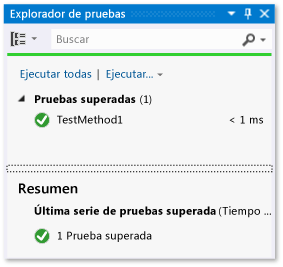
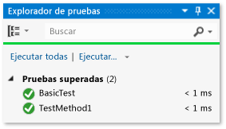
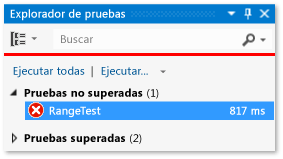
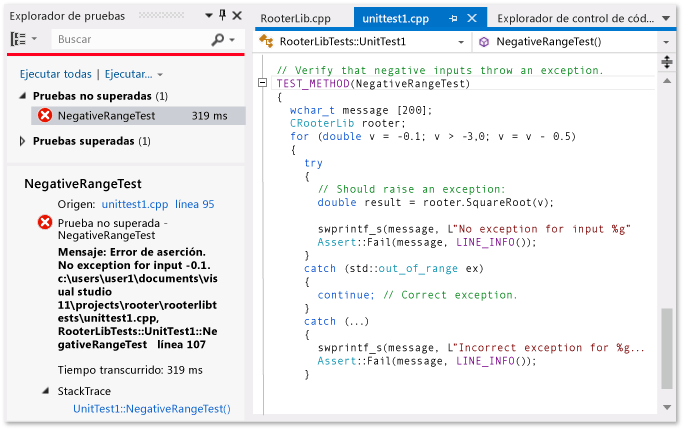
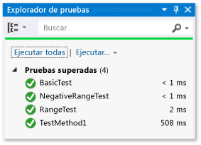

# Pruebas unitarias de c&#243;digo de Visual C# en una aplicaci&#243;n de la Tienda
[!INCLUDE[vs2017banner](../code-quality/includes/vs2017banner.md)]

Este tema describe una forma de crear pruebas unitarias para una clase de Visual C\# en una aplicación de la Tienda Windows.  La clase Rooter muestra las memorias imprecisas de teoría límite del cálculo mediante la implementación de una función que calcula una estimación de raíz cuadrada de un número determinado.  La aplicación Maths puede utilizar esta función para mostrar a un usuario las cosas divertidas que se pueden realizar con las matemáticas.  
  
 En este tema se muestra cómo se utilizan las pruebas unitarias como primer paso en el desarrollo.  En este enfoque, primero tienes que escribir un método de prueba que compruebe un comportamiento concreto en el sistema que estés probando y, después, escribir el código que tenga que superar la prueba.  Mediante la realización de cambios en el orden de los procedimientos siguientes, puedes invertir esta estrategia para escribir primero el código que deseas probar y escribe después las pruebas unitarias.  
  
 En este tema también se crea una solución única de Visual Studio y proyectos independientes para las pruebas unitarias y el DLL que desees probar.  También puedes incluir las pruebas unitarias directamente en el proyecto DLL, o crear soluciones independientes para las pruebas unitarias y el DLL.  
  
> [!NOTE]
>  Visual Studio Community, Enterprise  y Professional proporcionan características adicionales para las pruebas unitarias.  
>   
>  -   Use cualquier marco de pruebas unitarias de terceros y de código abierto que haya creado un adaptador complementario para el Explorador de pruebas de Microsoft.  También puedes analizar y mostrar información de cobertura de código para las pruebas.  
> -   Ejecute las pruebas después de cada compilación.  
> -   VS Enterprise también contiene Microsoft Fakes, un marco de aislamiento para código administrado que ayuda a centrar las pruebas en su propio código sustituyendo el código de prueba para el sistema y la funcionalidad de terceros.  
>   
>  Para más información, consulte [Comprobar código utilizando pruebas unitarias](http://msdn.microsoft.com/library/dd264975.aspx) en MSDN Library.  
  
##  <a name="BKMK_In_this_topic"></a> En este tema  
 [Crear la solución y el proyecto de prueba unitaria](#BKMK_Create_the_solution_and_the_unit_test_project)  
  
 [Comprobar que las pruebas se ejecutan en el Explorador de pruebas](#BKMK_Verify_that_the_tests_run_in_Test_Explorer)  
  
 [Agregar la clase Rooter al proyecto Matemáticas](#BKMK_Add_the_Rooter_class_to_the_Maths_project)  
  
 [Acoplar el proyecto de prueba al proyecto de la aplicación](#BKMK_Couple_the_test_project_to_the_app_project)  
  
 [Aumentar las pruebas de forma iterativa y comprobar si se superan](#BKMK_Iteratively_augment_the_tests_and_make_them_pass)  
  
 [Depurar una prueba que no se supera](#BKMK_Debug_a_failing_test)  
  
 [Refactorizar el código](#BKMK_Refactor_the_code_)  
  
##  <a name="BKMK_Create_the_solution_and_the_unit_test_project"></a> Crear la solución y el proyecto de prueba unitaria  
  
1.  En el menú **Archivo**, elige **Nuevo** y, a continuación, elige **Nuevo proyecto**.  
  
2.  En el cuadro de diálogo **Nuevo proyecto**, expande **Instalado** y, a continuación, expande **Visual C\#** y elige **Tienda Windows**.  A continuación, elige **Aplicación vacía** en la lista de plantillas de proyecto.  
  
3.  Asigna al proyecto el nombre `Matemáticas` y asegúrate de que esté seleccionado **Crear directorio para la solución**.  
  
4.  En el Explorador de soluciones, elige el nombre de la solución, elige **Agregar** en el menú contextual y, a continuación, elige **Nuevo proyecto**.  
  
5.  En el cuadro de diálogo **Nuevo proyecto**, expanda **Instalado**, expanda **Visual C\#** y elija **Tienda Windows**.  A continuación elige **Biblioteca de pruebas unitarias \(aplicaciones de la Tienda Windows\)** en la lista de plantillas de proyecto.  
  
       
  
6.  Abre UnitTest1.cs en el editor de Visual Studio.  
  
    ```c#  
  
    using System;  
    using System.Collections.Generic;  
    using System.Linq;  
    using System.Text;  
    using Microsoft.VisualStudio.TestPlatform.UnitTestFramework;  
    using Maths;  
  
    namespace RooterTests  
    {  
        [TestClass]  
        public class UnitTest1  
  
            [TestMethod]  
            public void TestMethod1()  
            {  
  
            }  
  
    ```  
  
     Ten en cuenta lo siguiente:  
  
    1.  Cada prueba se define utilizando `[TestMethod]`.  Un método de prueba debe devolver void y no puede tener parámetros.  
  
    2.  Los métodos de prueba deben estar en una clase decorada con el atributo `[TestClass]`.  
  
         Cuando se ejecutan las pruebas, se crea una instancia de cada clase de prueba.  Se llama a los métodos de prueba en un orden no especificado.  
  
    3.  Puedes definir métodos especiales que se invoquen antes y después de cada módulo, clase o método.  Para obtener más información, consulte [Usar miembros de Microsoft.VisualStudio.TestTools.UnitTesting en pruebas unitarias](../test/using-microsoft-visualstudio-testtools-unittesting-members-in-unit-tests.md) en MSDN Library.  
  
##  <a name="BKMK_Verify_that_the_tests_run_in_Test_Explorer"></a> Comprobar que las pruebas se ejecutan en el Explorador de pruebas  
  
1.  Inserta el código de prueba en `TestMethod1` del archivo **UnitTest1.cs**:  
  
    ```c#  
  
    [TestMethod]  
    public void TestMethod1()  
    {  
        Assert.AreEqual(0, 0);  
    }  
  
    ```  
  
     Observa que la clase `Assert` proporciona varios métodos estáticos que puedes utilizar para comprobar los resultados en los métodos de prueba.  
  
2.  En el menú **Prueba**, elige **Ejecutar** y, a continuación, elige **Ejecutar todas**.  
  
     El proyecto de prueba se compila y ejecuta.  Aparece la ventana Explorador de pruebas y la prueba se muestra debajo de **Pruebas superadas**.  El panel Resumen de la parte inferior de la ventana proporciona detalles adicionales sobre la prueba seleccionada.  
  
       
  
##  <a name="BKMK_Add_the_Rooter_class_to_the_Maths_project"></a> Agregar la clase Rooter al proyecto Matemáticas  
  
1.  En el Explorador de soluciones, elige el nombre del proyecto **Matemáticas**.  En el menú contextual, elige **Agregar** y, a continuación, elige **Clase**.  
  
2.  Asigna al archivo de clase el nombre `Rooter.cs`.  
  
3.  Agrega el siguiente código al archivo **Rooter.cs** de la clase Rooter:  
  
    ```c#  
  
    public Rooter()  
    {  
    }  
  
    // estimate the square root of a number  
    public double SquareRoot(double x)  
    {  
        return 0.0;  
    }  
  
    ```  
  
     La clase `Rooter` declara un constructor y el método de perito de `SqareRoot`.  
  
4.  El método `SqareRoot` es solo una implementación mínima, suficiente para probar la estructura básica de la configuración de pruebas.  
  
##  <a name="BKMK_Couple_the_test_project_to_the_app_project"></a> Acoplar el proyecto de prueba al proyecto de la aplicación  
  
1.  Agrega una referencia a la aplicación Maths en el proyecto RooterTests.  
  
    1.  En el Explorador de soluciones, elige el proyecto **RooterTests** y, a continuación, elige **Agregar referencia** en el menú contextual.  
  
    2.  En el cuadro de diálogo **Agregar referencia \- RooterTests**, expande **Solución** y elige **Proyectos**.  A continuación, selecciona el elemento **Maths**.  
  
           
  
2.  Agrega una instrucción Using al archivo UnitTest1.cs:  
  
    1.  Abre **UnitTest1.cs**.  
  
    2.  Agrega este código debajo de la línea `using Microsoft.VisualStudio.TestPlatform.UnitTestFramework;`:  
  
        ```c#  
        using Maths;  
        ```  
  
3.  Agrega una prueba que use la función Rooter.  Agrega el código siguiente a **UnitTest1.cpp**:  
  
    ```c#  
    [TestMethod]  
    public void BasicTest()  
    {  
        Maths.Rooter rooter = new Rooter();  
        double expected = 0.0;  
        double actual = rooter.SquareRoot(expected * expected);  
        double tolerance = .001;  
        Assert.AreEqual(expected, actual, tolerance);  
    }  
  
    ```  
  
4.  Compila la solución.  
  
     La nueva prueba aparece en el Explorador de pruebas en el nodo **Pruebas no ejecutadas**.  
  
5.  En el Explorador de pruebas, elige **Ejecutar todas**.  
  
       
  
 Ha configurado la prueba y los proyectos de código, y ha verificado que puede ejecutar las pruebas que ejecutan funciones en el proyecto de código.  Ahora puede empezar a escribir pruebas y código reales.  
  
##  <a name="BKMK_Iteratively_augment_the_tests_and_make_them_pass"></a> Aumentar las pruebas de forma iterativa y comprobar si se superan  
  
1.  Agregue una nueva prueba:  
  
    ```c#  
    [TestMethod]  
    public void RangeTest()  
    {  
        Rooter rooter = new Rooter();  
        for (double v = 1e-6; v < 1e6; v = v * 3.2)  
        {  
            double expected = v;  
            double actual = rooter.SquareRoot(v*v);  
            double tolerance = ToleranceHelper(expected);  
            Assert.AreEqual(expected, actual, tolerance);  
        }  
    }  
  
    ```  
  
    > [!TIP]
    >  Se recomienda no cambiar las pruebas superadas.  En vez de ello, agregue una nueva prueba, actualice el código para que la prueba se supere, después agregue otra prueba y así sucesivamente.  
    >   
    >  Cuando los usuarios cambien los requisitos, deshabilite las pruebas que ya no son correctas.  Escribe nuevas pruebas y haz que funcionen de una en una, de la misma manera incremental.  
  
2.  En el Explorador de pruebas, elige **Ejecutar todas**.  
  
3.  La prueba sufre un error.  
  
       
  
    > [!TIP]
    >  Inmediatamente después de haberla escrito, comprueba que cada prueba sufre un error.  Esto ayuda a evitar el error habitual de escribir una prueba que nunca falla.  
  
4.  Mejora el código objeto de prueba para que la nueva prueba se supere.  Cambia la función `SqareRoot` de **Rooter.cs** a lo siguiente:  
  
    ```c#  
    public double SquareRoot(double x)  
    {  
        double estimate = x;  
        double diff = x;  
        while (diff > estimate / 1000)  
        {  
            double previousEstimate = estimate;  
            estimate = estimate - (estimate * estimate - x) / (2 * estimate);  
            diff = Math.Abs(previousEstimate - estimate);  
        }  
        return estimate;  
    }  
  
    ```  
  
5.  Compila la solución y, a continuación, en el Explorador de pruebas, elige **Ejecutar todas**.  
  
     Ahora se superan las tres pruebas.  
  
> [!TIP]
>  Desarrolle código agregando pruebas una a una.  Asegúrese de que se pasan todas las pruebas después de cada iteración.  
  
##  <a name="BKMK_Debug_a_failing_test"></a> Depurar una prueba que no se supera  
  
1.  Agrega otra prueba a **UnitTest1.cs**:  
  
    ```c#  
    // Verify that negative inputs throw an exception.  
    [TestMethod]  
    public void NegativeRangeTest()  
    {  
        string message;  
        Rooter rooter = new Rooter();  
        for (double v = -0.1; v > -3.0; v = v - 0.5)  
        {  
            try  
            {  
                // Should raise an exception:  
                double actual = rooter.SquareRoot(v);  
  
                message = String.Format("No exception for input {0}", v);  
                Assert.Fail(message);  
            }  
            catch (ArgumentOutOfRangeException ex)  
            {  
                continue; // Correct exception.  
            }  
            catch (Exception e)  
            {  
                message = String.Format("Incorrect exception for {0}", v);  
                Assert.Fail(message);  
            }  
        }  
    }  
  
    ```  
  
2.  En el Explorador de pruebas, elige **Ejecutar todas**.  
  
     La prueba sufre un error.  Elige el nombre de la prueba en el Explorador de pruebas.  Se resalta el error de aserción.  El mensaje de error es visible en el panel de detalles del Explorador de pruebas.  
  
       
  
3.  Para ver por qué la prueba sufre un error, recorre paso a paso la función:  
  
    1.  Establece un punto de interrupción al principio de la función `SquareRoot`.  
  
    2.  En el menú contextual de la prueba no superada, elige **Depurar pruebas seleccionadas**.  
  
         Cuando la ejecución se detenga en el punto de interrupción, recorre paso a paso el código.  
  
    3.  Agrega código al método Rooter para detectar la excepción:  
  
        ```c#  
        public double SquareRoot(double x)  
        {  
            if (x < 0.0)  
            {  
                throw new ArgumentOutOfRangeException();  
        }  
  
        ```  
  
    1.  En el Explorador de pruebas, elige **Ejecutar todas** para probar el método corregido y asegúrate de que no se haya introducido una regresión.  
  
 Ahora todas las pruebas se superan.  
  
   
  
##  <a name="BKMK_Refactor_the_code_"></a> Refactorizar el código  
 **Simplificar el cálculo central en la función SquareRoot**  
  
1.  Cambia la implementación del resultado.  
  
    ```c#  
    // old code  
    //result = result - (result*result - v)/(2*result);  
    // new code  
    result = (result + v/result) / 2.0;  
  
    ```  
  
2.  Elige **Ejecutar todas** para probar el método refactorizado y asegúrate de que no hayas introducido una regresión.  
  
> [!TIP]
>  Un conjunto estable de pruebas unitarias correctas proporciona la confianza de que no se han introducido errores al cambiar el código.  
  
 **Refactorizar el código de prueba para eliminar código duplicado**  
  
 Observa que el método `RangeTest` codifica de forma rígida el denominador de la variable de tolerancia que se utiliza en el método `Assert`.  Si tienes la intención de agregar otras pruebas que utilizan el mismo cálculo de tolerancia, el uso de un valor codificado de forma rígida en varias ubicaciones puede provocar errores.  
  
1.  Agrega un método privado a la clase Unit1Test para calcular el valor de tolerancia y, después, llama a ese método en su lugar.  
  
    ```c#  
    private double ToleranceHelper(double expected)  
    {  
        return expected / 1000;  
    }  
  
    ...  
  
    [TestMethod]  
    public void RangeTest()  
    {  
        ...  
        // old code  
        // double tolerance = expected/1000;  
        // new code  
        double tolerance = ToleranceHelper(expected);  
        Assert.AreEqual(expected, actual, tolerance);  
    }  
    ...  
  
    ```  
  
2.  Elige **Ejecutar todas** para probar el método refactorizado y asegúrate de que no hayas introducido un error.  
  
> [!NOTE]
>  Para agregar un método auxiliar a una clase de prueba, no debes agregar el atributo `[TestMethod]` al método.  El Explorador de pruebas no registra el método que se va a ejecutar.