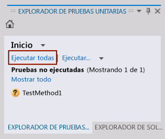

# Tutorial: Crear y ejecutar pruebas unitarias para aplicaciones UWP

Visual Studio incluye permite realizar pruebas unitarias de aplicaciones de la Plataforma universal de Windows (UWP). Incluye plantillas de proyecto de pruebas unitarias para Visual C#, Visual Basic y Visual C++.

> [!TIP]
> Para obtener más información sobre cómo desarrollar aplicaciones UWP, consulte [Introducción a las aplicaciones para UWP](/windows/uwp/get-started/).

Los procedimientos siguientes describen los pasos para crear, ejecutar y depurar pruebas unitarias para las aplicaciones de UWP.

## Crear un proyecto de prueba unitaria para una aplicación de UWP

1.  En el menú **Archivo** , elija **Nuevo proyecto**.

     Se muestra el cuadro de diálogo Nuevo proyecto.

2.  En Plantillas, elija el lenguaje de programación en el que desea crear las pruebas unitarias y, a continuación, elija la biblioteca de pruebas unitarias de Windows Universal asociada. Por ejemplo, elija **Visual C#** y, luego, **Windows Universal**. Por último, elija **Unit Test Library (Universal Windows)** (Biblioteca de pruebas unitarias [Windows Universal]).

3.  (Opcional) En el cuadro de texto **Nombre**, escriba el nombre que quiera usar para el proyecto.

4.  (Opcional) Para modificar la ruta de acceso en la que quiera crear el proyecto, escríbala en el cuadro de texto **Ubicación** o elija el botón **Examinar** .

5.  (Opcional) En el cuadro de texto nombre de **Solución** , escriba el nombre que desee usar para la solución.

6.  Deje seleccionada la opción **Crear directorio para la solución** y elija el botón **Aceptar** .

     

     El Explorador de soluciones se rellena con el nuevo proyecto de prueba unitaria de UWP y el editor de código muestra la prueba unitaria predeterminada denominada UnitTest1.

     

## Editar el archivo de manifiesto de la aplicación para UWP del proyecto de prueba unitaria

1.  En el Explorador de soluciones, haga clic con el botón derecho en el archivo *Package.appxmanifest* y elija **Abrir**.

     Aparece el diseñador de manifiestos para la edición.

2.  En el diseñador de manifiestos, elija la pestaña **Capacidades** .

3.  En la lista, en **Capacidades**, seleccione las capacidades que necesita la prueba unitaria y el código para las pruebas. Por ejemplo, active la casilla **Internet** si la prueba unitaria lo necesita y el código que está probando necesita tener la capacidad de tener acceso a Internet.

    > [!NOTE]
    > Las capacidades que seleccione deben incluir solo las capacidades necesarias para que la prueba unitaria funcione correctamente.

     

## Codificar la prueba unitaria para una aplicación de UWP

En el Editor de código, edite la prueba unitaria y agregue las aserciones y la lógica requeridas para las pruebas.

## Ejecutar pruebas unitarias

### Para compilar la solución y ejecutar pruebas unitarias mediante el Explorador de pruebas

1.  En el menú **Prueba** , seleccione **Windows**y, a continuación, elija **Explorador de pruebas**.

     Aparece el Explorador de pruebas, pero no incluye la prueba.

2.  En el menú **Compilar** , elija **Compilar solución**.

     Ahora aparece la prueba unitaria.

    > [!NOTE]
    > Debe compilar la solución para actualizar la lista de pruebas unitarias en el Explorador de pruebas.

3.  En el Explorador de pruebas, elija la prueba unitaria que creó.

    > [!TIP]
    > El Explorador de pruebas proporciona un vínculo al código fuente junto a **Origen:**.

4.  Elija **Ejecutar todas**.

     

    > [!TIP]
    > Puede seleccionar una o varias de las pruebas unitarias enumeradas en el Explorador, hacer clic con el botón secundario y elegir **Ejecutar pruebas seleccionadas**.
    >
    > Además, puede elegir **Depurar pruebas seleccionadas**, **Abrir prueba**y usar la opción **Propiedades** .
    >
    > 

    La prueba unitaria se ejecuta. Al finalizar, el Explorador de pruebas muestra el estado de la prueba y el tiempo transcurrido y proporciona un vínculo al origen.

    

## Vea también

- [Prueba de aplicaciones para UWP con Visual Studio](../test/testing-store-apps-with-visual-studio.md)
- [Compilar y probar una aplicación de UWP](/vsts/build-release/apps/windows/universal?tabs=vsts)
